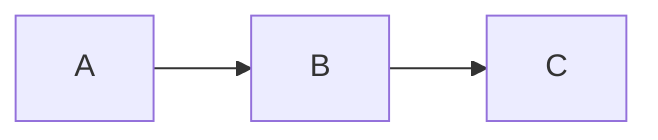

이 블로그의 마크다운 아티클을 작성하거나 수정할 때 아래 규칙을 준수한다.

---

## 파일 및 폴더 구조

- 정식 아티클: `public/markdown/{folderName}/index.md`
- 임시/초안 아티클: `public/markdown/@temp/{파일명}.md` (프론트매터 없음)
- 이미지: `public/markdown/{folderName}/images/` 하위에 저장
- 이미지 참조: `` (상대 경로 사용)

---

## 프론트매터(Frontmatter)

모든 정식 아티클은 아래 YAML 프론트매터로 시작한다.

```yaml
---
folderName: snake_case_folder_name
title: 아티클 제목
tag: 카테고리 태그
isPublished: true
---
```

- `folderName`: 폴더명과 동일, snake_case 사용
- `title`: 한글 또는 영문 (기술 용어는 영문 그대로 사용)
- `tag`: 단일 카테고리 (javascript, react, browser, cs, security, style, dom, linux, aws, design 등)
- `isPublished`: 공개 여부

---

## 문서 구조

### 제목

- `#` h1 제목은 프론트매터의 `title`과 동일하게 작성한다.
- 기술 용어는 `한글명(영문명)` 형태로 병기한다. (예: `실행 컨텍스트(Execution Context)`)
- 고유 명사나 널리 알려진 기술명은 영문 그대로 사용한다. (예: `Docker`, `React Rendering`)

### 목차(TOC)

- h1 제목 바로 아래에 마크다운 링크 형태의 목차를 수동으로 작성한다.
- h2, h3 수준까지 포함하며 중첩 리스트로 계층을 표현한다.

```md
- [섹션 제목](#앵커-링크)
  - [하위 섹션](#앵커-링크)
```

### 섹션 계층

- `##` h2: 주요 주제 단위
- `###` h3: 세부 항목
- `####` h4: 세부 항목 내 하위 분류 (드물게 사용)
- h5 이하는 사용하지 않는다.

---

## 말투 및 톤

- 해요체/합쇼체를 사용하지 않는다. 기술 문서 톤의 평서형 종결어미(`-다`)를 사용한다.
- 간결하고 직접적인 서술을 지향한다. 불필요한 수식어를 배제한다.

### 종결어미 패턴

- 정의/설명: `~다`, `~이다`
- 동작/결과: `~한다`, `~된다`
- 나열/부연: `~함`, `~됨`, `~있음` (명사형 종결)
- 리스트 항목에서는 명사형 종결(`~함`, `~됨`, `~가능`)을 주로 사용한다.
- 본문 설명에서는 `-다` 종결을 주로 사용한다.
- 두 종결 방식은 같은 아티클 내에서 혼용 가능하다.

---

## 콘텐츠 작성 패턴

### 개념 설명

- 핵심 정의를 먼저 한 문장으로 제시한다.
- 이후 리스트(`-`)로 세부 사항을 나열한다.
- 비유나 별칭이 있으면 따옴표로 병기한다.

### 비교/분류

- 테이블(표)을 적극적으로 활용한다.
- 열 헤더는 간결하게, 셀 내용은 짧은 문장 또는 키워드로 작성한다.

### 코드 블록

- 언어 태그를 반드시 명시한다 (`ts`, `tsx`, `js`, `css`, `sh`, `nginx`, `json` 등).
- TypeScript(`ts`, `tsx`)를 기본으로 사용한다.
- 코드 블록 앞에 설명 문장을 배치한다.
- 코드 내 주석으로 핵심 포인트를 표시한다.
- 올바른 예시와 잘못된 예시를 함께 제시할 때는 `// ✅ correct:`, `// ❌ incorrect:` 형태를 사용한다.

### 이미지

- 이미지는 관련 섹션 시작 부분 또는 설명 직후에 배치한다.
- alt 텍스트는 `img`로 통일한다. (예: ``)

### 참고 링크

- 외부 참고 자료는 아티클 하단에 URL만 단독으로 기재한다.
- 별도의 "참고자료" 섹션을 만들지 않고 본문 끝에 배치한다.

---

## 용어 표기 규칙

- 최초 등장 시: `한글명(영문명)` 형태로 병기한다. (예: "렉시컬 환경(Lexical Environment)")
- 이후 재등장 시: 한글명 또는 영문명 중 하나를 일관되게 사용한다.
- 약어는 풀네임을 먼저 쓰고 괄호 안에 약어를 표기한다. (예: "CDN (Content Delivery Network)")
- 코드, 명령어, 속성명, 파일명 등은 백틱(`` ` ``)으로 감싼다.
- 관련 개념을 나란히 소개할 때 가운뎃점(`•`)을 사용한다. (예: "Access Token • Refresh Token")

---

## 리스트 작성 규칙

- 순서가 중요하지 않은 항목은 `-` (unordered list)를 사용한다.
- 순서가 있는 절차/단계는 `1. 2. 3.` (ordered list)를 사용한다.
- 리스트 항목에 하위 설명이 필요하면 들여쓰기한 `-`로 중첩한다.
- "특징", "종류", "장점/단점" 등의 소제목을 리스트 상위에 `텍스트:` 형태로 붙인다.

---

## Q&A 패턴

질의응답 형식이 필요한 경우 다음 포맷을 사용한다.

```md
Q: 질문 내용

- 답변 내용
```

---

## 다이어그램

- 다이어그램이 필요한 경우 Mermaid 문법을 사용한다.

````md

````

---

## 금지 사항

- 이모지를 사용하지 않는다.
- 감탄사, 감정 표현을 사용하지 않는다. ("놀랍게도", "정말 중요한" 등)
- `~습니다`, `~세요`, `~해요` 등의 경어체를 사용하지 않는다.
- 독자에게 직접 말을 거는 표현을 사용하지 않는다. ("여러분", "우리" 등)
- h1 태그를 두 개 이상 사용하지 않는다.
- 마크다운 볼드체 문법(`**`)은 사용하지 않는다. 강조가 필요하면 백틱(`` ` ``)을 사용한다.
- 인용문 문법(`>`)을 사용하지 않는다.
- 코드 블록에 언어 태그를 반드시 명시한다. 언어를 특정하기 어려운 경우 `text`를 사용한다. (MD040)
