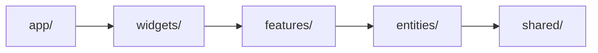

# CLAUDE.md

This file provides guidance to Claude Code (claude.ai/code) when working with code in this repository.

## 명령어

```bash
pnpm dev        # 개발 서버 실행 (포트 3003)
pnpm build      # 프로덕션 빌드
pnpm lint       # ESLint 실행
pnpm prettier   # 모든 .tsx 파일 포맷
pnpm test       # Jest 실행
pnpm test:watch # Jest watch 모드
```

## 아키텍처

Next.js 16 (App Router) 기반 개인 블로그로, 주요 라우트는 세 가지다.

- `/markdown` — 태그 필터링 및 페이지네이션이 있는 아티클 목록
- `/markdown/[folderName]/detail` — 정적 마크다운 아티클 상세 페이지 (`generateStaticParams`로 SSG)
- `/llm` — 멀티 모델 LLM 채팅 인터페이스 (OpenAI + DeepSeek 스트리밍)

### FSD 레이어 구조

FSD(Feature-Sliced Design) 아키텍처를 적용한다. 레이어 계층은 다음과 같으며, 상위 레이어만 하위 레이어를 import할 수 있다.



각 슬라이스 내부는 표준 세그먼트로 구성된다: `ui/`, `api/`, `model/`, `lib/`, `config/`

외부에서는 반드시 슬라이스 루트 `index.ts`를 통해 import한다 (`@/entities/chat`, `@/features/llm-chat` 등).

### 디렉터리 구조

- `app/` — Next.js App Router 페이지 및 API 라우트 (FSD app 레이어)
  - `_providers/` — ReactQueryProvider, GlobalClientConfig
- `widgets/` — 복합 UI 블록 (여러 레이어를 조합)
  - `site-header/` — Header (navList + DarkLightButton 조합)
  - `site-footer/` — Footer (라우트 인식)
- `features/` — 사용자 인터랙션 및 비즈니스 유스케이스
  - `llm-chat/` — ChatForm, TabsForm (채팅 전송·탭 관리)
  - `search-markdown/` — MarkdownSearchInput (Fuse.js 검색)
- `entities/` — 도메인 엔티티 (각 슬라이스: `ui/`, `api/`, `model/`)
  - `chat/` — useChatMutation, 타입
  - `markdown/` — MarkdownMetaCard, TagNavigation, 마크다운 파일 I/O 함수, 타입
  - `profile/` — Profile, CareerContentItem, ProjectContentItem, 정적 데이터, 타입
- `shared/` — 재사용 UI 키트 및 공용 유틸
  - `ui/` — Button, Badge, Pagination 등 범용 컴포넌트
  - `config/` — constants.ts (PAGE_SIZE), nav.ts (navList), icons.ts (iconMap)
  - `lib/hooks/` — useDebounce, useThrottle, useRequestAnimationFrame
  - `model/` — 공용 타입 (Nav, NavList)
- `public/markdown/` — 아티클 콘텐츠 및 이미지
- `styles/` — 전역 CSS 및 구문 강조 CSS

### 마크다운 콘텐츠 파이프라인

아티클은 `public/markdown/{folderName}/index.md`에 YAML 프론트매터(`folderName`, `title`, `tag`, `isPublished`)와 함께 저장된다. 임시/초안 아티클은 `public/markdown/@temp/`에 둔다.

메타데이터 인덱스는 `entities/markdown/api/list.json`에 저장되며 저장소에 커밋된다. `entities/markdown/api/index.ts` 하단에 주석 처리된 `writeMarkdownMetaList()` 호출을 해제하고 실행하면 재생성된다. 이후 `list.json`을 다시 커밋해야 한다. 상세 페이지는 `dynamicParams = false`로 설정되어 있고 `generateStaticParams`에서 `list.json`을 읽으므로, 빌드 전에 반드시 최신 상태여야 한다.

### 경로 별칭

`@/*`는 저장소 루트로 매핑된다(`tsconfig.json` 참고). 모든 import는 상대 경로 대신 `@/`를 사용한다.

### API 라우트

- `POST /api/chat` — LLM 응답 스트리밍. `body.model` 값에 따라 OpenAI 또는 DeepSeek 클라이언트를 선택한다. `OPENAI_API_KEY`, `DEEPSEEK_API_KEY` 환경 변수가 필요하다.
- `POST /api/mail` — 스텁 (빈 핸들러).

### 테마

다크/라이트 모드는 `theme` 쿠키에 저장되며, `app/layout.tsx`에서 서버 사이드로 읽어 `<html>` 클래스에 적용한다. `DarkLightButton` 컴포넌트가 클라이언트에서 쿠키를 쓴다.

### 스타일링

Tailwind CSS v4와 마크다운 prose를 위한 `@tailwindcss/typography`를 사용한다. 조건부 클래스 병합에는 `tailwind-merge`를 사용하고, 포맷 시 `prettier-plugin-tailwindcss`가 클래스 순서를 정렬한다.

## 아티클 작성

전체 작성 규칙은 저장소 루트의 `markdown.md`를 참고한다. 주요 사항은 다음과 같다.

- 프론트매터 필드: `folderName` (snake_case, 폴더명과 동일), `title`, `tag` (쉼표 구분), `isPublished`
- `public/markdown/` 하위 폴더마다 `index.md` 하나; 이미지는 `public/markdown/{folderName}/images/`에 저장
- 아티클 추가/수정 후 `writeMarkdownMetaList()`를 실행하여 `list.json`을 재생성하고 커밋
- 말투: 한국어 기술 문서 스타일, 평서형 종결어미(`-다`), 볼드체(`**`)·이모지·인용문(`>`) 사용 금지
- 다이어그램은 Mermaid로 표현; 코드 블록에 언어 태그 필수 (언어 불명확 시 `text` 사용)
