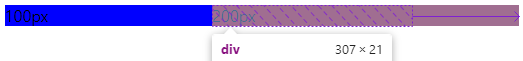
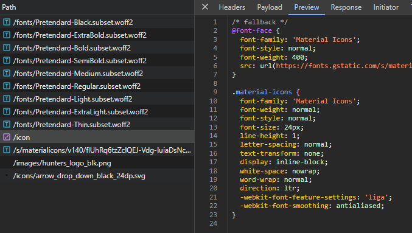

# CSS

- [CSS](#css)
  - [font 설정](#font-설정)
  - [초기 CSS 설정](#초기-css-설정)
  - [박스 깊이 나눌 때 명칭](#박스-깊이-나눌-때-명칭)
  - [block vs inline](#block-vs-inline)
  - [box-sizing](#box-sizing)
  - [border, outline, boxShadow](#border-outline-boxshadow)
  - [max-content](#max-content)
  - [white-space](#white-space)
  - [word-break, overflow-wrap](#word-break-overflow-wrap)
  - [text-overflow 속성 적용하기](#text-overflow-속성-적용하기)
  - [transition \& animation](#transition--animation)
  - [반응형 이미지](#반응형-이미지)
    - [rem](#rem)
  - [자동완성 스타일링](#자동완성-스타일링)
  - [pointer-events](#pointer-events)
  - [position](#position)
  - [반응형](#반응형)
    - [display: flex](#display-flex)
      - [Honey Tip](#honey-tip)
    - [display: grid](#display-grid)
    - [overflow](#overflow)
    - [media query](#media-query)
  - [color 관련](#color-관련)
  - [user-select](#user-select)

## font 설정

사용하고자 하는 폰트의 경량화 버전을 다운 받아 사용하는 경우, 프로젝트에 정적 자산이 놓일 폴더에 위치시켜두고 `font-face`를 아래와 같이 설정한다. `src` 속성에서 `local`은 로컬 컴퓨터에 설치된 폰트 위치 의미하고, `url`은 프로젝트 내부에 놓인 폰트 위치를 의미한다. 보통은 `url`만 사용하는 것이 일반적이다.

CDN을 사용한다면 `@font-face` 설정은 필요없다.

```css
/* ... */
@font-face {
  font-family: 'Pretendard';
  font-weight: 600;
  font-display: swap;
  src: local('Pretendard SemiBold'), url('/fonts/Pretendard-SemiBold.subset.woff2') format('woff2'), url('/fonts/Pretendard-SemiBold.subset.woff')
      format('woff');
}
@font-face {
  font-family: 'Pretendard';
  font-weight: 500;
  font-display: swap;
  src: local('Pretendard Medium'), url('/fonts/Pretendard-Medium.subset.woff2') format('woff2'), url('/fonts/Pretendard-Medium.subset.woff')
      format('woff');
}
/* ... */

body {
  font-family: 'Pretendard', -apple-system, BlinkMacSystemFont, sans-serif;
}

* {
  /* button, input 등 body의 설정만으로 적용이 안 되는 태그들이 있기에 설정 */
  font: inherit;
}
```

## 초기 CSS 설정

기본적으로 `width: 100%`로 설정되어 있기 때문에 따로 설정할 필요 없음. 가로 수평 스크롤을 피하기 위해서는 `width: 100vw`는 지양하자. 초기값을 `100%` 이하로 잡을 때는 설정 필요. 최상위 부모에게 고정 너비를 부여하고 밑에 자식들은 퍼센트로 관리하기.

```css
* {
  margin: 0;
  padding: 0;
  border: 0;
  font: inherit;
  /* ...기본 타이포그래피 설정; */
}

html,
body,
#root {
  height: 100%; /* 자식 레이아웃의 높이를 퍼센트로 조절하기 위한 설정 */
}

*,
:after,
:before {
  box-sizing: border-box;
}

html {
  font-size: 62.5%; /* 계산 필요없이 rem 값을 사용하기 위한 설정 */
}

body {
  font-family: 'Pretendard', -apple-system, sans-serif;
}

a {
  text-decoration: none;
}

ul,
ol,
li {
  list-style: none;
}
```

## 박스 깊이 나눌 때 명칭

Container > Box > Wrapper

## block vs inline

`block`은 `width`, `height` 제어 가능, `margin` 상하좌우 가능

`inline`은 `width`, `hieght` 제어 불가능, `margin` 좌우만 가능

## box-sizing

`box-sizing` 속성은 기본값이 `content-box`인데 이는 `width`, `padding`, `border` 중에 `width`만을 가지고 총 너비를 계산한다.

`border-box`는 `width`, `padding`, `border` 모두를 가지고 총 너비를 계산한다. 실무에서는 대부분 모든 요소에 `box-sizing: border-box`를 사용하여 작업을 한다.

## border, outline, boxShadow

보통 실무에서 `box-sizing: border-box` 상태의 요소를 작업한다. 이 때 `border`값이 너비에 포함되기 때문에 '어떤 요소가 포커싱되는 순간 테두리가 증가하는 동작'을 할 때 너비가 늘어나면서 주변 요소들이 움직이는 사이드 이펙트가 발생한다. 이는 너비에 영향을 주지 않는 `outline`이나 `box-shadow` 속성으로 `border` 처럼 보이게 트릭을 줘서 해결할 수 있다.

## max-content

`max-content`는 안에 내용물이 가질 수 있는 최대 길이를 의미한다. 나는 버튼 요소에 `width: max-content`를 적용해 텍스트가 줄어들지 않고 고정될 수 있도록 적용했다. 또는 `display: grid`에서 열 너비를 정할 때에도 사용했다. 반응형으로 작성하면서 내용물의 너비로 고정시키고 싶은 경우 많이 사용했다.

## white-space

|            | 스페이스와 탭 | 줄바꿈 | 자동 줄바꿈 |
| ---------- | ------------- | ------ | ----------- |
| `normal`   | 병합          | 병합   | O           |
| `nowrap`   | 병합          | 병합   | X           |
| `pre`      | 보존          | 보존   | X           |
| `pre-wrap` | 보존          | 보존   | O           |
| `pre-line` | 병합          | 보존   | O           |

## word-break, overflow-wrap

`word-break`과 `overflow-wrap` 모두 한 단어가 길게 이어져 부모 상자의 `width`를 넘길 때 어떻게 처리할 지에 관한 속성이다. 아래 그림을 통해서 차이를 확인하자.


## text-overflow 속성 적용하기

```css
div {
  display: block;
  white-space: nowrap;
  overflow: hidden;
  text-overflow: eillipsis;
}
```

일반적으로 텍스트가 오버플로우 되려면 띄어쓰기 없이 글자 길이가 부모 박스보다 길어야 하는데, `white-space`가 `normal`이 기본값으로 설정되어 있기 때문에 자동 줄바꿈이 일어나 오버플로우가 빈번하게 발생하지는 않는다. 그래서 `white-space`를 `nowrap` 이나 `pre`로 바꿔 자동 줄바꿈을 제거해 오버플로우를 발생시킨다.

발생한 오버플로우는 `overflow: hidden`으로 가려버리고 이후에 `text-overflow: eillipsis`를 적용해 해당 텍스트의 `...`을 적용한다.

이 방식은 데이터를 자르기 때문에 작은 화면에서는 데이터를 모두 확인할 수 없기 때문에 반응형을 통해 데이터를 최대한 보여주는 방식으로 해결하는 것이 사용자 경험에 좋은 것 같다.

## transition & animation

```css
/* Apply 1 property */
transition: property-name | duration | easing-function | delay;
/* Apply multiple property */
transition: property-name | duration | easing-function | delay, property-name | duration | easing-function | delay, ...;
/* Apply All property */
transition: all | duration | easing-function | delay;

/* Apply 1 animation */
animation: duration | easing-function | delay | iteration-count | direction | fill-mode | play-state | name;
/* Apply multiple animation */
animation: duration | easing-function | delay | iteration-count | direction | fill-mode | play-state | name, animation: duration | easing-function | delay | iteration-count | direction | fill-mode | play-state | name;
```

## 반응형 이미지

`padding-bottom`(or `padding-top`)을 이용한 aspect ratio 구현, 패딩은 부모 width를 따라감

이미지 비율 수정 object-fit (img 태그용)

### rem

```css
html {
  font-size: 62.5%;
}
```

폰트는 `rem`으로 관리하되, `html`에 `font-size: 62.5%`로 `1rem=10px`로 관리, 미디어쿼리로 `html` 퍼센트 조절해서 반응형 가능.
이미지가 제일 어려운데 이미지는 반응형에 대한 각 각의 이미지가 필요해보임

## 자동완성 스타일링

자동완성의 스타일링 `!important`로 브라우저 정의가 되어있어 `box-shadow`로 배경색을 제거해주는 트릭을 사용한다.

```css
input:autofill {
  border: 1px solid grey;
  box-shadow: 0 0 0px 1000px white inset;
}
```

## pointer-events

css 속성 중 `pointer-events` 값을 `none`으로 설정하면 해당 스타일이 적용된 요소에서는 클릭 이벤트가 발생하지 않는다.

## position

|            | 배치 위치                                                                         | `top`, `bottom`, `left`, `right`, `z-index` |
| ---------- | --------------------------------------------------------------------------------- | :-----------------------------------------: |
| `static`   | 문서의 일반적인 흐름                                                              |                      X                      |
| `relative` | 문서의 일반적인 흐름                                                              |                      O                      |
| `absolute` | `position` 속성이 `relative`, `absolute`, `fixed`로 설정된 가장 가까운 부모 요소  |                      O                      |
| `fixed`    | 뷰포트                                                                            |                      O                      |
| `sticky`   | 문서의 일반적인 흐름에 따라 배치되다가, 스크롤에 의해 화면에서 없어지기 전 고정됨 |                      O                      |

## 반응형



### display: flex

| 자주 사용하는 속성 |
| ------------------ |
| `flex-direction`   |
| `flex-wrap`        |
| `jutify-content`   |
| `align-content`    |
| `align-items`      |
| `align-self`       |
| `flex`             |
| `gap`              |

`flex-direction` 값이 `row`인 경우 모든 속성은 너비를 제어하며, `column`인 경우 높이를 제어한다.

`flex-basis`는 `flex-direction` 값이 `row`인 경우에는 너비를, `column`인 경우에는 높이를 의미한다. `flex-grow`와 `flex-shrink`는 `flex-basis` 값을 기준으로 너비나 높이가 여백을 얼마나 더 차지할지, 덜 차지할지를 의미한다.

#### Honey Tip

```css
.left-item {
  flex: 30 0 200px;
}

.right-item {
  flex: 1 0 120px;
}
```

위와 같이 설정하면 `.right-item` 요소는 고정 너비를 가진 것 처럼 보이다가 `flex-wrap: wrap` 설정을 통해 줄이 바뀌면 여백을 모두 차지하는 모양으로 바뀐다.

어지간한 반응형은 `flex`와 `flex-wrap: wrap` 속성을 통해 해결이 가능하다.

### display: grid

|                         |
| ----------------------- |
| `auto-template-columns` |
| `grid-row`              |
| `grid-column`           |
| `jutify-content`        |
| `jutify-items`          |
| `jutify-self`           |
| `align-content`         |
| `align-items`           |
| `align-self`            |
| `gap`                   |

`grid`로 복잡한 레이아웃을 작업하고 `flex`로 간단한 레이아웃을 작업한다. 화면 너비에 따른 스타일 조정이 필요할 때 `media query`를 사용한다.

`flex`는 `flex-direction` 값이 `row`일 때는 가로로 꼬치가 꽂힌 모습을 상상하고, `column`일 때는 세로로 꼬치가 꽂힌 모습을 상상한다. 꼬치를 기준으로 상중하 정렬을 해주는 속성이 `align-items`, 좌중우 정렬을 해주는 속성이 `justify-contents`. `flex-grow`, `flex-shrink`, `flex-basis` 속성을 한 번에 제어 가능한 `flex` 속성으로 자식들을 반응형으로 쉽게 제어할 수 있다. `flex-basis` 기준으로 부모의 남은 여백을 늘어나거나 줄어들 때 얼마나 차지할지를 정하는 개념이다.

grid-template-columns 속성으로 열 지정

로우 높이 일정하게 하려면 grid-auto-rows로 minmax 설정

### overflow

`min-width` 값과 `overflow-x` 값을 이용해 제어

### media query

## color 관련

hsl, rgba, hex...

## user-select


