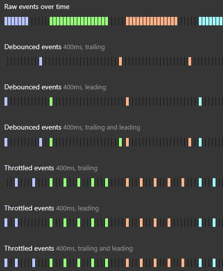
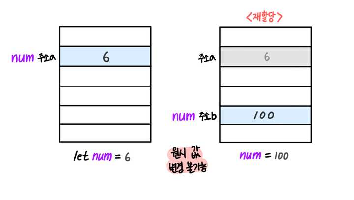

# JavaScript

- [JavaScript](#javascript)
  - [JavaScript vs ECMAScript](#javascript-vs-ecmascript)
  - [target vs currentTarget](#target-vs-currenttarget)
  - [onclick vs addEventListener('click')](#onclick-vs-addeventlistenerclick)
    - [onclick](#onclick)
    - [addEventListener('click')](#addeventlistenerclick)
  - [throttle vs debounce(feat. lodash 라이브러리)](#throttle-vs-debouncefeat-lodash-라이브러리)
  - [좌표](#좌표)
    - [요소의 너비와 높이](#요소의-너비와-높이)
    - [브라우저 창, 문서의 너비와 높이](#브라우저-창-문서의-너비와-높이)
    - [스크롤](#스크롤)
    - [요소의 좌표](#요소의-좌표)
    - [마우스 좌표](#마우스-좌표)
  - [모듈](#모듈)
    - [모듈 번들러](#모듈-번들러)
    - [번들러 파일 구조](#번들러-파일-구조)
    - [개발/프로덕션 모드에 따른 번들링 방식](#개발프로덕션-모드에-따른-번들링-방식)
      - [개발 모드(dev 모드)](#개발-모드dev-모드)
      - [프로덕션 모드(prod 모드)](#프로덕션-모드prod-모드)
  - [값, 리터럴, 표현식, 문](#값-리터럴-표현식-문)
  - [parse](#parse)
  - [실무에서 클로저 사용 예시](#실무에서-클로저-사용-예시)
  - [구조 분해 할당](#구조-분해-할당)
  - [논리 연산자 단락 평가](#논리-연산자-단락-평가)
  - [자바스크립트 값의 종류](#자바스크립트-값의-종류)
  - [Pass By Value vs Pass By Reference](#pass-by-value-vs-pass-by-reference)
  - [깊은 객체 복사](#깊은-객체-복사)
    - [직렬화가 불가능한 객체](#직렬화가-불가능한-객체)
    - [null, undefined 직렬화 차이](#null-undefined-직렬화-차이)
  - [null, undefined type check](#null-undefined-type-check)
  - [런타임 에러](#런타임-에러)
    - [TypeError (타입 에러)](#typeerror-타입-에러)
    - [ReferenceError (참조 에러)](#referenceerror-참조-에러)
    - [RangeError (범위 에러)](#rangeerror-범위-에러)
  - [async await](#async-await)
  - [file input 동일한 파일 입력 시 onChange 동작](#file-input-동일한-파일-입력-시-onchange-동작)
  - [history](#history)
  - [sort](#sort)
  - [clipboard API](#clipboard-api)

## JavaScript vs ECMAScript

JavaScript는 ECMAScript 언어의 구현 중 하나로, 대부분의 모던 웹 브라우저에서 지원하며 Node.js와 같은 서버 측 환경에서도 사용된다.

ECMAScript는 JavaScript의 표준 사양을 정의하는 언어이다. 프로그래밍 언어의 규격과 특성을 명시화하여 JavaScript 엔진 개발자와 웹 개발자 간의 일관된 작업 환경을 제공한다. 즉, ECMAScript는 JavaScript의 핵심 기능 및 구문을 정의하고 있으며, JavaScript 엔진 제작자 및 브라우저 개발자는 이 사양을 준수하여 JavaScript를 구현한다. JavaScript는 ECMAScript의 구현 중 하나로, 보통 브라우저나 Node.js 환경에서 실행된다. 여기에 브라우저나 환경에 따라 추가된 다양한 기능과 API를 제공한다.

## target vs currentTarget

이벤트 발생 시 콜백 함수에는 `Event` 객체를 인자로 받게 되는데, 해당 객체의 `target` 속성은 이벤트가 발생하고 버블링되는 과정에서 첫번째 단계의 엘리먼트를 가리킨다. `currentTarget`은 버블링을 따라 올라오면서 이벤트와 직접 바인딩된 엘리먼트를 가리킨다. `currentTarget`은 `console`로 찍어보면 `null`로 나타나게 되는데, 해당 데이터는 이벤트가 처리되는 동안에만 사용되기 때문이다.

## onclick vs addEventListener('click')

onclick과 addEventListener는 이벤트 처리를 위해 사용되는 JavaScript의 메커니즘이다. 하지만 두 가지 접근 방식에는 몇 가지 중요한 차이점이 있다.

### onclick

- HTML 요소의 onclick 속성을 통해 한 번에 하나의 이벤트 핸들러만 연결할 수 있다.
- HTML 요소의 onclick 속성은 HTML 코드에서 직접 지정되며, 정적으로 할당되기 때문에 바꾸기가 어렵다.
- onclick 속성으로 할당된 핸들러는 다른 핸들러보다 우선순위가 높다.
- onclick 속성에 빈 문자열을 설정하여 이벤트 핸들러를 제거할 수 있다.

### addEventListener('click')

- 하나의 요소에 여러 개의 이벤트 핸들러를 연결할 수 있다.
- 동적으로 이벤트 핸들러를 추가하거나 제거할 수 있따. 이는 런타임 중에 이벤트 핸들러를 동적으로 조작하고 업데이트하는 데 유용하다.
- 여러 개의 핸들러를 등록한 경우, 등록된 순서대로 호출된다. 이를 통해 여러 핸들러 간에 순서를 조절할 수 있다.
- removeEventListener를 사용하여 등록한 이벤트 핸들러를 제거할 수 있다. 단, 제거하려는 핸들러는 반드시 동일한 함수의 참조여야 한다.

## throttle vs debounce(feat. lodash 라이브러리)

이벤트에 병목 현상을 주고 싶거나, 사용자의 입력에 딜레이를 주고 싶은 상황이 빈번하게 발생하는데 이를 `lodash`의 `throttle`과 `debounce`로 쉽게 해결이 가능하다.

보통 스크롤 이벤트 같이 매우 빈번하게 발생하는 이벤트의 경우 `throttle`을 통해 병목 현상을 준다. 사용자가 고의로 빈번하게 입력하는 것을 방지하기 위해서는 `debounce`를 활용해 정해진 딜레이 이상 지나지 않으면 이벤트를 막아준다. 아래의 사진으로 해당 함수들이 어떻게 동작하는 지 이해할 수 있다.



사용법은 아래와 같다. 리액트의 경우 리렌더링 시에 컴포넌트를 계속 호출하므로 `useRef` 훅으로 감싸서 매 렌더링마다 새로운 함수가 생성되는 것을 막는다.

```js
import _ from 'lodash';

...

function onCheckEmail() {
    ...
}

const onThrottledCheckEmail = _.throttle(onCheckEmail, 1000, {leading: true, trailling: false});

const onDebouncedCheckEmail = _.debounce(onCheckEmail, 1000, {leading: true, trailling: false});
```

## 좌표

### 요소의 너비와 높이

```js
alert(element.offsetWidth); // 보더 + 패딩 + 컨텐츠 + 스크롤바 너비
alert(element.offsetHeight); // 보더 + 패딩 + 컨텐츠 + 스크롤바 높이
alert(element.clientWidth); // 패딩 + 컨텐츠 너비
alert(element.clientHeight); // 패딩 + 컨텐츠 높이
alert(element.scrollWidth); // 패딩 + 컨텐츠 + 스크롤바에 가려진 패딩 + 컨텐츠 너비
alert(element.scrollHeight); // 패딩 + 컨텐츠 + 스크롤바에 가려진 패딩 + 컨텐츠 높이
alert(element.scrollLeft); // 스크롤바에 가려진 왼쪽 영역의 패딩 + 컨텐츠 길이
alert(element.scrollTop); // 스크롤바에 가려진 위쪽 영역의  패딩 + 컨텐츠 길이
```

### 브라우저 창, 문서의 너비와 높이

```js
alert(window.innerWidth); // 세로 스크롤바 + 창 너비
alert(window.innerHeight); // 가로 스크롤바 + 창 높이
alert(document.documentElement.clientWidth); // 순수 창 너비
alert(document.documentElement.clientHeight); // 순수 창 높이
alert(document.documentElement.scrollWidth); // 스크롤에 가려진 부분 포함 문서 총 너비
alert(
  Math.max(
    document.body.scrollHeight,
    document.documentElement.scrollHeight,
    document.body.offsetHeight,
    document.documentElement.offsetHeight,
    document.body.clientHeight,
    document.documentElement.clientHeight,
  ),
); // 스크롤에 가려진 부분 포함 문서 총 높이
```

### 스크롤

```js
alert(window.scrollX); // 스크롤에 가려진 부분의 왼쪽 영역 너비
alert(window.scrollY); // 스크롤에 가려진 부분의 위쪽 영역 높이

window.scrollBy(x, y); // 현재 스크롤 위치 기준으로 스크롤 이동
window.scrollTo(x, y); // 문서 기준으로 스크롤 이동
element.scrollIntoView(true); // 요소를 창 위쪽 모서리에 맞추도록 이동
element.scrollIntoView(false); // 요소를 창 아래쪽 모서리에 맞추도록 이동

document.body.style.overflow = 'hidden'; // 스크롤바 고정
document.body.style.overflow = ''; // 스크롤바 고정 해제
// 스크롤바 고정 시 스크롤바 너비만큼 보정
// 창 기준 좌표
document.body.style.paddingleft = window.innerWidth - right.documentElement.clientWidth;
// 스크롤바 고정 시 스크롤바 너비만큼 보정 해제
document.body.style.paddingRight = '';
```

### 요소의 좌표

자바스크립트에서 `document.querySelector`를 사용하든, 리액트에서 `useRef`를 사용하든, 좌표를 알고싶은 요소의 객체를 가져와서 `getBoundingClientRect` 함수를 사용한다.

```js
// 창 기준 좌표
const { x, y, width, height, top, left, bottom, right } = element.getBoundingClientRect();

// 문서 기준 좌표
function getCoords(elem) {
  let { top, left, bottom, right } = element.getBoundingClientRect();

  return {
    top: top + window.pageYOffset,
    left: left + window.pageXOffset,
    bottom: bottom + window.pageYOffset,
    right: right + window.pageXOffset,
  };
}

// 주어진 좌표 아래의 가장 가까운 중첩 요소를 반환
document.elementFromPoint(x, y);
```


### 마우스 좌표


```js
element.onmousemove = function (e) {
  // 모니터 기준
  console.log(e.screenX);
  console.log(e.screenY);
  // 문서 기준
  console.log(e.pageX);
  console.log(e.pageY);
  // 브라우저 창 기준
  console.log(e.clientX);
  console.log(e.clientY);
  // 요소 기준
  console.log(e.offsetX);
  console.log(e.offsetY);
};
```

## 모듈

모듈은 단순히 파일 하나의 불과하다. 모듈 안에서 `import` 지시자를 이용해서 외부 모듈 내부의 변수나 함수를 가져오거나 `export` 지시자를 이용해 모듈 내부의 변수나 함수를 내보낼 수 있다.

`export`와 `import` 지시자를 스크립트 내에서 사용하려면 아래와 같이 `type='module'` 속성을 추가해서 작성해야 한다.

```html
<script type='module' src='./module.js' >
```

자바스크립트 엔진은 `module.js` 파일 안에 `import`문을 만나면 해당 모듈을 가져오기 위해 네트워크 요청 또는 파일 경로를 통해 온다. 브라우저 환경에서는 일반적으로 네트워크 요청을 통해 해당 모듈을 가져오며, Node.js 환경에서는 파일 시스템을 통해 모듈을 가져온다.

### 모듈 번들러

브라우저 환경에서는 모듈 번들러 없이 모듈을 사용한다면, 무수히 많은 네트워크 요청이 발생한다. 이를 방지하기 위해 웹팩(Webpack)과 같은 모듈 번들러 툴을 사용해 하나의 번들러를 생성하고 이를 `script`와 연결한다.

```html
<script type="module" src="script.js"></script>
```

```js
// script.js
import { a } from './module.js';

// module.js
import { b } from './module2.js';

export let a = 'a';

// module2.js
export let b = 'b';
```


모듈 번들러 툴은 보통 아래와 같이 동작합니다.

1. HTML의 `<script type="module">`에 진입점 역할을 하는 모듈을 넣는다.
2. 진입점 모듈에 의존하고 있는(`import`되어 있는) 모듈 분석을 시작으로 모듈 간의 의존 관계를 파악한다.
3. 모듈 전체를 한데 모아 하나의 큰 파일을 만든다(설정에 따라 여러 개의 파일을 만드는 것도 가능하다). 이 과정에서 `import`문이 번들러 내부 함수로 대체되므로 기존 기능은 그대로 유지된다. 4. 위 과정에서 아래와 같은 변형 및 최적화도 함께 수행한다.
   - 도달하지 못한 코드는 삭제된다.
   - 내보내진 모듈 중 쓰임처가 없는 모듈을 삭제한다(tree-shaking).
   - `console`, `debugger` 같은 개발 관련 코드를 삭제한다.
   - 최신 자바스크립트 문법이 사용된 경우 바벨(Babel)을 사용해 동일한 기능을 하는 낮은 버전의 스크립트로 변환한다.
   - 공백 제거, 변수 이름 줄이기 등으로 산출물의 크기를 줄인다.

기존 `import`, `export`는 번들러 내부 함수로 대체되기 때문에 `type='module'`이 사라진다.

```html
<script defer src="bundle.js"></script>
```

### 번들러 파일 구조


### 개발/프로덕션 모드에 따른 번들링 방식

#### 개발 모드(dev 모드)

- 개발용 소스맵: 웹팩은 개발 모드에서 소스맵을 생성하여 번들된 코드와 원본 코드 간의 매핑을 제공해서 개발자 도구에서 원본 코드를 볼 수 있도록 해준다. 이는 디버깅을 용이하게 하고 원본 코드의 오류를 추적하는 데 도움을 준다.
- 빠른 빌드: 빠른 빌드와 빠른 리로딩을 위해 번들링 속도를 최적화한다. 파일을 변경할 때 필요한 부분만 다시 빌드하고 적용하는 등의 최적화 작업을 수행한다.
- 개발용 플러그인 및 기능: HMR(Hot Module Replacement)과 같은 기능을 제공하는 플러그인이나 개발 도구와의 통합을 위한 기능들이 포함될 수 있다.

#### 프로덕션 모드(prod 모드)

- 코드 최적화: 코드를 압축하고 최적화하여 번들된 파일의 크기를 최소화한다. 이는 애플리케이션의 다운로드 속도를 향상시키고 사용자 경험을 개선하는 데 도움을 준다.
- 난독화: 코드 난독화 기법을 적용하여 번들된 코드를 해석하기 어렵게 만든다. 이는 코드의 보안성을 높이고 외부에서의 접근을 어렵게 만드는 데 도움을 준다.
- 환경 변수 설정: 환경 변수를 설정하여 개발 모드와 다른 설정을 사용할 수 있다. 이를 통해 프로덕션 환경에서 필요한 설정 및 동작을 조정할 수 있다.

## 값, 리터럴, 표현식, 문

| 종류               | 설명                                                                                                                                                                                                                                                                     |
| ------------------ | ------------------------------------------------------------------------------------------------------------------------------------------------------------------------------------------------------------------------------------------------------------------------ |
| 값(Value)          | 표현식이 평가되어 생성된 결과                                                                                                                                                                                                                                            |
| 리터럴(Literal)    | 다양한 자료형을 가진 값을 생성하려면 이를 텍스트로 구분 짓는 것이 필요한데, 이를 위해 미리 약속된 표기법 규칙을 말한다.                                                                                                                                                  |
| 표현식(Expression) | 표현식은 값을 생성하거나 조작하는 코드 구문이다. 표현식은 값, 변수, 리터럴, 연산자, 함수 호출 등의 조합으로 구성될 수 있다. 표현식은 평가되어 값을 반환한다.                                                                                                             |
| 문(Statement)      | 문은 프로그램에서 실행되는 동작이나 작업을 나타낸다. 문은 프로그램의 동작을 제어하거나 조작하는 데 사용된다. 문은 변수 선언, 할당, 조건문(`if`/`else`), 반복문(`for`, `while`), 함수 선언 등의 구조를 가질 수 있습니다. 문은 세미콜론(`;`)으로 끝나는 것이 일반적입니다. |

## parse

보통 라이브러리는 여러가지 메서드를 가진 거대한 객체로 구성이 되고, 해당 객체에 변경할 데이터를 넣은 후 여러 메서드를 사용하여 원하는 형태의 데이터를 얻어낼 수 있다. 반대로 데이터를 기반으로 거대한 객체를 구성할 때 사용하는 것이 `parse()` 파싱 관련 메서드이다. 개발을 하다보면 데이터를 다시 조작해서 다른 데이터를 얻어내고 싶을 경우가 있을 것이다. 이런 경우 데이터를 파싱해서 거대한 객체를 다시 만들어내고 데이터를 바탕으로 만들어진 거대한 객체를 통해 다시 사용자가 원하는 형태의 데이터를 출력한다.

## 실무에서 클로저 사용 예시

이벤트에 이벤트 객체 외에 인자를 포함하는 함수를 연결할 경우 클로저를 사용해서 조금 더 간결하게 작성 가능하다.

```js
// 이벤트 객체와 같은 depth에서 인자를 구성한 경우
const debounce = (event, callback) => {
  ...
}

<button onClick={(event) => debounce(event, callback)}>Click</button>

// 이벤트 객체를 인자로 가진 함수를 클로저로 감싸서 함수를 실행하는 형태로 이벤트에 연결하는 경우
const debounce = (callback) => () => {
  ...
};

<button onClick={debounce(callback)}>Click</button>
```

## 구조 분해 할당

구조 분해 할당 후 기본값을 설정하는 경우, 해당 값이 `undefined`인 경우에만 기본값이 적용된다.

```js
const {
  a = 1,
  b = 2,
  c = 3,
  d = 4,
} = {
  a: null,
  b: undefined,
  c: 3,
  d: 4,
};

console.log(a, b, c, d); // null 2 3 4
```

## 논리 연산자 단락 평가

```js
const a = null || null || null || 'end'

console.log(a) // 'end'

const b = 'value' && 'value' && 'value' && 'end'

console.log(b) 'end'
```

논리 연산자 `||`는 단락 평가 시 `null`, `undefined`, `''`, `0`, `NaN`, `false` 값을 만나면 다음으로 이동하고 만나지 않으면 해당 값을 출력한다.

논리 연산자 `&&`는 단락 평가 시 `null`, `undefined`, `''`, `0`, `NaN`, `false` 값을 만나면 해당 값을 출력하고 만나지 않으면 다음으로 이동한다.

## 자바스크립트 값의 종류

|             | `typeof`    | 원시값 | 특이사항 | 설명                                                                               |
| ----------- | ----------- | ------ | -------- | ---------------------------------------------------------------------------------- |
| `null`      | "object"    | O      | X        | `null`의 `typeof` 연산은 "object"인데, 이는 언어상 오류다. `null`은 객체가 아니다. |
| `undefined` | "undefined" | O      | X        |                                                                                    |
| Boolean     | "boolean"   | O      | X        |                                                                                    |
| Number      | "number"    | O      | X        |                                                                                    |
| `NaN`       | "number"    | O      | X        | `NaN === NaN`은 같지 않다.                                                         |
| `Infinity`  | "number"    | O      | X        |                                                                                    |
| BigInt      | "number"    | O      | X        |                                                                                    |
| String      | "string"    | O      | X        |                                                                                    |
| Symbol      | "symbol"    | O      | X        |                                                                                    |
| Object      | "object"    | X      | O        |                                                                                    |
| Array       | "object"    | X      | O        |                                                                                    |
| Function    | "function"  | X      | O        |                                                                                    |

## Pass By Value vs Pass By Reference




## 깊은 객체 복사

```js
const object = {
  person: {
    age: 20,
    name: 'Tomas',
  },
  country: 'Korea',
};

const copyObject = JSON.parse(JSON.stringify(object));
```

### 직렬화가 불가능한 객체

- 함수 (Functions): 함수는 직렬화할 수 없다. 함수는 코드와 상태를 가지고 있어 일련의 바이트로 단순히 표현하기 어렵다.
- 심볼 (Symbols): ES6에서 추가된 심볼(Symbol)은 직렬화할 수 없다.
- 특별한 객체 (Host Objects): 일부 브라우저나 환경에서 제공하는 특수한 객체들은 직렬화가 불가능할 수 있다.
- 일부 자바스크립트 내장 객체 (Certain Native JavaScript Objects): 특정 내장 객체들은 직렬화가 어려울 수 있다. 예를 들어, `Error` 객체와 같은 것들은 일부 직렬화 형식에서는 문제를 일으킬 수 있다.

### null, undefined 직렬화 차이

```js
console.log(
  JSON.stringfy({
    name: null,
    age: 30,
    gender: undefine,
  }),
); // {"name":null,"age":30}
```

`null`의 경우 값으로 인정되고, `undefined`의 경우 삭제해버린다.

## null, undefined type check

```js
const temp = null;

if (temp == null) {
  console.log(temp); // null
}
```

```js
const temp = undefined;

if (temp == null) {
  console.log(temp); // undefined
}
```

## 런타임 에러

런타임 에러는 프로그램이 실행 중에 발생하는 오류를 의미한다. 이는 프로그램의 실행 흐름 중에 예상치 못한 상황이나 문제로 인해 발생하며, 컴파일 단계에서는 검출되지 않는다.

`SyntaxError`와 같은 문법적인 에러는 런타임에 발생하는 에러가 아니다.

### TypeError (타입 에러)

변수나 속성에 예상하지 않은 타입의 값이 할당되거나 연산이 수행될 때 발생한다.

```js
const x = null;
console.log(x.toUpperCase()); // TypeError: x is null
```

### ReferenceError (참조 에러)

정의되지 않은 변수나 함수를 참조하려고 할 때 발생한다.

```js
console.log(y); // ReferenceError: y is not defined
```

### RangeError (범위 에러)

허용 범위를 벗어난 숫자 값이 사용될 때 발생한다. 주로 재귀 호출이 무한대로 계속되는 경우 등에서 발생할 수 있다.

```js
function recursiveFunction() {
  recursiveFunction();
}

recursiveFunction(); // RangeError: Maximum call stack size exceeded
```

## async await

<!-- todo: 내용 보완 필요 -->

```js
async function getResource() {
  try {
    const response = await fetch('/images/test.png'); // 여기서 발생한 error는 catch로
    const blob = await response.blob(); // 여기서 발생한 error는 catch로
    return new File([blob], 'test.png'); // Promise 형태로 값 반환
  } catch (error) {
    throw new Error('프로필 사진 업로드에 실패하였습니다'); // 상위 단으로 에러 올리기
    await Promise.reject(new Error('프로필 사진 업로드에 실패하였습니다')); // 상위 단으로 에러 올리기
  }
}

async function() {
  try{
    const resource = await getResource();
  } catch(error) {
    console.log(error.message)
  }
}
```

throw했는데 받아주는 곳 없으면 프로그램 종료되니 조심

## file input 동일한 파일 입력 시 onChange 동작

`<input type='file' />`의 경우 사용자가 파일을 입력한 후 동일한 파일을 다시 입력하면 `value` 값이 동일하기 때문에 `onChange`가 동작하지 않는다.

`onChange`는 `value` 값이 변경되어야만 동작하므로 `onChange`가 일어나기 전에 `onClick`이 발생할 때 `event.target.value = ''`를 통해 `value` 값을 초기화해준다.

어쩌피 우리가 관심있는 값은 `event.target.files`에 있는 `File` 객체이기 때문에 위 동작은 값에 영향을 주지 않는다.

```js
<input type='file' onClick={(event) => event.target.value = ''} onChange={(event) => console.log(event.target.files)}>
```

## history

window.location.href = '/'
history.pushState
history.replaceState

## sort

JavaScript의 sort 메서드는 배열의 요소를 정렬하는 데 사용됩니다. 기본적으로 sort 메서드는 배열의 각 요소를 문자열로 취급하여 정렬합니다. 이 때문에 숫자 정렬이 예상과 다를 수 있습니다. 예를 들어, 숫자 10은 문자열 '10'보다 작게 정렬됩니다.

## clipboard API

로컬호스트 및 HTTPS 통신에서만 동작함
