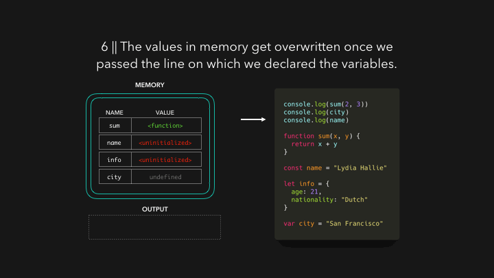
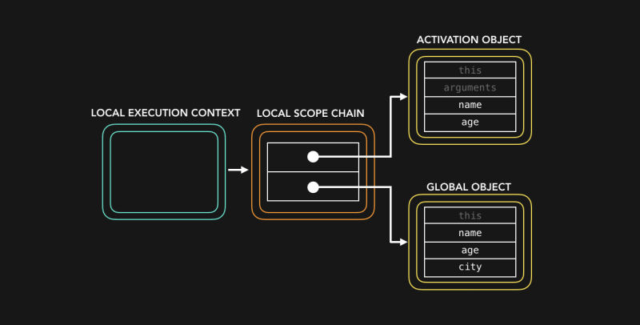
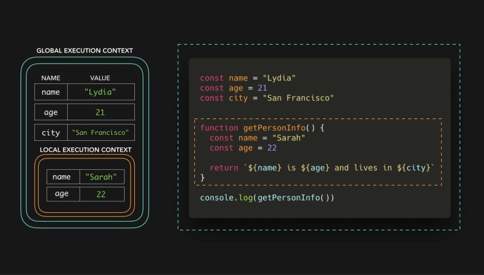

# Javascript Visualized

- [Javascript Visualized](#javascript-visualized)
  - [이벤트 루프](#이벤트-루프)
  - [호이스팅](#호이스팅)
  - [스코프](#스코프)
  - [프로토타입](#프로토타입)
  - [제너레이터와 이터레이터](#제너레이터와-이터레이터)
  - [프로미스](#프로미스)

## 이벤트 루프

## 호이스팅

## 스코프

## 프로토타입

## 제너레이터와 이터레이터

## 프로미스

