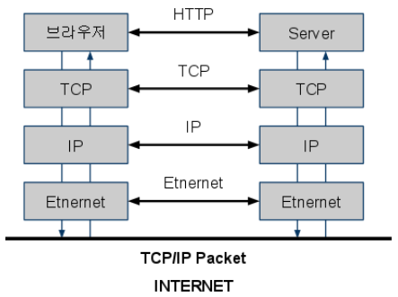
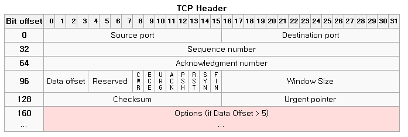
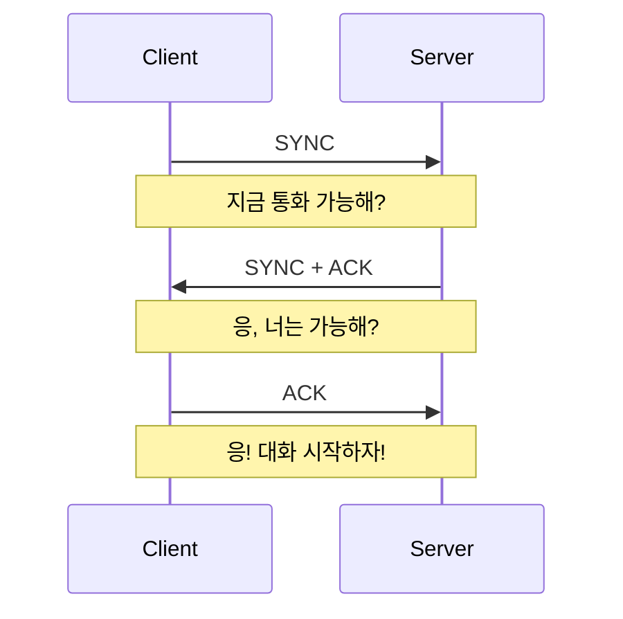
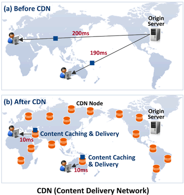

# Network

- [Network](#network)
  - [인터넷](#인터넷)
    - [프로토콜](#프로토콜)
    - [OSI 7계층](#osi-7계층)
  - [TCP/IP 프로토콜 수트](#tcpip-프로토콜-수트)
    - [TCP Header](#tcp-header)
    - [3-way handshake](#3-way-handshake)
    - [SSL handshake](#ssl-handshake)
  - [CDN](#cdn)

## 인터넷

인터넷(Internet)은 전 세계의 컴퓨터들을 상호 연결하여 정보를 교환할 수 있는 **거대한 컴퓨터 네트워크 통신망**입니다. 그야말로 인류의 역사상 전례 없는 거대한 정보의 바다이다. 인터넷은 컴퓨터, 서버, 라우터, 스위치 및 다양한 네트워크 장비로 구성된 물리적인 인프라와 소프트웨어 프로토콜, 규약들의 조합으로 이루어져 있습니다.

인터넷은 여러 개의 네트워크들이 상호 연결되어 구성되어 있습니다. 이러한 네트워크들은 인터넷 서비스 제공 업체(ISP, Internet Service Provider)에 의해 운영되며, 광섬유, 케이블 모뎀, DSL 등의 다양한 통신망을 통해 사용자들에게 인터넷 접속을 제공합니다.

### 프로토콜

컴퓨터 사이에서 데이터를 교환하는 방식을 정의한 규칙. 이런 규칙이 필요한 이유는 컴퓨터 간에 대화를 할 때에는 굉장히 다양한 방식으로 이루어지기 때문에 상대방이 어떤 방식으로 대화를 하고자 하는지 알기 위함이다.

### OSI 7계층

OSI 7 계층은 네트워크 통신에 대해 계층을 나누어 설명한 모델이다. 해당 모델의 위로 갈수록 사용자와 가까워지고 아래로 갈수록 컴퓨터와 가까워 진다. 데이터는 계층을 지날 때 마다 사용되는 프로토콜의 Header로 감싸진 상태로 이동한다. 깨지기 쉬운 유리 제품의 포장을 여러번 하는 것처럼 위에 겹겹이 쌓는 모습이다. 이동된 곳에서는 포장을 풀듯이 프로토콜의 Header들을 열어 정보를 확인하면서 최종적으로 데이터를 확인한다.

- 네트워크 계층(Network Layer): 여러 개의 노드를 거쳐 패킷을 목적지까지 전달하는 역할을 한다.
- 전송 계층(Transport Layer): 특정 애플리케이션 간의 데이터 전송을 관리하고, 데이터를 정확하게 전송하고 받는 것을 보장합니다.
- 응용 계층 (Application Layer): 최종 사용자에게 네트워크 서비스를 제공하는 계층으로, 이메일, 웹 브라우저, 파일 전송 등 다양한 응용 프로그램이 작동한다.

## TCP/IP 프로토콜 수트

인터넷은 대부분 TCP/IP 프로토클 수트, 즉 TCP 프로토콜과 IP 프로토콜 기반으로 통신을 한다. 이 말은 IP 헤더의 정보를 이용해 목적지를 제대로 찾고 TCP 헤더의 정보를 이용해 통신할 준비가 되었는지, 데이터가 제대로 전송되었는지, 데이터가 가는 도중 변질되지 않았는지, 수신자가 얼마나 받았고 빠진 부분은 없는지 등을 점검한다.

### TCP Header

IP를 통해 목적지에 도착했으면 어떤 항구(서비스)로 가야하는 지 TCP Header에서 포트 정보를 확인해 연결을 시도한다.

TCP의 대표 기능인 흐름 제어나 혼잡 제어도 TCP 헤더의 담긴 정보를 통해 수행한다.

### 3-way handshake

TCP는 3-way handshake라는 방식으로 송수신자 간의 통신이 가능한 지 의사를 물어 신뢰성 있는 통신을 보장한다. Header 속 SYNC, ACK flag를 이용한다.

### SSL handshake

<!-- todo: 내용 보완 필요 -->

## CDN

CDN은 Content Delivery Network의 약자로, 지리적인 제약 없이 전 세계 사용자에게 빠르게 정적 콘텐츠(이미지, 동영상, 음악, HTML, JavaScript 등)를 전송하는 기술이다.

콘텐츠를 전송할 때 물리적인 거리가 멀수록 콘텐츠를 불러올 때 소요되는 시간이 길어진다. 이를 해결하기 위해 전 세계 곳곳에 캐싱 서버를 두고 해당 서버에 콘텐츠를 캐싱한 뒤 같은 콘텐츠에 대한 요청이 오면 물리적으로 제일 가까운 거리에 캐싱 서버에서 응답을 준다.

작동원리에 대해 간단히 설명하면 아래와 같다.

- 사용자로부터 요청이 발생한다.
- 요청이 발생한 캐싱 서버는 요청이 발생한 데이터에 대하여 캐싱 여부를 확인한다.
- 캐싱 데이터가 존재하면 사용자에 요청에 맞게 응답하고 존재하지 않으면 Origin Server로 요청한다.
- 요청 받은 데이터에 대해 Origin Server로부터 전달 받은 캐싱 서버는 데이터를 캐싱하고 사용자에게 응답한다.

다국적 서비스를 리액트로 제작한다고 하면, 배포 시에 한국 리전에만 호스팅 서버를 두고 Cloudflare, AWS, Google 등이 제공하는 CDN 서비스를 이용해서 서버 비용 절감 및 웹사이트 로딩 속도를 높일 수 있다.
