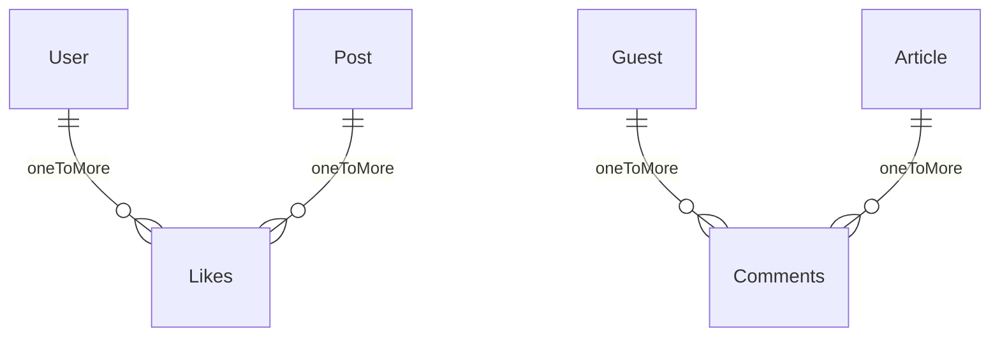

# API Design

- [API Design](#api-design)
  - [리스트와 상세보기](#리스트와-상세보기)
  - [A가 B에게 C를](#a가-b에게-c를)
  - [GET API 응답 데이터의 종류](#get-api-응답-데이터의-종류)
  - [쿼리를 사용한 필터 설계](#쿼리를-사용한-필터-설계)

## 리스트와 상세보기

리스트 데이터를 불러오는 API 설계 시 리스트 요소의 `id`를 받아서 요소의 데이터를 불러오는 API도 같이 작성하여 브라우저에서 URL의 동적 경로로 `id`를 넘겨서 상세보기 페이지에서 동적 경로로 넘어온 `id`를 받아 개별 요소의 데이터를 불러와 화면에 뿌려준다.

만약 페이지 이동 없이 페이지 안에서 데이터의 이동이 필요하고, 필요한 데이터가 리스트에 모두 존재한다면 굳이 `id`를 받아서 상세 데이터를 불러오는 API를 작성할 필요가 없다.

## A가 B에게 C를

일반 사용자가 다른 사용자의 게시글에 좋아요를 누르는 경우, 일반 사용자가 게시글에 댓글을 다는 경우 등 A가 B에게 C를 하는 경우에 C도 A와 B처럼 자신의 테이블과 고유값(PK)을 지니고 있으며, 외부값(FK)도 같이 지니게 된다.

## GET API 응답 데이터의 종류

GET API의 응답 데이터는 사용자 입력에 의해서 입력된 값과 서버 데이터가 상호작용을 통해 여러 종류로 표현될 수 있는데 내가 생각하는 종류는 아래와 같다.

- 입력 값 그대로
- 입력 값 기반으로 가공된 값
- 입력 값 + 입력 값 기반으로 가공된 값
- DB의 데이터를 기반으로 계산한 값(ex. 통계, 존재 여부 등)

## 쿼리를 사용한 필터 설계

주로 필터는 리스트 목록에 대해 서버단에서 데이터를 불러올 때 사용되는데, 이는 쿼리를 이용해서 값을 관리한다. 그 이유는 새로고침 시에도 해당 필터를 그대로 적용하기 위함이 가장 큰 이유라고 생각한다.

물론, 위 방법말고도 다른 방법으로 필터를 관리할 수도 있지만 개인적인 생각으로는 쿼리를 사용한 방식이 가장 보편적이고 쉬운 방식이라고 생각한다.

쿼리를 사용하게 되면 히스토리에 스택이 쌓이면서 뒤로가기 시 전에 클릭했던 필터 세팅으로 이동하게 된다. 이는 사용자 경험상 좋지 않다고 판단하여, 쿼리 변경 시에는 히스토리에 쌓지 않고 해당 url을 대체하는 방식으로 코드를 작성했다.

위처럼 판단한 근거는 뒤로가기 시 내가 하나하나 선택한 필터들이 하나씩 없어지는 걸 보려고 누른 것이 아닐 거라고 생각했다.

쿼리는 `?foo=a&bar=b`의 형식으로 작성이 되고, 이는 모두 문자열로 작성이 되어 서버로 보내진다. 그래서 클라이언트에서나 서버에서나 쿼리를 읽어들일 때는 적절한 자료형으로 파싱해서 사용해야 한다. 보통 `qs` 라이브러리를 이용해 손쉽게 해결할 수 있다.

모두 문자열이기 때문에 `null` 또는 `undefined`도 문자열로 인식하기 때문에 없는 값에 대한 데이터는 어떻게 전송해야하는지 백엔드와 협의하여 논의된 방식으로 전송하면 된다. 예를 들어 아예 보내지 않거나, 빈 문자열을 보내거나 아니면 문자열 `null`을 보내는 방식이 있다.

배열 같은 경우는 `?foo=1&foo=2` 또는 `?foo[]=1&foo[]=2` 등 `qs` 라이브러리에서 여러 형태의 포맷을 지원하며 백엔드와 협의하여 논의된 포맷으로 데이터를 전송하면 된다.
