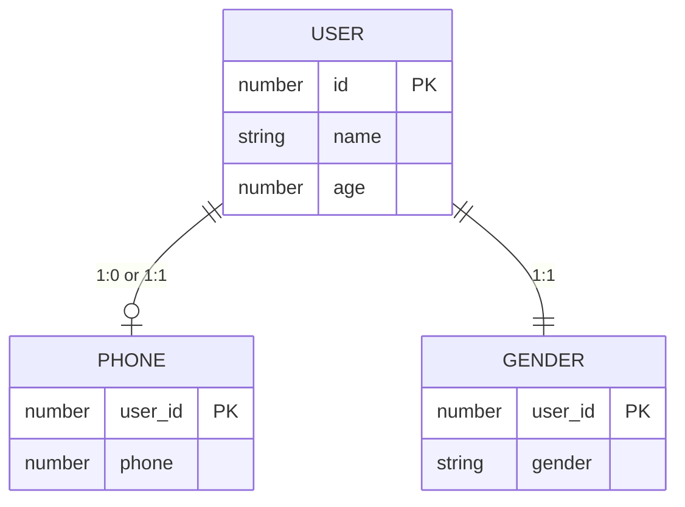
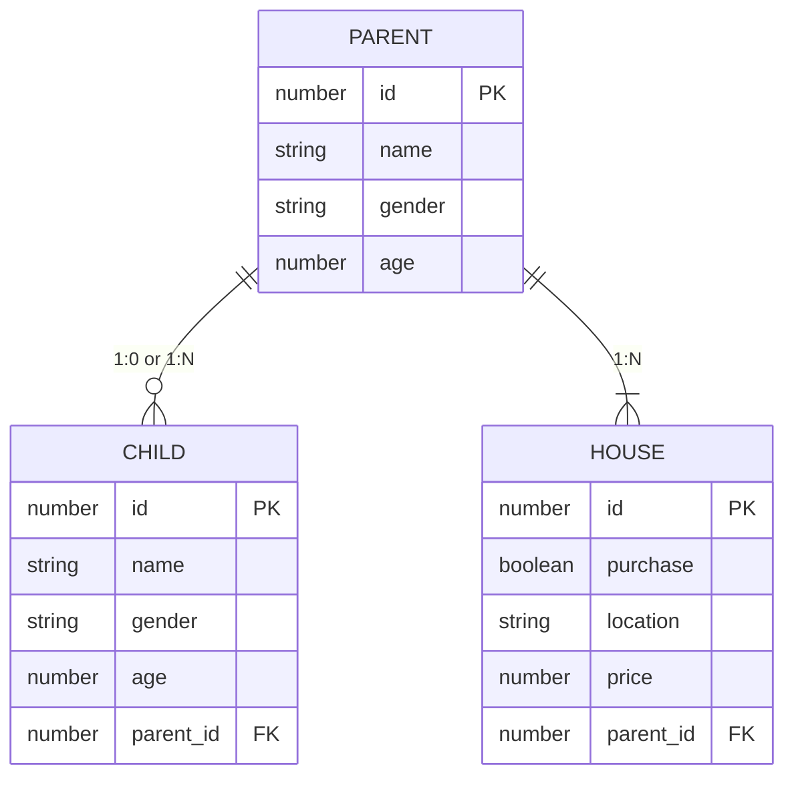
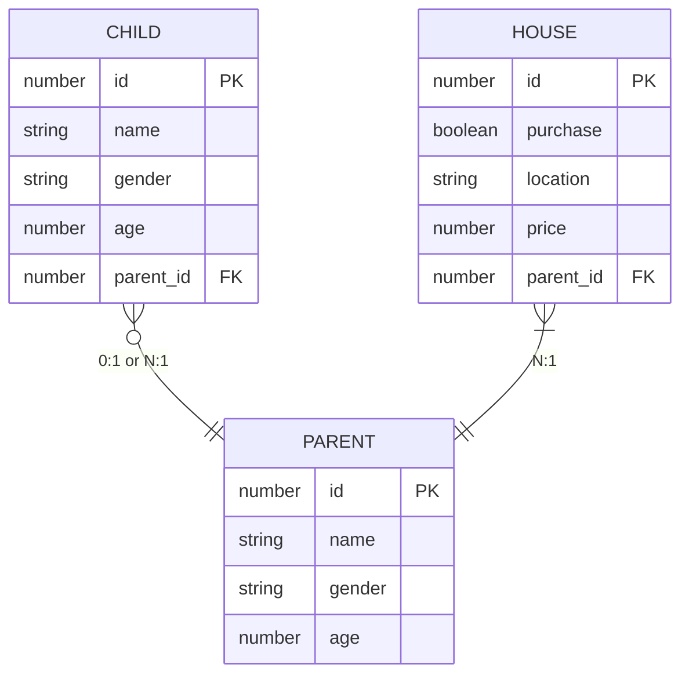
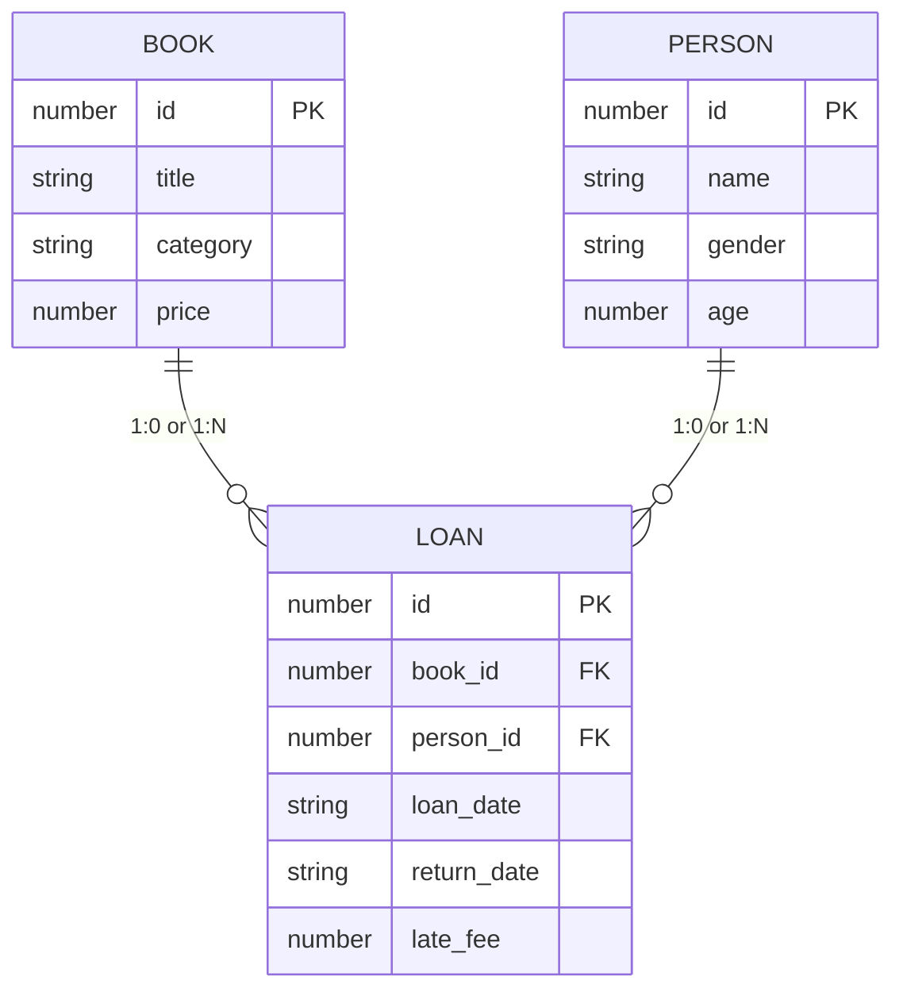

# API Design

- [API Design](#api-design)
  - [관계형 DB의 관계](#관계형-db의-관계)
    - [일대일 관계 (One-to-One Relationship)](#일대일-관계-one-to-one-relationship)
    - [일대다 관계 (One-to-Many Relationship)](#일대다-관계-one-to-many-relationship)
    - [다대일 관계 (Many-to-One Relationship)](#다대일-관계-many-to-one-relationship)
    - [다대다 관계 (Many-to-Many Relationship)](#다대다-관계-many-to-many-relationship)

## 관계형 DB의 관계

### 일대일 관계 (One-to-One Relationship)

한 테이블의 각 레코드가 다른 테이블의 레코드와 1:1 관계를 가진다.

### 일대다 관계 (One-to-Many Relationship)

한 테이블의 레코드가 다른 테이블의 여러 레코드와 관련이 있는 경우이다.
일대다 관계에서 "일"쪽의 PK 값을 알면 연관된 모든 "다"를 알 수 있지만, 특정 "다"를 알려면 추가적인 정보가 요구된다.

### 다대일 관계 (Many-to-One Relationship)

다수의 레코드가 다른 테이블의 한 레코드와 관련이 있는 경우입니다.
다대일 관계에서 특정한 "다"는 FK 값을 통해서 연결된 "일"의 관계를 알 수 있다.

### 다대다 관계 (Many-to-Many Relationship)

다수의 레코드가 다른 테이블의 다수의 레코드와 관련이 있는 경우입니다.

