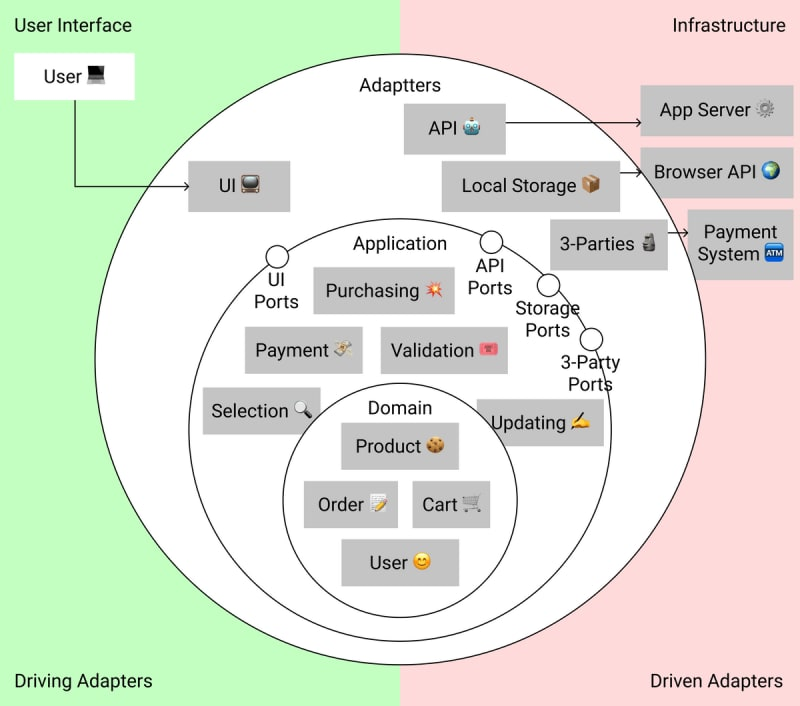

# Frontend Design

- [Frontend Design](#frontend-design)
  - [프로젝트 환경 설정 체크리스트](#프로젝트-환경-설정-체크리스트)
  - [설계 목록](#설계-목록)
  - [데이터 핸들링](#데이터-핸들링)
    - [자료형과 초기값](#자료형과-초기값)
  - [쿼리를 사용한 필터 설계](#쿼리를-사용한-필터-설계)
  - [그림으로 보는 프론트엔드 설계](#그림으로-보는-프론트엔드-설계)
  - [path 값을 활용한 페이지간 데이터 제공](#path-값을-활용한-페이지간-데이터-제공)
  - [유효성 설계](#유효성-설계)
  - [하나의 페이지를 미들웨어(인터셉터) 처럼 사용해서 값에 따라 페이징 분기처리 하는 방법](#하나의-페이지를-미들웨어인터셉터-처럼-사용해서-값에-따라-페이징-분기처리-하는-방법)
  - [값 수정 시](#값-수정-시)
  - [배포](#배포)

## 프로젝트 환경 설정 체크리스트

- [ ] monorepo
- [ ] rendering method
  - [ ] (CSR) React
  - [ ] (CSR + SSG + SSR) Next.js
- [ ] eslint
- [ ] prettier
- [ ] tsconfig
- [ ] css framework
  - [ ] emotion
  - [ ] tailwind
- [ ] 폼 상태 관리 라이브러리
  - [ ] react-hook-form
- [ ] 전역 상태 관리 라이브러리
  - [ ] recoil
  - [ ] redux
- [ ] 비동기 데이터 관리 라이브러리
  - [ ] react-query
  - [ ] redux-saga
- [ ] 라우터 관리 라이브러리
  - [ ] react-router
- [ ] 다국어 라이브러리
  - [ ] react-intl
  - [ ] next-translate
- [ ] 필수 라이브러리
  - [ ] axios
  - [ ] lodash
  - [ ] qs
  - [ ] js-cookie
  - [ ] dayjs
  - [ ] xlxs
  - [ ] uuid
  - [ ] jwt-decode
- [ ] 차트 라이브러리
  - [ ] chartjs
  - [ ] d3.js
- [ ] 드래그드랍 라이브러리
  - [ ] ...
- [ ] 텍스트 에디터 라이브러리
  - [ ] ...

## 설계 목록

- [ ] 레이아웃 설계
- [ ] 헤더, 푸터, 네비게이션 설계
- [ ] 페이지 설계
- [ ] 권한에 따른 라우트 가드 설계(미들웨어 방식)
- [ ] 비동기 통신 인터셉터 설계
- [ ] 로그인 토큰 제어 방법 설계
- [ ] 다국어 언어 데이터 구조 설계
- [ ] 디자인 컴포넌트 설계
- [ ] 데이터 컴포넌트 설계
- [ ] 검색, 정렬, 필터링, 페이징, 사이징 관련 쿼리 설계
- [ ] 클라이언트 데이터 관리 방법 설계
- [ ] 클라이언트 데이터 자료형 및 초기값 설정
- [ ] 클라이언트 데이터 에러 처리 설계
- [ ] 폼 데이터 관리 방법 설계
- [ ] 폼 데이터 자료형 및 초기값 설정
- [ ] 폼 유효성 검사 및 에러 처리 설계
- [ ] 비동기 데이터 관리 방법 설계
- [ ] 비동기 데이터 자료형 및 초기값 설정
- [ ] 비동기 데이터 로딩/성공/에러 처리 설계
- [ ] 배열 데이터 갯수 0개 화면 설계

## 데이터 핸들링

- 폼 데이터
- UI 제어 데이터
- 검색, 정렬, 필터링 데이터
- 페이징, 사이징 데이터
- 비동기 데이터

- 데이터 관리 방법
  - React Hooks
  - Context API
  - Query
  - Cookie
  - Local Storage
  - Session Storage
  - Recoil
  - React Query
  - React Hook Form

위 데이터를 다루면서 내가 느낀 점은 모든 데이터는 자료형과 초기값을 가지는 편이 좋다는 것이다. 그 이유는 하나의 변수가 다양한 자료형이 될 수 있거나, 초기값이 없다면 해당 변수를 자바스크립트 내부에서 사용할 때 예상치 못한 타입 에러가 날 가능성이 높고, 해당 상황은 사용자 경험을 저하시키기 떄문이다.

특히 특정 자료형에만 존재하는 메서드를 사용할 때 에러가 많이 발생하는데, 변수에 다른 자료형 값이 들어있다던지 `null`값이 들어있다면 메서드를 가지고 있지 않기 때문에 에러가 나게 된다.

이러한 실수들을 방지하기 위해 타입스크립트가 나오게 된 배경이 아닌가 싶다. 전 프로젝트에서 타입스크립트를 사용하다가 현재 프로젝트에서 타입스크립트를 사용하지 않다보니 크게 불편함을 많이 느꼈다.

API 응답 데이터의 경우 초기값을 작성하는 케이스보다 해당 API의 로딩이 끝나고 성공하면 API 문서에서 작성한 대로 데이터가 올거라 예상하고 데이터를 뿌려주는 경우가 많다. 이 경우에는 옵셔널 체이닝(`.?`)과 nullish 연산자(`??`)를 이용해 해당 데이터가 `null`인지 체킹하고 `null`이면 초기값을 세팅해주는 방식을 사용했다. 개인적으로 이 방식을 사용해보니 모든 데이터에 저 코드를 작성하다보니 초기값을 설정하는 편이 머리가 덜 아프다겠다는 생각이 들었다. 다음 프로젝트에서는 화면에 표시될 데이터들의 초기값을 설정한 후 비동기 데이터를 받아서 업데이트해주는 방식으로 진행해야겠다.

정리하면 초기값을 설정하고 응답 데이터를 초기값의 타입과 포맷에 맞게 가공해서 업데이트하고, 데이터를 요청할 때는 요청 타입과 포맷에 맞게 가공해서 전달한다.

**결론적으로 데이터를 다룰 때 데이터의 자료형과 초기값을 꼭 잘 설정하자!**

### 자료형과 초기값

클라이언트에서 다루는 데이터의 경우 HTML 태그의 속성 값을 참조하거나 Web API 응답값을 사용하게 되는데, 대부분의 경우 `string` 형태의 자료형을 가진다. 그리고
`string` 형태가 다른 `number`, `boolean` 형태보다 메서드도 많기 때문에 값을 다양하게 조작이 가능하다. 그래서 데이터의 자료형과 초기값은 기본적으로 `string` 형태의 빈 값을 세팅한 후, 작업을 하면서 자료형이 변경되어야 할 때 수정하면서 진행하는 편이 작업이 수월하다고 생각한다. 마치 `const`로 변수를 세팅한 후 변경이 필요한 값에 대해 `let`으로 수정하는 것과 비슷하다.

서버 응답 데이터의 경우 기존에 합의하여 설계된 API 문서를 바탕으로 자료형과 초기값을 설정한다. `React Query` 라이브러리를 사용할 경우, 해당 라이브러리가 비동기 상태 관리 라이브러리이기 때문에 따로 `useState()`를 활용해 관리하기보다 `useQuery()`의 `initialData` 속성을 활용하자.

## 쿼리를 사용한 필터 설계

주로 필터는 리스트 목록에 대해 서버단에서 데이터를 불러올 때 사용되는데, 이는 쿼리를 이용해서 값을 관리한다. 그 이유는 새로고침 시에도 해당 필터를 그대로 적용하기 위함이 가장 큰 이유라고 생각한다.

물론, 위 방법말고도 다른 방법으로 필터를 관리할 수도 있지만 개인적인 생각으로는 쿼리를 사용한 방식이 가장 보편적이고 쉬운 방식이라고 생각한다.

쿼리를 사용하게 되면 히스토리에 스택이 쌓이면서 뒤로가기 시 전에 클릭했던 필터 세팅으로 이동하게 된다. 이는 사용자 경험상 좋지 않다고 판단하여, 쿼리 변경 시에는 히스토리에 쌓지 않고 해당 url을 대체하는 방식으로 코드를 작성했다.

위처럼 판단한 근거는 뒤로가기 시 내가 하나하나 선택한 필터들이 하나씩 없어지는 걸 보려고 누른 것이 아닐 거라고 생각했다.

쿼리는 `?foo=a&bar=b`의 형식으로 작성이 되고, 이는 모두 문자열로 작성이 되어 서버로 보내진다. 그래서 클라이언트에서나 서버에서나 쿼리를 읽어들일 때는 적절한 자료형으로 파싱해서 사용해야 한다. 보통 `qs` 라이브러리를 이용해 손쉽게 해결할 수 있다.

모두 문자열이기 때문에 `null` 또는 `undefined`도 문자열로 인식하기 때문에 없는 값에 대한 데이터는 어떻게 전송해야하는지 백엔드와 협의하여 논의된 방식으로 전송하면 된다. 예를 들어 아예 보내지 않거나, 빈 문자열을 보내거나 아니면 문자열 `null`을 보내는 방식이 있다.

배열 같은 경우는 `?foo=1&foo=2` 또는 `?foo[]=1&foo[]=2` 등 `qs` 라이브러리에서 여러 형태의 포맷을 지원하며 백엔드와 협의하여 논의된 포맷으로 데이터를 전송하면 된다.

## 그림으로 보는 프론트엔드 설계

<!-- todo: 내용 보완 필요 -->

## path 값을 활용한 페이지간 데이터 제공

## 유효성 설계

입력의 제한을 두는 것이 아닌 입력은 자유로우나 해당 입력이 잘못됐으면 사용자 경험상 UI로 표현해주고 다음 단계로 못 넘어가게 작동

유효성에 대한 검사와 API 요청은 항상 분리

## 하나의 페이지를 미들웨어(인터셉터) 처럼 사용해서 값에 따라 페이징 분기처리 하는 방법

## 값 수정 시

사용자 입력했던 DB 값을 보여주는 디스플레이와 입력이 동시에 되는 인풋

DB 값을 보여주는 디스플레이와 입력이 분리되는 인풋

## 배포

네, Next.js는 개발 모드에서 파일이 변경될 때 자동으로 화면을 업데이트하는 "Hot Module Replacement (HMR)"라는 기능을 제공합니다. 따라서 Next.js 애플리케이션을 실행할 때 개발 서버가 변경된 파일을 실시간으로 감지하고 필요한 모듈만 교체하여 페이지를 자동으로 업데이트합니다.

일반적으로 다음과 같이 Next.js 애플리케이션을 개발 모드로 실행하면 HMR이 활성화됩니다:

bash
Copy code
npm run dev
이 명령을 실행하면 Next.js 개발 서버가 시작되며, 변경된 파일이 자동으로 반영되어 화면이 업데이트됩니다. 새로고침 없이 변경 사항을 확인할 수 있습니다.

그러나 프로덕션 환경에서는 이러한 자동 업데이트 기능이 기본적으로 비활성화됩니다. 프로덕션 빌드를 생성하고 서버를 시작하려면 다음과 같이 명령을 실행합니다:

bash
Copy code
npm run build
npm start
프로덕션 환경에서는 변경된 파일을 적용하려면 서버를 다시 시작해야 합니다. 이 경우 새로 고침 없이 업데이트되지 않습니다. 프로덕션 환경에서는 주로 빌드 후 서버를 다시 시작하는 방식으로 업데이트를 관리합니다.

개발 환경에서 HMR을 통해 빠르게 개발할 수 있고, 프로덕션 환경에서는 변경된 파일을 적용하는 데 필요한 조치를 취할 수 있습니다.

User
프로덕션 서버에서는 불가능하지?
ChatGPT
프로덕션 환경에서는 기본적으로 Next.js에서 제공하는 Hot Module Replacement (HMR)과 같은 실시간 자동 업데이트 기능이 활성화되지 않습니다. 프로덕션 환경에서는 변경된 파일을 적용하기 위해 서버를 다시 시작하고, 클라이언트는 페이지를 새로 고쳐야 합니다.

일반적으로 프로덕션 환경에서는 안정성과 예측 가능한 동작을 위해 HMR이 비활성화되며, 변경된 파일을 적용하기 위해서는 서버를 다시 시작해야 합니다. 이는 사용자에게 눈에 띄게 변경된 내용을 제공하기 위해 새로 고침이 필요할 수 있음을 의미합니다.

프로덕션 환경에서는 보통 다음과 같은 단계를 따릅니다:

빌드: 애플리케이션의 정적 파일을 미리 빌드하여 최적화된 번들을 생성합니다.
서버 시작: 빌드된 애플리케이션을 서버에 배포하고 서버를 시작합니다.
서버 재시작: 변경이 필요한 경우 서버를 다시 시작하여 새로운 코드나 자원을 반영합니다.
따라서 프로덕션 환경에서는 안정성과 예측 가능한 동작을 위해 더 많은 제어를 유지하고자 합니다. 개발 환경에서는 빠른 개발과 테스트를 위해 HMR과 같은 기능을 사용할 수 있지만, 프로덕션에서는 이러한 기능을 비활성화하고 변경 사항을 관리하는 데 조심스럽게 접근합니다.
