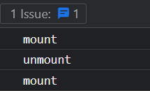

# React

- [React](#react)
  - [가상 돔(Virtual DOM)](#가상-돔virtual-dom)
    - [oninput vs onchange](#oninput-vs-onchange)
    - [사용자 입력 제한](#사용자-입력-제한)
  - [JSX](#jsx)
    - [checked](#checked)
  - [사용자 Hook](#사용자-hook)
  - [useState](#usestate)
  - [useEffect](#useeffect)
  - [useMemo vs useCallback](#usememo-vs-usecallback)
  - [memo](#memo)
  - [useEffect 두 번 호출 이슈](#useeffect-두-번-호출-이슈)
  - [manifest.json](#manifestjson)
  - [react-query 사용 시 애니메이션 렌더링 문제](#react-query-사용-시-애니메이션-렌더링-문제)

## 가상 돔(Virtual DOM)

리액트는 실제 돔을 기반으로 만들어진 가상 돔이 존재한다. 정의해놓은 상태 값이 변경되어 가상 돔의 변화가 일어나게 되면 실제 돔과 비교하여 변경된 부분만 수정한 후에 리렌더링이 이루어진다.


### oninput vs onchange

- `oninput`: 사용자가 입력을 생성하고 수정하는 매 순간 이벤트가 발생
- `onchange`: 사용자가 입력을 생성하고 수정한 후 포커스를 잃을 때 발생

리액트에서 `onchange`는 `oninput`과 동일한 방식으로 동작하며 기본 `onchange`의 동작은 지원하지 않는다. 이유는 불분명하고 설계상 이슈일 확률이 크다.

### 사용자 입력 제한

개발하다 보면 사용자 입력을 제한해야 하는 상황이 생긴다. 일반적으로 생각나는 방법은 입력 요소의 `disabled` 속성을 주는 방법 또는 해당 화면을 마스킹 처리해서 클릭이 일어나지 않도록 방지하는 것이다.

위 방법은 개발자 도구에서 `disabled` 값을 수정하거나 마스킹 스타일을 수정해서 클릭할 수 있는 상태로 변경이 가능하다. 이런 이유로 클라이언트에서는 데이터 무결성을 완벽히 체크하지 못하므로 서버에서 꼼꼼한 예외처리가 필요하다. 리액트에서는 가상 돔을 이용하므로 `disabled` 값이 상태 값에 의존하는 경우에는 입력 제한이 가능하다(?). 속성 값을 수정해도 상태 값이 변경되지 않아 리렌더링이 발생하지 않고 화면 상에서는 클릭 가능해보이지만 클릭해보면 이벤트가 발생하지 않는다.

인증된 사용자의 토큰이 필요한 API의 경우 추적도 가능하고 인증된 사용자가 위와 같은 편법을 쓸 확률을 낮기 떄문에 비교적 위험성이 적지만, 토큰이 필요없는 API나 중요한 정보가 오가는 API(가격, 사용자 정보, 결제 등)가 동작하는 입력 요소의 경우 보안적인 부분을 꼼꼼히 신경쓰는 것이 좋다.

## JSX

JSX(JavaScript XML)는 React와 같은 JavaScript 라이브러리를 위해 개발된 문법 확장이다. JSX는 JavaScript 코드 안에서 XML과 유사한 구문을 사용하여 JavaScript와 HTML을 함께 작성할 수 있게 해준다.

JSX는 JavaScript 표현식을 중괄호({})로 감싸서 삽입할 수도 있다. 이를 통해 동적으로 값을 계산하거나 변수를 사용할 수 있다.

JSX는 바벨(Babel)과 같은 도구를 사용하여 일반 JavaScript 코드로 변환된다.

### checked

HTML 파일에서 체크박스나 라디오 인풋의 `checked` 속성은 초기값을 설정하는 속성이다. `checked` 속성은 `Boolean` 타입으로 HTML에서 `Boolean` 타입은 해당 속성을 단순히 명시하거나 명시하지 않는 방식으로 제어한다. 아래와 같이 문자열을 넣든 빈 문자열을 넣든 명시할 경우 `true` 값이 된다.

```html
<!-- checked === true -->
<input type="checkbox" checked />
<input type="checkbox" checked="" />
<input type="checkbox" checked="false" />
<!-- checked === false -->
<input type="checkbox" />
```

이와 달리, 리액트에서는 JSX 문법을 사용하므로 HTML 요소의 속성을 동적으로 제어할 수 있다. 그래서 상태(state) 변수와 바인딩되어 동적으로 체크 상태를 제어할 수 있다.

## 사용자 Hook

사용자 Hook은 로직을 재사용하기 위해서 리액트의 Hook들을 이용해 개발자가 직접 작성하는 Hook이다. 보통 `useState`, `useEffect`의 조합으로 구성되며 함수명 규칙은 앞에 "use"를 사용해야 한다.

일반 유틸 함수와의 차이점은 리액트에서 제공하는 훅을 사용하냐 안하냐의 차이인 거 같다.

## useState

`useState`의 첫 번째 인자는 초기값을 설정해주는데, 해당 값은 컴포넌트가 마운트 시에만 설정되고, 이후에는 setState를 통해 값을 업데이트한다.

```js
const [state, setState] = useState(initialState);
```

## useEffect

`useEffect`는 화면이 한 번 렌더링된 이후에 동작한다.

## useMemo vs useCallback

```js
const memo: number = useMemo(() => {
  return 1;
}, []);

const callback: () => number = useCallback(() => {
  return 1;
}, []);
```

<!-- todo: 내용 보완 필요 -->

## memo

컴포넌트가 소품에 따른 렌더링 방지

## useEffect 두 번 호출 이슈

회사에서 개발 중 useEffect가 한 번만 호출되도록 설정을 했다. 그런데 두 번씩 호출되서 예상한대로 동작하지 않던 이슈가 있었는데 해당 코드가 기억이 나지 않아서 원인에 대해서만 작성해야겠다.

```JavaScript
useEffect(() => {
  console.log(mount);
  return () => {
    console.log(unmount);
  };
}, []);
```

위 코드를 실행해보면 아래와 같은 결과가 나타난다.



원인은 리액트의 엄격 모드 설정으로 인해 개발모드에서 나타나는 현상이다. 리액트에서 엄격 모드를 설정하면 안전하지 않은 수명 주기, 레거시 API 사용 및 기타 여러 기능을 식별하는데 도움이 된다고 하니 개발에 영향을 주지 않으면 굳이 비활성화 시킬 필요는 없어보인다.

아래는 리액트에서 엄격 모드를 설정하는 방법이고, Next.js를 사용한다면 다른 방식으로 설정이 필요하다.

```JavaScript
root.render(
  <React.StrictMode>
    <App />
  </React.StrictMode>,
);
```

개발에 영향을 줄 경우에만 해당 기능을 잠시 꺼둔 후에 작업을 진행하면 될 거 같다.

## manifest.json

manifest.json 파일은 Progressive Web App(PWA)에서 사용되는 파일로, 해당 웹 앱의 메타데이터와 구성 요소를 정의하는 역할을 합니다. PWA는 웹과 네이티브 앱의 장점을 결합한 형태이다.


CRA로 리액트 프로젝트 생성 시 public 폴더 아래에 해당 파일이 있는데 PWA 프로젝트가 아니라면 굳이 필요하지 않아 삭제해도 무방하다. index.html의 관련 코드도 같이 삭제해야 한다.

## react-query 사용 시 애니메이션 렌더링 문제

아래와 같은 어드민 패널에 진행과정 메일링을 보면 Switch 컴포넌트가 적용되어 있는데, 이 컴포넌트는 클릭 시 상태에 따라 트랜지션이 일어나고 리액트 쿼리로 리스트 값을 업데이트하는 API 요청을 하게 된다. 그리고 성공 시 해당 화면에 정보를 다시 불러와서 업데이트한다.


이 과정에서 연속으로 상태를 바꿀 경우 새로 불러오는 데이터와 버튼의 상태 데이터가 충돌해서 애니메이션이 왔다갔다하는 경우를 발견할 수 있다. 이를 해결하기 위해 리스트 값을 업데이트하지 않고 리액트 쿼리의 `cacheTime` 속성을 `0`으로 설정하여 해결했다.
