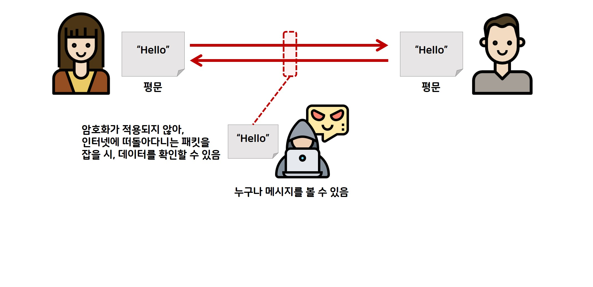

# Security

- [Security](#security)
  - [새로고침 시 데이터](#새로고침-시-데이터)
  - [암호화](#암호화)
    - [단방향 알고리즘(해시 알고리즘)](#단방향-알고리즘해시-알고리즘)
    - [양방향 알고리즘(대칭키)](#양방향-알고리즘대칭키)
    - [양방향 알고리즘(비대칭키)](#양방향-알고리즘비대칭키)

<!-- todo: 내용 보완 필요 -->

## 새로고침 시 데이터

새로고침 시 자바스크립트 상에서 작성한 데이터는 모두 휘발되며 재업데이트가 필요하다.

이런 재업데이트 현상으로 원하지 않는 사이드 이펙트가 발생할 수 있는데,

새로고침 시에도 데이터를 유지하면서 사이드 이펙트를 없애려면 브라우저 저장소를 적극 활용하자.

보안적인 측면에서는, 개인정보 같은 데이터는 인증된 사용자에 한해서는 브라우저에 존재해도 된다고 생각한다.

암호화에 대한 개념 서술

웹 스토리지, 쿠키는 모두 인증된 사용자에 한해서 데이터가 저장된다는 생각을 기반으로 설계된 놈들이기에 암호화 기능이 없다.

그러므로 해당 스토리지들에는 인증이 끝난 사용자에 한해서는 데이터가 저장되서는 안된다.

session storage를 이용하는 것이 권장된다. 브라우저가 종료되면 데이터가 휘발되기 떄문에

자동 로그인 같은 경우 사용자의 동의를 받고 데이터가 노출될 수 있음을 알려야 한다.

자동 로그인 트렌드는 본인이 신뢰할 수 있는 기기인지를 등록하여 사용하게 된다.

웹 스토리지, 쿠키, 세션에 대한 차이 서술

ui 제어로 보안 불가능 개발자 도구에서 얼마든지 뚫을 수 있음, disabled -> enabled

로그인 과정

권한

동시 접속 제한

액세스 토큰

리프레시 토큰

토큰 만료 시 리다이렉트

미들웨어를 이용한 라우팅 가드

axios 인터셉터를 이용한 인증 만료된 토큰 처리

로그인 시 라우팅

로그아웃 토큰 제거

## 암호화

암호(Cryptography)란 0과 1로 이루어진 이진수 데이터를 수학적 계산을 통한 비트 변경을 수행하는 것이다. 정상적인 데이터(평문 - Plaintext)의 2진수 데이터를 암호화라는 과정으로 데이터를 변경하고, 복호화라는 과정을 통해 데이터를 원래대로 돌리는 기술을 의미한다.

### 단방향 알고리즘(해시 알고리즘)

단방향 암호로 잘 알려진 알고리즘으로 해시 알고리즘들이 있다. 해시 알고리즘은 암호화는 가능하지만, 복호화가 불가능하다는 점을 이용하여 데이터의 무결성을 검증한다. 데이터의 무결성이란 데이터가 허락된 사용자로 인해 수정이 제대로 이루어졌는지, 허가되지 않은 사용자가 무단으로 데이터를 조작했는지 여부를 보는 것이다.

### 양방향 알고리즘(대칭키)

대칭키 암호화는 양방향 암호화로써, 복호화가 가능한 암호 알고리즘이다. 암호화와 복호화에 쓰이는 키 크기가 상대적으로 작고 암호 알고리즘 내부 구조가 단순하여, 시스템 개발 환경에 용이하고, 비대칭키에 비해 암호화와 복호화 속도가 빠르다. 하지만 교환 당사자간에 동일한 키를 공유해야 하기 때문에 키관리의 어려움이 있고, 잦은 키 변경이 있는 경우에 불편함을 초래한다. 뿐만 아니라 디지털 서명 기법에 적용이 곤란하고 안전성을 분석하기가 어렵고 중재자가 필요하다.

### 양방향 알고리즘(비대칭키)

비대칭키 암호화는 양방향 암호화로써, 복호화가 가능한 암호 알고리즘입니다. 공개키 암호는 대칭키 암호의 키 전달에 있어서 취약점을 해결하고자 한 노력의 결과로 탄생했다. 한 쌍의 키가 존재하며, 하나는 특정 사람만이 가지는 개인키(또는 비밀키)이고 다른 하나는 누구나 가질 수 있는 공개키이다. 공개키 암호화 방식은 암호학적으로 연관된 두 개의 키를 만들어서 하나는 자기가 안전하게 보관하고 다른 하나는 상대방에게 공개합니다. 개인키로 암호화 한 정보는 그 쌍이 되는 공개키로만 복호화가 가능하고, 공개키로 암호화한 정보는 그 쌍이 되는 개인키로만 복호화가 가능하다.

만약, 개인이 비밀통신을 할 경우 비대칭키 암호화보다 대칭키 암호를 사용할 수 있지만, 다수가 통신을 할 때에는 키의 개수가 급증하게 되어 큰 어려움이 따른다. 이런 어려움을 극복하기 위해 나타난 것이 공개키 암호이다. 공개키 암호는 다른 유저와 키를 공유하지 않더라도 암호를 통한 안전한 통신을 할 수 있다는 장점이 있다.
