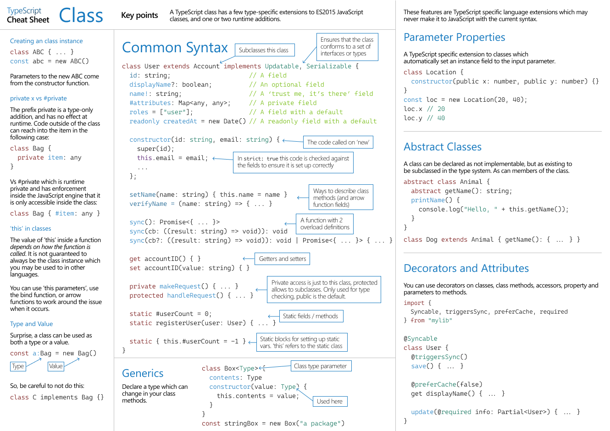

# Typescript

## .d.ts

타입스크립트로 어플리케이션을 작성할 때 기존 자바스크립트만으로 구성된 라이브러리를 사용할 경우 타입이 필요하다고 에러를 뿜을 것이다. 자바스크립트 이후에 타입스크립트가 탄생하면서 자바스크립트만으로 구성된 라이브러리에게는 타입이 없기 때문에 타입을 작성해주어야 했다.

위에 말한 기능을 제공하는 것이 `.d.ts` 파일이다. 해당 파일은 기존 자바스크립트 파일을 굳이 `.ts`로 바꿔서 재작성할 필요가 없이 `.d.ts` 파일에 타입 정의만 작성해서 추가하면 타입스크립트가 타입을 인식하고 오류를 뿜지 않는다.

`.ts` 파일은 표준 타입스크립트 파일로 타입스크립트 컴파일러에 의해 일반 자바스크립트 문법으로 변환되지만 `.d.ts` 파일은 타입스크립트 컴파일러에서 참조만 할 뿐 컴파일 결과물에 포함되지 않는다.

### 선언 방식의 차이

| .ts                          | .d.ts                                 |
| ---------------------------- | ------------------------------------- |
| var a = 1                    | declare var a: number                 |
| let a = 1                    | declare let a: number                 |
| const a = 1                  | declare const : 1                     |
| function a(b) { ... }        | declare function a(b: number): string |
| class A { b() { return 3 } } | declare class A { b() : number }      |
| namespace A { }              | declare namespace A {}                |
| type A = number              | type A = number                       |
| interface A { b?: string }   | interface A { b?: string }            |
