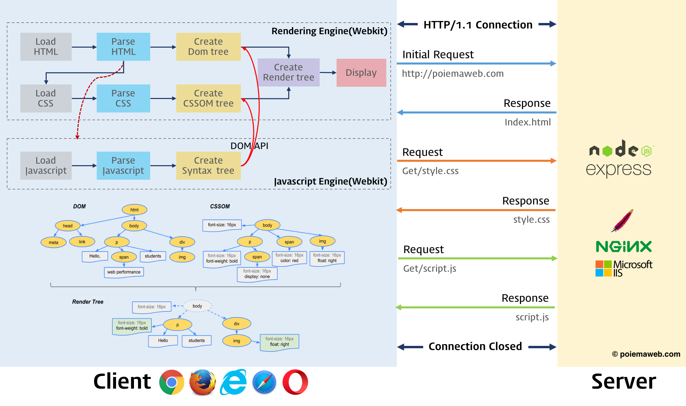
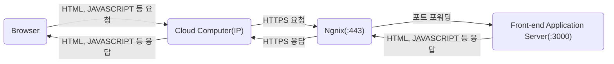
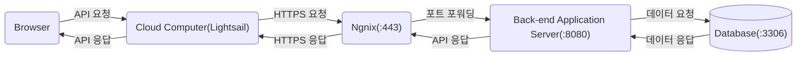
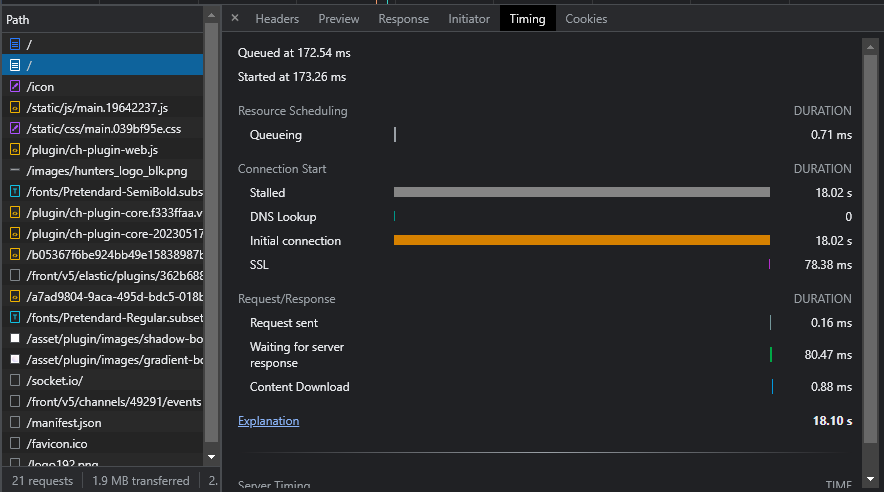

# Web

- [Web](#web)
  - [브라우저 렌더링](#브라우저-렌더링)
    - [Render Tree가 만들어지는 과정](#render-tree가-만들어지는-과정)
    - [웹서버의 종류](#웹서버의-종류)
    - [CSR(Client Side Rendering)](#csrclient-side-rendering)
    - [SSR(Server Side Rendering)](#ssrserver-side-rendering)
    - [SSG(Static Site Generator)](#ssgstatic-site-generator)
    - [렌더링 방법 비교](#렌더링-방법-비교)
  - [브라우저와 서버의 의사소통](#브라우저와-서버의-의사소통)
  - [마크업 언어(Markup Language)](#마크업-언어markup-language)
    - [HTML(Hyper Text Markup Language)](#htmlhyper-text-markup-language)
    - [Markdown](#markdown)
    - [XML(eXtensible Markup Language)](#xmlextensible-markup-language)
    - [JSON(Javascript Object Notation)](#jsonjavascript-object-notation)
  - [브라우저의 주소 표시창에 URL을 입력했을 때 발생하는 동작](#브라우저의-주소-표시창에-url을-입력했을-때-발생하는-동작)
  - [URL(Uniform Resource Locator)](#urluniform-resource-locator)
  - [자바스크립트 등장 이전의 웹 동작 방식](#자바스크립트-등장-이전의-웹-동작-방식)
    - [자바스크립트 등장 이후의 웹 동작 방식](#자바스크립트-등장-이후의-웹-동작-방식)
    - [AJAX 등장 이전의 웹 방식](#ajax-등장-이전의-웹-방식)
    - [AJAX 등장 이후의 웹 방식](#ajax-등장-이후의-웹-방식)
  - [MIME 타입](#mime-타입)
  - [디버깅](#디버깅)
    - [initial connection](#initial-connection)
    - [blocked:mixed-content](#blockedmixed-content)
    - [content-disposition](#content-disposition)
    - [Lightsail DB 연결](#lightsail-db-연결)

## 브라우저 렌더링

### Render Tree가 만들어지는 과정

### 웹서버의 종류

아래는 기본적으로 HTTP/HTTPS 요청을 받는 웹서버를 바탕으로 하고 사용성에 따라 구분해 보았다.

API 서버: DB와 연결되어 사용자의 요청에 따라 GET/POST/PUT/DELETE 동작을 수행하는 서버

SSR 서버: DB와 연결되어 사용자의 요청에 따라 알맞은 데이터를 넣어 렌더링된 HTML 파일을 응답하는 서버

Static 서버: 사용자가 요청한 정적 파일(HTML, Javascript, CSS, Image, Font 등)을 응답하는 서버

### CSR(Client Side Rendering)

CSR은 클라이언트(브라우저)에서 렌더링을 한다. 한 번 요청해서 받으면 변하지 않는 정적 자산들인 빈 HTML(도화지)과 자바스크립트(붓)를 Static 서버에 요청해서 받아온 후 작성된 자바스크립트 코드에 따라 브라우저는 화면을 그리고 동적인 데이터가 들어가는 부분은 API 서버에 데이터를 요청해서 데이터를 업데이트한다.

### SSR(Server Side Rendering)

SSR은 SSR 서버에서 렌더링을 한다. SSR 서버는 첫 요청에서 초기값을 넣어 렌더링된 HTML 파일을 응답한다. 이 후 상호작용을 통해 데이터가 변경될 때 서버로 요청이 들어오면 그 시점의 알맞은 데이터를 넣어 렌더링이 완료된 HTML을 보내는 방식이다.

### SSG(Static Site Generator)

미리 작성해놓은 정적인 파일들을 Static 서버에 저장해놓고 클라이언트가 요청하면 해당 파일을 보여주는 방식이며, 동적인 변화가 불가능하다.

### 렌더링 방법 비교

## 브라우저와 서버의 의사소통

## 마크업 언어(Markup Language)

문서가 화면에 표시되는 형식을 나타내거나 데이터의 논리적인 구조를 명시하기 위한 규칙들을 정의한 언어의 일종이다. 데이터를 기술한 언어라는 점에서 프로그래밍 언어와는 분명한 차이가 있다.

### HTML(Hyper Text Markup Language)

HTML은 태그를 사용하여 웹 페이지의 구조와 내용을 정의합니다. 제목, 단락, 링크, 이미지, 양식 등 다양한 요소를 지원합니다. HTML 문서는 웹 브라우저에 의해 시각적으로 표시됩니다.

### Markdown

Markdown은 간단한 구문 (강조를 위한 별표, 제목을 위한 해시태그 등)을 사용하여 일반 텍스트를 구조화된 콘텐츠로 서식 지정합니다. 원시 형식으로 읽기 쉽고, 게시를 위해 HTML이나 다른 형식으로 변환할 수 있습니다. Markdown은 HTML만큼 다양한 기능을 제공하지는 않지만, 기본 콘텐츠를 간단하고 빠르게 생성하는 데 적합합니다.

### XML(eXtensible Markup Language)

기존의 HTML과 달리 웹상에서 구조화된 문서를 전송가능하도록 설계되었다. 이게 무슨 뜻이냐면 예를 들어 HTML에서는 "CPU 2.83GHz"라는 데이터를 표기할 때 어디부터가 데이터 명이고 어디부터가 실제 데이터인지 표시할 수 있는 마땅한 방법이 없다.

이런 문제를 해결하기 위해 XML을 이용하면 어디부터 어디까지가 데이터 이름이고 어디부터 어디까지가 실제 데이터이며 어디부터 어디까지가 데이터 단위인지도 표현이 가능하다. 즉, 데이터에 의미를 부여하는 메타데이터를 기술할 수 있다. XML은 바로 이러한 목적으로 탄생했다. 위의 예를 XML로 바꾸면 데이터 명은 `<dataname>CPU</dataname>`가 되고 데이터 값은 `<datavalue>2.83</datavalue>`이 된다.

이런 XML의 특징은 수많은 종류의 데이터를 유연하고 자유롭게 기술하는 데 적용할 수 있어서 다양한 용도로 응용할 수 있으며, 인터넷으로 연결된 시스템끼리 쉽게 식별 가능한 데이터를 주고받을 수 있게 된다. 게임 모드 등을 시도해 봤다면 설정파일이 XML로 된 것을 본 경험이 있을 것이다.

### JSON(Javascript Object Notation)

서버와 클라이언트간의 데이터를 교환할 때 사용하는 데이터 포맷이다. 클라이언트가 사용하는 언어에 관계 없이 통일된 데이터를 주고받을 수 있도록, 일정한 패턴을 지닌 문자열을 생성해 내보내면 클라이언트는 그를 해석해 데이터를 자기만의 방식으로 온전히 저장, 표시할 수 있게 된다.

과거 웹 초기 시절부터 사용된 XML은 헤더와 태그 등의 여러 요소로 가독성이 떨어지고, 쓸데없이 용량을 잡아먹는다는 단점을 항상 지적받았다. 이에 대응해 간결하고 통일된 양식으로 각광을 받고 있는 것이 JSON이다.

`{ }`​은 객체를 의미하며, `[ ]`은 배열, 객체 안에 객체를 넣을 수도 있어서 XML처럼 복잡한 구조 또한 표현이 가능하다. 표현할 수 있는 값의 자료형은 `{ }​`로 표기되는 객체, `[ ]`로 표기되는 배열, 문자열, 숫자, 불리언, `null`로 6가지가 전부다. 또한 `null`의 존재에서 알 수 있듯, JSON은 JavaScript 이외의 언어에서 사용될 상황을 다분히 고려하고 있다.

## 브라우저의 주소 표시창에 URL을 입력했을 때 발생하는 동작

## URL(Uniform Resource Locator)

URL은 말 그대로 자원(리소스)을 가리키는 지시자이다. 자원의 종류는 아래와 같다.

- 웹 페이지 (HTML 문서)
- 이미지
- 스타일 시트 (CSS)
- 스크립트 (JavaScript)
- 멀티미디어 (동영상, 오디오)
- 문서 (PDF, 문서 파일 등)
- 데이터 (JSON, XML)
- 기타 리소스 (폰트, 아이콘 등)

이 외에도 웹은 다양한 유형의 자원을 포함하고 있으며, URL을 통해 이러한 자원들에 접근할 수 있다. URL은 프로토콜(예: http, https), 호스트, 포트, 경로 및 쿼리 매개변수 등을 포함하여 자원의 위치와 접근 방법을 지정한다.

## 자바스크립트 등장 이전의 웹 동작 방식

자바스크립트가 등장하기 전의 웹은 정적인 내용으로 구성되었다. 웹 페이지의 내용은 서버에서 생성되어 클라이언트에게 전송되고, 클라이언트는 해당 내용을 받아 브라우저에서 렌더링하여 표시했다. 사용자와의 상호작용은 주로 링크를 클릭하거나 폼을 제출하는 등의 방식으로 이루어졌다. 이렇게 정적인 웹 페이지에서는 페이지 갱신이 발생하면 새로운 페이지를 서버에서 요청하고 받아와야 했다. 이로 인해 사용자 경험이 제한되었고, 웹 페이지 갱신이 느렸다.

### 자바스크립트 등장 이후의 웹 동작 방식

자바스크립트의 등장으로 웹 페이지에 동적인 기능을 추가할 수 있게 되었다. 자바스크립트는 클라이언트 측에서 실행되는 스크립트 언어로, 웹 페이지의 내용을 변경하거나 사용자와의 상호작용을 처리할 수 있다. 이로 인해 웹 페이지는 더 동적이고 반응적으로 동작할 수 있게 되었다. 예를 들어, 사용자가 버튼을 클릭하면 자바스크립트를 사용하여 페이지 내용을 변경하거나 서버와 통신하여 데이터를 동적으로 가져올 수 있다.

### AJAX 등장 이전의 웹 방식

AJAX가 등장하기 전의 웹 방식에서는 페이지 갱신이 발생할 때마다 새로운 페이지를 서버에서 요청하고 응답을 받아와 전체 페이지를 다시 렌더링했다. 이로 인해 사용자 경험이 제한되었고, 페이지 갱신 시간이 오래 걸렸다.

### AJAX 등장 이후의 웹 방식

AJAX(Asynchronous Javascript and XML) 자바스크립트와 XML을 이용한 비동기적 데이터 교환을 의미한다. 그러나 현재에는 XML보다는 사용자 편의성이나 보안 측면에서 유리한 JSON이 보편적으로 사용된다.

AJAX의 등장으로 웹 페이지의 일부분만 갱신하거나 데이터를 비동기적으로 서버와 주고받을 수 있게 되었다. 이는 사용자 경험을 향상시키고 페이지 갱신 시간을 줄이는 데 큰 영향을 미쳤다. AJAX를 통해 데이터를 서버와 주고받을 때 페이지 전체를 새로 렌더링할 필요 없이, 필요한 부분만 업데이트할 수 있다. 이로 인해 웹 애플리케이션은 빠르고 동적인 동작을 보여줄 수 있게 되었다.

요약하면, 자바스크립트의 등장 이전에는 정적인 웹 페이지가 주를 이루었으며, 자바스크립트와 함께 웹 페이지는 동적이고 반응적인 동작을 하게 되었다. 또한, AJAX의 등장으로 웹 페이지의 일부분만 갱신하거나 데이터를 비동기적으로 주고받을 수 있게 되어 사용자 경험과 성능이 크게 향상되었다.

## MIME 타입

MIME(Multipurpose Internet Mail Extensions) 타입은 파일의 형식이나 유형을 식별하기 위한 표준화된 문자열입니다. MIME 타입은 주로 웹에서 사용되며, 웹 브라우저와 서버가 파일의 내용을 올바르게 처리하도록 도와줍니다. MIME 타입은 파일의 확장자나 내용의 특성에 따라 결정되며, 파일의 실제 형식을 정확하게 식별할 수 있도록 도와줍니다.

- application/javascript
- application/json
- application/x-www-form-urlencoded: 웹 폼 데이터를 URL 인코딩하여 서버로 전송
- application/xml
- application/zip
- application/pdf
- application/sql
- application/graphql
- application/ld+json
- application/msword (.doc)
- application/vnd.openxmlformats-officedocument.wordprocessingml.document(.docx)
- application/vnd.ms-excel (.xls)
- application/vnd.openxmlformats-officedocument.spreadsheetml.sheet (.xlsx)
- application/vnd.ms-powerpoint (.ppt)
- application/vnd.openxmlformats-officedocument.presentationml.presentation (.pptx)
- application/vnd.oasis.opendocument.text (.odt)
- audio/mpeg
- audio/vorbis
- multipart/form-data: 파일 업로드와 같이 바이너리 데이터를 포함하는 폼 데이터를 전송하는 데 사용
- text/css
- text/html
- text/csv
- text/plain
- image/png
- image/jpeg
- image/gif

## 디버깅

### initial connection

리액트 프로젝트를 배포 후에 사이트에 접속해보니 사이트가 매우 느리게 로드되었다. 거의 체감상 30초 정도 걸린 것 같다.

처음에는 SPA니까 첫 로드가 오래 걸린다 생각했지만, 그러기엔 번들 파일의 크기가 1.2MB정도였다. 개발 중에 급하게 폰트를 적용했었는데 해당 폰트가 경량화 폰트가 아니라서 폰트 용량 문제라고 생각했으나, 경량화 폰트를 적용해도 해당 이슈는 사라지지 않았다.

그래서 개발자 도구를 좀 더 디테일하게 살펴보니 진입점 파일인 index.html을 불러오는데 약 20초 정도가 걸렸다. 원인은 아래 사진과 같이 initial connection 이슈였다. 이걸 보니 단순히 프론트 쪽에 코드를 수정해서 될 일이 아니라 네트워크 쪽 이슈 같았다. 백엔드 개발자가 도메인 연결 쪽을 검토해줬는데 연결한 도메인이 다른 IP에도 연결되어 있어서 해당 IP를 잘 찾지못해서 일어난 이슈였다.

해당 이슈가 다시 발생한다면 도메인 연결을 검토해보자.

### blocked:mixed-content

https 사이트에서 http 비동기 통신을 할 경우 발생

### content-disposition

content-dispositon의 경우 서버에서 값을 노출시켜주지 않으면 axios에서 보여지지 않음 exposed 설정 따로 해야함

헤더 값을 통한 작업 시 헤더의 값이 대문자일수도 소문자일수도 있기에 해당 처리를 해줄 필요가 있다.
한마디로 헤더는 대소문자를 구분하지 않음 -> axios에서 다 소문자 처리해서 필요없음..

### Lightsail DB 연결

Lightsail의 DB는 동일한 Lightsail 계정에 있는 Lightsail 리소스(인스턴스, 로드 밸런서 등)에서만 액세스할 수 있다. 그래서 SSH Tunnel이 필요하다. 일반적으로 공개되어 있는 Lightsail 인스턴스와 공개적으로 액세스할 수 없는 Lightsail DB를 생성하여 연결한다. 다만 Lightsail DB를 퍼블릭 모드로 설정한다면 데이터베이스 접속 정보만으로 접속 가능하다.
