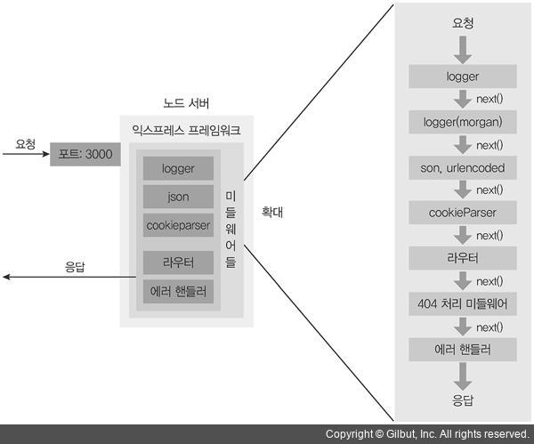

<!-- todo: 내용 보완 필요 -->

# NodeJS

- [탄생 배경](#탄생-배경)
- [NPM](#npm)
- [package.json](#packagejson)
  - [devDependencies](#devdependencies)
  - [scripts](#scripts)
  - [workspaces](#workspaces)
  - [브라우저 단에서 node\_moduels](#브라우저-단에서-node_moduels)
- [PM2 무중단 배포](#pm2-무중단-배포)
- [\_\_dirname, \_\_filename, process.cwd()](#__dirname-__filename-processcwd)
- [createWriteStream, createReadStream, readFile, readFileSync, readdir](#createwritestream-createreadstream-readfile-readfilesync-readdir)
- [HTTP Response에 스트림 연결 개념](#http-response에-스트림-연결-개념)
- [asd](#asd)
- [express.static()](#expressstatic)
- [web api](#web-api)
- [monorepo](#monorepo)

## 탄생 배경

자바스크립트는 본래 브라우저 환경에서만 동작하는 스크립팅 언어였으나 운영체제 환경에서도 동작 가능하도록 발전했다. 그 결과물이 Node.js이고, Node.js는 자바스크립트 엔진을 기반으로 한 자바스크립트 런타임 환경이며 단일 스레드, 비동기식 이벤트 주도 방식을 기반으로 하는 Non-blocking I/O 모델을 채택하고 있다.

## NPM

맞습니다! 레지스트리는 주로 패키지의 메타데이터를 저장하고 관리하는 역할을 합니다. 이 메타데이터에는 패키지의 이름, 버전, 설명, 의존성 정보 등이 포함됩니다. 이러한 메타데이터를 통해 사용자는 필요한 패키지를 쉽게 검색하고 식별할 수 있습니다.

npm과 같은 패키지 관리 도구는 이러한 레지스트리를 사용하여 패키지를 검색하고 설치합니다. 사용자가 패키지를 검색하면 패키지 관리 도구는 레지스트리에서 해당 패키지의 메타데이터를 가져와 사용자에게 보여줍니다. 그러면 사용자는 필요한 패키지를 선택하고 설치할 수 있습니다.

설치할 때 실제로 다운로드되는 파일은 레지스트리가 아니라, 해당 패키지의 소스 코드가 호스팅되는 곳에서 제공됩니다. 예를 들어, npm의 경우 패키지의 소스 코드는 npm 레지스트리에서 다운로드됩니다. 이렇게 다운로드된 소스 코드를 기반으로 패키지를 설치하고 사용할 수 있습니다.

따라서 레지스트리는 패키지의 메타데이터를 저장하고 색인을 쉽게 해주는 도구이며, 패키지의 실제 소스 코드는 해당 패키지가 호스팅되는 곳에서 제공됩니다.

## package.json

| 속성                   | 설명                                                                                           |
| ---------------------- | ---------------------------------------------------------------------------------------------- |
| `name`                 | 패키지의 이름을 정의한다. 이 이름은 패키지를 식별하는 데 사용된다.                             |
| `version`              | 패키지의 버전을 정의한다. 버전은 Semantic Versioning(의존성 관리를 위한 표준 방법론)을 따른다. |
| `description`          | 패키지의 간단한 설명을 제공한다.                                                               |
| `keywords`             | 패키지와 관련된 키워드 목록을 포함한다.                                                        |
| `author`               | 패키지의 작성자를 식별한다.                                                                    |
| `license`              | 패키지의 라이선스를 지정한다.                                                                  |
| `repository`           | 패키지의 소스 코드 저장소 정보를 제공한다.                                                     |
| `dependencies`         | 패키지가 의존하는 다른 패키지들과 그들의 버전을 명시한다.                                      |
| `devDependencies`      | 개발 중에만 필요한 패키지들을 명시한다.                                                        |
| `peerDependencies`     | 패키지가 함께 사용될 다른 패키지들과의 호환성을 명시한다.                                      |
| `optionalDependencies` | 설치 과정에서 실패해도 애플리케이션의 기능에 큰 영향을 미치지 않는 패키지들을 명시한다.        |
| `bundledDependencies`  | 패키지가 번들링된 의존성을 명시한다.                                                           |
| `engines`              | 패키지가 의존하는 Node.js 및 npm의 버전을 지정한다.                                            |
| `scripts`              | 패키지의 사용자 정의 스크립트들을 정의한다.                                                    |
| `main`                 | 패키지의 진입점(entry point)을 지정한다.                                                       |
| `typings`              | TypeScript로 작성된 패키지의 경우 타입 정의 파일의 경로를 지정한다.                            |
| `files`                | 패키지가 배포될 파일 및 디렉터리를 명시한다.                                                   |
| `private`              | 이 속성이 `true`로 설정된 경우, 해당 패키지는 npm 레지스트리에 게시되지 않는다.                |
| `workspaces`           | 모노레포(모놀리식 저장소)에서 사용하는 패키지들의 위치를 지정한다.                             |

### devDependencies

개발과정에서만 필요한 패키지들, 대표적으로 포맷팅, 번들러, 바벨, 테스트툴, 타입스크립트가 해당된다.

peerDependencies..

의존성 캐럿 의미도 파악 필요 `^` 같은 거

### scripts

`scripts` 속성은 `String` 값으로 Node 프로젝트 내에서 실행 가능한 커맨드 명령어를 정의한다. 쉘 스크립트와 유사한 개념이며 아래와 같이 몇 가지 차이점이 있다.

- 쉘 스크립트는 운영체제의 쉘에서 실행되지만, `scripts` 속성은 Node 환경에서 실행된다. 즉, Node 환경의 내장된 스크립팅 기능과 npm 패키지 관리자의 기능을 활용할 수 있다.
- 쉘 스크립트는 쉘 문법과 쉘 명령어를 혼합해 사용한다. `scripts` 속성은 보통 쉘 명령어를 직접 사용하기보다 패키지 이름과 옵션을 명시해서 사용하는 경우가 일반적이다.

### workspaces

npm workspace는 종속성 관리지 설정 파일 관리는 아님

### 브라우저 단에서 node_moduels

node_modules 안에 라이브러리는 절대/상대 경로없이 참조 가능하다

## PM2 무중단 배포

정적 호스팅은 번들링 파일 바뀌면 브라우저에서 캐싱되서 무중단 배포처럼 보임

서버 어플리케이션은 내용이 바뀌면 pm2로 무중단 서비스 배포가 필요

## \_\_dirname, \_\_filename, process.cwd()

// file 명을 포함한 절대경로
console.log(\_\_filename); // C:/Users/ano/temp/directory.js

// file 명을 제외한 절대 경로
console.log(\_\_dirname); // C:/Users/ano/temp

process.cwd(): node명령을 호출한 작업디렉터리의 절대경로

~/home/huryu/personal/blog > node ~
javascript// \_\_dirname은 현재 실행하는 파일의 절대경로이다
console.log(\_\_dirname); // /home/huryu/personal/blog/.next/server/app/posts/[id]

// process.cwd()는 node명령을 호출한 작업디렉터리의 절대경로이다
console.log(process.cwd()); // /home/huryu/personal/blog

## createWriteStream, createReadStream, readFile, readFileSync, readdir

## HTTP Response에 스트림 연결 개념

PDFKit은 PDF 문서를 생성하기 위한 Node.js 라이브러리입니다. doc.pipe()은 PDFKit에서 생성된 문서를 다양한 목적지로 보내는 역할을 합니다.

주로 사용되는 목적지로는 파일 시스템의 파일, HTTP 응답 객체, 그리고 다른 스트림 등이 있습니다. 이 함수는 생성된 PDF 문서를 지정된 목적지로 전송할 수 있도록 연결해줍니다.

일반적으로 doc.pipe()은 PDF 생성 프로세스의 시작 부분에서 호출되며, PDF 문서가 생성되고 데이터가 추가될 때마다 해당 목적지로 전송됩니다.

예를 들어, HTTP 응답 객체에 PDF를 전송하려면 다음과 같이 사용될 수 있습니다.

doc.pipe(res)가 빠지면 요청에 대한 응답이 완료되지 않고 계속 pending 상태

doc.pipe(res)를 코드에서 빼면 클라이언트 요청 후에 계속 pending 상태에 머무르는 이유는, PDF 문서가 생성되고 응답 스트림에 파이핑되지 않기 때문입니다.

Node.js에서 HTTP 응답은 스트림이기 때문에, 클라이언트에게 응답을 보내려면 응답 스트림에 데이터를 쓰거나 파이핑해야 합니다. doc.pipe(res)는 PDF 문서를 생성하고, 해당 문서를 응답 스트림에 파이핑하여 클라이언트에게 보내기 위해 필요한 코드입니다.

따라서 doc.pipe(res)를 코드에서 빼면 PDF 문서가 생성되고 응답 스트림에 전송되지 않으므로 클라이언트의 요청이 처리되지 않습니다. 이는 클라이언트 요청이 계속 pending 상태에 머무르게 되는 것을 의미합니다.

반면에 doc.pipe(res)를 다시 삽입하면, PDF 문서가 생성되고 응답 스트림에 파이핑되므로 클라이언트에게 적절한 응답이 보내지게 됩니다. 따라서 요청이 무사히 완료되는 것을 확인할 수 있습니다.

## asd

res.end와 res.send의 차이
ChatGPT
res.end()와 res.send()는 각각 Node.js의 http.ServerResponse와 Express.js의 Response 객체의 메서드입니다. 이 두 메서드는 비슷한 역할을 하지만 사용되는 맥락이 조금 다릅니다.

<!-- res.end([data][, encoding][, callback]): -->

res.end() 메서드는 HTTP 응답을 종료합니다. 선택적으로 데이터와 인코딩을 제공할 수 있습니다. 클라이언트에게 응답을 보내고 응답 프로세스를 종료합니다.
예를 들어, res.end('Hello, World!')는 'Hello, World!'를 포함하는 응답을 클라이언트에게 보내고 응답 프로세스를 종료합니다.
res.send([body]):

res.send() 메서드는 Express.js에서 사용되며, HTTP 응답을 보내는 역할을 합니다. 이 메서드는 여러 가지 유형의 데이터를 인수로 받을 수 있습니다(JSON, HTML, 문자열, 버퍼 등) 그리고 적절한 Content-Type 헤더를 설정하여 데이터를 클라이언트에게 보냅니다.
예를 들어, res.send('Hello, World!')는 'Hello, World!'를 포함하는 응답을 클라이언트에게 보내고 Content-Type을 자동으로 설정합니다.
주요 차이점은 res.send()가 Express.js의 기능이며 자동으로 Content-Type을 설정하고 다양한 유형의 데이터를 처리할 수 있다는 것입니다. 반면에 res.end()는 Node.js의 기본 HTTP 모듈의 일부이며 데이터를 직접 보내고 응답을 종료합니다. Express.js에서도 res.end()를 사용할 수 있지만, res.send()가 보다 편리하고 유연한 대안입니다.

User
res.writeHead, res.setHeader의 차이점
ChatGPT
res.writeHead()와 res.setHeader() 모두 HTTP 응답 헤더를 설정하는 데 사용되는 Node.js의 http.ServerResponse 객체의 메서드입니다. 그러나 두 메서드 간에는 몇 가지 중요한 차이점이 있습니다.

<!-- res.writeHead(statusCode[, statusMessage][, headers]): -->

이 메서드는 HTTP 응답 헤더를 설정하고, 응답의 상태 코드 및 선택적으로 상태 메시지를 지정합니다. 또한 headers 매개변수를 통해 추가적인 응답 헤더를 설정할 수 있습니다. 이 메서드를 호출하면 응답 헤더가 완전히 대체됩니다.
예를 들어, res.writeHead(200, {'Content-Type': 'text/plain'})는 상태 코드가 200이고 Content-Type 헤더가 text/plain인 응답 헤더를 설정합니다.
res.setHeader(name, value):

이 메서드는 기존 응답 헤더에 추가적인 헤더 값을 설정합니다. 만약 해당 헤더가 이미 존재하는 경우, 새로운 값을 추가하거나 덮어쓰게 됩니다.
예를 들어, res.setHeader('Cache-Control', 'no-cache')는 Cache-Control 헤더에 'no-cache' 값을 설정합니다. 만약 기존에 Cache-Control 헤더가 이미 있는 경우, 이 값은 덮어쓰게 됩니다.
따라서 writeHead()는 응답 헤더를 완전히 교체하고, setHeader()는 기존 헤더에 새로운 값을 추가하거나 덮어쓰게 됩니다. 선택적으로 writeHead()를 사용하여 상태 코드와 함께 응답 헤더를 설정하고, setHeader()를 사용하여 추가적인 헤더 값을 설정할 수 있습니다.

이 메서드는 메시지에서 한 번만 호출해야 하며 response.end()가 호출되기 전에 호출해야 합니다.

이 함수를 호출하기 전에 response.write() 또는 response.end()가 호출되면 암시적/변경 가능한 헤더가 계산되어 이 함수를 호출합니다.

응답.setHeader()로 헤더가 설정된 경우 응답.writeHead()로 전달된 모든 헤더와 병합되며, 응답.writeHead()로 전달된 헤더에 우선순위가 부여됩니다.

이 메서드가 호출되고 response.setHeader()가 호출되지 않은 경우 내부적으로 캐싱하지 않고 제공된 헤더 값을 네트워크 채널에 직접 쓰고 헤더에 대한 response.getHeader()는 예상 결과를 산출하지 않습니다. 향후 검색 및 수정 가능성이 있는 점진적인 헤더 모집단이 필요한 경우 응답.setHeader()를 대신 사용하세요.

Translated with www.DeepL.com/Translator (free version)

```js
// const data = fs.readFileSync(path.join(process.cwd(), '/pages/api/sub-project/[id]/report/TEST1.png'));
const response = await fetch('https://via.placeholder.com/600/92c952');
const data = await response.arrayBuffer();

res.setHeader('Access-Control-Expose-Headers', 'Content-Disposition');
res.setHeader('Content-Type', 'image/png');
res.setHeader('Content-Disposition', 'attachment; filename=sample.png');

res.send(Buffer.from(data));
```

```js
// const data = fs.readFileSync(path.join(process.cwd(), '/pages/api/sub-project/[id]/report/TEST1.png'));
const response = await fetch('https://via.placeholder.com/600/92c952');
const data = await response.arrayBuffer();

res
  .writeHead(200, {
    'Access-Control-Expose-Headers': 'Content-Disposition',
    'Content-Type': 'application/vnd.openxmlformats-officedocument.spreadsheetml.sheet',
    'Content-Disposition': 'attachment;filename=sample.xlsx',
  })
  .end(Buffer.from(data));
```

## express.static()

서버는 응답을 받으면 정적 자산을 제공하거나

값에 가공이나 무언가 필요한 작업을 진행한 후 제공하는 동적 자산을 제공한다.

## web api

웹 API는 주로 웹 브라우저 환경에서 사용되지만, Node.js 환경에서도 사용 가능한 일부 API가 있습니다. 다음은 브라우저와 Node.js에서 모두 사용 가능한 일부 웹 API의 목록입니다:

Fetch API: 네트워크 요청을 보내고 응답을 처리하기 위한 API입니다. 브라우저의 fetch() 함수와 유사한 기능을 제공합니다.

URL API: URL을 파싱하고 조작하기 위한 API입니다. URL 클래스를 사용하여 URL을 다룰 수 있습니다.

Web Crypto API: 암호화 기능을 수행하기 위한 API로, 브라우저 및 Node.js 환경에서 사용할 수 있습니다. 암호화 해싱, 서명, 암호화 등의 작업을 수행할 수 있습니다.

TextDecoder, TextEncoder: 텍스트 데이터를 UTF-8이나 다른 인코딩으로 변환하기 위한 API로, 브라우저 및 Node.js에서 사용할 수 있습니다.

Console API: 콘솔에 로그를 출력하고 디버깅하는 데 사용되는 API로, 브라우저 및 Node.js에서 모두 사용 가능합니다.

Event API: 이벤트 처리 및 디스패치를 위한 API로, 브라우저의 DOM 이벤트와 비슷한 기능을 제공합니다.

Buffer API: 이진 데이터를 다루기 위한 API로, Node.js에서 주로 사용되지만 브라우저에서도 사용 가능합니다 (일부 제한이 있을 수 있음).

Streams API: 데이터 스트림을 다루기 위한 API로, 브라우저와 Node.js에서 사용할 수 있습니다.

Worker API: 웹 워커를 생성하고 관리하는 API로, 브라우저 및 Node.js에서 사용할 수 있습니다.

Performance API: 성능 측정 및 분석을 위한 API로, 브라우저 및 Node.js에서 사용 가능합니다.

Timer API: setTimeout, setInterval 등과 같은 타이머를 제어하기 위한 API로, 브라우저와 Node.js에서 모두 사용 가능합니다.

File System API (experimental): 파일 시스템에 접근하기 위한 API로, Node.js에서는 기본적으로 지원되지만 브라우저에서는 실험적인 기능으로 제공됩니다.

이 외에도 브라우저와 Node.js 각각에서만 사용 가능한 다양한 API들이 있습니다. 사용하고자 하는 API가 특정 환경에서 지원되는지 여부를 확인하기 위해 해당 API의 문서를 참조하는 것이 중요합니다.

DOM 제어 API는 node에서 사용불가 Canvas API는 라이브러리로 모듈을 가져와서 사용 가능

\*\*node는 web api 기능이 없기에 비슷하게 수행하기 위해 내부 모듈들을 이용한다

browser는 window 객체
node는 global 객체\*\*

## monorepo
