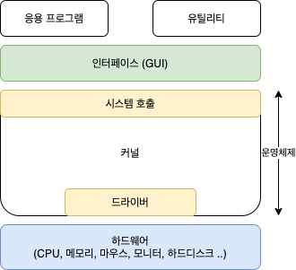

# 컴퓨터 과학

- [운영체제](#운영체제)
  - [환경 변수](#환경-변수)
- [실행 환경](#실행-환경)
- [컴파일러 vs 인터프리터](#컴파일러-vs-인터프리터)
- [쉘 스크립트](#쉘-스크립트)
- [데이터](#데이터)
  - [1. 텍스트 데이터](#1-텍스트-데이터)
  - [2. 이미지 데이터](#2-이미지-데이터)
  - [3. 오디오 데이터](#3-오디오-데이터)
  - [4. 비디오 데이터](#4-비디오-데이터)
  - [5. 기타 데이터](#5-기타-데이터)
- [메모리 vs 디스크](#메모리-vs-디스크)

## 운영체제

운영체제(Operating System)는 사용자가 사용하는 어플리케이션과 컴퓨터와 연결된 하드웨어간의 인터페이스를 제공한다. 운영체제는 인터페이스(GUI, CLI)와 시스템 호출, 커널, 하드웨어 드라이버로 구성된다.

시스템 호출은 운영체제의 서비스나 하드웨어의 리소스를 사용하기 위한 API다. 커널의 직접 접근하는 것을 보호하기 위해 만들어졌다. 컴퓨터 자원의 접근하기 위해서는 항상 시스템 호출을 거쳐야한다.

드라이버는 각 각의 하드웨어 특성을 반영하여 하드웨어 제작자들이 만든 소프트웨어로 커널과 하드웨어 사이에 인터페이스 역할을 한다. 그림에서 드라이버가 중간만 차지하고 있는 이유는 커널이 범용적인 하드웨어의 드라이버는 제공하고 있기 때문이다.

커널은 시스템 호출과 드라이버 사이에서 운영체제의 핵심 기능을 한다. 예를 들면 메모리 관리, 프로세스 관리, 파일 시스템 관리, 입출력 관리, 프로세스 간 통신 관리 등이 있다.

사용자는 어플리케이션과 인터페이스를 조작함으로써 시스템 호출을 요청하고 커널은 이 시스템 호출을 받아서 하드웨어 드라이버를 통해 하드웨어를 제어하고 요청한 응답을 보내줍니다.

### 환경 변수

환경 변수(Environment variable)는 운영 체제에서 시스템의 설정과 동작을 제어하기 위해 사용되는 값이다. 이 변수들은 운영 체제나 응용 프로그램에서 참조할 수 있는 데이터로서, 특정 값을 저장하고 필요에 따라 사용할 수 있습니다. 자바스크립트를 다룰 때 전역 변수 개념과 같다고 보면 된다.

## 실행 환경

실행 환경은 여러가지 프로그래밍 언어들이 운영체제의 시스템 콜을 이용해 파일을 조작하고, 네트워킹, 프로세스 관리를 할 수 있도록 중개자 역할을 한다. 또는 브라우저 상에서 실행환경을 제공해 Web API 및 브라우저 기능을 사용할 수 있도록 해준다.

예를 들면, Java는 JVM(Java Virtual Machine)을 통해 실행 환경을 제공 받고, JavaScript는 브라우저에서는 자바스크립트 엔진을 통해, 운영체제 위에서는 Node.js를 통해 환경을 제공받는다. C, C++의 경우 저수준 언어로 따로 실행 환경 없이 운영체제에 접근이 가능하다.

언어의 차이가 프로세스를 다루는 방식은 주로 해당 언어의 런타임 환경, 멀티스레딩 및 비동기 처리 지원, 그리고 언어 자체의 설계 철학에 의해 결정됩니다. 아래는 몇 가지 언어의 프로세스 처리에 대한 일반적인 특징입니다:

C/C++:

C 및 C++는 저수준 언어로, 프로세스 및 스레드를 직접 다룰 수 있는 기능을 제공합니다.
멀티프로세스 및 멀티스레딩을 지원하며, 개발자가 직접 스레드 및 프로세스를 생성하고 관리할 수 있습니다.
POSIX 스레딩 라이브러리와 같은 표준 라이브러리를 통해 다양한 멀티스레딩 및 프로세스 제어 기능을 사용할 수 있습니다.
Java:

Java는 가상 머신(Java Virtual Machine, JVM) 위에서 동작하며, 스레드를 쉽게 다룰 수 있는 고수준의 멀티스레딩 지원을 제공합니다.
java.lang.Thread 클래스를 통해 스레드를 생성하고, java.util.concurrent 패키지를 통해 고수준의 멀티스레딩 기능을 활용할 수 있습니다.
Java에서는 프로세스 생성 및 제어에 대한 표준 라이브러리가 제공되지 않습니다. 대신, Java는 주로 가상 머신에서 실행되는 여러 스레드를 통해 동시성을 처리합니다.
Node.js (JavaScript):

Node.js는 단일 스레드 이벤트 루프 기반의 비동기 I/O 모델을 사용합니다.
프로세스와 관련된 작업은 주로 child_process 모듈을 사용하여 외부 프로세스를 실행하거나, 클러스터링을 통해 여러 프로세스를 활용할 수 있습니다.
멀티스레딩은 직접적으로 지원하지 않지만, 비동기 콜백 및 이벤트 기반의 모델을 통해 효율적으로 다수의 동시 연결을 처리할 수 있습니다.
언어의 프로세스 처리 방식은 해당 언어 및 런타임의 설계 철학에 따라 다르며, 개발자는 프로세스와 스레드를 어떻게 다룰지에 대한 결정을 내려야 합니다. 각 언어는 특정한 사용 사례 및 성능 요구 사항을 고려하여 프로세스 및 스레드 모델을 선택하는 것이 중요합니다.

## 컴파일러 vs 인터프리터

컴파일러는 프로그래밍 언어의 소스 코드를 컴퓨터가 실행 가능한 기계어로 변환하는 도구다. 컴파일러는 소스 코드 전체를 한 번에 변환하고, 변환된 기계어 코드를 실행 파일로 생성합니다. 이러한 실행 파일은 운영체제에서 직접 실행할 수 있다. 컴파일러가 필요한 언어로는 C, C++, Java 등이 있다.

컴파일러 언어의 장점은 컴파일 과정에서 문법 및 타입에 대한 오류를 확인할 수 있어 런타임 중 오류가 날 확률이 상대적으로 적다. 기계어로 변환해서 실행하기 때문에 실행 속도가 빠릅니다. 단점은 개발 및 실행 단계가 분리되어 있어 상대적으로 복잡하며, 특정 플랫폼이나 아키텍처에 종속될 수 있어 이식성에서 제약이 존재한다.

인터프리터는 프로그래밍 언어의 소스 코드를 한 줄씩 읽어들여 해당 명령어를 해석하고 실행하는 도구입니다. 인터프리터는 소스 코드를 실행할 때마다 필요한 변환 작업을 수행합니다. 일반적으로 인터프리터는 소스 코드를 한 줄씩 읽어들이기 때문에 실행 시간이 상대적으로 더 많이 소요될 수 있습니다. 인터프리터가 필요한 언어로는 JavaScript, Python 등이 있다.

인터프리터 언어의 장점은 소스 코드를 수정하고 바로 확인 가능하므로 개발이 상대적으로 빠르다. 인터프리터에 의해 소스 코드가 해석되므로 플랫폼에 종속되지 않는다. 보통 동적 타입 시스템을 사용해서 타입 선언에 대해 비교적 자유롭다. 단점은 실행 중 코드를 해석하므로 런타임 중 오류가 날 확률이 상대적으로 높고, 실행 속도가 상대적으로 느리다. 동적 타입 시스템 때문에 오히려 협업하는 과정이나 디버깅 시에 해석하기 어려울 수 있다.

## 쉘 스크립트

쉘 스크립트는 인터프리터 언어로 각 운영체제의 존재하는 쉘이라는 인터프리터에 의해 한 줄씩 해석되고 실행된다. 리눅스와 macOS에서는 bash라는 기본 쉘을 사용하며 `.sh` 확장자를 사용한다. Windows에서는 cmd 쉘을 이용할 때는 `.batch`, `.cmd` 확장자를, PowerShell 쉘을 이용할 때는 `.ps1` 확장자를 사용한다.

쉘 스크립트는 각 운영체제에 존재하는 명령어들(프로그래밍 언어로 작성되어 컴파일러를 통해 생성된 실행 파일, 보틍은 C언어로 작성됨)을 쉘 스크립트의 문법과 조합하여 다양한 동작을 수행하게 된다. 예를 들면, 일련의 반복된 작업을 자동화를 하거나, 시스템 관리, 배포 및 설치, 환경 설정, 작업 흐름 제어 등의 일을 수행한다.

## 데이터

맞다, 모든 데이터는 궁극적으로 이진 데이터다. 컴퓨터는 이진법(binary system)을 사용하여 데이터를 저장하고 처리한다. 이진 데이터는 0과 1의 조합으로 표현되며, 모든 종류의 데이터는 이진 데이터로 변환되어 컴퓨터에서 사용된다. 이를 구체적으로 설명하면 다음과 같다:

### 1. 텍스트 데이터

텍스트 데이터는 문자 인코딩 방식을 통해 이진 데이터로 변환된다. 대표적인 문자 인코딩 방식에는 ASCII와 UTF-8이 있다. 예를 들어, ASCII 인코딩 방식에서는 문자 'A'는 65(10진수)로 표현되며, 이는 이진수로 01000001이 된다.

### 2. 이미지 데이터

이미지 데이터는 픽셀 값의 배열로 표현되며, 각 픽셀은 RGB 값으로 구성된다. 각 RGB 값은 8비트로 표현될 수 있어, 예를 들어 흰색 픽셀은 (255, 255, 255)로, 이진수로는 11111111 11111111 11111111이 된다.

### 3. 오디오 데이터

오디오 데이터는 아날로그 신호를 디지털화하여 이진 데이터로 변환된다. 이는 주로 샘플링과 양자화를 통해 이루어진다. 예를 들어, 44.1kHz의 샘플링 레이트와 16비트 깊이를 가진 오디오 데이터는 초당 44100개의 샘플, 각 샘플은 16비트 이진 데이터로 표현된다.

### 4. 비디오 데이터

비디오 데이터는 프레임 단위로 구성되며, 각 프레임은 이미지 데이터와 같다. 또한, 압축 알고리즘을 통해 저장 공간을 줄일 수 있으며, 이 과정에서 비디오 데이터는 이진 데이터로 인코딩된다.

### 5. 기타 데이터

- **파일**: 파일은 텍스트, 이미지, 오디오, 비디오 등 다양한 형태의 데이터를 포함할 수 있으며, 모든 파일은 이진 데이터로 저장된다.
- **네트워크 패킷**: 네트워크를 통해 전송되는 데이터는 패킷으로 분할되며, 각 패킷은 이진 데이터로 표현된다.
- **메모리**: 컴퓨터의 메모리는 모든 데이터를 이진수로 저장하고 관리한다.

이렇듯, 컴퓨터 시스템에서 사용되는 모든 데이터는 궁극적으로 이진 데이터로 표현되고 처리된다. 이진 데이터는 컴퓨터가 이해하고 처리할 수 있는 기본 단위로, 이를 통해 복잡한 데이터를 저장하고 전송하며, 연산을 수행할 수 있다.

## 메모리 vs 디스크

디비를 선택안하면 서버 프로그램에 할당된 메모리에 저장한다.

세션 데이터를 저장할 때 디스크 기반 데이터베이스와 메모리 기반 데이터베이스 중 어느 것을 사용할지 선택하는 것은 여러 요인에 따라 달라집니다. 각각의 장단점을 고려해보아야 합니다.

**디스크 기반 데이터베이스**는 데이터를 디스크에 저장하므로, 서버가 재시작되거나 장애가 발생하더라도 데이터가 유지됩니다. 이는 데이터의 영속성이 중요한 경우에 유리합니다. 그러나 디스크 I/O가 메모리보다 느리기 때문에 성능이 저하될 수 있습니다.

**메모리 기반 데이터베이스**는 데이터를 RAM에 저장하므로, 읽기와 쓰기 속도가 빠릅니다. 따라서 성능이 중요한 애플리케이션에서는 메모리 기반 데이터베이스가 유리할 수 있습니다. 하지만 서버가 재시작되거나 장애가 발생하면 메모리의 데이터는 손실될 수 있기 때문에, 데이터의 영속성이 중요한 경우에는 추가적인 저장소를 필요로 할 수 있습니다.

결국, 선택은 애플리케이션의 요구 사항에 따라 달라집니다. 성능과 영속성, 데이터의 중요성 등을 고려하여 적절한 데이터베이스를 선택하는 것이 중요합니다.

맞습니다. 설명하신 대로, 인메모리 데이터베이스와 디스크 기반 데이터베이스는 데이터를 가져오는 과정이 서로 다릅니다.

**인메모리 데이터베이스**의 경우:

1. 서버가 데이터를 요청하면 인메모리 데이터베이스는 RAM에 저장된 데이터를 직접 조회합니다.
2. 메모리에서 직접 데이터를 읽어오기 때문에 응답 속도가 매우 빠릅니다.
3. 메모리에서 데이터를 읽는 것은 디스크 I/O에 비해 훨씬 빠르기 때문에 성능이 우수합니다.

**디스크 기반 데이터베이스**의 경우:

1. 서버가 데이터를 요청하면 디스크 기반 데이터베이스는 디스크에서 데이터를 조회합니다.
2. 디스크에 저장된 데이터를 읽어오기 때문에 디스크 I/O가 발생합니다.
3. 디스크 I/O는 메모리보다 느리기 때문에 응답 속도가 상대적으로 느릴 수 있습니다.

결론적으로, 인메모리 데이터베이스는 빠른 데이터 접근 속도를 제공하지만 메모리의 크기에 제한을 받습니다. 반면, 디스크 기반 데이터베이스는 데이터의 영속성을 보장하지만 속도는 상대적으로 느릴 수 있습니다.
