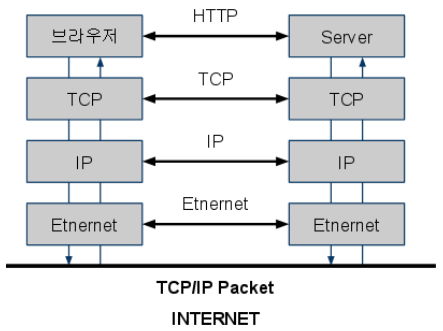
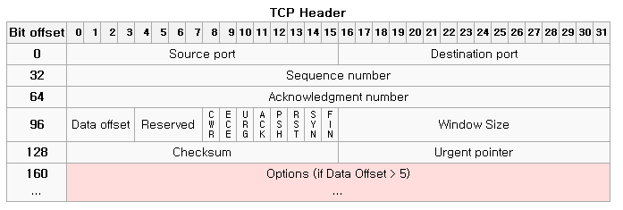
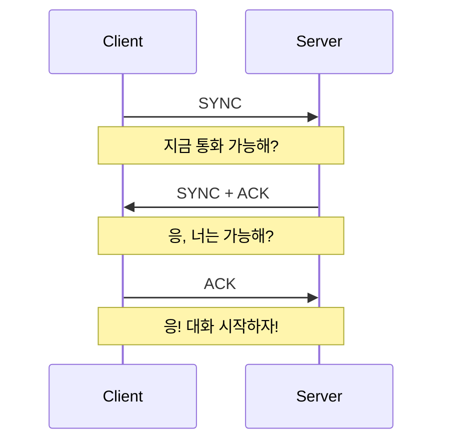

# Network

- [인터넷](#인터넷)
  - [프로토콜](#프로토콜)
  - [서버](#서버)
  - [포트](#포트)
- [방화벽](#방화벽)
- [도메인](#도메인)
  - [OSI 7계층](#osi-7계층)
- [TCP/IP 프로토콜 수트](#tcpip-프로토콜-수트)
  - [TCP Header](#tcp-header)
  - [3-way handshake](#3-way-handshake)
  - [SSL handshake](#ssl-handshake)
- [CDN](#cdn)
- [SSH](#ssh)
- [git ssh 접속 설정](#git-ssh-접속-설정)
  - [ssh config 작성 요령](#ssh-config-작성-요령)
- [git 사용자 설정](#git-사용자-설정)
- [이메일 원리](#이메일-원리)
- [프록시 vs 게이트웨이](#프록시-vs-게이트웨이)
  - [프록시 (Proxy)](#프록시-proxy)
  - [게이트웨이 (Gateway)](#게이트웨이-gateway)
  - [차이점 요약](#차이점-요약)

## 인터넷

인터넷(Internet)은 전 세계의 컴퓨터들을 상호 연결하여 정보를 교환할 수 있는 **거대한 컴퓨터 네트워크 통신망**이다. 그야말로 인류의 역사상 전례 없는 거대한 정보의 바다이다. 인터넷은 컴퓨터, 서버, 라우터, 스위치 및 다양한 네트워크 장비로 구성된 물리적인 인프라와 소프트웨어 프로토콜, 규약들의 조합으로 이루어져 있다.

인터넷은 여러 개의 네트워크들이 상호 연결되어 구성되어 있다. 이러한 네트워크들은 인터넷 서비스 제공 업체(ISP, Internet Service Provider)에 의해 운영되며, 광섬유, 케이블 모뎀, DSL 등의 다양한 통신망을 통해 사용자들에게 인터넷 접속을 제공한다.

### 프로토콜

컴퓨터 사이에서 데이터를 교환하는 방식을 정의한 규칙. 이런 규칙이 필요한 이유는 컴퓨터 간에 대화를 할 때에는 굉장히 다양한 방식으로 이루어지기 때문에 상대방이 어떤 방식으로 대화를 하고자 하는지 알기 위함이다.

### 서버

웹 서버, 이메일 서버 등 특정 프로토콜을 이용해서 통신이 필요한

### 포트

1 ip 1 A domain
N CName domain 1 A domain

1 server process 1 port listening
1 client process no port listening

CNAME 레코드를 고정 IP 주소에 직접 매핑하는 것은 DNS(Domain Name System)에서 허용되지 않는 동작입니다. 이렇게 할 경우 다음과 같은 문제가 발생할 수 있습니다:

1. **DNS 구조 규칙 위반**: DNS에서 CNAME 레코드는 다른 도메인 이름에 대한 별칭으로 사용되어야 합니다. 직접적인 IP 주소에 대한 CNAME 레코드는 DNS의 구조 규칙을 위반하며, 일반적으로 허용되지 않습니다.

2. **DNS 오류 및 불일치**: DNS 서버가 CNAME 레코드를 고정 IP 주소에 직접 매핑하도록 설정된 경우, DNS 오류가 발생할 수 있습니다. 또한, 이러한 설정은 DNS 쿼리에 대한 응답이 예상대로 되지 않도록 만들 수 있습니다.

3. **유지보수 및 관리의 어려움**: 고정 IP 주소를 직접적으로 CNAME 레코드에 매핑하는 것은 DNS의 목적과 용도에 맞지 않으며, 유지보수와 관리를 어렵게 만들 수 있습니다. 이는 IP 주소 변경 시 DNS 레코드를 업데이트하는 작업을 더욱 복잡하게 만들 수 있습니다.

따라서 고정 IP 주소를 직접적으로 CNAME 레코드에 매핑하는 것은 일반적으로 권장되지 않습니다. 대신, 해당 도메인 이름을 서비스하는 호스트의 도메인 이름에 대한 CNAME 레코드를 사용하는 것이 바람직합니다.

## 방화벽

Inbound, Outbound 규칙이란?

방화벽은 전달되는 패킷의 정보(프로토콜, 포트, IP 주소 정보)를 바탕으로 전송을 허용 또는 거부하는 시스템입니다. 이때 외부 네트워크에서 발생해 내부 네트워크로 패킷이 전달되는 것을 Inbound 트래픽이라고 하며, 내부 네트워크에서 발생해 외부 네트워크로 패킷이 전달되는 것을 Outbound 트래픽이라고 합니다.
즉, 방화벽의 Inbound, Outbound 규칙은 패킷의 전달 방향(내부, 외부)과 통신 프로토콜, 포트, IP 주소를 기준으로 트래픽을 허용하거나 거부하는 규칙을 의미합니다

## 도메인

도메인 구매 - 네임서버에 저장 - 도메인 입력 시 -> 네임서버에서 찾아서 -> ip 반환

A 레코드 구매
CNAME 레코드는 A 레코드의 alias

도메인, 서브 도메인, A 레코드, C 레코드의 차이를 잘 구분해서 작성해보자 설명을

프록시 서버에서 보통 CNAME을 통해 포트 구분해서 프로세스 배분

### OSI 7계층


OSI 7 계층은 네트워크 통신에 대해 계층을 나누어 설명한 모델이다. 해당 모델의 위로 갈수록 사용자와 가까워지고 아래로 갈수록 컴퓨터와 가까워 진다. 데이터는 계층을 지날 때 마다 사용되는 프로토콜의 Header로 감싸진 상태로 이동한다. 깨지기 쉬운 유리 제품의 포장을 여러번 하는 것처럼 위에 겹겹이 쌓는 모습이다. 이동된 곳에서는 포장을 풀듯이 프로토콜의 Header들을 열어 정보를 확인하면서 최종적으로 데이터를 확인한다.

- 네트워크 계층(Network Layer): 여러 개의 노드를 거쳐 패킷을 목적지까지 전달하는 역할을 한다.
- 전송 계층(Transport Layer): 특정 애플리케이션 간의 데이터 전송을 관리하고, 데이터를 정확하게 전송하고 받는 것을 보장합니다.
- 응용 계층 (Application Layer): 최종 사용자에게 네트워크 서비스를 제공하는 계층으로, 이메일, 웹 브라우저, 파일 전송 등 다양한 응용 프로그램이 작동한다.

## TCP/IP 프로토콜 수트

인터넷은 대부분 TCP/IP 프로토클 수트, 즉 TCP 프로토콜과 IP 프로토콜 기반으로 통신을 한다. 이 말은 IP 헤더의 정보를 이용해 목적지를 제대로 찾고 TCP 헤더의 정보를 이용해 통신할 준비가 되었는지, 데이터가 제대로 전송되었는지, 데이터가 가는 도중 변질되지 않았는지, 수신자가 얼마나 받았고 빠진 부분은 없는지 등을 점검한다.



### TCP Header



IP를 통해 목적지에 도착했으면 어떤 항구(서비스)로 가야하는 지 TCP Header에서 포트 정보를 확인해 연결을 시도한다.

TCP의 대표 기능인 흐름 제어나 혼잡 제어도 TCP 헤더의 담긴 정보를 통해 수행한다.

### 3-way handshake

TCP는 3-way handshake라는 방식으로 송수신자 간의 통신이 가능한 지 의사를 물어 신뢰성 있는 통신을 보장한다. Header 속 SYNC, ACK flag를 이용한다.



### SSL handshake

<!-- todo: 내용 보완 필요 -->


## CDN

CDN은 Content Delivery Network의 약자로, 지리적인 제약 없이 전 세계 사용자에게 빠르게 정적 콘텐츠(이미지, 동영상, 음악, HTML, JavaScript 등)를 전송하는 기술이다.

콘텐츠를 전송할 때 물리적인 거리가 멀수록 콘텐츠를 불러올 때 소요되는 시간이 길어진다. 이를 해결하기 위해 전 세계 곳곳에 캐싱 서버를 두고 해당 서버에 콘텐츠를 캐싱한 뒤 같은 콘텐츠에 대한 요청이 오면 물리적으로 제일 가까운 거리에 캐싱 서버에서 응답을 준다.


작동원리에 대해 간단히 설명하면 아래와 같다.

- 사용자로부터 요청이 발생한다.
- 요청이 발생한 캐싱 서버는 요청이 발생한 데이터에 대하여 캐싱 여부를 확인한다.
- 캐싱 데이터가 존재하면 사용자에 요청에 맞게 응답하고 존재하지 않으면 Origin Server로 요청한다.
- 요청 받은 데이터에 대해 Origin Server로부터 전달 받은 캐싱 서버는 데이터를 캐싱하고 사용자에게 응답한다.

다국적 서비스를 리액트로 제작한다고 하면, 배포 시에 한국 리전에만 호스팅 서버를 두고 Cloudflare, AWS, Google 등이 제공하는 CDN 서비스를 이용해서 서버 비용 절감 및 웹사이트 로딩 속도를 높일 수 있다.

## SSH

<!-- todo: 내용 보완 필요 -->

## git ssh 접속 설정

아래 코드를 통해 rsa 또는 ed25519 방식으로 암호화된 ssh 키 생성

```sh
ssh-keygen -t rsa -C [이메일명] # rsa 타입으로 이메일 코멘트가 붙은 키 생성
ssh-keygen -t ed25519 -C [이메일명] # ed25519 타입으로 이메일 코멘트가 붙은 키 생성
```

저장 경로를 따로 설정해주지 않았다면, `~/.ssh` 위치에 저장이 된다. 그 중에서 `*.pub` 형식의 파일이 public key이다. 나머지 파일이 private key이다. public key의 내용을 복사해서 github ssh 설정에 들어가 붙여넣기 해준다.

이후 ssh 접속이 가능해진다.

만약 집 와이파이 또는 카페 와이파이 사용 시 방화벽으로 인해 22번 포트를 막아 ssh 접속이 불가능한 경우, `~/.ssh` 디렉토리 하위에 `config`파일을 만든 후 아래와 같이 작성하여 443 포트(HTTPS) 설정을 해준다.

```sh
Host github.com
    Hostname ssh.github.com
    Port 443

Host bitbucket.org
    Hostname altssh.bitbucket.org
    Port 443
```

### ssh config 작성 요령

```sh
Host # 아래 ssh 설정에 대한 별명(영문, 숫자, 하이픈(-), 점(.)만 가능)
    Hostname # IP or IP를 가리키는 도메인
    Port # 포트 번호(보통은 22)
    User # 해당 서버 유저 이름
    IdentityFile # 키 파일을 요구하는 서버의 경우 키 파일 위치 주소
```

입력한 도메인으로 접속이 잘 안될 시에는 `nslookup [도메인명]`으로 제대로 된 IP를 가리키고 있는 지 확인해본다.

또는 `/.ssh` 디렉토리 내부에 `known_hosts` 파일을 삭제하고 시도해본다.

`known_hosts` 파일은 Secure Shell (SSH) 클라이언트가 원격 호스트의 신원을 확인하기 위해 사용하는 파일이다. `known_hosts` 파일에는 클라이언트가 이전에 연결한 호스트의 공개 키(public key)와 해당 호스트의 실제 IP 주소 또는 호스트 이름이 기록되어 있다. 이를 통해 클라이언트는 이후 연결 시 해당 호스트의 공개 키가 변경되었는지 여부를 확인하고, 중간자 공격을 방지할 수 있다.

## git 사용자 설정

전역 설정 파일에 사용자 이름과 이메일을 아래 커맨드를 사용하여 설정해준다.

`~/.gitconfig`

```sh
git config --global user.name
git config --global user.email
```

git을 이용한 서비스를 여러 개(github, bitbucket) 이용할 경우, 위 방법 대신에 아래 코드를 참고하여 설정해준다.

`~/.gitconfig`

```sh
[includeIf "gitdir:[DIR]/"]
    path = [DIR]/.gitconfig
```

나는 서비스 이름으로 폴더를 구분하고, 해당 폴더 안에 깃 설정 파일에 사용자 이름과 이메일을 작성하여 설정을 완료했다.

`~/.gitconfig`

```sh
[includeIf "gitdir:~/bitbucket/"]
    path = ~/bitbucket/.gitconfig

[includeIf "gitdir:~/github/"]
    path = ~/github/.gitconfig
```

`~/github/.gitconfig`

```sh
[user]
    name = RHUK2
    email = gusdnr814@naver.com
```

`~/bitbucket/.gitconfig`

```sh
[user]
    name = 류현욱
    email = huryu@wecruitcorp.com
```

## 이메일 원리

SMTP, POP3, IMAP 프로토콜

해당 프로토콜을 해석하는 소프트웨어가 설치된 컴퓨터(= 메일 서버)

메일 전송에 특화된 데이터를 지니고 있는 프로토콜들이다.

프로토콜 내부에 데이터로 목적지로 데이터 전송

보통 메일 서버를 직접 구축하기보다는 기업에서 제공하는 메일 서버를 이용한다.(네이버웍스, g메일, 네이버메일)

## 프록시 vs 게이트웨이

게이트웨이와 프록시는 네트워크 트래픽을 관리하는 데 사용되는 두 가지 중요한 구성 요소지만, 그 역할과 목적에는 차이가 있습니다.

### 프록시 (Proxy)

- **역할**: 클라이언트와 서버 사이에서 중개자 역할을 합니다.
- **주요 목적**:
  - **익명성 제공**: 클라이언트의 IP 주소를 숨깁니다.
  - **캐싱**: 자주 요청되는 데이터를 저장해 네트워크 부하를 줄입니다.
  - **필터링**: 특정 콘텐츠에 대한 접근을 차단하거나 허용합니다.
- **종류**: 정방향 프록시와 리버스 프록시가 있습니다.

### 게이트웨이 (Gateway)

- **역할**: 서로 다른 네트워크 간의 연결을 관리하고, 프로토콜 변환을 수행합니다.
- **주요 목적**:
  - **프로토콜 변환**: 예를 들어, HTTP 요청을 SOAP 또는 다른 프로토콜로 변환합니다.
  - **복합 서비스 제공**: 여러 서비스의 집합을 단일 엔드포인트로 제공합니다.
  - **보안 강화**: 인증 및 인가를 관리합니다.

### 차이점 요약

- **프록시**는 주로 클라이언트와 서버 간의 중개자로서 작동하며, 클라이언트의 요청을 대리 처리합니다.
- **게이트웨이**는 주로 서로 다른 네트워크나 프로토콜 간의 변환을 담당하며, 더 복잡한 서비스 조합 및 보안 기능을 제공합니다.


