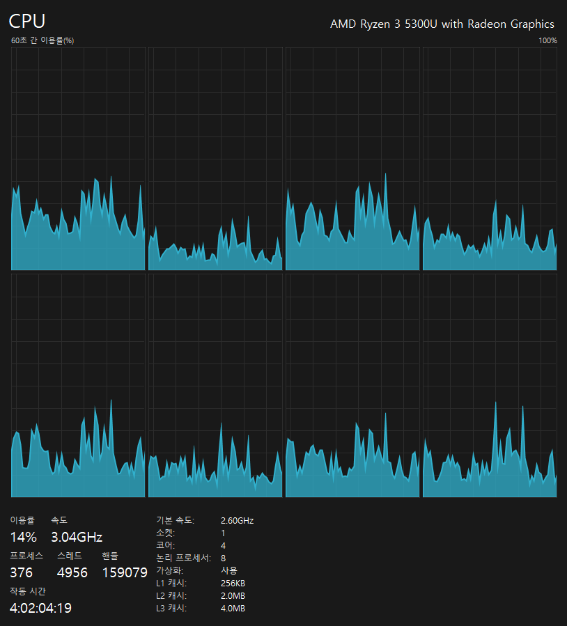
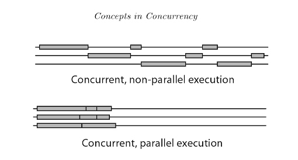

# Process와 Thread

- [Program과 Process](#program과-process)
  - [System Program과 Application Program](#system-program과-application-program)
- [Thread](#thread)
- [Memory Model](#memory-model)
- [자원 할당과 공유](#자원-할당과-공유)
- [Core와 Thread, 병렬성과 동시성](#core와-thread-병렬성과-동시성)
- [CPU vs GPU](#cpu-vs-gpu)
  - [CPU(중앙처리장치)](#cpu중앙처리장치)
  - [GPU(그래픽처리장치)](#gpu그래픽처리장치)
  - [요약](#요약)

## Program과 Process

Program은 컴퓨터에서 처리할 작업의 순서대로 명령어들을 나열한 명령어들의 집합체이다.

Program과 Process의 차이는 Program을 실행하냐 안하냐의 차이를 의미한다. 실행하지 않은 정적인 상태를 Program, 실행한 동적인 상태를 Process라고 한다.

Program은 `*.exe`, `*.dmg`와 같은 실행 파일을 의미하며, 컴퓨터 메모리에 올라가 있지 않다.

Process는 위와 같은 Program을 실행시켜서 만든 하나의 인스턴스를 의미하며, 컴퓨터 메모리에 올라가고 CPU 자원을 할당 받는다. 하나의 Program은 여러 개의 Process를 가질 수 있다.

### System Program과 Application Program

System Program은 컴퓨터 하드웨어 및 각종 장치 정보를 효율적으로 사용할 수 있도록 지원하는 Program이며, 대표적인 예로는 운영체제가 있다.

Application Program은 컴퓨터 하드웨어를 건드릴 권한이 없고, 운영체제 위에서 사용자가 원하는 작업을 할 수 있도록 만든 Program이다. 대표적인 예로는 웹 브라우저, 엑셀 등이 있다.

## Thread

Thread가 없던 시절 하나의 Process는 동시에 여러 작업을 수행할 수 없었다. 파일을 다운받기 시작하면 진행되는 동안 다른 작업을 수행할 수 없었다. 이를 해결하려고 여러 개의 Process를 만들면, 그만큼 메모리를 차지하고 CPU에서 할당받는 자원들이 중복되는 경우가 많아져 자원의 낭비가 심해진다. 이러한 이유로 태어난 것이 Thread이다.

Thread는 하나의 Process 내에서 동시에 진행되는 작업의 단위를 뜻한다.

보통 하나의 Program은 하나 이상의 Process를 가지고 있고, 하나의 Process는 하나 이상의 Thread를 가지고 있다.

## Memory Model

위에서 Process는 메모리에 적재되고 CPU에게 자원을 할당받은 상태라고 설명했는데, 그 자원이 어떻게 구성되어 있는지 살펴보자.

- Text(Code) Area: 기계어로 컴파일된 코드들이 저장되는 공간이다.

- Data(GVAR, BSS) Area: 전역 변수와 정적 변수가 저장되는 공간으로, GVAR에는 초기값이 존재하는 변수가 담기고, BSS에는 초기값이 없는 변수가 담긴다.

- Heap Area: 동적으로 할당되는 데이터를 저장하는 공간이다.

- Stack Area: 함수 호출과 관련된 정보를 저장하는 공간이다. 함수가 호출될 때마다 호출 정보(복귀 주소 등)와 지역 변수가 스택에 푸시되며, 함수가 종료될 때 스택에서 팝된다. 이를 통해 함수 호출과 반환의 관리가 이루어집니다.

## 자원 할당과 공유

Process는 아래와 같이 자원을 할당받게 된다.

Thread는 Process가 할당받은 자원 중 Stack 영역 내에서 독립적인 Stack을 할당받게 되고 그 공간의 크기는 Thread마다 다를 수 있으며, Stack 영역의 공간이 제한적인 만큼 Thread도 생성 가능한 수가 제한된다.

그리고 Process 내에서 서로 다른 Thread들 간에는 Text, Data, Heap 영역이 공유가 되어 자원을 공유해서 사용할 수 있으며, 자원의 생성과 관리에 있어서 중복을 최소화한다.

서로 다른 Process는 각 자 별도의 공간을 차지하기 때문에 Thread가 정보를 공유하는 것과는 다른 방법을 취해야 한다.

대표적으로 두 가지 모델이 있고, 아래 그림과 같이 공유 메모리를 사용하는 (a) 모델과 메세지를 전달하는 (b) 모델이 있다.

## Core와 Thread, 병렬성과 동시성

보통 사용자는 컴퓨터에서 많은 수의 Program을 동시에 실행하게 되고, 동시에 작업을 처리하고 있다는 느낌을 받는다. 많은 수의 Program이 실행되면 그보다 더 많은 수의 Process와 Thread가 실행되게 되는데 어떻게 컴퓨터는 이 많은 Process를 동시에 처리하는 걸까?

CPU 구매 시 스펙을 살펴보면 6 Core 12 Thread, 4 Core 8 Thread 등이 적혀 있을 것이다. CPU는 명령어를 메모리에서 뽑아 해석하고 실행하는 반도체 유닛을 한 개 이상 가지고 있고 이를 Core라고 부른다. 그리고 Thread는 운영체제가 인식하는 Core의 수다. Hyper Threading이라는 기술을 이용해서 Core의 수가 증가한 것처럼 운영체제를 속인다. 위에서 설명한 Thread와는 다른 개념이다.

위 사진은 작업 관리자의 성능 탭에서 확인할 수 있는데, 사진에서 보듯이 실제로 존재하는 물리적인 Core의 수는 4개지만, 운영체제는 8개로 인식하는 모습을 볼 수 있다.

그렇다면 처음 제기했던 의문으로 돌아가보면, 수많은 Process는 운영체제가 인식하는 코어(Thread)들로 병렬성과 동시성을 가지고 처리된다.

병렬성은 8개의 코어가 동시에 작업하는 것을 의미한다.

동시성은 한 개의 코어가 한 개의 Process만 처리하는 것이 아니라 여러 개의 Process를 조금씩 번갈아가면서 처리하는 것을 의미한다.

병렬성과 동시성을 통해서 수많은 Process가 동시에 처리되는 것이 아니라 동시에 처리되는 것처럼 느끼게 해주는 것이다.

## CPU vs GPU

CPU(중앙처리장치)와 GPU(그래픽처리장치)는 모두 컴퓨터에서 데이터를 처리하는 데 사용되지만, 그들의 설계와 주요 목적에는 몇 가지 중요한 차이점이 있습니다.

### CPU(중앙처리장치)

1. **목적:**

   - 범용 처리: CPU는 다양한 작업을 수행할 수 있도록 설계되었습니다. 운영 체제 실행, 애플리케이션 실행, 복잡한 계산 등 모든 컴퓨터 작업의 중심 역할을 합니다.

2. **구조:**

   - 소수의 강력한 코어: CPU는 일반적으로 소수의 강력한 코어를 가지고 있습니다(보통 4-16개). 각 코어는 복잡한 명령을 빠르게 처리할 수 있습니다.
   - 고속 캐시 메모리: CPU는 더 빠른 데이터 접근을 위해 큰 용량의 캐시 메모리를 포함하고 있습니다.

3. **작업 방식:**
   - 직렬 처리: CPU는 복잡한 작업을 순차적으로 처리하는 데 강합니다. 단일 또는 적은 수의 스레드에서 높은 성능을 발휘합니다.

### GPU(그래픽처리장치)

1. **목적:**

   - 병렬 처리: GPU는 대규모 병렬 연산을 효율적으로 처리할 수 있도록 설계되었습니다. 주로 그래픽 렌더링, 비디오 처리, 과학 계산, 인공지능 연산 등에 사용됩니다.

2. **구조:**

   - 다수의 단순한 코어: GPU는 수천 개의 작은 코어를 가지고 있습니다. 각 코어는 단순한 명령을 동시에 실행할 수 있습니다.
   - 고대역폭 메모리: GPU는 대량의 데이터를 빠르게 처리하기 위해 고대역폭 메모리를 사용합니다.

3. **작업 방식:**
   - 병렬 처리: GPU는 많은 수의 작은 작업을 동시에 처리하는 데 뛰어납니다. 이를 통해 복잡한 그래픽과 대규모 데이터 처리를 효율적으로 수행합니다.

### 요약

- **CPU**: 범용적이고 복잡한 작업을 직렬로 처리하는 소수의 강력한 코어를 가짐.
- **GPU**: 대규모 병렬 작업을 효율적으로 처리하는 다수의 단순한 코어를 가짐.

이 차이로 인해 CPU는 일반적인 컴퓨터 작업에, GPU는 그래픽 및 데이터 병렬 처리 작업에 각각 최적화되어 사용됩니다.
