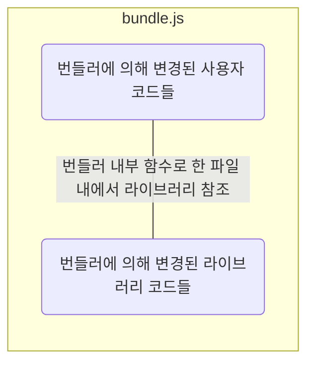

# Javascript 기록하기

- [JavaScript vs ECMAScript](#javascript-vs-ecmascript)
- [target vs currentTarget](#target-vs-currenttarget)
- [onclick vs addEventListener('click')](#onclick-vs-addeventlistenerclick)
  - [onclick](#onclick)
  - [addEventListener('click')](#addeventlistenerclick)
- [모듈](#모듈)
  - [모듈 번들러](#모듈-번들러)
  - [번들러 파일 구조](#번들러-파일-구조)
  - [개발/프로덕션 모드에 따른 번들링 방식](#개발프로덕션-모드에-따른-번들링-방식)
    - [개발 모드(dev 모드)](#개발-모드dev-모드)
    - [프로덕션 모드(prod 모드)](#프로덕션-모드prod-모드)
- [값, 리터럴, 표현식, 문](#값-리터럴-표현식-문)
- [parse](#parse)
- [실무에서 클로저 사용 예시](#실무에서-클로저-사용-예시)
- [구조 분해 할당](#구조-분해-할당)
- [논리 연산자 단락 평가](#논리-연산자-단락-평가)
- [자바스크립트 값의 종류](#자바스크립트-값의-종류)
- [Pass By Value vs Pass By Reference](#pass-by-value-vs-pass-by-reference)
- [깊은 객체 복사](#깊은-객체-복사)
  - [직렬화가 불가능한 객체](#직렬화가-불가능한-객체)
  - [null, undefined 직렬화 차이](#null-undefined-직렬화-차이)
- [null, undefined type check](#null-undefined-type-check)
- [try/catch](#trycatch)
  - [실행 동작의 에러 여부와 상관없이 실행시키고 싶은 코드가 있을 때 finally](#실행-동작의-에러-여부와-상관없이-실행시키고-싶은-코드가-있을-때-finally)
  - [사용자가 직접 에러 객체를 던지고 싶을 때 throw](#사용자가-직접-에러-객체를-던지고-싶을-때-throw)
  - [TypeError](#typeerror)
  - [ReferenceError](#referenceerror)
  - [SyntaxError](#syntaxerror)
  - [RangeError](#rangeerror)
- [file input 동일한 파일 입력 시 onChange 동작](#file-input-동일한-파일-입력-시-onchange-동작)
- [sort](#sort)
- [throttle vs debounce(feat. lodash 라이브러리)](#throttle-vs-debouncefeat-lodash-라이브러리)
- [context와 this](#context와-this)
- [window vs document](#window-vs-document)
- [node vs browser](#node-vs-browser)
  - [Node.js 환경에서만 사용 가능한 메서드 및 모듈:](#nodejs-환경에서만-사용-가능한-메서드-및-모듈)
  - [브라우저 환경에서만 사용 가능한 메서드 및 모듈:](#브라우저-환경에서만-사용-가능한-메서드-및-모듈)
- [createObjectURL(), revokeObjectURL()](#createobjecturl-revokeobjecturl)
- [배열, 이터러블 객체, 유사배열 객체](#배열-이터러블-객체-유사배열-객체)
- [async await, 프로미스, 콜백](#async-await-프로미스-콜백)
- [class](#class)
- [module script, nomodule script, defer, async](#module-script-nomodule-script-defer-async)
- [fetch](#fetch)
  - [Fetch 사용 시 네트워크 오류 처리](#fetch-사용-시-네트워크-오류-처리)
  - [Axios 사용 시 네트워크 오류 처리](#axios-사용-시-네트워크-오류-처리)
- [mutable vs immutable](#mutable-vs-immutable)
  - [Mutable vs Immutable](#mutable-vs-immutable-1)
    - [Mutable (변경 가능)](#mutable-변경-가능)
    - [Immutable (불변)](#immutable-불변)
  - [Immutable 데이터 구조를 사용하는 이유](#immutable-데이터-구조를-사용하는-이유)
  - [불변성 유지하기](#불변성-유지하기)
  - [불변 라이브러리](#불변-라이브러리)
  - [결론](#결론)
- [시간 구하기](#시간-구하기)

## JavaScript vs ECMAScript

JavaScript는 ECMAScript 언어의 구현 중 하나로, 대부분의 모던 웹 브라우저에서 지원하며 Node.js와 같은 서버 측 환경에서도 사용된다.

ECMAScript는 JavaScript의 표준 사양을 정의하는 언어이다. 프로그래밍 언어의 규격과 특성을 명시화하여 JavaScript 엔진 개발자와 웹 개발자 간의 일관된 작업 환경을 제공한다. 즉, ECMAScript는 JavaScript의 핵심 기능 및 구문을 정의하고 있으며, JavaScript 엔진 제작자 및 브라우저 개발자는 이 사양을 준수하여 JavaScript를 구현한다. JavaScript는 ECMAScript의 구현 중 하나로, 보통 브라우저나 Node.js 환경에서 실행된다. 여기에 브라우저나 환경에 따라 추가된 다양한 기능과 API를 제공한다.

## target vs currentTarget

이벤트 발생 시 콜백 함수에는 `Event` 객체를 인자로 받게 되는데, 해당 객체의 `target` 속성은 이벤트가 발생하고 버블링되는 과정에서 첫번째 단계의 엘리먼트를 가리킨다. `currentTarget`은 버블링을 따라 올라오면서 이벤트와 직접 바인딩된 엘리먼트를 가리킨다. `currentTarget`은 `console`로 찍어보면 `null`로 나타나게 되는데, 해당 데이터는 이벤트가 처리되는 동안에만 사용되기 때문이다.

## onclick vs addEventListener('click')

onclick과 addEventListener는 이벤트 처리를 위해 사용되는 JavaScript의 메커니즘이다. 하지만 두 가지 접근 방식에는 몇 가지 중요한 차이점이 있다.

### onclick

- HTML 요소의 onclick 속성을 통해 한 번에 하나의 이벤트 핸들러만 연결할 수 있다.
- HTML 요소의 onclick 속성은 HTML 코드에서 직접 지정되며, 정적으로 할당되기 때문에 바꾸기가 어렵다.
- onclick 속성으로 할당된 핸들러는 다른 핸들러보다 우선순위가 높다.
- onclick 속성에 빈 문자열을 설정하여 이벤트 핸들러를 제거할 수 있다.

### addEventListener('click')

- 하나의 요소에 여러 개의 이벤트 핸들러를 연결할 수 있다.
- 동적으로 이벤트 핸들러를 추가하거나 제거할 수 있따. 이는 런타임 중에 이벤트 핸들러를 동적으로 조작하고 업데이트하는 데 유용하다.
- 여러 개의 핸들러를 등록한 경우, 등록된 순서대로 호출된다. 이를 통해 여러 핸들러 간에 순서를 조절할 수 있다.
- removeEventListener를 사용하여 등록한 이벤트 핸들러를 제거할 수 있다. 단, 제거하려는 핸들러는 반드시 동일한 함수의 참조여야 한다.

## 모듈

모듈은 단순히 파일 하나의 불과하다. 모듈 안에서 `import` 지시자를 이용해서 외부 모듈 내부의 변수나 함수를 가져오거나 `export` 지시자를 이용해 모듈 내부의 변수나 함수를 내보낼 수 있다.

`export`와 `import` 지시자를 스크립트 내에서 사용하려면 아래와 같이 `type='module'` 속성을 추가해서 작성해야 한다.

```html
<script type='module' src='./module.js' >
```

자바스크립트 엔진은 `module.js` 파일 안에 `import`문을 만나면 해당 모듈을 가져오기 위해 네트워크 요청 또는 파일 경로를 통해 온다. 브라우저 환경에서는 일반적으로 네트워크 요청을 통해 해당 모듈을 가져오며, Node.js 환경에서는 파일 시스템을 통해 모듈을 가져온다.

### 모듈 번들러

브라우저 환경에서는 모듈 번들러 없이 모듈을 사용한다면, 무수히 많은 네트워크 요청이 발생한다. 이를 방지하기 위해 웹팩(Webpack)과 같은 모듈 번들러 툴을 사용해 하나의 번들러를 생성하고 이를 `script`와 연결한다.

```html
<script type="module" src="script.js"></script>
```

```js
// script.js
import { a } from './module.js';

// module.js
import { b } from './module2.js';

export let a = 'a';

// module2.js
export let b = 'b';
```


모듈 번들러 툴은 보통 아래와 같이 동작합니다.

1. HTML의 `<script type="module">`에 진입점 역할을 하는 모듈을 넣는다.
2. 진입점 모듈에 의존하고 있는(`import`되어 있는) 모듈 분석을 시작으로 모듈 간의 의존 관계를 파악한다.
3. 모듈 전체를 한데 모아 하나의 큰 파일을 만든다(설정에 따라 여러 개의 파일을 만드는 것도 가능하다). 이 과정에서 `import`문이 번들러 내부 함수로 대체되므로 기존 기능은 그대로 유지된다. 4. 위 과정에서 아래와 같은 변형 및 최적화도 함께 수행한다.
   - 도달하지 못한 코드는 삭제된다.
   - 내보내진 모듈 중 쓰임처가 없는 모듈을 삭제한다(tree-shaking).
   - `console`, `debugger` 같은 개발 관련 코드를 삭제한다.
   - 최신 자바스크립트 문법이 사용된 경우 바벨(Babel)을 사용해 동일한 기능을 하는 낮은 버전의 스크립트로 변환한다.
   - 공백 제거, 변수 이름 줄이기 등으로 산출물의 크기를 줄인다.

기존 `import`, `export`는 번들러 내부 함수로 대체되기 때문에 `type='module'`이 사라진다.

```html
<script defer src="bundle.js"></script>
```

### 번들러 파일 구조



### 개발/프로덕션 모드에 따른 번들링 방식

#### 개발 모드(dev 모드)

- 개발용 소스맵: 웹팩은 개발 모드에서 소스맵을 생성하여 번들된 코드와 원본 코드 간의 매핑을 제공해서 개발자 도구에서 원본 코드를 볼 수 있도록 해준다. 이는 디버깅을 용이하게 하고 원본 코드의 오류를 추적하는 데 도움을 준다.
- 빠른 빌드: 빠른 빌드와 빠른 리로딩을 위해 번들링 속도를 최적화한다. 파일을 변경할 때 필요한 부분만 다시 빌드하고 적용하는 등의 최적화 작업을 수행한다.
- 개발용 플러그인 및 기능: HMR(Hot Module Replacement)과 같은 기능을 제공하는 플러그인이나 개발 도구와의 통합을 위한 기능들이 포함될 수 있다.

#### 프로덕션 모드(prod 모드)

- 코드 최적화: 코드를 압축하고 최적화하여 번들된 파일의 크기를 최소화한다. 이는 애플리케이션의 다운로드 속도를 향상시키고 사용자 경험을 개선하는 데 도움을 준다.
- 난독화: 코드 난독화 기법을 적용하여 번들된 코드를 해석하기 어렵게 만든다. 이는 코드의 보안성을 높이고 외부에서의 접근을 어렵게 만드는 데 도움을 준다.
- 환경 변수 설정: 환경 변수를 설정하여 개발 모드와 다른 설정을 사용할 수 있다. 이를 통해 프로덕션 환경에서 필요한 설정 및 동작을 조정할 수 있다.

## 값, 리터럴, 표현식, 문

| 종류               | 설명                                                                                                                                                                                                                                                                     |
| ------------------ | ------------------------------------------------------------------------------------------------------------------------------------------------------------------------------------------------------------------------------------------------------------------------ |
| 값(Value)          | 표현식이 평가되어 생성된 결과                                                                                                                                                                                                                                            |
| 리터럴(Literal)    | 다양한 자료형을 가진 값을 생성하려면 이를 텍스트로 구분 짓는 것이 필요한데, 이를 위해 미리 약속된 표기법 규칙을 말한다.                                                                                                                                                  |
| 표현식(Expression) | 표현식은 값을 생성하거나 조작하는 코드 구문이다. 표현식은 값, 변수, 리터럴, 연산자, 함수 호출 등의 조합으로 구성될 수 있다. 표현식은 평가되어 값을 반환한다.                                                                                                             |
| 문(Statement)      | 문은 프로그램에서 실행되는 동작이나 작업을 나타낸다. 문은 프로그램의 동작을 제어하거나 조작하는 데 사용된다. 문은 변수 선언, 할당, 조건문(`if`/`else`), 반복문(`for`, `while`), 함수 선언 등의 구조를 가질 수 있습니다. 문은 세미콜론(`;`)으로 끝나는 것이 일반적입니다. |

## parse

보통 라이브러리는 여러가지 메서드를 가진 거대한 객체로 구성이 되고, 해당 객체에 변경할 데이터를 넣은 후 여러 메서드를 사용하여 원하는 형태의 데이터를 얻어낼 수 있다. 반대로 데이터를 기반으로 거대한 객체를 구성할 때 사용하는 것이 `parse()` 파싱 관련 메서드이다. 개발을 하다보면 데이터를 다시 조작해서 다른 데이터를 얻어내고 싶을 경우가 있을 것이다. 이런 경우 데이터를 파싱해서 거대한 객체를 다시 만들어내고 데이터를 바탕으로 만들어진 거대한 객체를 통해 다시 사용자가 원하는 형태의 데이터를 출력한다.

## 실무에서 클로저 사용 예시

이벤트에 이벤트 객체 외에 인자를 포함하는 함수를 연결할 경우 클로저를 사용해서 조금 더 간결하게 작성 가능하다.

```js
// 이벤트 객체와 같은 depth에서 인자를 구성한 경우
const debounce = (event, callback) => {
  ...
}

<button onClick={(event) => debounce(event, callback)}>Click</button>

// 이벤트 객체를 인자로 가진 함수를 클로저로 감싸서 함수를 실행하는 형태로 이벤트에 연결하는 경우
const debounce = (callback) => () => {
  ...
};

<button onClick={debounce(callback)}>Click</button>
```

## 구조 분해 할당

구조 분해 할당 후 기본값을 설정하는 경우, 해당 값이 `undefined`인 경우에만 기본값이 적용된다.

```js
const {
  a = 1,
  b = 2,
  c = 3,
  d = 4,
} = {
  a: null,
  b: undefined,
  c: 3,
  d: 4,
};

console.log(a, b, c, d); // null 2 3 4
```

## 논리 연산자 단락 평가

```js
const a = null || null || null || 'end'

console.log(a) // 'end'

const b = 'value' && 'value' && 'value' && 'end'

console.log(b) 'end'
```

논리 연산자 `||`는 단락 평가 시 `null`, `undefined`, `''`, `0`, `NaN`, `false` 값을 만나면 다음으로 이동하고 만나지 않으면 해당 값을 출력한다.

논리 연산자 `&&`는 단락 평가 시 `null`, `undefined`, `''`, `0`, `NaN`, `false` 값을 만나면 해당 값을 출력하고 만나지 않으면 다음으로 이동한다.

## 자바스크립트 값의 종류

|             | `typeof`    | 원시값 | 특이사항 | 설명                                                                               |
| ----------- | ----------- | ------ | -------- | ---------------------------------------------------------------------------------- |
| `null`      | "object"    | O      | X        | `null`의 `typeof` 연산은 "object"인데, 이는 언어상 오류다. `null`은 객체가 아니다. |
| `undefined` | "undefined" | O      | X        |                                                                                    |
| Boolean     | "boolean"   | O      | X        |                                                                                    |
| Number      | "number"    | O      | X        |                                                                                    |
| `NaN`       | "number"    | O      | X        | `NaN === NaN`은 같지 않다.                                                         |
| `Infinity`  | "number"    | O      | X        |                                                                                    |
| BigInt      | "number"    | O      | X        |                                                                                    |
| String      | "string"    | O      | X        |                                                                                    |
| Symbol      | "symbol"    | O      | X        |                                                                                    |
| Object      | "object"    | X      | O        |                                                                                    |
| Array       | "object"    | X      | O        |                                                                                    |
| Function    | "function"  | X      | O        |                                                                                    |

## Pass By Value vs Pass By Reference


## 깊은 객체 복사

```js
const object = {
  person: {
    age: 20,
    name: 'Tomas',
  },
  country: 'Korea',
};

const copyObject = JSON.parse(JSON.stringify(object));
```

### 직렬화가 불가능한 객체

- 함수 (Functions): 함수는 직렬화할 수 없다. 함수는 코드와 상태를 가지고 있어 일련의 바이트로 단순히 표현하기 어렵다.
- 심볼 (Symbols): ES6에서 추가된 심볼(Symbol)은 직렬화할 수 없다.
- 특별한 객체 (Host Objects): 일부 브라우저나 환경에서 제공하는 특수한 객체들은 직렬화가 불가능할 수 있다.
- 일부 자바스크립트 내장 객체 (Certain Native JavaScript Objects): 특정 내장 객체들은 직렬화가 어려울 수 있다. 예를 들어, `Error` 객체와 같은 것들은 일부 직렬화 형식에서는 문제를 일으킬 수 있다.

### null, undefined 직렬화 차이

```js
console.log(
  JSON.stringfy({
    name: null,
    age: 30,
    gender: undefine,
  }),
); // {"name":null,"age":30}
```

`null`의 경우 값으로 인정되고, `undefined`의 경우 삭제해버린다.

## null, undefined type check

```js
const temp = null;

if (temp == null) {
  console.log(temp); // null
}
```

```js
const temp = undefined;

if (temp == null) {
  console.log(temp); // undefined
}
```

## try/catch

에러가 발생하면 스크립트가 중단되고 콘솔에 에러가 출력된다. 스크립트가 중단되는 것을 방지하기 위해 `try/catch`문이 사용된다. 유효한 코드에서 발생하는 에러만 처리 가능하다.

### 실행 동작의 에러 여부와 상관없이 실행시키고 싶은 코드가 있을 때 finally

### 사용자가 직접 에러 객체를 던지고 싶을 때 throw

throw했는데 받아주는 곳 없으면 프로그램 종료되니 조심

<!-- todo: 내용 보완 필요 -->

### TypeError

```js
let undefinedVariable;
undefinedVariable.someMethod();
```

```js
try {
  let undefinedVariable;
  undefinedVariable.someMethod();
} catch (error) {
  console.error(error.message);
}
```

### ReferenceError

```js
console.log(nonExistentVariable);
```

```js
try {
  console.log(nonExistentVariable);
} catch (error) {
  console.error(error.message);
}
```

### SyntaxError

```js
JSON.parse('string');
```

```js
try {
  JSON.parse('string');
} catch (error) {
  console.error(error.message);
}
```

### RangeError

```js
let arr = new Array(-1);
```

```js
try {
  let arr = new Array(-1);
} catch (error) {
  console.error(error.message);
}
```

## file input 동일한 파일 입력 시 onChange 동작

`<input type='file' />`의 경우 사용자가 파일을 입력한 후 동일한 파일을 다시 입력하면 `value` 값이 동일하기 때문에 `onChange`가 동작하지 않는다.

`onChange`는 `value` 값이 변경되어야만 동작하므로 `onChange`가 일어나기 전에 `onClick`이 발생할 때 `event.target.value = ''`를 통해 `value` 값을 초기화해준다.

어쩌피 우리가 관심있는 값은 `event.target.files`에 있는 `File` 객체이기 때문에 위 동작은 값에 영향을 주지 않는다.

```js
<input type='file' onClick={(event) => event.target.value = ''} onChange={(event) => console.log(event.target.files)}>
```

## sort

배열은 각 문자의 유니 코드 코드 포인트 값에 따라 정렬되기 때문에 숫자 정렬이 생각한대로 정렬되지 않을 수 있다. 원 배열이 정렬되며, 복사본이 만들어지는 것이 아니다.

`compareFunction(a, b) < 0`인 경우, `a`를 `b`보다 낮은 인덱스로 정렬한다. 즉, `a`가 먼저 온다.
`compareFunction(a, b) === 0`인 경우, `a`와 `b`를 서로에 대해 변경하지 않는다.
`compareFunction(a, b) > 0`인 경우, `b`를 `a`보다 낮은 인덱스로 정렬한다. 즉, `b`가 먼저 온다.

## throttle vs debounce(feat. lodash 라이브러리)

<!-- todo: 내용 보완 필요 -->

이벤트에 병목 현상을 주고 싶거나, 사용자의 입력에 딜레이를 주고 싶은 상황이 빈번하게 발생하는데 이를 `lodash`의 `throttle`과 `debounce`로 쉽게 해결이 가능하다.

보통 스크롤 이벤트 같이 매우 빈번하게 발생하는 이벤트의 경우 `throttle`을 통해 병목 현상을 준다. 사용자가 고의로 빈번하게 입력하는 것을 방지하기 위해서는 `debounce`를 활용해 정해진 딜레이 이상 지나지 않으면 이벤트를 막아준다. 아래의 사진으로 해당 함수들이 어떻게 동작하는 지 이해할 수 있다.

`throttle`은 클릭을 여러번할 때 사용자가 설정한 n초 당 한 번씩 이벤트가 발생한다
`debounce`는 클릭을 여러번할 때 클릭과 클릭 사이에 간격이 사용자가 설정한 n초를 넘어가면 이벤트가 발생한다


사용법은 아래와 같다. 리액트의 경우 리렌더링 시에 컴포넌트를 계속 호출하므로 `useRef` 훅으로 감싸서 매 렌더링마다 새로운 함수가 생성되는 것을 막는다.

```js
import _ from 'lodash';

...

function onCheckEmail() {
    ...
}

const onThrottledCheckEmail = _.throttle(onCheckEmail, 1000, {leading: true, trailling: false});

const onDebouncedCheckEmail = _.debounce(onCheckEmail, 1000, {leading: true, trailling: false});

function debounceWrapper(func, delay) {
  let timerId;

  return function (...args) {
    if (timerId) {
      clearTimeout(timerId);
    }

    timerId = setTimeout(() => {
      func.apply(this, args);
    }, delay);
  };
}

function throttleWrapper(func, delay) {
  let isThrottled = false;

  return function (...args) {
    if (!isThrottled) {
      func.apply(this, args);
      isThrottled = true;

      setTimeout(() => {
        isThrottled = false;
      }, delay);
    }
  };
}
```

## context와 this

자바스크립트 컨텍스트와 this의 상관관계

1. 컨텍스트

자바스크립트 컨텍스트는 코드 실행 환경을 의미하며, 크게 전역 컨텍스트와 함수 컨텍스트로 나눌 수 있습니다.
컨텍스트는 변수 및 함수의 스코프를 결정하고, 호이스팅에 영향을 미치며, this 키워드의 값을 결정합니다. 2. this

this 키워드는 현재 실행 중인 코드의 컨텍스트 객체를 참조합니다.
컨텍스트 객체는 함수 컨텍스트에서는 함수 객체이며, 전역 컨텍스트에서는 전역 객체(브라우저 환경에서는 window 객체)입니다. 3. 컨텍스트와 this의 상관관계

this 키워드는 함수가 어떻게 호출되었는지에 따라 값이 결정됩니다.
함수가 독립적으로 호출되면 this는 전역 객체를 참조합니다.
함수가 객체의 메서드로 호출되면 this는 해당 객체를 참조합니다.
함수가 call(), apply(), bind() 메서드를 사용하여 호출되면 this는 첫 번째 인수로 전달된 객체를 참조합니다.

화살표 함수는 this가 없음

```js
const noObjThis = this; // window

function Func() {
  return this; // window
}
const ArrowFunc = () => {
  return this; // window
};

const obj = {
  name: 'Tomas',
  age: 30,
  objThis: this, // window
  objFunc() {
    return this; // obj
  },
  objArrowFunc: () => {
    return this; // window
  },
  nestedObjFunc1() {
    console.log(this); // obj
    return function () {
      return this; // window
    };
  },
  nestedObjFunc2() {
    console.log(this); // obj
    return () => {
      return this; // obj
    };
  },
  nestedObjFunc3: () => {
    console.log(this); // window
    return () => {
      return this; // window
    };
  },
  nestedObjFunc4: () => {
    console.log(this); // window
    return () => {
      return this; // window
    };
  },
};

function wrapperFunc1(callback, localVar1) {
  const localVar2 = 'localVar2';

  return function (...arguments) {
    console.log(localVar1);
    console.log(localVar2);
    return callback(...arguments); // window
  };
}

function wrapperFunc2(callback, localVar1) {
  const localVar2 = 'localVar2';

  return (...arguments) => {
    console.log(localVar1);
    console.log(localVar2);
    return callback(...arguments); // window
  };
}

function wrapperFunc3(callback, localVar1) {
  const localVar2 = 'localVar2';

  return function (...arguments) {
    console.log(localVar1);
    console.log(localVar2);
    return callback.call(this, ...arguments); // obj
  };
}

function wrapperFunc4(callback, localVar1) {
  const localVar2 = 'localVar2';

  return (...arguments) => {
    console.log(localVar1);
    console.log(localVar2);
    return callback.call(this, ...arguments); // window
  };
}
```

## window vs document

window 객체는 브라우저 탭에 존재하는 자바스크립트 전역 최상위 객체이다. 따라서 window로 어디서든 접근이 가능하다.(서버사이드 렌더링 시엔 브라우저 렌더링이 아니기 때문에 window 객체가 없다)
window 객체 안에는 document 객체가 존재하고, document에는 잠재적으로 보여질 수 있는 dom에 대한 정보가 저장되어 있다. document객체는 window.document 혹은 document로 접근이 가능하다. (그 이유는 바로 다음 줄에)
window 객체는 전역으로 선언되어 있기 때문에 window객체 안에 있는 요소는 "window."와 같이 window객체를 참조하지 않고도 property 이름으로 바로 접근이 가능하다. 예컨대 window.innerHeight는 그냥 innerHeight로 접근이 가능하다. ( 오... 신기... 하지만 혼동이나 scope 등의 문제로 window.innerHeight 이런 식으로 사용하는 게 좋을 것 같다. )
document객체와 window객체에서 수용 가능한 eventList가 다르기 때문에, 같은 addEventListener이 있다고 하더라도, 각 용도에 맞게 호출해야 한다.

## node vs browser

네, Node.js 환경과 브라우저 환경에서는 각각 다른 환경에서 사용되는 메서드 및 모듈들이 있습니다. 이는 두 환경이 다르기 때문에 특정한 기능을 지원하기 위해 각각의 환경에서 독립적으로 제공되는 것입니다.

### Node.js 환경에서만 사용 가능한 메서드 및 모듈:

1. **fs 모듈:**

   - 파일 시스템 관련 작업을 수행할 수 있는 모듈. (`fs.readFileSync`, `fs.writeFile` 등)

2. **http 모듈:**

   - HTTP 서버를 만들고 관리할 수 있는 모듈. (`http.createServer` 등)

3. **os 모듈:**

   - 운영체제 정보에 접근할 수 있는 모듈. (`os.platform`, `os.cpus` 등)

4. **path 모듈:**

   - 파일 경로 관련 작업을 수행할 수 있는 모듈. (`path.join`, `path.resolve` 등)

5. **child_process 모듈:**

   - 외부 프로세스를 실행할 수 있는 모듈. (`child_process.exec`, `child_process.spawn` 등)

6. **util 모듈:**
   - 유틸리티 함수들을 제공하는 모듈. (`util.promisify` 등)

### 브라우저 환경에서만 사용 가능한 메서드 및 모듈:

1. **DOM API:**

   - 웹 페이지의 문서 객체 모델(DOM)에 접근할 수 있는 메서드. (`document.getElementById`, `document.createElement` 등)

2. **Fetch API:**

   - 네트워크 요청을 수행하는 API. (`fetch` 함수 등)

3. **Web Storage API:**

   - 로컬 스토리지와 세션 스토리지에 접근할 수 있는 API. (`localStorage`, `sessionStorage` 등)

4. **Web Workers API:**

   - 백그라운드에서 별도의 스레드에서 스크립트를 실행할 수 있는 API. (`new Worker` 등)

5. **WebSockets:**

   - 웹소켓 통신을 위한 API. (`new WebSocket` 등)

6. **WebRTC:**
   - 실시간 통신을 위한 API. (`RTCPeerConnection`, `getUserMedia` 등)

이 외에도 각각의 환경에 특화된 다양한 메서드와 모듈이 있습니다. 자바스크립트 코드를 작성할 때 어떤 환경에서 실행될지 고려하여 해당 환경에서 지원하는 기능을 활용하는 것이 중요합니다. 또한, Node.js에서는 CommonJS 스타일의 모듈 시스템을, 브라우저에서는 ES6 모듈 시스템을 사용하는 것에도 주의해야 합니다.

## createObjectURL(), revokeObjectURL()

바이너리 데이터 -> 자바스크립트에서 다루기 쉽게 BLOB 객체로 변환 -> 해당 BLOB 객체를 가리키는 URL 생성

모두 브라우저 메모리에 저장됨

## 배열, 이터러블 객체, 유사배열 객체

이터러블: 심볼 이터레이터를 포함하며 for in 구문 사용 가능한 객체
유사배열 객체: 인덱스와 length 프로퍼티가 있으나 배열 메서드를 사용할 수 없는 객체

위 두 객체는 배열이 아니기 때문에 Array.from으로 배열로 만들어서 사용 가능

## async await, 프로미스, 콜백

```js
import { readdir } from 'fs/promises';

export async function getDirectoryList() {
  try {
    const directoryList = await readdir(`${process.cwd()}/public/post`);

    let allCount = 0;

    const result = await Promise.all(
      directoryList
        .filter((directory) => /^[^\.]*$/.test(directory))
        .map(async (directory) => {
          const postList = await readdir(`${process.cwd()}/public/post/${directory}`);

          const count = postList.filter((directory) => /.*.md/.test(directory));

          allCount += count.length;

          return {
            folderName: directory,
            postCount: count.length,
          };
        }),
    );

    return [
      {
        folderName: 'ALL',
        postCount: allCount,
      },
      ...result,
    ];
  } catch (err) {
    console.log(err);

    return [];
  }
}
```

```js
import { readdir } from 'fs/promises';

export function getDirectoryList() {
  return readdir(`${process.cwd()}/public/post`)
    .then((directoryList) => {
      let allCount = 0;

      const promises = directoryList
        .filter((directory) => /^[^\.]*$/.test(directory))
        .map((directory) => {
          return readdir(`${process.cwd()}/public/post/${directory}`).then((postList) => {
            const count = postList.filter((file) => /.*\.md$/.test(file)).length;

            allCount += count;

            return {
              folderName: directory,
              postCount: count,
            };
          });
        });

      return Promise.all(promises).then((result) => [
        {
          folderName: 'ALL',
          postCount: allCount,
        },
        ...result,
      ]);
    })
    .catch((err) => {
      console.error(err);
      return [];
    });
}
```

## class

```js
class MyClass {
  prop = value; // 프로퍼티(instance 속성)
  static prop = value; // (class 속성)

  constructor(...) { // 생성자 메서드(prototype 속성)
    // ...
  }

  method(...) {} // 메서드(prototype 속성)

  get something(...) {} // getter 메서드(prototype 속성)
  set something(...) {} // setter 메서드(prototype 속성)

  [Symbol.iterator]() {} // 계산된 이름(computed name)을 사용해 만드는 메서드 (심볼)(prototype 속성)
  // ...
}
```

## module script, nomodule script, defer, async

Scope(범위):
모듈 스크립트: 파일 단위로 스코프가 지정되며, 모듈 내에서 정의된 변수와 함수는 기본적으로 해당 모듈 내에서만 접근 가능합니다. 모듈 간의 변수 충돌을 방지하기 위해 각 모듈은 자체적인 스코프를 가집니다.
일반 스크립트: 전역 스코프를 사용하며, 모든 스크립트가 동일한 전역 스코프를 공유합니다. 이는 변수 충돌이 발생할 수 있으며, 코드 유지보수 및 디버깅을 어렵게 만들 수 있습니다.
자동 strict mode(엄격 모드):
모듈 스크립트: 기본적으로 모듈 스크립트는 엄격 모드(strict mode)로 실행됩니다. 엄격 모드는 예기치 않은 동작을 방지하고 보다 안전한 코드를 작성할 수 있도록 도와줍니다.
일반 스크립트: 엄격 모드를 사용하려면 스크립트의 첫 부분에 "use strict";를 명시적으로 추가해야 합니다.
지연 실행(Lazy Execution):
모듈 스크립트: 모듈 스크립트는 브라우저에서 필요한 시점에만 다운로드되고 실행됩니다. 이는 성능을 향상시키고 초기 로딩 속도를 개선할 수 있습니다.
일반 스크립트: 일반 스크립트는 선언된 위치에서 즉시 다운로드되고 실행됩니다.
외부 스크립트 로딩 방법:
모듈 스크립트: <script type="module" src="..."></script> 형태로 외부 스크립트를 로드합니다.
일반 스크립트: <script src="..."></script> 형태로 외부 스크립트를 로드합니다.

async 속성:
일반 스크립트(<script>)와 모듈 스크립트(<script type="module">) 모두에 적용할 수 있습니다.
스크립트가 비동기적으로 다운로드되고 실행됨을 나타내며, 페이지의 로딩을 차단하지 않고 병렬로 다운로드됩니다.
defer 속성:(모듈 스크립트에서는 디폴트 값)
일반 스크립트(<script>)에서만 사용할 수 있습니다.
비동기적으로 다운로드되지만 페이지 파싱을 중단하지 않고, 페이지 파싱이 완료된 후에 실행됩니다.

## fetch

클라이언트에서 네트워크 오류를 처리하는 방법은 주로 HTTP 요청을 보내는 fetch나 axios와 같은 라이브러리의 에러 핸들링을 통해 이루어집니다. 네트워크 오류는 주로 HTTP 응답 코드를 통해 감지되며, 다음은 fetch와 axios를 사용하여 네트워크 오류를 처리하는 방법입니다.

### Fetch 사용 시 네트워크 오류 처리

```javascript
fetch('https://api.example.com/data')
  .then((response) => {
    if (!response.ok) {
      // 응답 했지만 상태코드가 200대가 아닌 경우
      throw new Error('Network response was not ok');
    }
    return response.json();
  })
  .then((data) => {
    // 데이터를 사용하는 로직
  })
  .catch((error) => {
    // 응답 자체를 실패한 경우
    console.error('Fetch Error:', error);
    // 에러 처리 로직
  });
```

### Axios 사용 시 네트워크 오류 처리

```javascript
axios
  .get('https://api.example.com/data')
  .then((response) => {
    // 성공적인 응답 처리
  })
  .catch((error) => {
    if (error.response) {
      // 서버가 응답했지만 상태 코드가 실패인 경우
      console.error('Axios Response Error:', error.response.data);
    } else if (error.request) {
      // 요청이 만들어졌지만 응답을 받지 못한 경우
      console.error('Axios Request Error:', error.request);
    } else {
      // 오류를 발생시킨 요청을 설정하는 과정에서 오류가 발생한 경우
      console.error('Axios Error:', error.message);
    }
    // 에러 처리 로직
  });
```

네트워크 오류를 처리할 때, 주의해야 할 점은 클라이언트와 서버 간의 통신이 실패하거나 지연될 수 있으며, 이는 여러 가지 이유로 발생할 수 있다는 점입니다. 이에 대비하여 적절한 에러 핸들링을 구현하여 사용자 경험을 향상시키는 것이 중요합니다.

## mutable vs immutable

JavaScript에서 mutable(변경 가능)과 immutable(불변) 개념은 데이터의 변경 가능성을 정의합니다. 이는 코드의 예측 가능성을 높이고, 특히 상태 관리가 중요한 애플리케이션에서 유용합니다. 아래에서 mutable과 immutable 데이터 유형의 차이점과 이들을 다루는 방법에 대해 설명합니다.

### Mutable vs Immutable

#### Mutable (변경 가능)

Mutable 데이터는 원래의 값을 직접 변경할 수 있는 데이터 유형입니다. JavaScript에서 배열과 객체는 대표적인 mutable 데이터 유형입니다.

**예시:**

```javascript
// 배열 (mutable)
let arr = [1, 2, 3];
arr.push(4); // arr는 [1, 2, 3, 4]로 변경됨

// 객체 (mutable)
let obj = { name: 'Alice', age: 25 };
obj.age = 26; // obj는 { name: 'Alice', age: 26 }으로 변경됨
```

#### Immutable (불변)

Immutable 데이터는 한 번 생성된 후에는 변경할 수 없는 데이터 유형입니다. JavaScript의 기본 자료형인 숫자, 문자열, 불리언은 불변입니다. 또한, 배열과 객체의 불변성을 유지하려면 복사를 통해 새로운 값을 만들어야 합니다.

**예시:**

```javascript
// 문자열 (immutable)
let str = 'Hello';
let newStr = str.concat(' World'); // str은 여전히 "Hello", newStr은 "Hello World"

// 숫자 (immutable)
let num = 5;
let newNum = num + 1; // num은 여전히 5, newNum은 6
```

### Immutable 데이터 구조를 사용하는 이유

1. **예측 가능성**: 데이터가 변하지 않기 때문에 코드의 예측 가능성이 높아집니다.
2. **변경 추적**: 불변 객체를 사용하면 변경 전후의 상태를 쉽게 추적할 수 있습니다.
3. **비교 용이성**: 불변 객체는 값이 변경되지 않으므로 얕은 비교(shallow comparison)로도 변경 여부를 알 수 있습니다.

### 불변성 유지하기

불변성을 유지하기 위해, JavaScript에서는 종종 배열이나 객체를 복사하여 새로운 데이터를 생성합니다.

**객체의 불변성 유지:**

```javascript
const originalObj = { name: 'Alice', age: 25 };

// 새로운 객체 생성
const newObj = { ...originalObj, age: 26 };

console.log(originalObj); // { name: 'Alice', age: 25 }
console.log(newObj); // { name: 'Alice', age: 26 }
```

**배열의 불변성 유지:**

```javascript
const originalArr = [1, 2, 3];

// 새로운 배열 생성
const newArr = [...originalArr, 4];

console.log(originalArr); // [1, 2, 3]
console.log(newArr); // [1, 2, 3, 4]
```

### 불변 라이브러리

불변성을 더 쉽게 관리하기 위해, JavaScript에서 `Immutable.js` 같은 라이브러리를 사용할 수 있습니다. 이는 복잡한 불변 데이터 구조를 간단하게 다룰 수 있도록 도와줍니다.

**예시:**

```javascript
const { Map } = require('immutable');

let map1 = Map({ a: 1, b: 2, c: 3 });
let map2 = map1.set('b', 50);

console.log(map1.get('b')); // 2
console.log(map2.get('b')); // 50
```

### 결론

JavaScript에서 mutable과 immutable 데이터 구조는 데이터의 변경 가능성을 관리하는 중요한 개념입니다. 특히, 상태 관리가 중요한 애플리케이션에서는 불변성을 유지하는 것이 예측 가능성을 높이고, 코드의 유지보수성을 향상시키는 데 도움이 됩니다. Spread 연산자, `Object.assign`, 또는 `Immutable.js`와 같은 도구를 사용하여 불변성을 유지할 수 있습니다.

## 시간 구하기

10분짜리 오디오 초로 변환: 600초

번역 걸리는 시간: 15초

오디오 초로 번역 시간을 알아내기: 600 / x = 15

x = 40, 600을 40으로 나누면 15초 나옴

15초를 interval 0.2초 간격으로 나누면 총 75회 카운트

75회 카운트 동안 100퍼센트를 채우려면 1.333...%씩

보더 길이를 채우려면 보더 총 길이 / 75
