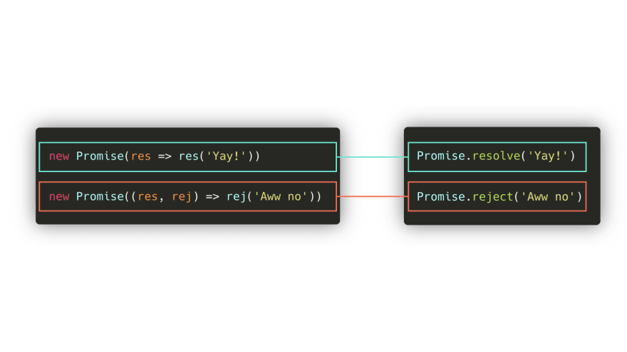
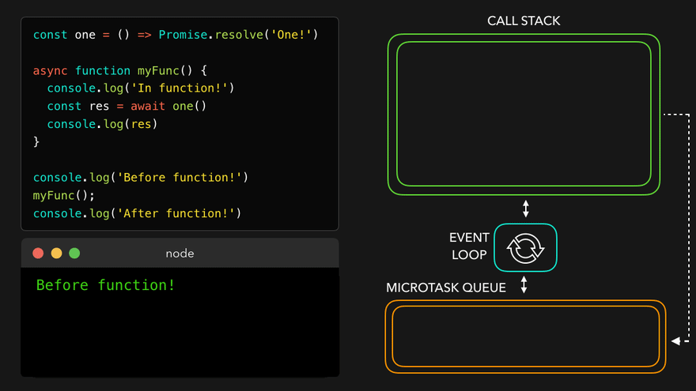
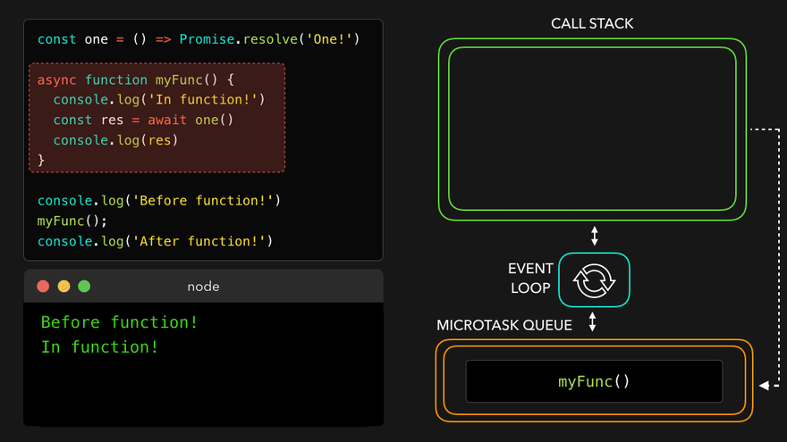

# Promise

- [async/await](#asyncawait)

Promise.resolve
Promise.resolve(value)는 결괏값이 value인 이행 상태 프라미스를 생성합니다.

아래 코드와 동일한 일을 수행합니다.

let promise = new Promise(resolve => resolve(value));
Promise.resolve는 호환성을 위해 함수가 프라미스를 반환하도록 해야 할 때 사용할 수 있습니다.

아래 함수 loadCached는 인수로 받은 URL을 대상으로 fetch를 호출하고, 그 결과를 기억(cache)합니다. 나중에 동일한 URL을 대상으로 fetch를 호출하면 캐시에서 호출 결과를 즉시 가져오는데, 이때 Promise.resolve를 사용해 캐시 된 내용을 프라미스로 만들어 반환 값이 항상 프라미스가 되게 합니다.

let cache = new Map();

function loadCached(url) {
if (cache.has(url)) {
return Promise.resolve(cache.get(url)); // (\*)
}

return fetch(url)
.then(response => response.text())
.then(text => {
cache.set(url,text);
return text;
});
}
loadCached를 호출하면 프라미스가 반환된다는 것이 보장되기 때문에 loadCached(url).then(…)을 사용할 수 있습니다. loadCached 뒤에 언제나 .then을 쓸 수 있게 됩니다. (\*)로 표시한 줄에서 Promise.resolve를 사용한 이유가 바로 여기에 있습니다.

Promise.reject
Promise.reject(error)는 결괏값이 error인 거부 상태 프라미스를 생성합니다.

아래 코드와 동일한 일을 수행합니다.

let promise = new Promise((resolve, reject) => reject(error));
실무에서 이 메서드를 쓸 일은 거의 없습니다.

Promise.all
Promise.allSettled
Promise.race

## async/await

