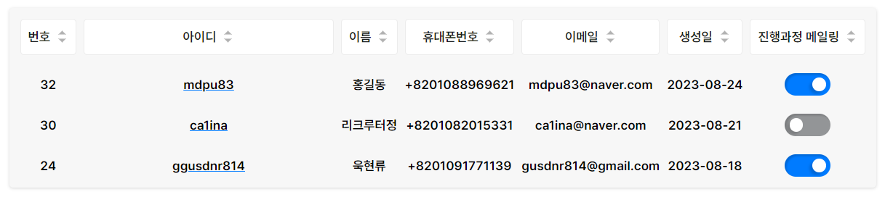

# React Query

- [react-query 사용 시 애니메이션 렌더링 문제](#react-query-사용-시-애니메이션-렌더링-문제)
- [react-query](#react-query-1)
- [CRA 빌드](#cra-빌드)
- [manifest.json](#manifestjson)
- [react에서 환경변수](#react에서-환경변수)

## react-query 사용 시 애니메이션 렌더링 문제

아래와 같은 어드민 패널에 진행과정 메일링을 보면 Switch 컴포넌트가 적용되어 있는데, 이 컴포넌트는 클릭 시 상태에 따라 트랜지션이 일어나고 리액트 쿼리로 리스트 값을 업데이트하는 API 요청을 하게 된다. 그리고 성공 시 해당 화면에 정보를 다시 불러와서 업데이트한다.

이 과정에서 연속으로 상태를 바꿀 경우 새로 불러오는 데이터와 버튼의 상태 데이터가 충돌해서 애니메이션이 왔다갔다하는 경우를 발견할 수 있다. 이를 해결하기 위해 리스트 값을 업데이트하지 않고 리액트 쿼리의 `cacheTime` 속성을 `0`으로 설정하여 해결했다.

## react-query

queryClient.getQueryState
queryClient.getQueryData

useQuery 키공유

상태 동기화가 잘 안됨

## CRA 빌드

`react-scripts build` 명령어를 실행하면, 다음과 같은 작업을 수행한다.

1. 프로덕션 모드 설정

   - NODE_ENV를 production으로 설정하여 최적화된 빌드를 생성한다.

2. 코드 번들링 및 최적화

   - Webpack을 사용하여 JavaScript 파일들을 번들링한다.
   - Babel을 사용하여 최신 JavaScript 코드가 구형 브라우저에서도 동작하도록 트랜스파일링한다.
   - 코드 압축(UglifyJS) 및 최적화(Dead Code Elimination) 작업이 수행된다.
   - CSS 파일이 별도로 추출되어 최적화된다.

3. 빌드 결과물 생성

   - `build/` 디렉토리에 최종 빌드 결과물이 생성된다.
   - 이 디렉토리에는 번들된 JavaScript 파일, 최적화된 CSS 파일, 그리고 `index.html` 파일이 포함된다.
   - 결과적으로, `build/` 디렉토리의 파일들을 웹 서버에 배포한다.

## manifest.json

`manifest.json` 파일은 Progressive Web App(PWA)에서 사용되는 파일로, 해당 웹 앱의 메타데이터와 구성 요소를 정의하는 역할을 한다. PWA는 웹과 네이티브 앱의 장점을 결합한 형태이다.

CRA로 리액트 프로젝트 생성 시 `public` 폴더 아래에 해당 파일이 있는데 PWA를 지원하지 않으려면 삭제해도 된다. `index.html`의 관련 코드도 같이 삭제해야 한다.

## react에서 환경변수

CRA에 의해 `.env` 파일에 규칙을 가지고 작성된 환경변수는 빌드 타임에 `process.env`로 객체화되서 클라이언트에서 접근이 가능한 형태가 된다.
