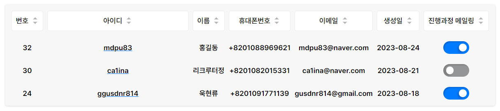

# React Query

- [react-query 사용 시 애니메이션 렌더링 문제](#react-query-사용-시-애니메이션-렌더링-문제)
- [react-query](#react-query-1)

## react-query 사용 시 애니메이션 렌더링 문제

아래와 같은 어드민 패널에 진행과정 메일링을 보면 Switch 컴포넌트가 적용되어 있는데, 이 컴포넌트는 클릭 시 상태에 따라 트랜지션이 일어나고 리액트 쿼리로 리스트 값을 업데이트하는 API 요청을 하게 된다. 그리고 성공 시 해당 화면에 정보를 다시 불러와서 업데이트한다.

이 과정에서 연속으로 상태를 바꿀 경우 새로 불러오는 데이터와 버튼의 상태 데이터가 충돌해서 애니메이션이 왔다갔다하는 경우를 발견할 수 있다. 이를 해결하기 위해 리스트 값을 업데이트하지 않고 리액트 쿼리의 `cacheTime` 속성을 `0`으로 설정하여 해결했다.

## react-query

queryClient.getQueryState
queryClient.getQueryData

useQuery 키공유

상태 동기화가 잘 안됨
