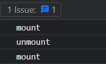
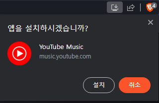

# React 기록하기

- [React 기록하기](#react-기록하기)
  - [가상 돔(Virtual DOM)](#가상-돔virtual-dom)
  - [JSX(JavaScript XML)](#jsxjavascript-xml)
  - [useState](#usestate)
    - [Strict Mode](#strict-mode)
  - [useRef](#useref)
    - [forwardRef()](#forwardref)
    - [useImperativeHandle](#useimperativehandle)
  - [useEffect](#useeffect)
    - [의존성 배열에 상태 변수 없애기](#의존성-배열에-상태-변수-없애기)
    - [의존성 배열에 객체 변수 없애기](#의존성-배열에-객체-변수-없애기)
    - [의존성 배열에 함수 없애기](#의존성-배열에-함수-없애기)
    - [useEffect 두 번 호출 이슈](#useeffect-두-번-호출-이슈)
  - [useMemo vs useCallback](#usememo-vs-usecallback)
  - [memo](#memo)
  - [사용자 훅과 일반 유틸 함수의 차이점](#사용자-훅과-일반-유틸-함수의-차이점)
  - [사용자 Hook](#사용자-hook)
  - [manifest.json](#manifestjson)
  - [react에서 환경변수](#react에서-환경변수)
    - [checked](#checked)
    - [oninput vs onchange](#oninput-vs-onchange)
    - [사용자 입력 제한](#사용자-입력-제한)

## 가상 돔(Virtual DOM)

리액트는 실제 돔을 기반으로 만들어진 가상 돔이 존재한다. 정의해놓은 상태 값이 변경되어 가상 돔의 변화가 일어나게 되면 실제 돔과 비교하여 변경된 부분만 수정한 후에 리렌더링이 이루어진다.


## JSX(JavaScript XML)

- JavaScript의 확장 문법으로, React 컴포넌트를 더 직관적이고 가독성이 높은 방식으로 작성할 수 있도록 도와준다.
- XML과 유사한 구문을 사용하여 JavaScript 코드 안에 HTML 마크업을 작성할 수 있게 해준다.
- JSX는 JavaScript 표현식을 중괄호(`{}`)로 감싸서 삽입할 수도 있다. 이를 통해 동적으로 값을 계산하거나 변수를 사용할 수 있다.
- 바벨(Babel)과 같은 도구를 사용하여 일반 JavaScript 코드로 변환된다.

## useState

```ts
const [state, setState] = useState(initialState);
```

`useState`의 첫 번째 인자로 값을 전달하면 해당 값을 초기 상태로 설정해준다. 함수를 전달하면 이 함수는 초기화 함수로 취급된다. 이 함수는 순수해야 하고 인수를 받지 않아야 하며 어떤 유형의 값도 반환해야 한다. React는 컴포넌트를 초기화할 때 초기화 함수를 호출하고 그 반환값을 초기 상태로 저장한다. 초기 상태는 컴포넌트가 처음 렌더링되는 시점에만 설정되고, 이후에는 무시된다.

### Strict Mode

엄격 모드에서 React는 실수로 발생한 불순물을 찾기 위해 이니셜라이저 함수를 두 번 호출합니다. 이는 개발 전용 동작이며 프로덕션에는 영향을 미치지 않습니다. 이니셜라이저 함수가 순수하다면(그래야만 하는 것처럼) 동작에 영향을 미치지 않습니다. 호출 중 하나의 결과는 무시됩니다.

## useRef

```ts
function App() {
  const myRef = useRef(null);
  // 직접 값 변경을 위해선 | null을 써야함
  const myRef2 = useRef<HTMLButtonElement | null>(null);
  const myRef3 = [useRef<HTMLButtonElement | null>(null), useRef<HTMLButtonElement | null>(null), useRef<HTMLButtonElement | null>(null)];


  function handleClick() {
    console.dir(myRef.current);
  }

  return (
    <button ref={myRef} onClick={handleClick}>
      Button
    </button>
    // ref={myRef}를 자세히 쓰면 아래와 같음
    <button ref={(element) => { myRef2.current = element } } onClick={handleClick}>
    Button
    </button>
  );
}
```

네, 맞습니다. 리액트에서 ref 값은 컴포넌트가 마운트된 이후에 리렌더링이 발생해야 값이 채워집니다.

이유

ref는 컴포넌트 렌더링 과정에서 생성된 DOM 요소 또는 기타 값을 참조합니다.
컴포넌트가 처음 렌더링될 때는 DOM 요소가 아직 생성되지 않았기 때문에 ref 값은 null입니다.
컴포넌트가 마운트된 후에는 DOM 요소가 생성되고 ref 값이 채워집니다.
리렌더링이 발생하면 컴포넌트 내부 state 또는 props가 변경되고 ref 값도 업데이트될 수 있습니다.
따라서 ref 값을 사용하려면 다음과 같이 해야 합니다.

useEffect 또는 componentDidMount 라이프 사이클 메서드에서 ref 값을 사용합니다.
useRef hook을 사용하여 ref 값을 저장하고 리렌더링 후에도 값을 유지합니다.

### forwardRef()

리액트에 의해 관리되는 DOM 노드에 참조하는 방법은 아래와 같다.

```js
function App() {
  const myRef = useRef(null);

  function handleClick() {
    console.dir(myRef.current);
  }

  return (
    <button ref={myRef} onClick={handleClick}>
      Button
    </button>
  );
}
```

버튼을 클릭하면 해당 버튼 요소의 정보가 콘솔에 출력된다.

사용자 정의 컴포넌트 내부 요소의 `ref` 속성을 참조하려는 경우 `forwardRef()` 메서드를 사용해야 한다.

```js
const MyButton = forwardRef((props, ref) => {
  return (
    <button ref={ref} {...props}>
      Button
    </button>
  );
});

function App() {
  const myRef = useRef(null);

  function handleClick() {
    console.dir(myRef.current);
  }

  return (
    <MyButton ref={myRef} onClick={handleClick}>
      Button
    </MyButton>
  );
}
```

버튼을 클릭하면 사용자 정의 버튼 요소의 정보가 콘솔에 출력된다.

기본적으로 React는 가상 DOM을 이용해 실제 DOM을 추상화하고 관리하기 때문에 리액트의 메커니즘이 아닌 기존 바닐라 자바스크립트 메커니즘으로 실제 DOM을 수정하려고 할 경우 문제가 생길 수 있다. 그렇기 때문에 DOM 노드를 참조해서 기능을 생성할 때 포커스 관리, 스크롤 위치 수정과 같은 비파괴적인 작업은 상관없지만 `remove()`와 같이 해당 노드를 삭제하는 행위는 리액트에서 오류를 분출한다.

### useImperativeHandle

`forwardRef()`로 감싸진 컴포넌트는 `ref`가 요소와 연결되면 해당 요소를 컴포넌트 내부에서 조작을 할 수 없게 된다. `useImperativeHandle()`이라는 리액트에서 제공해주는 훅을 사용하면 컴포넌트 내부에서 요소의 연결된 `ref`를 조작할 수 있고 `ref`를 상위 컴포넌트에 내보낼 때 `ref`를 커스텀해서 보낼 수 있다.

```js
// useImperativeHandle 사용 전
const FileInput = forwardRef(({ buttonProps, ...inputProps }, ref) => {
  return (
    <div>
      <input css={{ display: 'none' }} ref={ref} type='file' {...inputProps} />

      <Button onClick={(e) => /* input 요소를 클릭하게 하고싶다.. */} {...buttonProps}>
        <span className='material-icons'>file_upload</span>
      </Button>
    </div>
  );
});

// useImperativeHandle 사용 후
const FileInput = forwardRef(({ buttonProps, ...inputProps }, ref) => {
  const inputRef = useRef(null);

  useImperativeHandle(ref, () => inputRef.current);

  return (
    <div>
      <input css={{ display: 'none' }} ref={inputRef} type='file' {...inputProps} />

      <Button onClick={(e) => inputRef.current.click()} {...buttonProps}>
        <span className='material-icons'>file_upload</span>
      </Button>
    </div>
  );
});

```

## useEffect

`useEffect`는 화면이 한 번 렌더링된 이후에 동작한다.

의존성 배열이 없는 경우 `return`을 통한 정리 함수는 언마운트 시에만 동작한다

의존성 배열이 있는 경우 `return`을 통한 정리 함수는 렌더링 마다 동작한다

효과의 로직이 포함된 함수입니다. 설정 함수는 선택적으로 정리 함수를 반환할 수도 있습니다. 컴포넌트가 DOM에 추가되면 React는 설정 함수를 실행합니다. **변경된 종속성으로 다시 렌더링할 때마다 React는 먼저 이전 값으로 정리 함수(제공한 경우)를 실행한 다음 새 값으로 설정 함수를 실행합니다**. 컴포넌트가 DOM에서 제거된 후 React는 정리 함수를 실행합니다.

### 의존성 배열에 상태 변수 없애기

setCount 안에 prev 변수를 사용하기, 직접 컴포넌트 상위 단에 정의된 상태 변수 쓰지않기

### 의존성 배열에 객체 변수 없애기

useEffect 내부에 객체 선언하기

### 의존성 배열에 함수 없애기

useEffect 내부에 함수 선언하기

### useEffect 두 번 호출 이슈

회사에서 개발 중 useEffect가 한 번만 호출되도록 설정을 했다. 그런데 두 번씩 호출되서 예상한대로 동작하지 않던 이슈가 있었는데 해당 코드가 기억이 나지 않아서 원인에 대해서만 작성해야겠다.

```JavaScript
useEffect(() => {
  console.log(mount);
  return () => {
    console.log(unmount);
  };
}, []);
```

위 코드를 실행해보면 아래와 같은 결과가 나타난다.



원인은 리액트의 엄격 모드 설정으로 인해 개발모드에서 나타나는 현상이다. 리액트에서 엄격 모드를 설정하면 안전하지 않은 수명 주기, 레거시 API 사용 및 기타 여러 기능을 식별하는데 도움이 된다고 하니 개발에 영향을 주지 않으면 굳이 비활성화 시킬 필요는 없어보인다.

아래는 리액트에서 엄격 모드를 설정하는 방법이고, Next.js를 사용한다면 다른 방식으로 설정이 필요하다.

```JavaScript
root.render(
  <React.StrictMode>
    <App />
  </React.StrictMode>,
);
```

개발에 영향을 줄 경우에만 해당 기능을 잠시 꺼둔 후에 작업을 진행하면 될 거 같다.

## useMemo vs useCallback

```js
const memo: number = useMemo(() => {
  return 1;
}, []);

const callback: () => number = useCallback(() => {
  return 1;
}, []);
```

## memo

<!-- todo: 내용 보완 필요 -->

컴포넌트가 소품에 따른 렌더링 방지

## 사용자 훅과 일반 유틸 함수의 차이점

사용자 훅에 경우 리액트에서 제공해주는 시스템 훅을 사용할 수 있고 일반 함수는 그를 사용할 수 없는 정도의 차이가 존재한다.

## 사용자 Hook

사용자 Hook은 로직을 재사용하기 위해서 리액트의 Hook들을 이용해 개발자가 직접 작성하는 Hook이다. 보통 `useState`, `useEffect`의 조합으로 구성되며 함수명 규칙은 앞에 "use"를 사용해야 한다.

일반 유틸 함수와의 차이점은 리액트에서 제공하는 훅을 사용하냐 안하냐의 차이인 거 같다.

## manifest.json

manifest.json 파일은 Progressive Web App(PWA)에서 사용되는 파일로, 해당 웹 앱의 메타데이터와 구성 요소를 정의하는 역할을 합니다. PWA는 웹과 네이티브 앱의 장점을 결합한 형태이다.



CRA로 리액트 프로젝트 생성 시 public 폴더 아래에 해당 파일이 있는데 PWA 프로젝트가 아니라면 굳이 필요하지 않아 삭제해도 무방하다. index.html의 관련 코드도 같이 삭제해야 한다.

## react에서 환경변수


create react app에 의해 .env 파일에 규칙을 가지고 작성된 환경변수는 빌드 타임에 process.env로 객체화되서 클라이언트에서 접근이 가능한 형태가 된다.

### checked

HTML 파일에서 체크박스나 라디오 인풋의 `checked` 속성은 초기값을 설정하는 속성이다. `checked` 속성은 `Boolean` 타입으로 HTML에서 `Boolean` 타입은 해당 속성을 단순히 명시하거나 명시하지 않는 방식으로 제어한다. 아래와 같이 문자열을 넣든 빈 문자열을 넣든 명시할 경우 `true` 값이 된다.

```html
<!-- checked === true -->
<input type="checkbox" checked />
<input type="checkbox" checked="" />
<input type="checkbox" checked="false" />
<!-- checked === false -->
<input type="checkbox" />
```

이와 달리, 리액트에서는 JSX 문법을 사용하므로 HTML 요소의 속성을 동적으로 제어할 수 있다. 그래서 상태(state) 변수와 바인딩되어 동적으로 체크 상태를 제어할 수 있다.

### oninput vs onchange

- `oninput`: 사용자가 입력을 생성하고 수정하는 매 순간 이벤트가 발생
- `onchange`: 사용자가 입력을 생성하고 수정한 후 포커스를 잃을 때 발생

리액트에서 `onchange`는 `oninput`과 동일한 방식으로 동작하며 기본 `onchange`의 동작은 지원하지 않는다. 이유는 불분명하고 설계상 이슈일 확률이 크다.

### 사용자 입력 제한

개발하다 보면 사용자 입력을 제한해야 하는 상황이 생긴다. 일반적으로 생각나는 방법은 입력 요소의 `disabled` 속성을 주는 방법 또는 해당 화면을 마스킹 처리해서 클릭이 일어나지 않도록 방지하는 것이다.

위 방법은 개발자 도구에서 `disabled` 값을 수정하거나 마스킹 스타일을 수정해서 클릭할 수 있는 상태로 변경이 가능하다. 이런 이유로 클라이언트에서는 데이터 무결성을 완벽히 체크하지 못하므로 서버에서 꼼꼼한 예외처리가 필요하다. 리액트에서는 가상 돔을 이용하므로 `disabled` 값이 상태 값에 의존하는 경우에는 입력 제한이 가능하다(?). 속성 값을 수정해도 상태 값이 변경되지 않아 리렌더링이 발생하지 않고 화면 상에서는 클릭 가능해보이지만 클릭해보면 이벤트가 발생하지 않는다.

인증된 사용자의 토큰이 필요한 API의 경우 추적도 가능하고 인증된 사용자가 위와 같은 편법을 쓸 확률을 낮기 떄문에 비교적 위험성이 적지만, 토큰이 필요없는 API나 중요한 정보가 오가는 API(가격, 사용자 정보, 결제 등)가 동작하는 입력 요소의 경우 보안적인 부분을 꼼꼼히 신경쓰는 것이 좋다.
