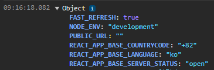

# React 기록하기

- [가상 돔(Virtual DOM)](#가상-돔virtual-dom)
- [JSX(JavaScript XML)](#jsxjavascript-xml)
- [useState](#usestate)
- [useRef](#useref)
  - [forwardRef()](#forwardref)
  - [useImperativeHandle](#useimperativehandle)
- [useEffect](#useeffect)
  - [의존성 배열에 상태 변수 없애기](#의존성-배열에-상태-변수-없애기)
  - [의존성 배열에 객체 변수 없애기](#의존성-배열에-객체-변수-없애기)
  - [의존성 배열에 함수 없애기](#의존성-배열에-함수-없애기)
- [useMemo vs useCallback](#usememo-vs-usecallback)
- [memo](#memo)
- [useContext](#usecontext)
- [useReducer](#usereducer)
- [StrictMode](#strictmode)
- [사용자 정의 훅 vs 일반 함수](#사용자-정의-훅-vs-일반-함수)
- [manifest.json](#manifestjson)
- [react에서 환경변수](#react에서-환경변수)
- [checked](#checked)
- [oninput vs onchange](#oninput-vs-onchange)
  - [사용자 입력 제한](#사용자-입력-제한)
- [빌드](#빌드)
- [제어 컴포넌트 vs 비제어 컴포넌트](#제어-컴포넌트-vs-비제어-컴포넌트)
- [value, checked, defaultValue, defaultChecked](#value-checked-defaultvalue-defaultchecked)
- [내가 생각하는 컴포넌트의 종류](#내가-생각하는-컴포넌트의-종류)
- [값을 반환하냐? 컴포넌트를 반환하냐?](#값을-반환하냐-컴포넌트를-반환하냐)
- [비동기 데이터가 포함된 컴포넌트](#비동기-데이터가-포함된-컴포넌트)

## 가상 돔(Virtual DOM)

리액트는 실제 돔을 기반으로 만들어진 가상 돔이 존재한다. 정의해놓은 상태 값이 변경되어 가상 돔의 변화가 일어나게 되면 실제 돔과 비교하여 변경된 부분만 수정한 후에 리렌더링이 이루어진다.


## JSX(JavaScript XML)

전통적인 웹은 HTML, CSS, JavaScript를 기반으로 구축됐었다. 하지만 웹이 발전하면서 로직이 콘텐츠를 결정하는 경우가 많아졌다. 그래서 HTML을 자바스크립트가 제어하는 형태가 탄생했다. 이것이 바로 React에서 렌더링 로직과 마크업이 같은 위치, 즉 컴포넌트에 함께 존재하는 이유다.

- JSX와 React는 별개의 개념이다. JSX는 구문 확장이고 React는 자바스크립트 라이브러리이다.
- JavaScript 표현식을 중괄호(`{}`)로 감싸서 삽입할 수도 있다. 이를 통해 보다 동적으로 마크업할 수 있다.
- 컴포넌트에서 여러 요소를 반환하려면 단일 부모 태그로 래핑하거나 Fragment(`<>`, `</>`)를 래핑해야 한다.
  - JSX는 HTML처럼 보이지만 내부적으로는 일반 JavaScript 객체로 변환된다. 함수에서 두 개의 객체를 배열로 래핑하지 않고는 반환할 수 없다
- JSX로 작성된 속성은 객체의 키가 된다. 그래서 속성은 모두 카멜 케이스로 작성해야 하고 대시를 포함하거나 `class`와 같은 예약어를 사용할 수 없다.
  - 역사적인 이유로 `aria-*` 및 `data-*` 속성은 HTML에서와 같이 대시를 사용하여 작성된다.

## useState

```ts
const [state, setState] = useState(initialState);
```

- 두 개의 값을 가진 배열을 반환한다.
  - 현재 상태 값(`state`)
  - 상태를 다른 값으로 업데이트하고 다시 렌더링을 트리거할 수 있는 `set` 함수
- `state`는 immutable하다
- `useState`의 인자로 값을 전달하면 해당 값을 초기 상태로 설정한다.
- `useState`의 인자로 함수를 전달하면 이 함수의 반환값을 초기 상태로 설정한다.
  - 초기화 함수는 순수해야 하고 인수를 받지 않아야 하며 무조건 값을 반환해야 한다.
- 초기 상태는 컴포넌트가 처음 렌더링되는 시점에만 설정되고, 이후에는 무시된다.
- 최상위 레벨 또는 자체 Hook에서만 호출할 수 있다. 루프나 조건 내부에서는 호출할 수 없다.

## useRef

```ts
const ref = useRef(initialValue);
```

- `current` 속성을 가진 객체(`ref`)를 반환한다.
- `ref` 객체는 mutable하다.
- `useRef`의 인자로 값을 전달하면 해당 값을 `current`의 값으로 설정한다.
- 초기 값은 컴포넌트가 처음 렌더링되는 시점에만 설정되고, 이후에는 무시된다.
- `ref` 객체는 변경돼어도 렌더링을 트리거하지 않는다.
  - `ref`는 일반 자바스크립트 객체이기 때문에 React는 해당 값의 변경 여부를 추적하지 못한다.
- `ref` 객체를 JSX 요소의 `ref` 속성으로 전달하면 요소가 렌더링됐을 때 `current`에 요소의 객체가 담긴다.
- 기본적으로 React는 가상 DOM을 이용해 실제 DOM을 추상화하고 관리하기 때문에 리액트의 메커니즘이 아닌 기존 바닐라 자바스크립트 메커니즘으로 실제 DOM을 수정하려고 할 경우 문제가 생길 수 있다. 그렇기 때문에 DOM 노드를 참조해서 기능을 생성할 때 스타일 수정, 포커스 관리, 스크롤 위치 수정과 같은 비파괴적인 작업은 상관없지만 `appendChild()`, `remove()`와 같은 파괴적인 작업은 예기치 못한 오류를 낼 수 있다.

```ts
function App() {
  const ref = useRef<HTMLButtonElement | null>(null);
  // 다중 Ref 설정 방법
  const refArray = [useRef<HTMLButtonElement | null>(null), useRef<HTMLButtonElement | null>(null), useRef<HTMLButtonElement | null>(null)];


  function handleClick() {
    if(ref.current != null) console.dir(ref.current);
  }

  return (
    // ref 설정 방법
    // <button ref={(element) => { ref.current = element }} onClick={handleClick}>
    // ref 설정 방법 축약 버전
    <button ref={ref} onClick={handleClick}>
        Button
      </button>
  );
}
```

### forwardRef()

부모 컴포넌트에서 사용자 정의 컴포넌트의 내부 요소를 참조하려는 경우 `forwardRef()` 메서드를 사용해야 한다.

```ts
const MyButton = forwardRef((props, ref) => {
  return (
    <button ref={ref} {...props}>
      Button
    </button>
  );
});

function App() {
  const ref = useRef(null);

  function handleClick() {
    console.dir(ref.current);
  }

  return (
    <MyButton ref={ref} onClick={handleClick}>
      Button
    </MyButton>
  );
}
```

### useImperativeHandle

`forwardRef()`로 감싸진 컴포넌트는 `ref` 객체가 요소와 연결되면 해당 요소를 컴포넌트 내부에서 조작을 할 수 없게 된다. `useImperativeHandle()`이라는 리액트에서 제공해주는 훅을 사용하면 컴포넌트 내부에서 요소의 연결된 `ref` 객체를 조작할 수 있고 `ref` 객체를 상위 컴포넌트에 내보낼 때 필요한 기능만 커스텀해서 보낼 수 있다.

```ts
// useImperativeHandle 사용 전
const FileInput = forwardRef(({ buttonProps, ...inputProps }, ref) => {
  return (
    <div>
      <input css={{ display: 'none' }} ref={ref} type='file' {...inputProps} />

      <Button onClick={(e) => /* input 요소를 클릭하게 하고싶다.. */} {...buttonProps}>
        <span className='material-icons'>file_upload</span>
      </Button>
    </div>
  );
});

// useImperativeHandle 사용 후
const FileInput = forwardRef(({ buttonProps, ...inputProps }, ref) => {
  const inputRef = useRef(null);

  useImperativeHandle(ref, () => inputRef.current);

  return (
    <div>
      <input css={{ display: 'none' }} ref={inputRef} type='file' {...inputProps} />

      <Button onClick={(e) => inputRef.current.click()} {...buttonProps}>
        <span className='material-icons'>file_upload</span>
      </Button>
    </div>
  );
});
```

## useEffect

```ts
useEffect(function setup () {
  // ...

  return function cleanup () {
    // ...
  }
}, dependencies?);
```

- 설정 함수는 선택적으로 정리 함수를 반환할 수도 있습니다. 컴포넌트가 DOM에 추가되면 React는 설정 함수를 실행합니다. 변경된 종속성으로 다시 렌더링할 때마다 React는 먼저 이전 값으로 정리 함수(제공한 경우)를 실행한 다음 새 값으로 설정 함수를 실행합니다. 컴포넌트가 DOM에서 제거된 후 React는 정리 함수를 실행합니다.

선택적 의존성: 설정 코드 내부에서 참조된 모든 반응형 값의 목록입니다. 반응형 값에는 프로퍼티, state, 컴포넌트 본문 안에 직접 선언된 모든 변수와 함수가 포함됩니다. 린터가 React용으로 구성된 경우, 모든 반응형 값이 종속성으로 올바르게 지정되었는지 확인합니다. 의존성 목록에는 일정한 수의 항목이 있어야 하며 [dep1, dep2, dep3]와 같이 인라인으로 작성해야 합니다. React는 Object.is 비교를 사용하여 각 종속성을 이전 값과 비교합니다. 이 인수를 생략하면 컴포넌트를 다시 렌더링할 때마다 Effect가 다시 실행됩니다. 의존성 배열을 전달할 때와 빈 배열을 전달할 때, 그리고 의존성을 전혀 전달하지 않을 때의 차이를 살펴보세요.

사용 효과는 Hook이므로 컴포넌트의 최상위 레벨 또는 자체 Hook에서만 호출할 수 있습니다. 루프나 조건 내부에서는 호출할 수 없습니다. 필요한 경우 새 컴포넌트를 추출하고 상태를 그 안으로 옮기세요.

외부 시스템과 동기화하려는 것이 아니라면 Effect가 필요하지 않을 것입니다.

Strict 모드가 켜져 있으면 React는 첫 번째 실제 설정 전에 개발 전용 설정+정리 사이클을 한 번 더 실행합니다. 이는 클린업 로직이 설정 로직을 "미러링"하고 설정이 수행 중인 모든 작업을 중지하거나 실행 취소하는지 확인하는 스트레스 테스트입니다. 문제가 발생하면 정리 기능을 구현하세요.

종속성 중 일부가 컴포넌트 내부에 정의된 객체나 함수인 경우 이펙트가 필요 이상으로 자주 다시 실행될 위험이 있습니다. 이 문제를 해결하려면 불필요한 객체 및 함수 종속성을 제거하세요. 또한 상태 업데이트와 비반응형 로직을 Effect 외부에서 추출할 수도 있습니다.

이펙트가 클릭과 같은 상호작용으로 인해 발생한 것이 아니라면, React는 일반적으로 브라우저가 이펙트를 실행하기 전에 업데이트된 화면을 먼저 그리도록 합니다. Effect가 시각적인 작업(예: 툴팁 위치 지정)을 하고 있는데 지연이 눈에 띄는 경우(예: 깜박임), useEffect를 useLayoutEffect로 바꾸세요.

클릭과 같은 상호작용으로 인해 이펙트가 발생하는 경우 브라우저가 업데이트된 화면을 그리기 전에 React가 이펙트를 실행할 수 있습니다. 이렇게 하면 이벤트 시스템에서 Effect의 결과를 관찰할 수 있습니다. 일반적으로 이것은 예상대로 작동합니다. 그러나 alert()와 같이 페인트 이후까지 작업을 연기해야 하는 경우 setTimeout을 사용할 수 있습니다. 자세한 내용은 reactwg/react-18/128을 참조하세요.

클릭과 같은 상호작용으로 인해 이펙트가 발생한 경우에도 React는 브라우저가 이펙트 내부의 상태 업데이트를 처리하기 전에 화면을 다시 칠하도록 허용할 수 있습니다. 일반적으로 이것은 예상대로 작동합니다. 하지만 브라우저가 화면을 다시 칠하지 못하도록 차단해야 하는 경우, useEffect를 useLayoutEffect로 대체해야 합니다.

효과는 클라이언트에서만 실행됩니다. 서버 렌더링 중에는 실행되지 않습니다.

- 모든 `useEffect`에는 설정 함수가 있고 정리 함수가 있을 수 있다. 컴포넌트가 마운트될 때(화면에 추가될 때) 설정 함수를 호출하고 컴포넌트가 마운트 해제될 때(화면에서 제거될 때) 정리 함수를 호출한다. 그 다음 마지막 렌더링 이후 종속성이 변경된 경우 React는 정리 함수를 호출한 후 설정 함수을 다시 호출한다.

`useEffect`는 화면이 한 번 렌더링된 이후에 동작한다.

의존성 배열이 없는 경우 `return`을 통한 정리 함수는 언마운트 시에만 동작한다

의존성 배열이 있는 경우 `return`을 통한 정리 함수는 렌더링 마다 동작한다

효과의 로직이 포함된 함수입니다. 설정 함수는 선택적으로 정리 함수를 반환할 수도 있습니다. 컴포넌트가 DOM에 추가되면 React는 설정 함수를 실행합니다. **변경된 종속성으로 다시 렌더링할 때마다 React는 먼저 이전 값으로 정리 함수(제공한 경우)를 실행한 다음 새 값으로 설정 함수를 실행합니다**. 컴포넌트가 DOM에서 제거된 후 React는 정리 함수를 실행합니다.

### 의존성 배열에 상태 변수 없애기

setCount 안에 prev 변수를 사용하기, 직접 컴포넌트 상위 단에 정의된 상태 변수 쓰지않기

setinterval

settimeout

### 의존성 배열에 객체 변수 없애기

useEffect 내부에 객체 선언하기

### 의존성 배열에 함수 없애기

useEffect 내부에 함수 선언하기

## useMemo vs useCallback

```js
const memo: number = useMemo(() => {
  return 1;
}, []);

const callback: () => number = useCallback(() => {
  return 1;
}, []);
```

## memo

컴포넌트가 소품에 따른 렌더링 방지

## useContext

## useReducer

## StrictMode

개발 환경의 `<StrictMode>`에서는 다음과 같은 동작이 활성화된다.

- 컴포넌트가 불완전한 렌더링으로 인한 버그를 찾기 위해 한 번 더 렌더링한다.

  - React는 모든 컴포넌트를 순수한 함수라고 가정한다. 즉, 컴포넌트는 동일한 입력(`props`, `state`, `context`)이 주어졌을 때 항상 동일한 JSX를 반환해야 한다.

    이 규칙을 위반하는 컴포넌트는 예측할 수 없는 동작을 하며 버그를 유발한다. 실수로 발생한 버그를 찾을 수 있도록 `<StrictMode>`는 일부 함수(순수해야 하는 함수만)를 두 번 호출합니다. 일부 함수는 다음과 같다.

    - 컴포넌트 함수 본문(최상위 로직만 포함하므로 이벤트 핸들러 내부의 코드는 포함되지 않음)

    - `useState`, `set` 함수에 전달한 함수, `useMemo` 또는 `useReducer`에 전달한 함수

    순수 함수는 매번 동일한 결과를 생성하므로 함수가 순수하면 두 번 실행해도 동작이 변경되지 않는다. 그러나 함수가 불순한 경우 두 번 실행하면 눈에 띄는 경향이 있으므로 버그를 조기에 발견하고 수정하는 데 도움이 됩니다.

- 컴포넌트가 정리 함수가 누락되어 발생한 버그를 찾기 위해 초기에 설정 함수 -> 정리 함수 -> 설정 함수 사이클을 실행한다.

- 더 이상 사용되지 않는 리액트 API를 찾아준다.

`<StrictMode>`로 래핑된 트리 내부에서는 `<StrictMode>`를 해제할 수 있는 방법이 없다. 이러면 모든 컴포넌트가 검사된다는 확신을 가질 수 있다. 앱을 작업하는 개발자 사이에 검사의 가치에 대해 의견이 달라 검사 범위를 축소해야할 경우, 트리에서 `<StrictMode>`를 아래로 이동시켜야 한다.

## 사용자 정의 훅 vs 일반 함수

사용자 훅은 로직을 재사용하기 위해서 리액트의 훅들을 이용해 개발자가 직접 작성하는 훅이다. 보통 `useState`, `useEffect`의 조합으로 구성되며 함수명 규칙은 앞에 `use`를 사용해야 한다.

일반 함수와의 차이점은 리액트에서 제공하는 훅을 사용할 수 있냐 없냐의 차이다.

## manifest.json

`manifest.json` 파일은 Progressive Web App(PWA)에서 사용되는 파일로, 해당 웹 앱의 메타데이터와 구성 요소를 정의하는 역할을 한다. PWA는 웹과 네이티브 앱의 장점을 결합한 형태이다.


CRA로 리액트 프로젝트 생성 시 `public` 폴더 아래에 해당 파일이 있는데 PWA를 지원하지 않으려면 삭제해도 된다. `index.html`의 관련 코드도 같이 삭제해야 한다.

## react에서 환경변수



CRA에 의해 `.env` 파일에 규칙을 가지고 작성된 환경변수는 빌드 타임에 `process.env`로 객체화되서 클라이언트에서 접근이 가능한 형태가 된다.

## checked

HTML 파일에서 체크박스나 라디오 인풋의 `checked` 속성은 초기값을 설정하는 속성이다. `checked` 속성은 `Boolean` 타입으로 HTML에서 `Boolean` 타입은 해당 속성을 단순히 명시하거나 명시하지 않는 방식으로 제어한다. 아래와 같이 문자열을 넣든 빈 문자열을 넣든 명시할 경우 `true` 값이 된다.

```html
<!-- checked === true -->
<input type="checkbox" checked />
<input type="checkbox" checked="" />
<input type="checkbox" checked="false" />
<!-- checked === false -->
<input type="checkbox" />
```

이와 달리, 리액트에서는 JSX 문법을 사용하므로 HTML 요소의 속성을 동적으로 제어할 수 있다. 그래서 상태(state) 변수와 바인딩되어 동적으로 체크 상태를 제어할 수 있다.

## oninput vs onchange

- `oninput`: 사용자가 입력을 생성하고 수정하는 매 순간 이벤트가 발생
- `onchange`: 사용자가 입력을 생성하고 수정한 후 포커스를 잃을 때 발생

리액트에서 `onchange`는 `oninput`과 동일한 방식으로 동작하며 기본 `onchange`의 동작은 지원하지 않는다. 이유는 불분명하고 설계상 이슈일 확률이 크다.

### 사용자 입력 제한

개발하다 보면 사용자 입력을 제한해야 하는 상황이 생긴다. 일반적으로 생각나는 방법은 입력 요소의 `disabled` 속성을 주는 방법 또는 해당 화면을 마스킹 처리해서 클릭이 일어나지 않도록 방지하는 것이다.

위 방법은 개발자 도구에서 `disabled` 값을 수정하거나 마스킹 스타일을 수정해서 클릭할 수 있는 상태로 변경이 가능하다. 이런 이유로 클라이언트에서는 데이터 무결성을 완벽히 체크하지 못하므로 서버에서 꼼꼼한 예외처리가 필요하다. 리액트에서는 가상 돔을 이용하므로 `disabled` 값이 상태 값에 의존하는 경우에는 입력 제한이 가능하다(?). 속성 값을 수정해도 상태 값이 변경되지 않아 리렌더링이 발생하지 않고 화면 상에서는 클릭 가능해보이지만 클릭해보면 이벤트가 발생하지 않는다.

인증된 사용자의 토큰이 필요한 API의 경우 추적도 가능하고 인증된 사용자가 위와 같은 편법을 쓸 확률을 낮기 떄문에 비교적 위험성이 적지만, 토큰이 필요없는 API나 중요한 정보가 오가는 API(가격, 사용자 정보, 결제 등)가 동작하는 입력 요소의 경우 보안적인 부분을 꼼꼼히 신경쓰는 것이 좋다.

## 빌드

웹브라우저에서 리액트 앱에 접속하면 아래와 같이 네트워크 요청이 이루어진다. 항상 `index.html`을 우선적으로 호출하고 파일에 연결된 정적 파일들을 호출한다.

index.html에는 난수가 붙지않음. 각 각에 정적 파일에는 난수값이 적혀져있고 매 빌드마다 바뀌기 때문에 빌드 후에 파일만 교체해주면 서버(정적 파일 서빙)를 다운시키지 않고 파일 변경이 가능하다

## 제어 컴포넌트 vs 비제어 컴포넌트

제어 컴포넌트와 비제어 컴포넌트는 `input` 요소의 상태 관리 방식을 의미한다.

제어 컴포넌트는 React의 상태값과 입력 필드값이 동기화되고 입력 필드값이 변경됐을 때, 상태값을 조작하고 리렌더링을 발생시키는 핸들러가 동작하는 방식으로 제어된다. 상태를 활용하므로 React가 값을 추적하면서 유효성 검사, 값을 수정 또는 가공하는 등의 추가적인 로직을 구현하기에 용이하다.

비제어 컴포넌트는 React의 상태를 사용하지 않고 입력 필드값을 직접 처리한다. 바닐라 자바스크립트에 동작과 동일하다고 보면 된다. React는 입력 필드의 값을 추적하지 않고, 직접 DOM에서 값을 가져오거나 업데이트합니다. `ref`를 사용하여 입력 필드의 DOM 요소에 접근하고, 이벤트 핸들러를 이용해 값의 변경을 감지한다. 값을 추적하거나 수정하는 데 제한적이며, 유효성 검사나 추가적인 로직을 구현하기에는 제한적이다.

`props`로 `value`와 `onChange`를 받는다면 `useEffect`를 이용해 값 업데이트도 필요하다.

```js
// Controlled Component
function ControlledComponentExample() {
  const [value, setValue] = useState('');

  const handleChange = (event) => {
    setValue(event.target.value);
  };

  return <input type='text' value={value} onChange={handleChange} />;
}

// Uncontrolled Component
function UncontrolledComponentExample() {
  const inputRef = useRef(null);

  const handleSubmit = () => {
    const value = inputRef.current.value;
    // 값 처리 로직
  };

  return (
    <div>
      <input type='text' ref={inputRef} />
      <button onClick={handleSubmit}>Submit</button>
    </div>
  );
}
```

## value, checked, defaultValue, defaultChecked

이러한 소품 중 하나를 전달하여 입력을 제어할 수 있습니다:

checked: 부울입니다. 체크박스 입력 또는 라디오 버튼의 경우 선택 여부를 제어합니다.
value: 문자열입니다. 텍스트 입력의 경우 텍스트를 제어합니다. (라디오 버튼의 경우 해당 양식 데이터를 지정합니다.)
둘 중 하나를 전달할 때는 전달된 값을 업데이트하는 onChange 핸들러도 전달해야 합니다.

이러한 <입력> 프로퍼티는 제어되지 않는 입력에만 해당됩니다:

defaultChecked: 부울입니다. 유형="체크박스" 및 유형="라디오" 입력의 초기값을 지정합니다.
defaultValue: 문자열입니다. 텍스트 입력의 초기값을 지정합니다.

## 내가 생각하는 컴포넌트의 종류

MUI 라이브러리와 같이 `variant`와 여러가지 속성을 통해 디자인의 변화만을 주는 컴포넌트를 디자인 컴포넌트라고 나는 정의했다. 디자인 컴포넌트는 매우 재사용성이 높다. 하지만 서버의 요청을 보내기 위해 일반적인 입력이 아닌 인풋 컴포넌트나 비동기 데이터와 연동되어 데이터를 출력하는 컴포넌트는 재사용성이 떨어진다.

그래서 나는 재사용성이 높은 디자인 컴포넌트와 해당 디자인 컴포넌트들을 사용해 단일 책임 원칙을 따르는 데이터 컴포넌트 두가지의 컴포넌트로 구성된다고 생각한다. 비동기 데이터 컴포넌트의 경우 비동기 데이터의 상태까지 같이 받아서 해당 데이터의 상태에 따라 표현하는 UI를 같이 작성하는 방향으로 생각하자

도메인, 권한 등등 분기되는 로직이 최대한 들어가지 않게 작성하도록 하며, 분기가 필요한 경우 새로운 파일에 작성하는 것이 옳다고 생각한다.

## 값을 반환하냐? 컴포넌트를 반환하냐?

만약 어떠한 값에 따라 색깔이 변경되는 컴포넌트가 있다고 하자. 처음 든 생각은 컴포넌트를 구성하는 요소에 필요한 데이터와 동적으로 변경되는 색깔 값을 객체 배열로 생성하고 해당 객체를 `map()`으로 요소와 함께 뿌려주려고 생각했다. 하지만 단순히 색깔만 고려하는 게 아니고 요소의 속성이나 요소 값이 바뀐다고 생각하면 객체 값의 재정의가 필요하고 통일성도 떨어진다. 그래서 위와 같은 상황에서는 요소 값 또는 컴포넌트 값을 리턴하는 것이 훨씬 낫다.

만약 스타일 변경 없이 단순히 입력에 따라 출력 데이터가 바뀌는 경우에는 값을 반환하는 것이 좋다.

<!-- todo: 내용 보완 필요 -->

## 비동기 데이터가 포함된 컴포넌트

비동기 데이터의 로딩 상태를 고려해서 작성해야한다.

페이지네이션 작성 시 셀렉트 리스트 데이터가 다 오지 않았는데 값을 선택하려다 보니 에러가 발생했음

데이터가 로딩된 이후에 동작되어야함.
