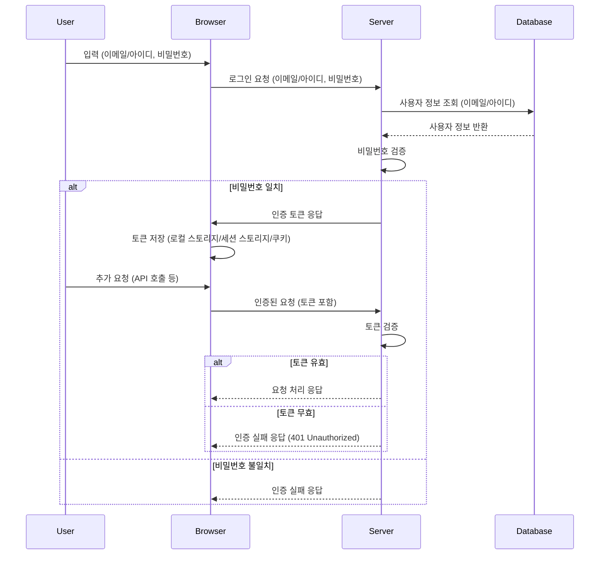

# 인증과 보안

- [인증과 보안](#인증과-보안)
  - [브라우저 저장소](#브라우저-저장소)
    - [보충 설명](#보충-설명)
    - [쿠키 옵션 설명](#쿠키-옵션-설명)
      - [`SameSite` 옵션 값 설명](#samesite-옵션-값-설명)
  - [JWT](#jwt)
    - [JWT 토큰이란?](#jwt-토큰이란)
    - [JWT 토큰의 구조](#jwt-토큰의-구조)
    - [서명 알고리즘](#서명-알고리즘)
  - [현대 웹 인증 과정](#현대-웹-인증-과정)
  - [XSS](#xss)
  - [CSRF](#csrf)

## 브라우저 저장소

브라우저 저장소에 저장된 데이터는 브라우저 메모리에 저장된 데이터가 아니기에, 새로고침 시에도 데이터가 남아있다.

| 특징                 | 로컬 스토리지 (Local Storage)   | 세션 스토리지 (Session Storage)      | 쿠키 (Cookie)                |
| -------------------- | ------------------------------- | ------------------------------------ | ---------------------------- |
| **데이터 저장 기간** | 영구적 (삭제 시까지)            | 세션 종료 시 (브라우저 탭 닫기)      | 설정된 만료 시간까지         |
| **저장 용량**        | 약 5~10MB                       | 약 5~10MB                            | 약 4KB                       |
| **데이터 접근**      | 클라이언트 측 (자바스크립트)    | 클라이언트 측 (자바스크립트)         | 클라이언트 및 서버 측        |
| **데이터 전송**      | 전송되지 않음                   | 전송되지 않음                        | 매 요청마다 서버로 전송 가능 |
| **보안**             | XSS에 취약                      | XSS에 취약                           | XSS 및 CSRF에 취약           |
| **범위**             | 도메인 전체                     | 도메인 및 브라우저 탭                | 도메인 및 경로               |
| **사용 예**          | 사용자 설정, 장기적인 상태 저장 | 일시적인 상태 저장, 세션 기반 데이터 | 사용자 인증, 세션 관리       |

### 보충 설명

1. **로컬 스토리지 (Local Storage)**

   - **데이터 접근**: 클라이언트 측에서만 접근 가능하며, HTTP 헤더를 통해 자동으로 서버에 전송되지 않는다.
   - **범위**: 도메인 전체에서 접근 가능하다.
   - **사용 예**: 사용자 설정, 장기적인 상태 저장 (예: 테마 설정, 사용자 선호도 등).

2. **세션 스토리지 (Session Storage)**

   - **데이터 접근**: 클라이언트 측에서만 접근 가능하며, HTTP 헤더를 통해 자동으로 서버에 전송되지 않는다.
   - **범위**: 도메인 및 현재 브라우저 탭에서 접근 가능하다.
   - **사용 예**: 일시적인 상태 저장, 세션 기반 데이터 (예: 일시적인 폼 데이터, 일시적인 애플리케이션 상태).

3. **쿠키 (Cookie)**
   - **데이터 접근**: 클라이언트 및 서버 측에서 접근 가능하며, HTTP 요청 시 서버로 자동 전송될 수 있다.
   - **범위**: 도메인 및 경로에 따라 접근 범위가 설정된다.
   - **사용 예**: 사용자 인증, 세션 관리 (예: 로그인 세션, 사용자 식별 정보).

### 쿠키 옵션 설명

| 옵션       | 설명                                       | 역할 및 특징                                                                                                                                   |
| ---------- | ------------------------------------------ | ---------------------------------------------------------------------------------------------------------------------------------------------- |
| `name`     | 쿠키의 이름                                | 쿠키를 식별하는 데 사용된다. 동일한 도메인 내에서 고유해야 한다.                                                                               |
| `value`    | 쿠키의 값                                  | 쿠키에 저장되는 데이터입니다. 보안에 민감한 정보는 포함하지 않는 것이 좋다.                                                                    |
| `domain`   | 쿠키를 사용할 수 있는 도메인               | 특정 도메인 또는 하위 도메인에서만 쿠키를 사용할 수 있게 제한한다. 예: `.example.com` 설정 시 모든 하위 도메인에서도 쿠키가 사용된다.          |
| `path`     | 쿠키를 사용할 수 있는 경로                 | 특정 경로에서만 쿠키를 사용할 수 있게 제한한다. 예: `/account` 설정 시 `/account`와 그 하위 경로에서만 쿠키가 사용된다.                        |
| `expires`  | 쿠키의 만료 날짜                           | 쿠키의 유효 기간을 설정한다. 날짜를 지정하지 않으면 세션 쿠키가 되며, 브라우저를 닫으면 삭제된다. 예: `expires=Wed, 21 Oct 2021 07:28:00 GMT`. |
| `max-age`  | 쿠키의 수명 (초 단위)                      | `expires` 대신 사용할 수 있으며, 초 단위로 유효 기간을 설정한다. 예: `max-age=3600` 설정 시 1시간 후에 쿠키가 만료된다.                        |
| `secure`   | 쿠키가 HTTPS 연결에서만 전송되도록 설정    | 이 옵션을 설정하면 쿠키가 HTTPS 연결에서만 전송된다. 이를 통해 네트워크 상의 스니핑 공격을 방지할 수 있다.                                     |
| `HttpOnly` | JavaScript에서 쿠키 접근을 방지            | 이 옵션을 설정하면 JavaScript에서 쿠키에 접근할 수 없으므로 XSS 공격에 대한 보호를 강화한다.                                                   |
| `SameSite` | 쿠키의 크로스 사이트 요청에 대한 제한 설정 | `Strict`, `Lax`, `None` 중 하나를 선택할 수 있으며, 이를 통해 CSRF 공격을 방지할 수 있다.                                                      |

#### `SameSite` 옵션 값 설명

- `Strict`: 쿠키가 동일 사이트 요청에서만 전송된다. 타 사이트에서의 모든 요청에는 쿠키가 전송되지 않는다.
- `Lax`: 쿠키가 동일 사이트 요청과 일부 타 사이트 요청(GET 메서드 등 안전한 방법)에서만 전송된다.
- `None`: 모든 크로스 사이트 요청에서 쿠키가 전송된다. 이 옵션을 사용할 경우 `Secure` 옵션도 함께 설정해야 한다.

## JWT

### JWT 토큰이란?

JWT(JSON Web Token)는 JSON 객체를 사용하여 정보를 안전하게 전달하기 위한 컴팩트하고 자가 포함된 방식이다.

### JWT 토큰의 구조

1. **헤더 (Header)**:
   헤더는 토큰 타입(JWT)과 사용된 서명 알고리즘을 정의합니다. 보통 두 부분으로 구성된 JSON 객체입니다.

   ```json
   {
     "alg": "HS256",
     "typ": "JWT"
   }
   ```

2. **페이로드 (Payload)**:
   페이로드에는 클레임(Claims)이라는 정보가 포함됩니다. 클레임은 엔티티(주로 사용자)에 대한 정보와 추가 메타데이터를 담고 있습니다. 클레임에는 등록된 클레임(Registered claims), 공개 클레임(Public claims), 비공개 클레임(Private claims)이 있습니다.

   ```json
   {
     "sub": "1234567890",
     "name": "John Doe",
     "iat": 1516239022
   }
   ```

3. **서명 (Signature)**:
   서명은 토큰이 변조되지 않았음을 보장합니다. 생성 과정은 다음과 같습니다:

   1. 헤더와 페이로드를 Base64Url로 인코딩합니다.
   2. 인코딩된 헤더와 페이로드를 결합하여 점(.)으로 구분합니다.
   3. 이 결합된 문자열을 지정된 알고리즘과 비밀 키를 사용해 서명합니다.

   ```text
   HMACSHA256(
     base64UrlEncode(header) + "." +
     base64UrlEncode(payload),
     secret
   )
   ```

### 서명 알고리즘

JWT에서 사용되는 서명 알고리즘은 토큰의 무결성을 보장하기 위해 중요합니다. 주요 알고리즘은 다음과 같습니다:

1. **HMAC (Hash-based Message Authentication Code)**:

   - **HS256, HS384, HS512**: SHA-256, SHA-384, SHA-512 해시 함수를 사용하는 HMAC 알고리즘입니다. 대칭 키 암호화 방식을 사용하여 서명과 검증에 동일한 비밀 키를 사용합니다. 보안이 단순하고 빠르지만, 키가 노출되면 토큰을 위조할 수 있는 위험이 있습니다.

2. **RSA (Rivest-Shamir-Adleman)**:

   - **RS256, RS384, RS512**: SHA-256, SHA-384, SHA-512 해시 함수와 RSA 알고리즘을 사용합니다. 비대칭 키 암호화 방식을 사용하며, 서명과 검증에 각각 다른 키(프라이빗 키와 퍼블릭 키)를 사용합니다. 퍼블릭 키를 공유할 수 있어 검증이 쉽고 안전합니다.

3. **ECDSA (Elliptic Curve Digital Signature Algorithm)**:
   - **ES256, ES384, ES512**: SHA-256, SHA-384, SHA-512 해시 함수와 ECDSA 알고리즘을 사용합니다. RSA와 마찬가지로 비대칭 키 암호화 방식을 사용하지만, 더 작은 키 크기로 비슷한 수준의 보안을 제공하여 성능이 더 우수합니다.

## 현대 웹 인증 과정



보안적인 측면에서는, 개인정보 같은 데이터는 인증된 사용자에 한해서는 브라우저에 존재해도 된다고 생각한다.

웹 스토리지, 쿠키는 모두 인증된 사용자에 한해서 데이터가 저장된다는 생각을 기반으로 설계된 놈들이기에 암호화 기능이 없다.

그러므로 해당 스토리지들에는 인증이 끝난 사용자에 한해서는 데이터가 저장되서는 안된다.

session storage를 이용하는 것이 권장된다. 브라우저가 종료되면 데이터가 휘발되기 떄문에

자동 로그인 같은 경우 사용자의 동의를 받고 데이터가 노출될 수 있음을 알려야 한다.

자동 로그인 트렌드는 본인이 신뢰할 수 있는 기기인지를 등록하여 사용하게 된다.

ui 제어로 보안 불가능 개발자 도구에서 얼마든지 뚫을 수 있음, disabled -> enabled

권한

동시 접속 제한

액세스 토큰

리프레시 토큰

토큰 만료 시 리다이렉트

미들웨어를 이용한 라우팅 가드

axios 인터셉터를 이용한 인증 만료된 토큰 처리

로그인 시 라우팅

로그아웃 토큰 제거

## XSS

## CSRF
