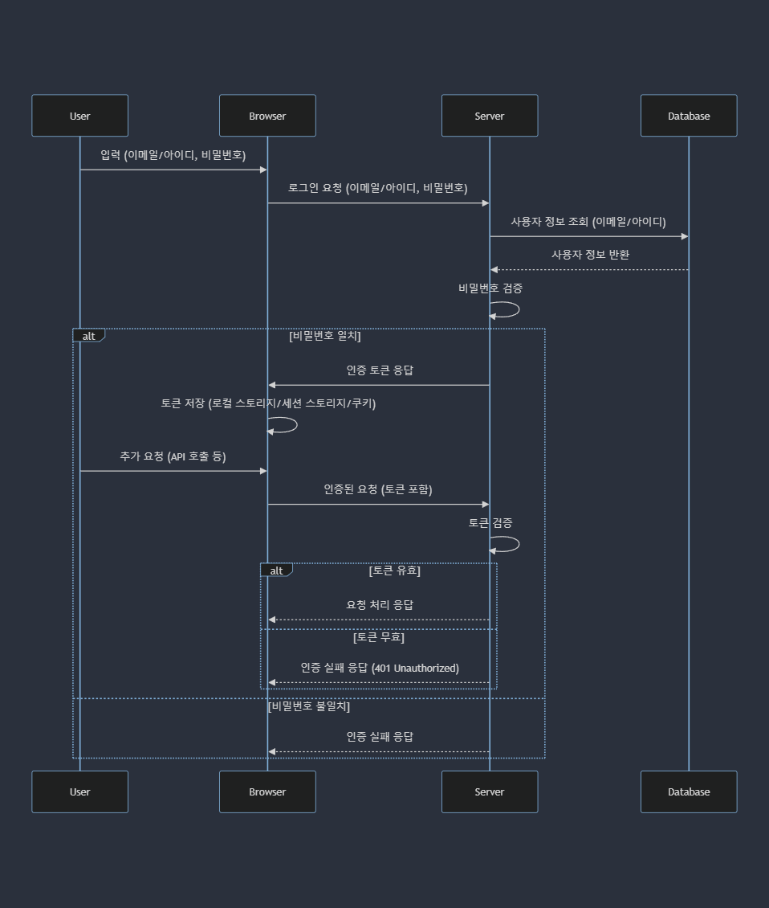

# 인증과 보안

- [브라우저 저장소](#브라우저-저장소)
  - [보충 설명](#보충-설명)
  - [쿠키 옵션 설명](#쿠키-옵션-설명)
    - [`SameSite` 옵션 값 설명](#samesite-옵션-값-설명)
- [JWT](#jwt)
  - [구조](#구조)
  - [대칭키 방식의 JWT 생성 및 검증](#대칭키-방식의-jwt-생성-및-검증)
  - [비대칭키 방식의 JWT 생성 및 검증](#비대칭키-방식의-jwt-생성-및-검증)
  - [1. 액세스 토큰 (Access Token)](#1-액세스-토큰-access-token)
  - [2. 리프레시 토큰 (Refresh Token)](#2-리프레시-토큰-refresh-token)
  - [요약](#요약)
- [모던 웹 인증 과정](#모던-웹-인증-과정)
- [XSS](#xss)
- [CSRF](#csrf)

## 브라우저 저장소

브라우저 저장소에 저장된 데이터는 브라우저 메모리에 저장된 데이터가 아니기에, 새로고침 시에도 데이터가 남아있다.

| 특징             | 로컬 스토리지 (Local Storage)   | 세션 스토리지 (Session Storage)      | 쿠키 (Cookie)                |
| ---------------- | ------------------------------- | ------------------------------------ | ---------------------------- |
| 데이터 저장 기간 | 영구적 (삭제 시까지)            | 세션 종료 시 (브라우저 탭 닫기)      | 설정된 만료 시간까지         |
| 저장 용량        | 약 5~10MB                       | 약 5~10MB                            | 약 4KB                       |
| 데이터 접근      | 클라이언트 측 (자바스크립트)    | 클라이언트 측 (자바스크립트)         | 클라이언트 및 서버 측        |
| 데이터 전송      | 전송되지 않음                   | 전송되지 않음                        | 매 요청마다 서버로 전송 가능 |
| 보안             | XSS에 취약                      | XSS에 취약                           | XSS 및 CSRF에 취약           |
| 범위             | 도메인 전체                     | 도메인 및 브라우저 탭                | 도메인 및 경로               |
| 사용 예          | 사용자 설정, 장기적인 상태 저장 | 일시적인 상태 저장, 세션 기반 데이터 | 사용자 인증, 세션 관리       |

### 보충 설명

1. 로컬 스토리지 (Local Storage)

   - 공유 범위: 동일한 도메인 내의 모든 탭과 창에서 데이터를 공유할 수 있다.
   - 브라우저 간 공유: 다른 브라우저 간에는 공유되지 않는다.
   - 사용 예: 사용자 설정, 장기적인 상태 저장 (예: 테마 설정, 사용자 선호도 등).

2. 세션 스토리지 (Session Storage)

   - 공유 범위: 같은 브라우저의 동일한 도메인 내의 단일 탭 또는 창에서만 데이터를 공유할 수 있다.
   - 다른 탭 간 공유: 동일한 도메인이라도 다른 탭이나 창 간에는 공유되지 않는다.
   - 브라우저 간 공유: 다른 브라우저 간에도 공유되지 않는다.
   - 사용 예: 일시적인 상태 저장, 세션 기반 데이터 (예: 일시적인 폼 데이터, 일시적인 애플리케이션 상태).

3. 쿠키 (Cookie)

   - 공유 범위: 기본적으로 동일한 도메인 내의 모든 탭과 창에서 데이터를 공유할 수 있다.
   - 도메인 제어: 쿠키의 `Domain` 속성을 설정하여 서브 도메인 간에도 데이터를 공유할 수 있다. 예를 들어, `example.com`에서 설정한 쿠키를 `sub.example.com`에서도 접근 가능하게 할 수 있다.
   - 브라우저 간 공유: 브라우저 간에는 공유되지 않는다.
   - 사용 예: 사용자 인증, 세션 관리 (예: 로그인 세션, 사용자 식별 정보).

### 쿠키 옵션 설명

| 옵션       | 설명                                       | 역할 및 특징                                                                                                                                   |
| ---------- | ------------------------------------------ | ---------------------------------------------------------------------------------------------------------------------------------------------- |
| `name`     | 쿠키의 이름                                | 쿠키를 식별하는 데 사용된다. 동일한 도메인 내에서 고유해야 한다.                                                                               |
| `value`    | 쿠키의 값                                  | 쿠키에 저장되는 데이터입니다. 보안에 민감한 정보는 포함하지 않는 것이 좋다.                                                                    |
| `domain`   | 쿠키를 사용할 수 있는 도메인               | 특정 도메인 또는 하위 도메인에서만 쿠키를 사용할 수 있게 제한한다. 예: `.example.com` 설정 시 모든 하위 도메인에서도 쿠키가 사용된다.          |
| `path`     | 쿠키를 사용할 수 있는 경로                 | 특정 경로에서만 쿠키를 사용할 수 있게 제한한다. 예: `/account` 설정 시 `/account`와 그 하위 경로에서만 쿠키가 사용된다.                        |
| `expires`  | 쿠키의 만료 날짜                           | 쿠키의 유효 기간을 설정한다. 날짜를 지정하지 않으면 세션 쿠키가 되며, 브라우저를 닫으면 삭제된다. 예: `expires=Wed, 21 Oct 2021 07:28:00 GMT`. |
| `max-age`  | 쿠키의 수명 (초 단위)                      | `expires` 대신 사용할 수 있으며, 초 단위로 유효 기간을 설정한다. 예: `max-age=3600` 설정 시 1시간 후에 쿠키가 만료된다.                        |
| `secure`   | 쿠키가 HTTPS 연결에서만 전송되도록 설정    | 이 옵션을 설정하면 쿠키가 HTTPS 연결에서만 전송된다. 이를 통해 네트워크 상의 스니핑 공격을 방지할 수 있다.                                     |
| `HttpOnly` | JavaScript에서 쿠키 접근을 방지            | 이 옵션을 설정하면 JavaScript에서 쿠키에 접근할 수 없으므로 XSS 공격에 대한 보호를 강화한다.                                                   |
| `SameSite` | 쿠키의 크로스 사이트 요청에 대한 제한 설정 | `Strict`, `Lax`, `None` 중 하나를 선택할 수 있으며, 이를 통해 CSRF 공격을 방지할 수 있다.                                                      |

#### `SameSite` 옵션 값 설명

- `Strict`: 쿠키가 동일 사이트 요청에서만 전송된다. 타 사이트에서의 모든 요청에는 쿠키가 전송되지 않는다.
- `Lax`: 쿠키가 동일 사이트 요청과 일부 타 사이트 요청(GET 메서드 등 안전한 방법)에서만 전송된다.
- `None`: 모든 크로스 사이트 요청에서 쿠키가 전송된다. 이 옵션을 사용할 경우 `Secure` 옵션도 함께 설정해야 한다.

## JWT

JWT는 JSON Web Token의 약자로, JSON 객체를 안전하게 전송하기 위한 웹 표준이다. 주로 인증 및 정보 교환에 사용된다.

JWT는 그 자체로 정보를 안전하게 전송할 수 있는 방법이지만, 항상 HTTPS를 사용하여 전송하는 것이 중요하다. JWT를 사용함으로써 인증 메커니즘이 간소화되고, 확장성이 높아지는 장점을 가질 수 있다.

### 구조

1. header:

   ```json
   {
     "alg": "HS256",
     "typ": "JWT"
   }
   ```

   - 토큰 유형과 해싱 알고리즘 정보를 포함한다.

2. payload:

   ```json
   {
     "sub": "1234567890",
     "name": "John Doe",
     "iat": 1516239022
   }
   ```

   - 토큰에 담길 실제 데이터를 포함한다. 일반적으로 사용자의 정보나 만료 시간 등이 들어간다.

3. signature:

   ```ts
   HMACSHA256(base64UrlEncode(header) + '.' + base64UrlEncode(payload), secret);
   ```

   - 토큰의 무결성을 검증하기 위해 사용된다. 헤더와 페이로드를 합친 후 비밀 키로 서명한다.

### 대칭키 방식의 JWT 생성 및 검증

```ts
const crypto = require('crypto');

// Base64 URL 인코딩 함수
function base64urlEncode(str) {
  return Buffer.from(str).toString('base64').replace(/=/g, '').replace(/\+/g, '-').replace(/\//g, '_');
}

// Base64 URL 디코딩 함수
function base64urlDecode(str) {
  str = str.replace(/-/g, '+').replace(/_/g, '/');
  return Buffer.from(str, 'base64').toString('utf8');
}

// HMAC-SHA256 해싱 함수
function hmacSHA256(data, secret) {
  return crypto.createHmac('sha256', secret).update(data).digest('base64url');
}

// JWT 생성 함수
function generateToken(payload, secret, expiresIn = '1h') {
  const header = {
    alg: 'HS256',
    typ: 'JWT',
  };

  const iat = Math.floor(Date.now() / 1000);
  let exp = iat;

  // 만료 시간 계산
  if (expiresIn.endsWith('h')) {
    exp += parseInt(expiresIn) * 60 * 60;
  } else if (expiresIn.endsWith('m')) {
    exp += parseInt(expiresIn) * 60;
  } else if (expiresIn.endsWith('s')) {
    exp += parseInt(expiresIn);
  }

  const extendedPayload = {
    ...payload,
    iat,
    exp,
  };

  const encodedHeader = base64urlEncode(JSON.stringify(header));
  const encodedPayload = base64urlEncode(JSON.stringify(extendedPayload));
  const signature = hmacSHA256(`${encodedHeader}.${encodedPayload}`, secret);

  return `${encodedHeader}.${encodedPayload}.${signature}`;
}

// JWT 검증 함수
function verifyToken(token, secret) {
  const [encodedHeader, encodedPayload, signature] = token.split('.');

  const data = `${encodedHeader}.${encodedPayload}`;
  const validSignature = hmacSHA256(data, secret);

  if (signature !== validSignature) {
    return null;
  }

  const payload = JSON.parse(base64urlDecode(encodedPayload));
  const currentTime = Math.floor(Date.now() / 1000);

  if (currentTime > payload.exp) {
    return null;
  }

  return payload;
}

// 예제 데이터
const secretKey = 'your-256-bit-secret';
const payload = {
  userId: 123,
  username: 'exampleUser',
};

// 토큰 생성
const token = generateToken(payload, secretKey);
console.log('Generated Token:', token);

// 토큰 검증
const decoded = verifyToken(token, secretKey);
if (decoded) {
  console.log('Decoded Payload:', decoded);
} else {
  console.log('Invalid or expired token');
}
```

### 비대칭키 방식의 JWT 생성 및 검증

```ts
const crypto = require('crypto');

// Base64 URL 인코딩 함수
function base64urlEncode(str) {
  return Buffer.from(str).toString('base64').replace(/=/g, '').replace(/\+/g, '-').replace(/\//g, '_');
}

// Base64 URL 디코딩 함수
function base64urlDecode(str) {
  str = str.replace(/-/g, '+').replace(/_/g, '/');
  return Buffer.from(str, 'base64').toString('utf8');
}

// RSA-SHA256 서명 생성 함수
function sign(data, privateKey) {
  const sign = crypto.createSign('RSA-SHA256');
  sign.update(data);
  sign.end();
  return sign.sign(privateKey, 'base64').replace(/=/g, '').replace(/\+/g, '-').replace(/\//g, '_');
}

// RSA-SHA256 서명 검증 함수
function verify(data, signature, publicKey) {
  const verify = crypto.createVerify('RSA-SHA256');
  verify.update(data);
  verify.end();
  return verify.verify(publicKey, signature.replace(/-/g, '+').replace(/_/g, '/'), 'base64');
}

// JWT 생성 함수
function generateToken(payload, privateKey, expiresIn = '1h') {
  const header = {
    alg: 'RS256',
    typ: 'JWT',
  };

  const iat = Math.floor(Date.now() / 1000);
  let exp = iat;

  // 만료 시간 계산
  if (expiresIn.endsWith('h')) {
    exp += parseInt(expiresIn) * 60 * 60;
  } else if (expiresIn.endsWith('m')) {
    exp += parseInt(expiresIn) * 60;
  } else if (expiresIn.endsWith('s')) {
    exp += parseInt(expiresIn);
  }

  const extendedPayload = {
    ...payload,
    iat,
    exp,
  };

  const encodedHeader = base64urlEncode(JSON.stringify(header));
  const encodedPayload = base64urlEncode(JSON.stringify(extendedPayload));
  const signature = sign(`${encodedHeader}.${encodedPayload}`, privateKey);

  return `${encodedHeader}.${encodedPayload}.${signature}`;
}

// JWT 검증 함수
function verifyToken(token, publicKey) {
  const [encodedHeader, encodedPayload, signature] = token.split('.');

  const data = `${encodedHeader}.${encodedPayload}`;

  if (!verify(data, signature, publicKey)) {
    return null;
  }

  const payload = JSON.parse(base64urlDecode(encodedPayload));
  const currentTime = Math.floor(Date.now() / 1000);

  if (currentTime > payload.exp) {
    return null;
  }

  return payload;
}

// RSA 키 생성
const { publicKey, privateKey } = crypto.generateKeyPairSync('rsa', {
  modulusLength: 2048,
});

// 예제 데이터
const payload = {
  userId: 123,
  username: 'exampleUser',
};

// 토큰 생성
const token = generateToken(payload, privateKey);
console.log('Generated Token:', token);

// 토큰 검증
const decoded = verifyToken(token, publicKey);
if (decoded) {
  console.log('Decoded Payload:', decoded);
} else {
  console.log('Invalid or expired token');
}
```

JWT 인증 방식에서 **액세스 토큰**과 **리프레시 토큰**은 보안을 강화하고 사용자 세션을 관리하기 위한 두 가지 중요한 요소입니다. 이들 각각의 역할과 보안 측면을 설명드리겠습니다.

### 1. 액세스 토큰 (Access Token)

**역할**:

- 액세스 토큰은 사용자 인증 후 서버로부터 발급받는 JWT로, 클라이언트가 서버의 보호된 자원에 접근할 때 사용됩니다.
- 주로 API 호출 시 인증을 위해 사용되며, HTTP 요청의 헤더나 쿼리 파라미터로 전달됩니다.

**특징**:

- **짧은 유효 기간**: 액세스 토큰은 일반적으로 짧은 유효 기간을 가지며, 이는 만료되었을 때 보안 위험을 줄이기 위함입니다.
- **JWT 구조**: 액세스 토큰은 서명된 JWT로, 클라이언트와 서버 간의 신뢰를 보장합니다. 이 토큰에는 사용자 정보와 권한 정보가 포함됩니다.

**보안**:

- 액세스 토큰의 유효 기간이 짧기 때문에, 탈취된 경우에도 피해를 최소화할 수 있습니다.
- HTTPS를 사용하여 암호화된 채널을 통해 전송함으로써, 네트워크에서의 도청을 방지할 수 있습니다.

### 2. 리프레시 토큰 (Refresh Token)

**역할**:

- 리프레시 토큰은 액세스 토큰의 유효 기간이 만료되었을 때 새로운 액세스 토큰을 발급받기 위해 사용됩니다.
- 서버에 요청을 보내 액세스 토큰을 갱신할 수 있으며, 클라이언트 측에서 안전하게 보관해야 합니다.

**특징**:

- **긴 유효 기간**: 리프레시 토큰은 액세스 토큰보다 긴 유효 기간을 가지며, 사용자가 로그인 상태를 유지할 수 있도록 도와줍니다.
- **서버 측 검증**: 서버는 리프레시 토큰을 검증하여 새로운 액세스 토큰을 발급합니다. 리프레시 토큰이 만료되면 사용자는 다시 로그인을 해야 합니다.

**보안**:

- 리프레시 토큰이 클라이언트 측에 저장되며, 만약 이 토큰이 탈취되면 새로운 액세스 토큰을 발급받을 수 있으므로, 매우 주의가 필요합니다.
- 일반적으로 리프레시 토큰은 액세스 토큰보다 더 안전하게 저장되어야 하며, 가능하면 HTTP 쿠키의 `HttpOnly` 속성을 사용하여 클라이언트 스크립트가 접근하지 못하도록 해야 합니다.
- HTTPS를 사용하여 리프레시 토큰의 전송을 암호화하고, 리프레시 토큰의 유효 기간을 정기적으로 만료시키며, 토큰 탈취 방지를 위한 추가적인 보안 조치를 적용할 수 있습니다.

### 요약

- **액세스 토큰**은 사용자 인증 후 클라이언트가 서버의 자원에 접근할 때 사용되며, 짧은 유효 기간을 가지고 빠르게 만료됩니다.
- **리프레시 토큰**은 액세스 토큰이 만료되었을 때 새로운 액세스 토큰을 발급받기 위해 사용되며, 긴 유효 기간을 가지고 보안상 더 철저한 관리가 필요합니다.

이 두 가지 토큰을 적절히 활용하면, 보안을 강화하고 사용자 경험을 개선할 수 있습니다.

리프레시 토큰이 고정 시간을 가진 경우,
리프레시 토큰이 액세스 토큰 업데이트될 때마다 같이 업데이트되는 경우,

맞습니다. JWT( JSON Web Token) 인증 방식과 세션 저장 방식은 인증 정보를 저장하고 관리하는 방식에서 큰 차이를 보입니다.

**JWT 인증 방식**:

1. **클라이언트 측 저장**: JWT는 클라이언트 측에 저장됩니다. 일반적으로 브라우저의 로컬 스토리지(localStorage)나 세션 스토리지(sessionStorage), 또는 쿠키에 저장합니다.
2. **토큰 전송**: 클라이언트가 서버에 요청을 보낼 때, JWT를 HTTP 헤더(주로 `Authorization` 헤더)나 쿠키에 포함하여 전송합니다.
3. **서버 측 검증**: 서버는 JWT를 검증하여 사용자의 인증 상태를 확인합니다. JWT에는 암호화된 서명이 포함되어 있어 토큰의 무결성을 검증할 수 있습니다.
4. **상태 비저장**: 서버는 클라이언트의 상태를 저장하지 않습니다. 즉, 서버는 JWT를 발급할 때만 상태를 저장하고, 이후에는 JWT 자체에 인증 정보가 포함되기 때문에 서버는 사용자 세션에 대한 상태를 유지할 필요가 없습니다.

**세션 저장 방식**:

1. **서버 측 저장**: 세션 데이터는 서버에 저장됩니다. 클라이언트는 세션 ID를 저장하고, 이 ID를 사용하여 서버와 통신합니다.
2. **세션 ID 전송**: 클라이언트가 서버에 요청을 보낼 때, 세션 ID를 쿠키에 포함하여 전송합니다.
3. **서버 측 상태 관리**: 서버는 세션 ID를 사용하여 클라이언트의 세션 상태를 저장하고 관리합니다. 세션 데이터는 서버 측 데이터베이스나 메모리에 저장됩니다.
4. **상태 저장**: 서버는 클라이언트의 세션 정보를 메모리나 데이터베이스에 저장하고 이를 통해 인증 상태를 관리합니다. 서버는 세션 상태를 유지하며, 클라이언트의 세션이 유효한지 확인합니다.

이러한 차이로 인해, JWT는 서버의 상태를 관리할 필요가 없고 클라이언트 측에 인증 정보를 저장하므로 스케일링이 용이하지만, 클라이언트 측 저장으로 인해 보안에 유의해야 합니다. 반면, 세션 저장 방식은 서버가 상태를 유지하므로 더 강력한 상태 관리가 가능하지만, 서버의 메모리나 데이터베이스에 부담이 될 수 있습니다.

## 모던 웹 인증 과정



## XSS

## CSRF
