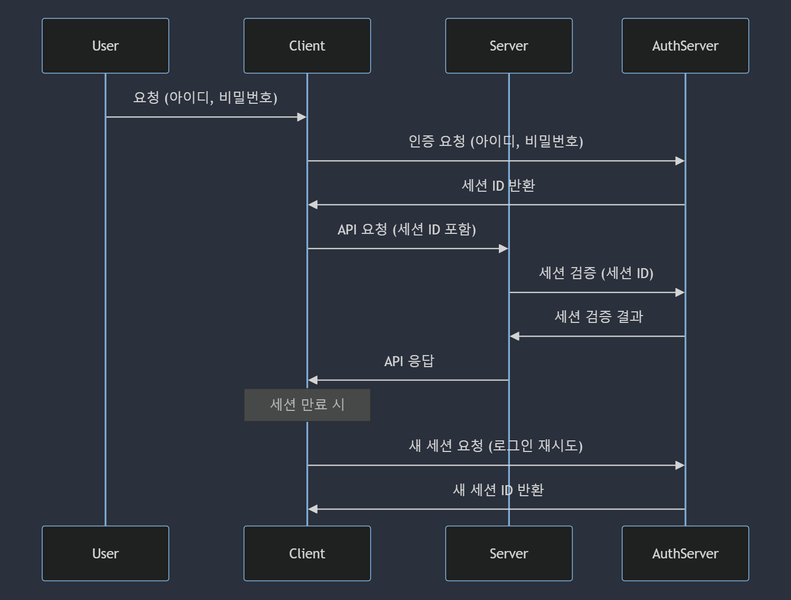
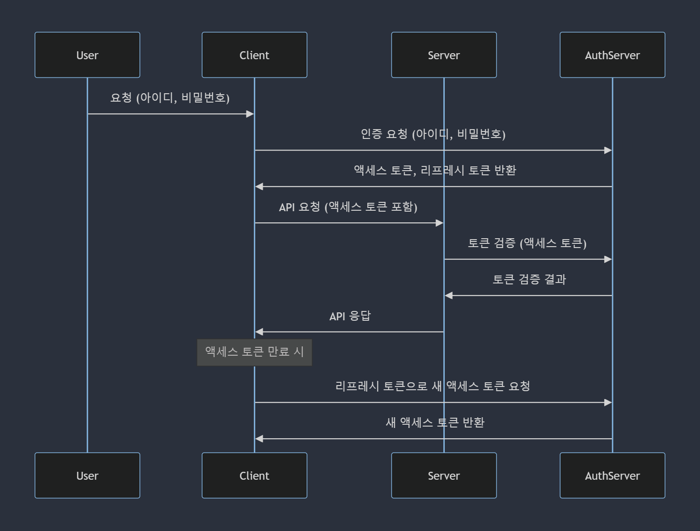
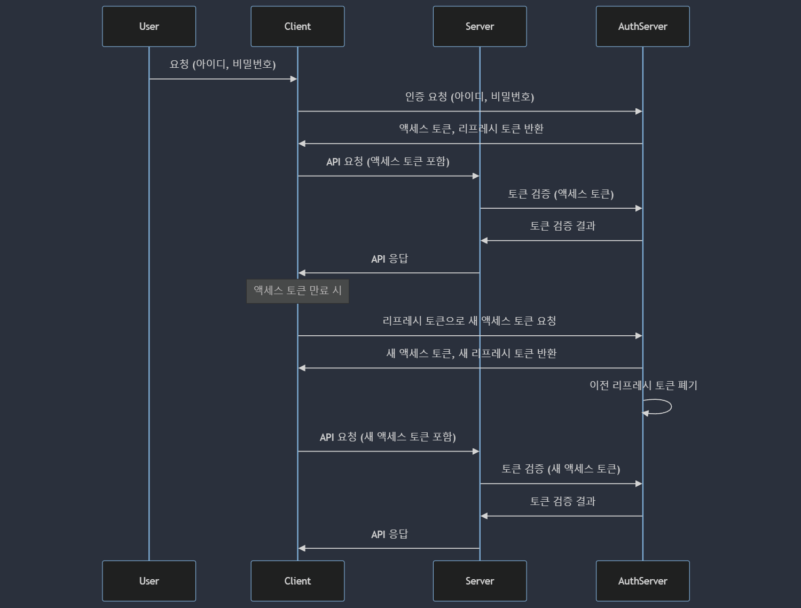

# 인증과 보안

- [브라우저 저장소](#브라우저-저장소)
  - [보충 설명](#보충-설명)
  - [쿠키 옵션 설명](#쿠키-옵션-설명)
    - [`SameSite` 옵션 값 설명](#samesite-옵션-값-설명)
- [세션](#세션)
  - [세션 인증 과정](#세션-인증-과정)
- [JWT](#jwt)
  - [구조](#구조)
  - [대칭키 방식의 JWT 생성 및 검증](#대칭키-방식의-jwt-생성-및-검증)
  - [비대칭키 방식의 JWT 생성 및 검증](#비대칭키-방식의-jwt-생성-및-검증)
  - [Access Token, Refresh Token](#access-token-refresh-token)
  - [JWT 인증 과정](#jwt-인증-과정)
- [XSS, CSRF](#xss-csrf)
  - [XSS (Cross-Site Scripting) 악용 사례](#xss-cross-site-scripting-악용-사례)
  - [CSRF (Cross-Site Request Forgery) 악용 사례](#csrf-cross-site-request-forgery-악용-사례)

## 브라우저 저장소

브라우저 저장소에 저장된 데이터는 브라우저 메모리에 저장된 데이터가 아니기에, 새로고침 시에도 데이터가 남아있다.

| 특징             | 로컬 스토리지 (Local Storage)   | 세션 스토리지 (Session Storage)      | 쿠키 (Cookie)                |
| ---------------- | ------------------------------- | ------------------------------------ | ---------------------------- |
| 데이터 저장 기간 | 영구적 (삭제 시까지)            | 세션 종료 시 (브라우저 탭 닫기)      | 설정된 만료 시간까지         |
| 저장 용량        | 약 5~10MB                       | 약 5~10MB                            | 약 4KB                       |
| 데이터 접근      | 클라이언트 측 (자바스크립트)    | 클라이언트 측 (자바스크립트)         | 클라이언트 및 서버 측        |
| 데이터 전송      | 전송되지 않음                   | 전송되지 않음                        | 매 요청마다 서버로 전송 가능 |
| 보안             | XSS에 취약                      | XSS에 취약                           | XSS 및 CSRF에 취약           |
| 범위             | 도메인 전체                     | 도메인 및 브라우저 탭                | 도메인 및 경로               |
| 사용 예          | 사용자 설정, 장기적인 상태 저장 | 일시적인 상태 저장, 세션 기반 데이터 | 사용자 인증, 세션 관리       |

### 보충 설명

1. 로컬 스토리지 (Local Storage)

   - 공유 범위: 동일한 도메인 내의 모든 탭과 창에서 데이터를 공유할 수 있다.
   - 브라우저 간 공유: 다른 브라우저 간에는 공유되지 않는다.
   - 사용 예: 사용자 설정, 장기적인 상태 저장 (예: 테마 설정, 사용자 선호도 등).

2. 세션 스토리지 (Session Storage)

   - 공유 범위: 같은 브라우저의 동일한 도메인 내의 단일 탭 또는 창에서만 데이터를 공유할 수 있다.
   - 다른 탭 간 공유: 동일한 도메인이라도 다른 탭이나 창 간에는 공유되지 않는다.
   - 브라우저 간 공유: 다른 브라우저 간에도 공유되지 않는다.
   - 사용 예: 일시적인 상태 저장, 세션 기반 데이터 (예: 일시적인 폼 데이터, 일시적인 애플리케이션 상태).

3. 쿠키 (Cookie)

   - 공유 범위: 기본적으로 동일한 도메인 내의 모든 탭과 창에서 데이터를 공유할 수 있다.
   - 도메인 제어: 쿠키의 `Domain` 속성을 설정하여 서브 도메인 간에도 데이터를 공유할 수 있다. 예를 들어, `example.com`에서 설정한 쿠키를 `sub.example.com`에서도 접근 가능하게 할 수 있다.
   - 브라우저 간 공유: 브라우저 간에는 공유되지 않는다.
   - 사용 예: 사용자 인증, 세션 관리 (예: 로그인 세션, 사용자 식별 정보).

### 쿠키 옵션 설명

| 옵션       | 설명                                       | 역할 및 특징                                                                                                                                   |
| ---------- | ------------------------------------------ | ---------------------------------------------------------------------------------------------------------------------------------------------- |
| `name`     | 쿠키의 이름                                | 쿠키를 식별하는 데 사용된다. 동일한 도메인 내에서 고유해야 한다.                                                                               |
| `value`    | 쿠키의 값                                  | 쿠키에 저장되는 데이터입니다. 보안에 민감한 정보는 포함하지 않는 것이 좋다.                                                                    |
| `domain`   | 쿠키를 사용할 수 있는 도메인               | 특정 도메인 또는 하위 도메인에서만 쿠키를 사용할 수 있게 제한한다. 예: `.example.com` 설정 시 모든 하위 도메인에서도 쿠키가 사용된다.          |
| `path`     | 쿠키를 사용할 수 있는 경로                 | 특정 경로에서만 쿠키를 사용할 수 있게 제한한다. 예: `/account` 설정 시 `/account`와 그 하위 경로에서만 쿠키가 사용된다.                        |
| `expires`  | 쿠키의 만료 날짜                           | 쿠키의 유효 기간을 설정한다. 날짜를 지정하지 않으면 세션 쿠키가 되며, 브라우저를 닫으면 삭제된다. 예: `expires=Wed, 21 Oct 2021 07:28:00 GMT`. |
| `max-age`  | 쿠키의 수명 (초 단위)                      | `expires` 대신 사용할 수 있으며, 초 단위로 유효 기간을 설정한다. 예: `max-age=3600` 설정 시 1시간 후에 쿠키가 만료된다.                        |
| `secure`   | 쿠키가 HTTPS 연결에서만 전송되도록 설정    | 이 옵션을 설정하면 쿠키가 HTTPS 연결에서만 전송된다. 이를 통해 네트워크 상의 스니핑 공격을 방지할 수 있다.                                     |
| `HttpOnly` | JavaScript에서 쿠키 접근을 방지            | 이 옵션을 설정하면 JavaScript에서 쿠키에 접근할 수 없으므로 XSS 공격에 대한 보호를 강화한다.                                                   |
| `SameSite` | 쿠키의 크로스 사이트 요청에 대한 제한 설정 | `Strict`, `Lax`, `None` 중 하나를 선택할 수 있으며, 이를 통해 CSRF 공격을 방지할 수 있다.                                                      |

#### `SameSite` 옵션 값 설명

- `Strict`: 쿠키가 동일 사이트 요청에서만 전송된다. 타 사이트에서의 모든 요청에는 쿠키가 전송되지 않는다.
- `Lax`: 쿠키가 동일 사이트 요청과 일부 타 사이트 요청(GET 메서드 등 안전한 방법)에서만 전송된다.
- `None`: 모든 크로스 사이트 요청에서 쿠키가 전송된다. 이 옵션을 사용할 경우 `Secure` 옵션도 함께 설정해야 한다.

## 세션

디비를 선택안하면 서버 프로그램에 할당된 메모리에 저장한다.

세션 데이터를 저장할 때 디스크 기반 데이터베이스와 메모리 기반 데이터베이스 중 어느 것을 사용할지 선택하는 것은 여러 요인에 따라 달라집니다. 각각의 장단점을 고려해보아야 합니다.

**디스크 기반 데이터베이스**는 데이터를 디스크에 저장하므로, 서버가 재시작되거나 장애가 발생하더라도 데이터가 유지됩니다. 이는 데이터의 영속성이 중요한 경우에 유리합니다. 그러나 디스크 I/O가 메모리보다 느리기 때문에 성능이 저하될 수 있습니다.

**메모리 기반 데이터베이스**는 데이터를 RAM에 저장하므로, 읽기와 쓰기 속도가 빠릅니다. 따라서 성능이 중요한 애플리케이션에서는 메모리 기반 데이터베이스가 유리할 수 있습니다. 하지만 서버가 재시작되거나 장애가 발생하면 메모리의 데이터는 손실될 수 있기 때문에, 데이터의 영속성이 중요한 경우에는 추가적인 저장소를 필요로 할 수 있습니다.

결국, 선택은 애플리케이션의 요구 사항에 따라 달라집니다. 성능과 영속성, 데이터의 중요성 등을 고려하여 적절한 데이터베이스를 선택하는 것이 중요합니다.

맞습니다. 설명하신 대로, 인메모리 데이터베이스와 디스크 기반 데이터베이스는 데이터를 가져오는 과정이 서로 다릅니다.

**인메모리 데이터베이스**의 경우:

1. 서버가 데이터를 요청하면 인메모리 데이터베이스는 RAM에 저장된 데이터를 직접 조회합니다.
2. 메모리에서 직접 데이터를 읽어오기 때문에 응답 속도가 매우 빠릅니다.
3. 메모리에서 데이터를 읽는 것은 디스크 I/O에 비해 훨씬 빠르기 때문에 성능이 우수합니다.

**디스크 기반 데이터베이스**의 경우:

1. 서버가 데이터를 요청하면 디스크 기반 데이터베이스는 디스크에서 데이터를 조회합니다.
2. 디스크에 저장된 데이터를 읽어오기 때문에 디스크 I/O가 발생합니다.
3. 디스크 I/O는 메모리보다 느리기 때문에 응답 속도가 상대적으로 느릴 수 있습니다.

결론적으로, 인메모리 데이터베이스는 빠른 데이터 접근 속도를 제공하지만 메모리의 크기에 제한을 받습니다. 반면, 디스크 기반 데이터베이스는 데이터의 영속성을 보장하지만 속도는 상대적으로 느릴 수 있습니다.

### 세션 인증 과정



## JWT

JWT는 JSON Web Token의 약자로, JSON 객체를 안전하게 전송하기 위한 웹 표준이다. 주로 인증 및 정보 교환에 사용된다.

JWT는 그 자체로 정보를 안전하게 전송할 수 있는 방법이지만, 항상 HTTPS를 사용하여 전송하는 것이 중요하다. JWT를 사용함으로써 인증 메커니즘이 간소화되고, 확장성이 높아지는 장점을 가질 수 있다.

### 구조

1. header:

   ```json
   {
     "alg": "HS256",
     "typ": "JWT"
   }
   ```

   - 토큰 유형과 해싱 알고리즘 정보를 포함한다.

2. payload:

   ```json
   {
     "sub": "1234567890",
     "name": "John Doe",
     "iat": 1516239022
   }
   ```

   - 토큰에 담길 실제 데이터를 포함한다. 일반적으로 사용자의 정보나 만료 시간 등이 들어간다.

3. signature:

   ```ts
   HMACSHA256(base64UrlEncode(header) + '.' + base64UrlEncode(payload), secret);
   ```

   - 토큰의 무결성을 검증하기 위해 사용된다. 헤더와 페이로드를 합친 후 비밀 키로 서명한다.

### 대칭키 방식의 JWT 생성 및 검증

```ts
const crypto = require('crypto');

// Base64 URL 인코딩 함수
function base64urlEncode(str) {
  return Buffer.from(str).toString('base64').replace(/=/g, '').replace(/\+/g, '-').replace(/\//g, '_');
}

// Base64 URL 디코딩 함수
function base64urlDecode(str) {
  str = str.replace(/-/g, '+').replace(/_/g, '/');
  return Buffer.from(str, 'base64').toString('utf8');
}

// HMAC-SHA256 해싱 함수
function hmacSHA256(data, secret) {
  return crypto.createHmac('sha256', secret).update(data).digest('base64url');
}

// JWT 생성 함수
function generateToken(payload, secret, expiresIn = '1h') {
  const header = {
    alg: 'HS256',
    typ: 'JWT',
  };

  const iat = Math.floor(Date.now() / 1000);
  let exp = iat;

  // 만료 시간 계산
  if (expiresIn.endsWith('h')) {
    exp += parseInt(expiresIn) * 60 * 60;
  } else if (expiresIn.endsWith('m')) {
    exp += parseInt(expiresIn) * 60;
  } else if (expiresIn.endsWith('s')) {
    exp += parseInt(expiresIn);
  }

  const extendedPayload = {
    ...payload,
    iat,
    exp,
  };

  const encodedHeader = base64urlEncode(JSON.stringify(header));
  const encodedPayload = base64urlEncode(JSON.stringify(extendedPayload));
  const signature = hmacSHA256(`${encodedHeader}.${encodedPayload}`, secret);

  return `${encodedHeader}.${encodedPayload}.${signature}`;
}

// JWT 검증 함수
function verifyToken(token, secret) {
  const [encodedHeader, encodedPayload, signature] = token.split('.');

  const data = `${encodedHeader}.${encodedPayload}`;
  const validSignature = hmacSHA256(data, secret);

  if (signature !== validSignature) {
    return null;
  }

  const payload = JSON.parse(base64urlDecode(encodedPayload));
  const currentTime = Math.floor(Date.now() / 1000);

  if (currentTime > payload.exp) {
    return null;
  }

  return payload;
}

// 예제 데이터
const secretKey = 'your-256-bit-secret';
const payload = {
  userId: 123,
  username: 'exampleUser',
};

// 토큰 생성
const token = generateToken(payload, secretKey);
console.log('Generated Token:', token);

// 토큰 검증
const decoded = verifyToken(token, secretKey);
if (decoded) {
  console.log('Decoded Payload:', decoded);
} else {
  console.log('Invalid or expired token');
}
```

### 비대칭키 방식의 JWT 생성 및 검증

```ts
const crypto = require('crypto');

// Base64 URL 인코딩 함수
function base64urlEncode(str) {
  return Buffer.from(str).toString('base64').replace(/=/g, '').replace(/\+/g, '-').replace(/\//g, '_');
}

// Base64 URL 디코딩 함수
function base64urlDecode(str) {
  str = str.replace(/-/g, '+').replace(/_/g, '/');
  return Buffer.from(str, 'base64').toString('utf8');
}

// RSA-SHA256 서명 생성 함수
function sign(data, privateKey) {
  const sign = crypto.createSign('RSA-SHA256');
  sign.update(data);
  sign.end();
  return sign.sign(privateKey, 'base64').replace(/=/g, '').replace(/\+/g, '-').replace(/\//g, '_');
}

// RSA-SHA256 서명 검증 함수
function verify(data, signature, publicKey) {
  const verify = crypto.createVerify('RSA-SHA256');
  verify.update(data);
  verify.end();
  return verify.verify(publicKey, signature.replace(/-/g, '+').replace(/_/g, '/'), 'base64');
}

// JWT 생성 함수
function generateToken(payload, privateKey, expiresIn = '1h') {
  const header = {
    alg: 'RS256',
    typ: 'JWT',
  };

  const iat = Math.floor(Date.now() / 1000);
  let exp = iat;

  // 만료 시간 계산
  if (expiresIn.endsWith('h')) {
    exp += parseInt(expiresIn) * 60 * 60;
  } else if (expiresIn.endsWith('m')) {
    exp += parseInt(expiresIn) * 60;
  } else if (expiresIn.endsWith('s')) {
    exp += parseInt(expiresIn);
  }

  const extendedPayload = {
    ...payload,
    iat,
    exp,
  };

  const encodedHeader = base64urlEncode(JSON.stringify(header));
  const encodedPayload = base64urlEncode(JSON.stringify(extendedPayload));
  const signature = sign(`${encodedHeader}.${encodedPayload}`, privateKey);

  return `${encodedHeader}.${encodedPayload}.${signature}`;
}

// JWT 검증 함수
function verifyToken(token, publicKey) {
  const [encodedHeader, encodedPayload, signature] = token.split('.');

  const data = `${encodedHeader}.${encodedPayload}`;

  if (!verify(data, signature, publicKey)) {
    return null;
  }

  const payload = JSON.parse(base64urlDecode(encodedPayload));
  const currentTime = Math.floor(Date.now() / 1000);

  if (currentTime > payload.exp) {
    return null;
  }

  return payload;
}

// RSA 키 생성
const { publicKey, privateKey } = crypto.generateKeyPairSync('rsa', {
  modulusLength: 2048,
});

// 예제 데이터
const payload = {
  userId: 123,
  username: 'exampleUser',
};

// 토큰 생성
const token = generateToken(payload, privateKey);
console.log('Generated Token:', token);

// 토큰 검증
const decoded = verifyToken(token, publicKey);
if (decoded) {
  console.log('Decoded Payload:', decoded);
} else {
  console.log('Invalid or expired token');
}
```

### Access Token, Refresh Token

| 항목        | 액세스 토큰                                | 리프레시 토큰                                |
| ----------- | ------------------------------------------ | -------------------------------------------- |
| 정의        | 자원에 접근할 수 있는 권한을 부여하는 토큰 | 새로운 액세스 토큰을 발급받기 위한 토큰      |
| 용도        | API 호출 시 인증을 위해 사용               | 액세스 토큰이 만료되었을 때 갱신을 위해 사용 |
| 유효 기간   | 짧음 (몇 분에서 몇 시간)                   | 김 (몇 주에서 몇 달)                         |
| 보안 위험성 | 만료 시간이 짧아 상대적으로 적음           | 만료 시간이 길어 유출 시 위험성 큼           |
| 만료될 경우 | 새로운 액세스 토큰 발급 필요               | 세션 종료 및 재로그인 필요                   |
| 저장 위치   | 주로 클라이언트 측                         | 주로 클라이언트 측                           |
| 페이로드    | 사용자 ID, 권한, 만료 시간, 발급자 정보    | 사용자 ID, 토큰 ID, 만료 시간                |
| 발급 주체   | 인증 서버                                  | 인증 서버                                    |
| 전송 방식   | HTTP 헤더(Authorization) 또는 URL 파라미터 | HTTP 헤더(Authorization) 또는 URL 파라미터   |

### JWT 인증 과정

- 일반적인 방식



- Refresh Token Rotation을 이용한 보안이 강화된 방식



## XSS, CSRF

| 항목             | XSS (Cross-Site Scripting)                                              | CSRF (Cross-Site Request Forgery)                                 |
| ---------------- | ----------------------------------------------------------------------- | ----------------------------------------------------------------- |
| 개념             | 악성 스크립트를 웹 페이지에 삽입하여 사용자의 브라우저에서 실행         | 사용자가 인지하지 못한 상태에서 악성 요청을 서버에 전송           |
| 목적             | 사용자의 세션/토큰 탈취, 개인정보 도용, 권한 있는 작업 수행             | 사용자의 권한을 악용하여 원하지 않는 행동을 실행                  |
| 공격 방식        | 악성 스크립트를 입력 필드나 URL 파라미터에 삽입                         | 사용자가 인증된 상태에서 특정 요청을 자동으로 실행                |
| 취약점 발생 위치 | 사용자 입력을 제대로 검증하지 않는 웹 페이지                            | CSRF 방어 토큰을 사용하지 않는 웹 페이지                          |
| 예방 방법        | 1. 입력 데이터 검증 2. 출력 시 이스케이프 3. 콘텐츠 보안 정책(CSP) 적용 | 1. CSRF 토큰 사용 2. Referer 헤더 검사 3. SameSite 쿠키 속성 설정 |
| 대표적인 공격 예 | 1. 댓글에 악성 스크립트 삽입 2. 악성 링크 클릭 유도                     | 1. 악성 웹사이트 방문 2. 악성 이메일 링크 클릭                    |

### XSS (Cross-Site Scripting) 악용 사례

1. 피싱 공격:

   - 사례: 공격자가 피싱 이메일을 통해 사용자를 악성 웹사이트로 유도한다. 이 웹사이트는 유명한 은행 사이트처럼 보이지만, 실제로는 공격자의 서버에서 호스팅된다. 사용자가 로그인 정보를 입력하면, 악성 스크립트가 이 정보를 공격자에게 전송한다.
   - 피해: 사용자의 로그인 정보 탈취, 금융 손실 등.

2. 세션 하이재킹:

   - 사례: 공격자가 XSS 취약점을 이용해 사용자의 브라우저에 악성 스크립트를 삽입한다. 이 스크립트는 사용자의 쿠키 또는 토큰을 탈취하여 공격자에게 전송한다. 공격자는 이 쿠키와 토큰을 사용해 사용자의 세션을 하이재킹할 수 있다.
   - 피해: 공격자가 사용자의 계정에 무단으로 접근하여 개인 정보 탈취, 불법적인 행동 수행 등.

3. 웹사이트 변조:
   - 사례: 댓글 기능이 있는 웹사이트에 공격자가 악성 스크립트를 포함한 댓글을 게시한다. 다른 사용자가 이 댓글을 볼 때마다 스크립트가 실행되어 웹페이지가 변조되거나 사용자에게 악성 코드가 다운로드된다.
   - 피해: 사용자 기기 감염, 웹사이트 평판 손상 등.

### CSRF (Cross-Site Request Forgery) 악용 사례

1. 불법 송금:

   - 사례: 공격자가 사용자가 로그인한 은행 웹사이트의 CSRF 취약점을 이용해 악성 이메일을 보낸다. 이메일에는 공격자의 계좌로 돈을 송금하는 요청이 포함된 악성 링크가 있다. 사용자가 링크를 클릭하면, 사용자의 계좌에서 공격자의 계좌로 돈이 송금된다.
   - 피해: 금융 손실.

2. 계정 설정 변경:

   - 사례: 공격자가 소셜 네트워크 사이트의 CSRF 취약점을 이용하여 사용자의 이메일 주소를 자신의 이메일 주소로 변경하는 요청을 포함한 악성 링크를 만든다. 사용자가 로그인된 상태에서 링크를 클릭하면, 사용자의 계정 이메일이 변경된다.
   - 피해: 계정 탈취, 개인정보 유출 등.

3. 비밀번호 변경:
   - 사례: 공격자가 사용자가 로그인한 쇼핑몰 사이트에서 비밀번호를 변경하는 CSRF 취약점을 악용한다. 악성 스크립트가 포함된 웹페이지를 만들어 사용자가 방문하도록 유도하고, 사용자가 로그인된 상태에서 페이지를 방문하면 공격자의 비밀번호로 변경된다.
   - 피해: 계정 접근 권한 상실, 개인정보 도용 등.
