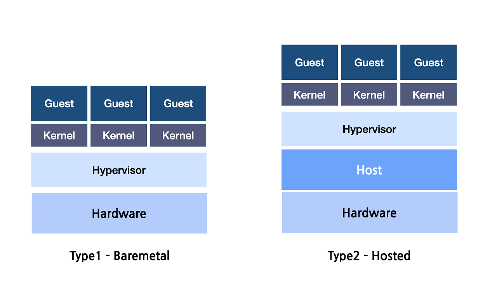

# 컴퓨터 구조 및 운영체제 궁금증 해결

- [cpu는 이진수로 이루어진 명령어에서 연산코드와 오퍼랜드를 어떻게 구분하지?](#cpu는-이진수로-이루어진-명령어에서-연산코드와-오퍼랜드를-어떻게-구분하지)
- [cpu 내부에도 버스가 존재하는가?](#cpu-내부에도-버스가-존재하는가)
- [예외(동기) vs 하드웨어 인터럽트(비동기)](#예외동기-vs-하드웨어-인터럽트비동기)
- [고립형 입출력 방식에서 입출력 장치를 위한 주소공간은 어디에 존재하는가?](#고립형-입출력-방식에서-입출력-장치를-위한-주소공간은-어디에-존재하는가)
- [시스템 버스 중 제어 버스는 여러가지 신호선이 따로 존재하는가?](#시스템-버스-중-제어-버스는-여러가지-신호선이-따로-존재하는가)
- [하이퍼바이저 모드](#하이퍼바이저-모드)

## cpu는 이진수로 이루어진 명령어에서 연산코드와 오퍼랜드를 어떻게 구분하지?

- CPU는 명령어의 고정된 비트 구조를 사용하여 연산코드와 오퍼랜드를 구분한다.
- 명령어는 보통 워드 크기와 동일하거나 워드의 배수로 정해진다. 예를 들어, 32비트 CPU는 32비트(1워드) 명령어를 처리하며, 더 복잡한 명령어는 2워드(64비트)일 수도 있다.

예시:

`[연산코드 (8비트)] [오퍼랜드1 (12비트)] [오퍼랜드2 (12비트)]`

## cpu 내부에도 버스가 존재하는가?

CPU 내부의 레지스터들은 제어장치의 지시에 따라 내부 버스를 통해 제어되고, 데이터의 이동이 이루어진다.

## 예외(동기) vs 하드웨어 인터럽트(비동기)

- 인터럽트 발생 시 처리방식이 비슷하다.

  1. 상태 저장: CPU는 인터럽트나 폴트가 발생하면 현재 실행 중인 작업의 상태(레지스터, 프로그램 카운터 등)를 스택에 저장한다.
  2. 처리 루틴 실행: 인터럽트 벡터 테이블 또는 예외 처리 테이블을 참조해 적절한 처리 루틴(인터럽트 서비스 루틴 또는 예외 처리 핸들러)을 실행한다.
  3. 상태 복원: 처리가 끝나면 저장해 둔 상태를 복원하고, 원래 중단된 작업을 이어서 수행한다.

- 발생 원인이 다르다.

  - 동기: 이벤트가 CPU의 명령 실행과 직접적인 관련이 있을 때 발생한다. 즉, CPU가 특정 명령을 실행할 때 발생하는 이벤트이다. 그 명령어가 실행되지 않았다면 해당 이벤트도 발생하지 않는다.
  - 비동기: 이벤트가 CPU의 명령 실행과는 독립적으로, 외부 요인에 의해 언제든 발생할 수 있다. 즉, CPU가 현재 무슨 작업을 하고 있든 상관없이 외부 장치에서 발생하는 이벤트이다.

## 고립형 입출력 방식에서 입출력 장치를 위한 주소공간은 어디에 존재하는가?

입출력 장치를 위한 메모리는 입출력 장치 내부에 있거나, 장치의 레지스터와 같은 하드웨어 구성 요소에 포함된다.

## 시스템 버스 중 제어 버스는 여러가지 신호선이 따로 존재하는가?

제어 버스는 데이터 버스나 주소 버스처럼 단일 신호가 아니라, 다양한 제어 신호들이 결합된 구조이다.

- 메모리 읽기(Memory Read): CPU가 메모리에서 데이터를 읽을 때 사용하는 신호선
- 메모리 쓰기(Memory Write): CPU가 데이터를 메모리에 기록할 때 사용하는 신호선
- I/O 읽기(I/O Read): CPU가 입출력 장치에서 데이터를 읽을 때 사용하는 신호선
- I/O 쓰기(I/O Write): CPU가 데이터를 입출력 장치에 보낼 때 사용하는 신호선
- 인터럽트 요청(Interrupt Request): 하드웨어 장치가 CPU에 인터럽트를 요청할 때 사용하는 신호선
- 인터럽트 승인(Interrupt Acknowledge): CPU가 인터럽트 요청을 수락하고 처리할 때 사용하는 신호선
- 버스 요청(Bus Request): DMA 같은 장치가 시스템 버스를 사용하려고 요청할 때 사용하는 신호선
- 버스 승인(Bus Grant): CPU가 버스 요청을 승인해 DMA 장치가 버스를 사용할 수 있도록 할 때 사용하는 신호선
- 클락 신호(Clock Signal): 시스템의 동기화를 위한 신호선
- 리셋 신호(Reset): 시스템을 초기화할 때 사용하는 신호선

## 하이퍼바이저 모드

| 구분      | Type 1 (베어메탈 하이퍼바이저)                            | Type 2 (호스트형 하이퍼바이저)                      |
| --------- | --------------------------------------------------------- | --------------------------------------------------- |
| 설치 위치 | 하드웨어 위에 직접 설치 (운영 체제 없이 작동)             | 기존 운영 체제 위에 설치                            |
| 성능      | 높은 성능 (운영 체제 없이 직접 하드웨어 제어)             | 상대적으로 낮은 성능 (호스트 OS를 거침)             |
| 복잡성    | 더 복잡한 설치 및 관리 필요                               | 비교적 간단한 설치 및 관리                          |
| 사용 예시 | 데이터 센터, 서버 가상화 (VMware ESXi, Microsoft Hyper-V) | 개인 PC, 개발 환경 (VirtualBox, VMware Workstation) |
| 용도      | 대규모 가상화 환경 (서버, 클라우드 인프라)                | 소규모 또는 데스크톱 가상화                         |

