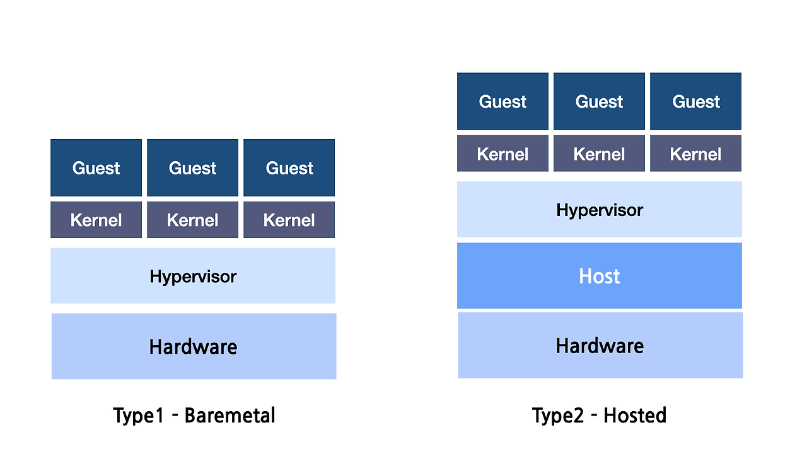

# 운영체제

- [커널 vs 하이퍼바이저](#커널-vs-하이퍼바이저)
- [시스템 호출과 비시스템 호출 구분해보기](#시스템-호출과-비시스템-호출-구분해보기)
  - [시스템 호출 (System Call)](#시스템-호출-system-call)
  - [비시스템 호출 (Non-System Call)](#비시스템-호출-non-system-call)
- [애플리케이션이 메모리를 할당받는 과정](#애플리케이션이-메모리를-할당받는-과정)
- [프로세스 vs 스레드](#프로세스-vs-스레드)
- [BIOS • UEFI • 부트로더](#bios--uefi--부트로더)
- [파일과 폴더](#파일과-폴더)
- [맞다. 스트림에서 버퍼로 이동되는 데이터 조각을 "청크"라고 부른다.](#맞다-스트림에서-버퍼로-이동되는-데이터-조각을-청크라고-부른다)

## 커널 vs 하이퍼바이저

| 특징        | 커널                                                                                         | 하이퍼바이저                                                    |
| ----------- | -------------------------------------------------------------------------------------------- | --------------------------------------------------------------- |
| 정의        | 운영 체제의 핵심 구성 요소로, 하드웨어 자원과 소프트웨어 간의 상호작용을 관리하는 소프트웨어 | 여러 가상 머신(VM)을 생성하고 관리하는 소프트웨어               |
| 주 목적     | 프로세스 관리, 메모리 관리, 파일 시스템 관리 등 운영 체제 기능 제공                          | 가상화, 자원 할당, 여러 운영 체제의 동시 실행 지원              |
| 자원 관리   | CPU, 메모리, I/O 장치 등 물리적 자원 관리                                                    | 물리적 자원을 가상 머신에 할당하고 관리                         |
| 문맥 교환   | 프로세스 간의 문맥 교환 관리                                                                 | 가상 머신 간의 문맥 교환 관리                                   |
| 의존성      | 하드웨어 위에서 직접 실행                                                                    | 하드웨어 위에서 또는 운영 체제 위의 가상화 계층으로 실행        |
| 형태        | 일반적으로 단일 커널 (자주 사용하는 구조)                                                    | 타입 1 하이퍼바이저(베어 메탈) 및 타입 2 하이퍼바이저(호스트형) |
| 설치 위치   | 물리적 하드웨어와 직접적으로 연결                                                            | 물리적 하드웨어 위에서 또는 운영 체제 내에서 간접적으로 실행    |
| 가상화 지원 | 기본적으로 가상화를 지원하지 않으며, 이를 위해 추가 소프트웨어가 필요                        | 기본적으로 가상화를 지원하며 여러 운영 체제를 동시에 실행 가능  |

## 시스템 호출과 비시스템 호출 구분해보기

### 시스템 호출 (System Call)

시스템 호출은 운영 체제의 기능을 호출하는 것이며, 주로 파일 시스템, 네트워크, 프로세스 관리 등과 관련된 작업을 수행한다.

- `fs.readFile()`: 파일을 읽기 위한 시스템 호출
- `fs.writeFile()`: 파일에 쓰기 위한 시스템 호출
- `http.createServer()`: HTTP 서버를 생성하는 시스템 호출
- `net.createServer()`: TCP 서버를 생성하는 시스템 호출
- `child_process.exec()`: 자식 프로세스를 생성하는 시스템 호출

### 비시스템 호출 (Non-System Call)

비시스템 호출은 운영 체제와 직접적으로 상호작용하지 않는 코드로, 주로 메모리 내에서 데이터 처리나 계산을 수행한다.

- 숫자 계산, 문자열 조작 등
- 배열, 객체 등을 사용한 데이터 처리
- Promise 및 async/await를 사용한 비동기 처리, 시스템 자원에 의존하지 않는 경우

## 애플리케이션이 메모리를 할당받는 과정

고급 언어로 작성된 애플리케이션은 런타임 환경(Node.js, JVM, Python)을 통해 메모리를 할당받고, 런타임 환경(Node.js, JVM, Python)은 운영체제에게 메모리를 할당받는 구조를 갖는다.

## 프로세스 vs 스레드

| 항목         | 프로세스                                        | 스레드                                              |
| ------------ | ----------------------------------------------- | --------------------------------------------------- |
| 정의         | 실행 중인 프로그램의 인스턴스                   | 프로세스 내에서 실행되는 경량의 작업 단위           |
| 메모리 공간  | 독립적인 메모리 공간을 가짐                     | 같은 프로세스 내에서 메모리 공간을 공유             |
| 자원 할당    | 각 프로세스는 필요한 시스템 자원을 보유         | 스레드는 프로세스의 자원을 공유 (전역 변수를 포함)  |
| 생성 및 종료 | 생성 비용이 크고 종료시 모든 자치 자원이 해제됨 | 생성 비용이 작고 종료 시 해당 스레드만 자원을 해제  |
| 스케줄링     | 운영체제가 관리하며 PCB를 통해 이루어짐         | 운영체제가 관리하며 TCB를 통해 이루어짐             |
| 통신         | 프로세스 간의 통신은 IPC를 통해 이루어짐        | 스레드 간의 통신은 메모리 공유를 통해 쉽게 이루어짐 |
| 성능         | 비교적 무겁고, 스위칭 시 비용이 큼              | 경량화되어 있고, 스위칭 시 비용이 적음              |

PCB(프로세스 제어 블록) 저장 정보:

- 프로세스 ID (PID)
- 프로세스 상태 (예: 실행, 대기, 중지 등)
- 프로그램 카운터 (PC)
- CPU 레지스터 (프로세스에 대한 레지스터 내용)
- 메모리 관리 정보 (페이지 테이블, 세그먼트 테이블 등)
- I/O 상태 정보 (열린 파일 디스크립터, 입출력 장치 정보 등)
- 프로세스 우선순위
- 스케줄링 정보 (스케줄링 큐에서의 위치 등)
- 부모 프로세스 ID
- 프로세스의 자식 프로세스 목록
- 사용자 및 시스템 자원 사용 정보

TCB(스레드 제어 블록) 저장 정보:

- 스레드 ID (TID)
- 스레드 상태 (예: 준비, 실행, 대기, 종료 등)
- 프로그램 카운터 (PC)
- 스택 포인터
- CPU 레지스터 (스레드에 대한 레지스터 내용)
- 스레드 우선순위
- 스레드의 개별 자원 사용 정보
- 소속 프로세스 ID (PID)
- 이벤트 및 세마포어 정보 (상태 동기화 정보)

## BIOS • UEFI • 부트로더

BIOS (Basic Input/Output System):

- BIOS는 컴퓨터를 켤 때 가장 먼저 실행되는 펌웨어로, 하드웨어 초기화와 운영체제를 로드하는 역할을 한다.
- 하드웨어와 운영체제 사이에서 통신을 중재하며, 하드웨어 테스트(POST: Power-On Self-Test)를 한다.
- BIOS는 ROM에 저장된 코드로, 기본적으로 키보드, 모니터, 하드 드라이브 등의 하드웨어를 제어한다.

UEFI (Unified Extensible Firmware Interface):

- UEFI는 BIOS의 후속 기술로, 더 많은 기능과 빠른 부팅 속도를 제공한다.
- 그래픽 기반의 인터페이스와 보안 기능(Secure Boot)을 포함하며, 더 큰 하드 드라이브(2TB 이상의 드라이브)를 지원한다.
- UEFI는 운영체제와 하드웨어 간의 더 효율적인 인터페이스를 제공하며, 네트워크 기능이나 마우스 사용 등 고급 기능을 지원한다.

부트로더 (Bootloader):

- 부트로더는 BIOS나 UEFI가 하드웨어 초기화를 마친 후, 운영체제를 로드하는 프로그램이다.
- 컴퓨터가 켜지면 부트로더가 운영체제를 메모리에 올리고 실행하는 역할을 한다.
- 대표적인 부트로더로는 리눅스에서 많이 사용하는 GRUB, 윈도우의 Windows Boot Manager 등이 있다.

## 파일과 폴더

1. **파일과 폴더의 차이**

   - 파일: 데이터를 저장하는 기본 단위 (예: 텍스트 파일, 이미지 파일).
   - 폴더: 파일을 그룹화하여 관리하는 구조, 다른 폴더(하위 폴더)도 포함 가능.

2. **운영체제와 파일 확장자**

   - 운영체제는 파일 확장자를 기반으로 적절한 프로그램과 연동함.
   - 특정 확장자는 특정 프로그램에서 가장 잘 해석됨 (예: .txt → 텍스트 에디터, .jpg → 이미지 뷰어).

3. **파일의 바이너리 데이터 저장 방식**

   - 모든 파일은 바이너리 형태(0과 1)로 저장됨.
   - 파일 확장자에 따라 데이터의 해석 방식이 달라짐.
     - .txt → 문자 데이터를 ASCII/UTF-8로 저장.
     - .jpg → 이미지 데이터를 압축된 바이너리 형태로 저장.

4. **파일 형식별 데이터 내용**
   - .wmv: 주로 비디오 데이터를 저장, 오디오도 포함 가능.
   - .pdf: 문서 데이터 저장, PDF 뷰어가 가장 적절하게 해석함.
   - .xlsx/.xls: Excel 스프레드시트 데이터 저장, Excel이 가장 적절하게 해석함.

파일 확장자에 따라 저장되는 데이터 유형과 이를 해석하는 소프트웨어가 달라진다.

## 맞다. 스트림에서 버퍼로 이동되는 데이터 조각을 "청크"라고 부른다.

1. **청크**:

   - 스트림을 통해 전송되는 데이터의 단위.
   - 각 청크는 버퍼의 크기와 관련이 있으며, 일반적으로 버퍼가 가득 차면 이벤트 발생.

2. **메모리 사용**:
   - 청크 단위로 데이터를 처리하므로, 전체 파일을 메모리에 로드하지 않고도 파일을 읽을 수 있다.
   - 이는 메모리 사용량을 줄이고, 대용량 파일을 효율적으로 처리하게 해준다.

따라서, 스트림은 청크 단위로 작업을 수행하며, 이는 데이터 처리에서 중요한 개념이다.
