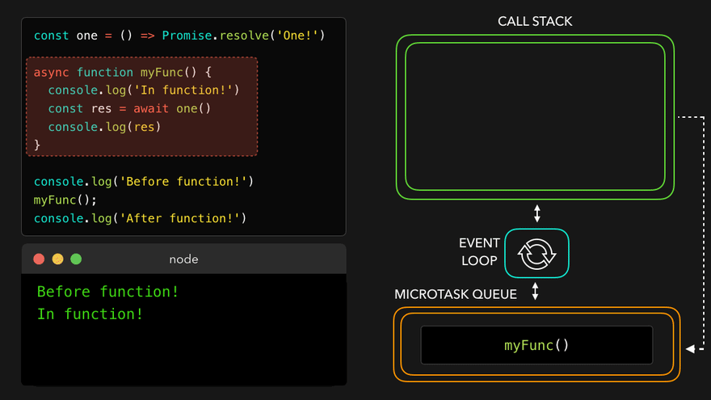

# Asynchronous

- [Promise](#promise)
  - [Promise.resolve](#promiseresolve)
  - [Promise.reject](#promisereject)
  - [Promise.all](#promiseall)
  - [Promise.allSettled](#promiseallsettled)
  - [Promise.race](#promiserace)
- [async/await](#asyncawait)

## Promise


### Promise.resolve

`Promise.resolve(value)`는 결괏값이 `value`인 이행 상태 프라미스를 생성한다.

`Promise.resolve(value)`는 `new Promise((res, rej) => res(value))`와 같다.

`Promise.resolve`는 호환성을 위해 함수가 거부 상태 프라미스를 반환하도록 해야 할 때 사용할 수 있다.

아래 함수 `loadCached`는 인수로 받은 URL을 대상으로 fetch를 호출하고, 그 결과를 기억한다.

```ts
let cache = new Map();

function loadCached(url) {
  if (cache.has(url)) {
    return Promise.resolve(cache.get(url)); // (*)
  }

  return fetch(url)
    .then((response) => response.text())
    .then((text) => {
      cache.set(url, text);
      return text;
    });
}
```

`loadCached`를 호출하면 이행 상태 프라미스가 반환된다는 것이 보장된다. `(*)`로 표시한 줄에서 `Promise.resolve`를 사용한 이유가 바로 여기에 있다.

### Promise.reject

`Promise.reject(error)`는 결괏값이 `error`인 거부 상태 프라미스를 생성한다.

`Promise.reject(error)`는 `new Promise((res, rej) => rej(error))`와 같다.

`Promise.reject`는 호환성을 위해 함수가 이행 상태 프라미스를 반환하도록 해야 할 때 사용할 수 있다.

아래는 `axios` 라이브러리의 응답에 대한 인터셉터 기능을 사용할 때이다.

```ts
axios.interceptors.response.use(
  function (response) {
    // ...
    return response;
  },
  function (error) {
    // ...
    return Promise.reject(error); // (*)
  },
);
```

`axios`는 오류가 나고 인터셉터로 에러에 대한 추가 처리가 되어도 거절 상태 프라미스가 반환된다는 것이 보장된다. `(*)`로 표시한 줄에서 `Promise.reject`를 사용한 이유가 바로 여기에 있다.

### Promise.all

- `Promise.all`은
- `Promise.all`은 전달되는 프라미스 중 하나라도 거부되면, Promise.all이 반환하는 프라미스는 에러와 함께 바로 거부됩니다.
  Promise.all에

```ts
let urls = [
  'https://api.github.com/users/iliakan',
  'https://api.github.com/users/Violet-Bora-Lee',
  'https://api.github.com/users/jeresig',
];

// fetch를 사용해 url을 프라미스로 매핑합니다.
let requests = urls.map((url) => fetch(url));

// Promise.all은 모든 작업이 이행될 때까지 기다립니다.
Promise.all(requests).then((responses) =>
  responses.forEach((response) => alert(`${response.url}: ${response.status}`)),
);
```

### Promise.allSettled

```ts
let urls = [
  'https://api.github.com/users/iliakan',
  'https://api.github.com/users/Violet-Bora-Lee',
  'https://no-such-url',
];

Promise.allSettled(urls.map((url) => fetch(url))).then((results) => {
  // (*)
  results.forEach((result, num) => {
    if (result.status == 'fulfilled') {
      alert(`${urls[num]}: ${result.value.status}`);
    }
    if (result.status == 'rejected') {
      alert(`${urls[num]}: ${result.reason}`);
    }
  });
});
```

### Promise.race

## async/await




