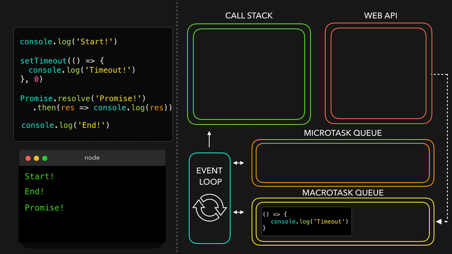

# Asynchronous

- [Promise](#promise)
  - [Promise.resolve](#promiseresolve)
  - [Promise.reject](#promisereject)
  - [다중 프로미스 처리](#다중-프로미스-처리)
- [async/await](#asyncawait)

## Promise


아래 그림 설명:

1. 실행흐름 중 비동기 함수를 만나 Web API로 넘겨서 처리한다.
2. 비동기 함수가 완료되면 인수로 넘겨진 콜백을 매크로태스크 큐로 넘긴다.


아래 그림 설명:

1. 실행흐름 중 `Promise`를 만나 `executor` 함수를 즉시 실행한다.
2. `resolve` 함수가 호출되면 `then` 함수에 인수로 넘겨진 콜백을 마이크로태스크 큐로 넘긴다.
3. `reject` 함수가 호출되면 `catch` 함수에 인수로 넘겨진 콜백을 마이크로태스크 큐로 넘긴다.


아래 그림 설명:

1. 콜 스택이 비워지면 이벤트 루프는 마이크로태스크 큐의 작업을 우선으로 콜 스택으로 보낸다.
2. 이후 매크로태스크 큐의 작업을 콜 스택으로 보낸다.




### Promise.resolve

- `Promise.resolve(value)`는 결괏값이 `value`인 이행 상태 프로미스를 생성한다.
- `Promise.resolve(value)`는 `new Promise((res, rej) => res(value))`와 같다.
- `Promise.resolve`는 호환성을 위해 함수가 거부 상태 프로미스를 반환하도록 해야 할 때 사용할 수 있다.

아래 함수 `loadCached`는 인수로 받은 URL을 대상으로 fetch를 호출하고, 그 결과를 기억한다.

```ts
let cache = new Map();

function loadCached(url) {
  if (cache.has(url)) {
    return Promise.resolve(cache.get(url)); // (*)
  }

  return fetch(url)
    .then((response) => response.text())
    .then((text) => {
      cache.set(url, text);
      return text;
    });
}
```

`loadCached`를 호출하면 이행 상태 프로미스가 반환된다는 것이 보장된다. `(*)`로 표시한 줄에서 `Promise.resolve`를 사용한 이유가 바로 여기에 있다.

### Promise.reject

- `Promise.reject(error)`는 결괏값이 `error`인 거부 상태 프로미스를 생성한다.
- `Promise.reject(error)`는 `new Promise((res, rej) => rej(error))`와 같다.
- `Promise.reject`는 호환성을 위해 함수가 이행 상태 프로미스를 반환하도록 해야 할 때 사용할 수 있다.

아래는 `axios` 라이브러리의 응답에 대한 인터셉터 기능을 사용할 때이다.

```ts
axios.interceptors.response.use(
  function (response) {
    // ...
    return response;
  },
  function (error) {
    // ...
    return Promise.reject(error); // (*)
  },
);
```

`axios`는 오류가 나고 인터셉터로 에러에 대한 추가 처리가 되어도 거절 상태 프로미스가 반환된다는 것이 보장된다. `(*)`로 표시한 줄에서 `Promise.reject`를 사용한 이유가 바로 여기에 있다.

### 다중 프로미스 처리

다중 프로미스는 `Promise.all`, `Promise.allSettled`, `Promise.race` 함수로 처리가 가능하다.

- `Promise.all`은 모든 프로미스가 이행될 때까지 기다렸다가 그 결괏값을 담은 배열을 반환한다. 주어진 프로미스 중 하나라도 실패하면 `Promise.all`은 거부되고, 나머지 프로미스의 결과는 무시된다.
- `Promise.allSettled`은 모든 프로미스가 처리될 때까지 기다렸다가 그 결과를 담은 배열을 반환한다
- `Promise.race` 가장 먼저 처리된 프로미스의 결과 또는 에러를 담은 프로미스를 반환한다.

```ts
let promiseList = [
  new Promise((resolve, reject) => setTimeout(() => resolve(1), 1000)),
  new Promise((resolve, reject) => setTimeout(() => reject(new Error('에러 발생!')), 2000)),
  new Promise((resolve, reject) => setTimeout(() => resolve(3), 3000)),
];

Promise.all(promiseList)
  .then((result) => result.forEach((item) => console.log(item)))
  .catch((error) => console.error(error));

Promise.allSettled(promiseList).then((item) => {
  item.forEach((value, index) => {
    if (value.status == 'fulfilled') {
      console.log(`${value.value}`);
    }
    if (value.status == 'rejected') {
      console.log(`${value.reason}`);
    }
  });
});

Promise.race(promiseList)
  .then((result) => console.log(result))
  .catch((error) => console.error(error));
```

## async/await


아래 그림 설명:

1. 실행흐름 중 `async` 함수를 만나면 해당 함수를 실행한다.


아래 그림 설명:

1. `async` 함수 내부에서 `await` 키워드를 만나면 해당 `async` 함수를 마이크로태스크 큐로 넘긴다.


아래 그림 설명:

1. 콜 스택이 비워지면 마이크로태스크 큐에 작업을 콜 스택으로 보낸다.


