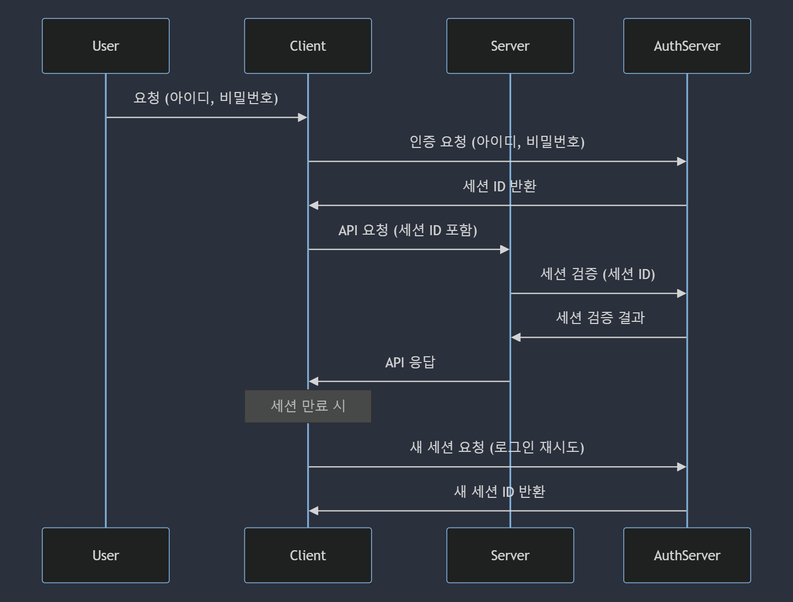

# Session 인증

- [Session 저장소](#session-저장소)
- [Session 인증 과정](#session-인증-과정)

## Session 저장소

| 저장 방식   | 설명                                       | 장점                                     | 단점                                               |
| ----------- | ------------------------------------------ | ---------------------------------------- | -------------------------------------------------- |
| 서버 메모리 | 서버의 메모리에 저장                       | 빠른 접근 속도                           | 서버 재시작 시 데이터 손실, 서버 확장 시 문제 발생 |
| 인메모리 DB | Redis 등의 인메모리 데이터베이스에 저장    | 빠른 접근 속도, 데이터 복제 및 분산 가능 | 휘발성 데이터베이스이므로 데이터 영속성 낮음       |
| 디스크 DB   | MySQL 등의 디스크 기반 데이터베이스에 저장 | 데이터 영속성 보장, 데이터 백업 가능     | 접근 속도 상대적으로 느림                          |
| 파일 시스템 | 파일 형태로 서버의 파일 시스템에 저장      | 구현이 간단, 데이터 영속성 보장          | 파일 읽기/쓰기 속도 느림, 파일 시스템에 의존적     |

## Session 인증 과정

