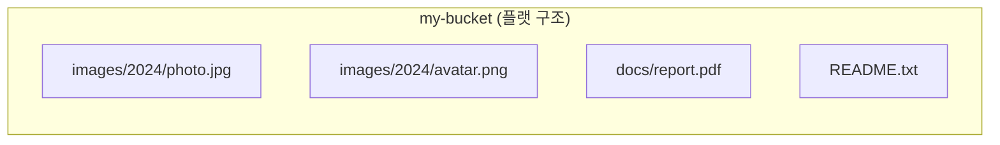

# S3

- [액세스 제어 (Access Control)](#액세스-제어-access-control)
  - [IAM (Identity and Access Management) - "사용자 신분증"](#iam-identity-and-access-management---사용자-신분증)
  - [버킷 정책 (Bucket Policy) - "버킷의 문지기"](#버킷-정책-bucket-policy---버킷의-문지기)
  - [ACL (Access Control List) - "개별 파일의 꼬리표"](#acl-access-control-list---개별-파일의-꼬리표)
  - [퍼블릭 액세스 차단 (Block Public Access, BPA) - "2중 잠금장치"](#퍼블릭-액세스-차단-block-public-access-bpa---2중-잠금장치)
- [액세스 지점 (Access Points)](#액세스-지점-access-points)
- [폴더 개념](#폴더-개념)
- [`GetObjectCommand`](#getobjectcommand)
- [`ListObjectsV2Command`](#listobjectsv2command)

## 액세스 제어 (Access Control)

### IAM (Identity and Access Management) - "사용자 신분증"

가장 권장되는 방식

- 개념: AWS 리소스에 접근 가능한 '사용자(User)'나 '역할(Role)'을 생성하고 권한 부여
- 구조: IAM User 생성 → Access Key 발급 → Policy(권한) 연결
- 장점: 버킷을 퍼블릭하게 열지 않아도, 키를 가진 서버만 안전하게 접근 가능

### 버킷 정책 (Bucket Policy) - "버킷의 문지기"

버킷 전체에 적용되는 JSON 형태의 규칙

- 용도: 특정 IP 허용, 퍼블릭 읽기 허용(정적 웹 호스팅), CloudFront 연동 등

### ACL (Access Control List) - "개별 파일의 꼬리표"

- 상태: Legacy 방식. 최근에는 비활성화(Bucket Owner Enforced) 권장
- 단점: 파일마다 권한을 관리해야 하므로 복잡하며 보안 사고 위험 높음

### 퍼블릭 액세스 차단 (Block Public Access, BPA) - "2중 잠금장치"

실수로 버킷을 공개하는 사고를 방지하기 위한 최상위 안전장치. 버킷 정책이나 ACL보다 우선순위 높음

퍼블릭 액세스 차단 4가지 옵션 (모두 True 권장):

1. 새 ACL 차단: 향후 ACL을 통한 파일 공개 시도 차단
2. 임의의 ACL 차단: 기존 ACL로 공개된 파일이 있어도 무시하고 차단
3. 새 퍼블릭 정책 차단: 버킷 정책에 "모두에게 공개" 내용 저장 불가
4. 임의의 퍼블릭 정책 차단: 기존 "모두에게 공개" 정책 무시 및 차단

## 액세스 지점 (Access Points)

기본적으로 S3 버킷은 하나의 주소와 정책을 가짐. 여러 팀이 거대한 버킷을 공유하여 정책 관리가 복잡해질 때 액세스 지점 사용

- 버킷: 거대한 창고 건물 하나
- 버킷 정책: 정문 경비실의 출입 명부. (인원 증가 시 관리 난해)
- 액세스 지점: 건물 옆에 뚫어놓은 '재무팀 전용 쪽문', '개발팀 전용 쪽문'

사용 이유:

1. 정책 분리: `Finance-AP`(재무팀)에는 재무 폴더 권한만, `Dev-AP`(개발팀)에는 로그 폴더 권한만 부여하여 관리 분리
2. 네트워크 제한: 특정 액세스 지점은 VPC(내부망)에서만 접근 가능하도록 제한 가능

## 폴더 개념

S3는 전통적인 파일 시스템과 달리 실제 폴더 구조가 없는 객체 스토리지이다. 폴더처럼 보이는 구조는 모두 S3와 클라이언트가 협력하여 시뮬레이션한 결과다.

### 객체 스토리지의 본질

S3의 버킷 내부는 플랫(flat)한 키-값 구조로 이루어져 있다. 모든 객체는 고유한 키(Key)를 가지며, 버킷 안에 계층 없이 나란히 존재한다. 디렉터리 개념이 없으므로, 운영체제의 파일 시스템처럼 중첩된 폴더 트리가 실제로 존재하지는 않는다.



### 키(Key)와 접두사(Prefix)

S3에서 객체의 위치를 나타내는 것은 키(Key)다. 키에 `/`가 포함되어 있으면 폴더 경로처럼 보이지만, 실제로는 단순한 문자열이다.

- 키 예시: `images/2024/photo.jpg`
- 이 키에서 `images/2024/`는 접두사(Prefix)이고, `photo.jpg`가 객체 이름이다.
- `/`는 특별한 구분자가 아니라 키를 구성하는 일반 문자다.

접두사(Prefix)를 기준으로 객체를 필터링하면 특정 "폴더" 안의 파일만 조회하는 것처럼 동작한다. `ListObjectsV2Command`의 `Prefix` 파라미터가 이 원리를 활용한다.

### 콘솔에서 폴더 생성 시 실제로 일어나는 일

AWS 콘솔에서 "폴더 만들기" 버튼을 누르면 내부적으로 크기가 0바이트인 객체가 생성된다. 이 객체의 키는 입력한 폴더명에 `/`를 붙인 형태다.

- 입력: `images`
- 실제 생성되는 객체 키: `images/` (0바이트)

이 객체는 폴더 자체를 나타내는 일종의 플레이스홀더(placeholder)다. 콘솔은 이 객체를 감지하여 폴더 아이콘으로 표시한다.

### 폴더처럼 보이는 이유

AWS 콘솔과 SDK는 `Prefix`와 `Delimiter`를 조합하여 폴더 탐색을 시뮬레이션한다.

- `Delimiter`로 `/`를 지정하면 S3는 응답에서 해당 구분자 이전까지의 접두사를 `CommonPrefixes`로 묶어 반환한다.
- 콘솔은 이 `CommonPrefixes`를 폴더로, `Contents`를 파일로 렌더링한다.

예를 들어 버킷에 아래 세 객체가 있을 때:

```text
images/2024/photo.jpg
images/2024/avatar.png
docs/report.pdf
```

`Delimiter=/`로 목록을 요청하면 `images/`와 `docs/`가 `CommonPrefixes`로 반환된다. 실제 폴더가 아니라 공통 접두사를 폴더처럼 그룹화한 것이다.

### 실무 주의사항

"폴더 삭제"는 실제로 해당 접두사를 가진 모든 객체를 개별적으로 삭제하는 작업이다. `images/` 폴더를 삭제한다는 것은 키가 `images/`로 시작하는 객체를 하나씩 찾아 삭제하는 것을 의미한다.

- 객체 수가 많으면 삭제 작업이 오래 걸릴 수 있음
- S3 콘솔은 내부적으로 `ListObjectsV2` → `DeleteObjects`를 반복하여 처리함
- SDK로 직접 구현할 때도 페이지네이션을 고려한 반복 삭제 로직이 필요함

## `GetObjectCommand`

특정 객체(파일) 하나를 가져오는 명령어

- 기능: 버킷 이름과 객체 키(Key)를 제공하여 파일의 내용(Body)과 메타데이터를 조회
- 사용 예시: 사용자가 특정 이미지를 요청했을 때 해당 이미지 데이터를 스트림 형태로 받아옴

```ts
import { S3Client, GetObjectCommand } from '@aws-sdk/client-s3';

const client = new S3Client({
  region: 'ap-northeast-2',
  credentials: {
    accessKeyId: process.env.S3_ACCESS_KEY,
    secretAccessKey: process.env.S3_SECRET_KEY,
  },
});

const command = new GetObjectCommand({
  Bucket: 'my-bucket',
  Key: 'images/profile.jpg',
});

try {
  const response = await client.send(command);
  // response.Body는 ReadableStream 형태 (Node.js)
  const str = await response.Body?.transformToString();
  console.log(str);
} catch (err) {
  console.error(err);
}
```

## `ListObjectsV2Command`

버킷 내의 객체 목록을 조회하는 명령어

- 주요 파라미터:
  - `Prefix`: 특정 접두사(폴더 경로)로 시작하는 객체만 필터링하여 조회. (예: `images/`로 시작하는 파일만 검색)
  - `Delimiter`: 폴더 구조를 시뮬레이션하기 위한 구분자. 보통 `/`를 사용하며, 이를 기준으로 하위 폴더처럼 보이는 객체들을 그룹화함
- 반환 값:
  - `Contents`: 실제 파일(객체)들의 메타데이터 리스트
  - `CommonPrefixes`: `Delimiter` 기준으로 묶인 '폴더'들의 리스트

```ts
import { S3Client, ListObjectsV2Command } from '@aws-sdk/client-s3';

const client = new S3Client({
  region: 'ap-northeast-2',
  credentials: {
    accessKeyId: process.env.S3_ACCESS_KEY,
    secretAccessKey: process.env.S3_SECRET_KEY,
  },
});

const command = new ListObjectsV2Command({
  Bucket: 'my-bucket',
  Prefix: 'images/', // 'images/' 폴더 내의 파일만 조회
  Delimiter: '/', // 폴더 구조 시뮬레이션
  MaxKeys: 10, // 한 번에 가져올 최대 개수
});

try {
  const response = await client.send(command);

  // 파일 목록
  response.Contents?.forEach((item) => {
    console.log(`File: ${item.Key}`);
  });

  // 하위 폴더 목록
  response.CommonPrefixes?.forEach((prefix) => {
    console.log(`Folder: ${prefix.Prefix}`);
  });
} catch (err) {
  console.error(err);
}
```
