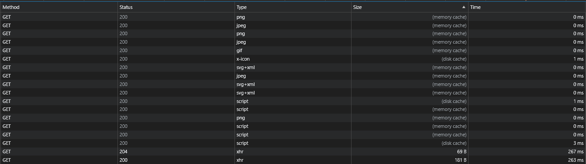

## 브라우저 캐시

캐시란, 데이터를 미리 복사해 놓는 임시 장소를 가리킨다. 캐시를 이용하지 않았을 때의 데이터 접근 시간이 오래 걸리는 경우나 값을 다시 연산하는 시간을 단축하기 위해 사용된다. 데이터가 본래 저장되어 있던 장소보다 접근 시간이 더 빠른 별도의 장소에 데이터를 미리 복사해 놓으면 계산이나 접근 시간 없이 더 빠른 속도로 데이터에 접근할 수 있다.

브라우저는 웹 페이지에서 사용되는 이미지, 스크립트, 스타일시트, 폰트 및 기타 웹 자원을 캐시에 저장한다. 캐시 덕에 동일한 자원을 나중에 다시 다운로드하지 않고 재사용할 수 있으며 렌더링 속도를 높이고 대역폭 사용을 줄일 수 있다. 캐시된 데이터는 보통 웹 서버에서 지정한 만료 기간 또는 캐시 제어 헤더를 기반으로 관리되며 만료 기간이 지나면 브라우저는 데이터를 새로 다운로드한다.

### memory cache vs disk cache

위의 개발자 도구에서 확인할 수 있듯이, 브라우저에서는 자원을 캐싱할 때 저장되는 위치에 따라 memory cache와 disk cache로 나뉜다. memory cache는 컴퓨터의 RAM(메모리)에 저장되고, disk cache는 컴퓨터의 하드디스크의 저장된다. 윈도우 운영체제에서 크롬을 사용한다면 아래 경로를 통해 저장된 캐시를 확인할 수 있다.

C:\Users\<사용자 이름>\AppData\Local\Google\Chrome\User Data\Default\Cache

memory cache는 브라우저 종료 시 데이터가 휘발되며, 주로 크기가 작거나 빠른 엑세스가 필요한 자원들이 저장된다. 빠른 엑세스는 디스크보다 메모리가 접근 위치가 가깝기 때문에 상대적으로 빠르게 접근이 가능하다. disk cache는 브라우저가 종료되어도 휘발되지 않으며, 주로 크기가 크고 복잡한 자원들이 저장된다.

memory cache, disk cache, 캐시 안된 자원의 Time 열을 확인하면 속도의 차이를 확인할 수 있다.
