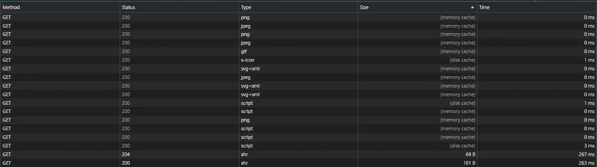

# 브라우저 캐시

- [캐시(Cache)의 개념](#캐시cache의-개념)
- [브라우저 캐시(Browser Cache)란?](#브라우저-캐시browser-cache란)
- [캐시 제어 헤더(Cache Control Header)](#캐시-제어-헤더cache-control-header)
  - [Cache-Control 지시어](#cache-control-지시어)
  - [검증 헤더와 조건부 요청](#검증-헤더와-조건부-요청)
- [메모리 캐시(Memory Cache) • 디스크 캐시(Disk Cache)](#메모리-캐시memory-cache--디스크-캐시disk-cache)

## 캐시(Cache)의 개념

캐시는 데이터에 접근하는 시간을 단축하기 위해 원본 데이터의 복사본을 임시로 저장해 두는 장소다.

- 특징:
  - 반복적으로 사용하는 데이터를 미리 복사해 놓음으로써 처리 속도를 높임.
  - 네트워크 비용을 절감하고 서버의 부하를 줄임.
  - 데이터의 최신성(Freshness)과 접근 속도 사이의 트레이드오프가 존재함.

## 브라우저 캐시(Browser Cache)란?

웹 브라우저가 웹 페이지를 구성하는 자원(HTML, CSS, JS, 이미지 등)을 로컬 저장소에 보관하여 재사용하는 메커니즘이다.

- 이점:
  - 동일한 자원의 중복 다운로드 방지.
  - 페이지 로딩 및 렌더링 속도 향상.
  - 사용자 네트워크 대역폭 사용량 감소.

## 캐시 제어 헤더(Cache Control Header)

HTTP 응답 헤더를 통해 브라우저가 자원을 얼마나 오래, 어떤 방식으로 캐싱할지 결정한다.

### Cache-Control 지시어

- `max-age=N`: 자원의 유효 기간을 초 단위로 지정함 (예: `max-age=3600`).
- `no-cache`: 캐시를 사용하기 전에 항상 서버에 재검증(Validation) 요청을 보내야 함. (캐시를 안 쓰는 것이 아님)
- `no-store`: 자원을 로컬 저장소에 절대로 저장하지 않음. 보안이 중요한 데이터에 사용함.
- `public`: 모든 중간 서버(CDN, 프록시 등)에서 캐싱 가능함.
- `private`: 브라우저(최종 사용자)의 로컬 캐시에만 저장 가능함.
- `must-revalidate`: 캐시 만료 후 반드시 서버의 재검증을 거쳐야 하며, 서버 연결 실패 시 오래된 데이터를 사용하지 않음.

### 검증 헤더와 조건부 요청

캐시 만료 후에도 자원이 변경되지 않았다면, 서버는 `304 Not Modified` 응답을 통해 본문 없이 헤더만 전송하여 효율성을 높인다.

- `Last-Modified` • `If-Modified-Since`: 자원의 최종 수정 시각을 기준으로 검증함.
- `ETag` • `If-None-Match`: 자원의 고유한 해시값(Entity Tag)을 기준으로 검증함. 시각 기준보다 더 정밀한 검증이 가능함.

## 메모리 캐시(Memory Cache) • 디스크 캐시(Disk Cache)

브라우저는 자원의 크기와 사용 빈도에 따라 저장 위치를 자동으로 결정한다.

- 메모리 캐시(Memory Cache):
  - RAM에 저장되며 브라우저 종료 시 휘발됨.
  - 접근 속도가 매우 빠름 (0ms).
  - 주로 폰트나 렌더링 직후 재사용되는 이미지 등이 저장됨.
- 디스크 캐시(Disk Cache):
  - 하드디스크(SSD)에 저장되며 브라우저 종료 후에도 유지됨.
  - 메모리보다 느리지만 네트워크 요청보다는 월등히 빠름.
  - 크기가 큰 스크립트나 스타일시트 파일 등이 주로 저장됨.
