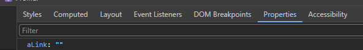
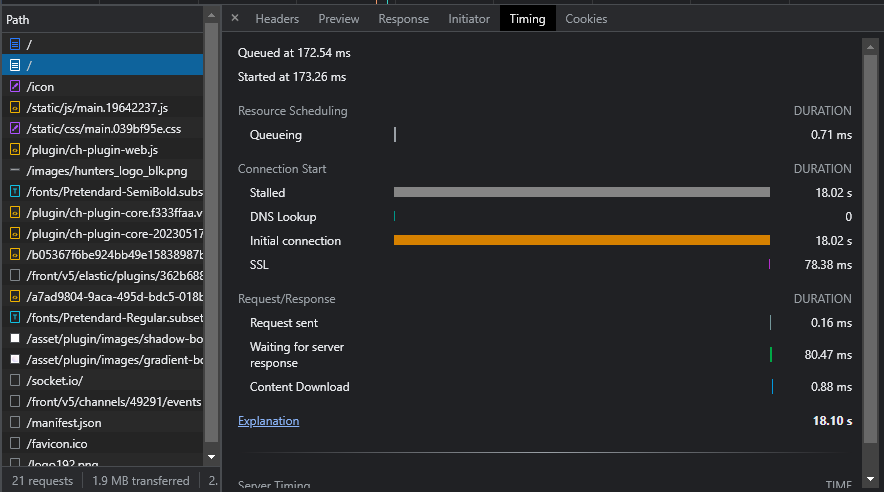
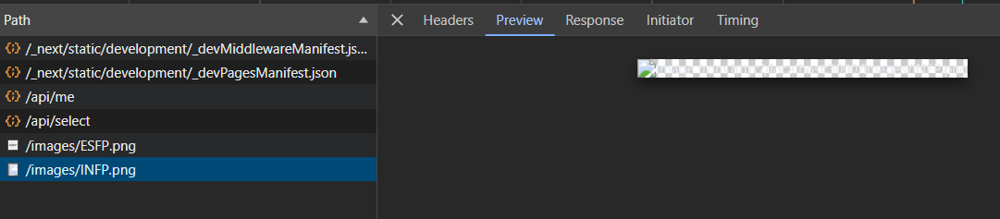

# 개발자 도구 디버깅

## 등록 이벤트 확인하기

```js
getEventListeners($0);
getEventListeners(window);
getEventListeners(document);
```

또는 개발자 도구



### initial connection

리액트 프로젝트를 배포 후에 사이트에 접속해보니 사이트가 매우 느리게 로드되었다. 거의 체감상 30초 정도 걸린 것 같다.

처음에는 SPA니까 첫 로드가 오래 걸린다 생각했지만, 그러기엔 번들 파일의 크기가 1.2MB정도였다. 개발 중에 급하게 폰트를 적용했었는데 해당 폰트가 경량화 폰트가 아니라서 폰트 용량 문제라고 생각했으나, 경량화 폰트를 적용해도 해당 이슈는 사라지지 않았다.

그래서 개발자 도구를 좀 더 디테일하게 살펴보니 진입점 파일인 index.html을 불러오는데 약 20초 정도가 걸렸다. 원인은 아래 사진과 같이 initial connection 이슈였다. 이걸 보니 단순히 프론트 쪽에 코드를 수정해서 될 일이 아니라 네트워크 쪽 이슈 같았다. 백엔드 개발자가 도메인 연결 쪽을 검토해줬는데 연결한 도메인이 다른 IP에도 연결되어 있어서 해당 IP를 잘 찾지못해서 일어난 이슈였다.



해당 이슈가 다시 발생한다면 도메인 연결을 검토해보자.

### blocked:mixed-content

https 사이트에서 http 통신을 할 경우 발생한다.

### content-disposition

content-dispositon의 경우 서버에서 값을 노출시켜주지 않으면 axios에서 보여지지 않으므로 설정을 따로 해야한다.

Access-Control-Expose-Headers: Content-Disposition
Content-Type: application/octet-stream
Content-Disposition: attachment; filename="example.dat"

### CSS가 안 먹히는 경우

사용자의 브라우저 버전이 낮을 경우 해당 요소에 적용된 스타일이 지원이 안되는 경우가 있다. 브라우저 업데이트를 요구한다.

### 화면이 하얗게 뜨는 경우

자바스크립트에서 메서드 참조를 못하거나 값을 참조하지 못했을 때 발생할 확률이 크다

### 이미지 로드 시 개발자 도구에서 미리보기가 안 뜨는 이슈



```js
async function getResource() {
  try {
    const response = await fetch('/images/images/test.png');
    const blob = await response.blob();
    return new File([blob], 'images/test.png');
  } catch (error) {
    console.log(error);
  }
}
```

위 코드에서 보듯이 `fetch`로 가져온 자원은 개발자 도구 Network 탭에서 미리보기 가능한 상태이지만 `blob()` 메서드를 적용하면서 해당 `response`의 타입이 변경되었으니 미리보기가 불가능해진다.
