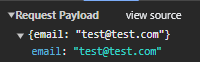

# Browser Network

- [서버와 클라이언트의 개념](#서버와-클라이언트의-개념)
- [브라우저의 주소 표시창에 URL을 입력했을 때 발생하는 동작](#브라우저의-주소-표시창에-url을-입력했을-때-발생하는-동작)
- [논 스트림 방식 • 스트림 방식](#논-스트림-방식--스트림-방식)
  - [논 스트림 방식](#논-스트림-방식)
  - [스트림 방식](#스트림-방식)
  - [버퍼(Buffer)](#버퍼buffer)
- [MIME(Multipurpose Internet Mail Extensions)](#mimemultipurpose-internet-mail-extensions)
  - [`multipart/form-data`](#multipartform-data)
  - [`application/json`](#applicationjson)
  - [`application/octet-stream`](#applicationoctet-stream)
  - [`application/x-www-form-urlencoded`](#applicationx-www-form-urlencoded)
  - [기타 MIME 타입](#기타-mime-타입)
- [네트워크 리소스 타입](#네트워크-리소스-타입)
- [브라우저의 파일 처리 방식](#브라우저의-파일-처리-방식)
  - [파일 선택과 메모리 동작](#파일-선택과-메모리-동작)
  - [서버 측 파일 저장](#서버-측-파일-저장)

## 서버와 클라이언트의 개념

- 서버(Server): 네트워크를 통해 클라이언트에게 정보나 서비스를 제공하는 컴퓨터 시스템 또는 프로그램. (예: 웹 서버, 이메일 서버, DB 서버)
- 클라이언트(Client): 서버에 접속하여 서비스를 요청하고, 그 결과를 사용자에게 보여주는 단말기 또는 프로그램. (예: 웹 브라우저, 모바일 앱)

## 브라우저의 주소 표시창에 URL을 입력했을 때 발생하는 동작

1. URL 해석: 브라우저가 입력된 텍스트가 검색어인지 URL인지 확인한다.
2. DNS 조회: 도메인 이름을 IP 주소로 변환하기 위해 DNS 서버에 요청한다.
   - 브라우저 캐시 확인: 브라우저가 이전에 방문한 기록이 있는지 자체 캐시를 확인한다.
   - OS 캐시 (hosts 파일 포함) 확인: 브라우저에 없으면 운영체제의 DNS 캐시와 hosts 파일을 확인한다.
   - 라우터 캐시 확인: 공유기(라우터)의 캐시를 확인한다.
   - ISP의 DNS 서버 (Recursive Resolver) 요청: 위 단계에서 찾지 못하면, 인터넷 서비스 제공자(ISP)가 제공하는 DNS 서버(또는 사용자가 설정한 8.8.8.8 같은 공용 DNS)에 요청을 보낸다.
   - 반복적 질의 (Iterative Query): ISP의 DNS 서버가 캐시를 가지고 있지 않다면, 그때부터 Root 네임서버 -> TLD 네임서버(.com 등) -> 도메인의 실제 네임서버 순으로 순차적으로 물어보며 IP 주소를 찾아낸다.
3. TCP 연결 (3-way Handshake): 서버와 통신하기 위해 TCP 소켓 연결을 맺는다. HTTPS의 경우 TLS Handshake가 추가된다.
4. HTTP 요청: 브라우저가 서버로 HTTP Request 메시지를 보낸다.
5. 서버 처리 및 응답: 서버가 요청을 처리하고 HTTP Response 메시지를 보낸다.
6. 렌더링: 브라우저가 응답받은 리소스를 파싱하여 화면에 그린다.

## 논 스트림 방식 • 스트림 방식

### 논 스트림 방식

- 논 스트림 방식에서는 서버로부터 자원(예: HTML, JSON, 이미지 등)을 요청하면, 브라우저는 해당 데이터가 완전히 수신될 때까지 기다린 뒤, 그 이후에 렌더링이나 후속 작업을 시작한다.

- 동작 과정
  1. 클라이언트(브라우저)가 서버에 HTTP 요청을 보냄.
  2. 서버가 응답을 준비하고, 전체 데이터를 한 번에 전송.
  3. 브라우저는 데이터가 모두 도착할 때까지 대기.
  4. 데이터 수신이 완료되면 이를 파싱하거나 렌더링.

- 특징
  - 데이터가 완전한 상태로 도착하므로, 처리 로직이 단순하고 안정적임.
  - 데이터 크기가 크거나 네트워크 속도가 느리면 응답 시간이 길어질 수 있음.

### 스트림 방식

- 스트림 방식에서는 데이터를 한 번에 모두 받는 대신, 작은 조각(chunk) 단위로 나누어 데이터가 도착하는 대로 즉시 처리할 수 있어 대기 시간이 줄어든다.

- 동작 과정
  1. 클라이언트가 서버에 요청을 보냄.
  2. 서버가 데이터를 스트림 형태로 전송.
  3. 브라우저는 데이터 조각이 도착할 때마다 실시간으로 처리.
  4. 모든 데이터가 도착하지 않아도 작업을 시작할 수 있음.

- 특징
  - 대용량 데이터나 실시간 데이터를 효율적으로 처리 가능. 초기 응답 시간이 빠르고, 메모리 사용이 최적화됨.
  - 구현이 더 복잡하고, 데이터가 순차적으로 도착하므로 중간에 오류가 발생하면 처리가 까다로울 수 있음.

### 버퍼(Buffer)

- 브라우저는 수신된 데이터 조각을 버퍼라는 임시 저장소에 저장한다.
- 버퍼는 단기적인 재생을 위한 임시 메모리일 뿐, 디스크에 영구 저장되는 캐시와는 다르다.
- 버퍼의 크기는 처리 속도와 데이터 도착 속도에 따라 동적으로 조절될 수 있다.

- 버퍼 동작과정
  1. 서버는 데이터를 작은 조각 단위로 브라우저에 전송하면 브라우저는 이 데이터를 버퍼에 채운다.
  2. 버퍼에 데이터가 충분히 쌓이면 처리가 시작되고, 처리됨에 따라 버퍼에서 데이터가 소진된다.
  3. 동시에 브라우저는 네트워크를 통해 새로운 데이터를 계속 받아와 버퍼를 채운다. 이 과정에서 네트워크 속도가 느리면 버퍼가 비워지는 속도가 빨라져 버퍼링 상태(재생 중단)가 발생할 수 있다.
  4. 브라우저는 버퍼에 최소한의 데이터를 유지하려고 한다. 이를 최소 버퍼 임계값이라고 하는데, 이 값에 도달하면 재생을 멈추고 데이터를 더 채우기를 기다린다.
  5. 반대로 버퍼가 가득 차면, 브라우저는 서버에 데이터 전송을 일시적으로 느리게 요청하거나 중단할 수 있다(Flow Control).

## MIME(Multipurpose Internet Mail Extensions)

- MIME 타입은 파일의 형식이나 유형을 식별하기 위한 표준화된 문자열이다.
- 형태는 `type/subtype` (주요 콘텐츠 유형/해당 유형의 구체적인 하위 분류)이다.

### `multipart/form-data`

- 여러 데이터 유형(텍스트, 이미지, 파일 등)을 동시에 HTTP 요청의 `body` 값으로 전송할 수 있으며 주로 파일 업로드와 폼 데이터를 같이 전송할 때 사용된다.
- 각 파트에 `Content-Type` 및 `Content-Disposition` 헤더가 부여된다.
- 자바스크립트에서 바이너리 데이터를 다룰 때 `blob` 객체로 다뤄지는데 `multipart/form-data`를 사용하면 해당 객체를 자동으로 바이너리 데이터로 변환하고 서버로 전송한다.

### `application/json`

- HTTP 요청의 `body` 값으로 JSON 데이터를 보낼 때 사용한다.

- 바이너리 데이터를 Base64 형식으로 인코딩해서 보내는 경우는 아래와 같다.

### `application/octet-stream`

- HTTP 요청의 `body` 값으로 아무런 특별한 분류나 변환 없이 원시 바이트 데이터로 이루어진 스트림을 전송할 때 사용한다.
- 어떤 종류의 파일인지 알 수 있는 바이너리 데이터는 다른 MIME 타입을 사용해서 명시해준다.
- 자바스크립트에서 바이너리 데이터를 다룰 때 `blob` 객체로 다뤄지는데 `application/octet-stream`을 사용하면 해당 객체를 바이너리 데이터로 변환 후에 서버로 전송해야 한다.

### `application/x-www-form-urlencoded`

- HTML 폼 방식으로 HTTP 요청을 할 때 기본값으로 설정되며, HTTP 요청의 `body` 값으로 데이터를 URL 인코딩하여 보낼 때 사용한다. (`key=value&key2=value2` 형태)

### 기타 MIME 타입

| 확장자      | MIME 타입                                                                   |
| ----------- | --------------------------------------------------------------------------- |
| .xml        | `application/xml`                                                           |
| .zip        | `application/zip`                                                           |
| .pdf        | `application/pdf`                                                           |
| .sql        | `application/sql`                                                           |
| .graphql    | `application/graphql`                                                       |
| .js         | `application/javascript`                                                    |
| .doc        | `application/msword`                                                        |
| .docx       | `application/vnd.openxmlformats-officedocument.wordprocessingml.document`   |
| .xls        | `application/vnd.ms-excel`                                                  |
| .xlsx       | `application/vnd.openxmlformats-officedocument.spreadsheetml.sheet`         |
| .ppt        | `application/vnd.ms-powerpoint`                                             |
| .pptx       | `application/vnd.openxmlformats-officedocument.presentationml.presentation` |
| .css        | `text/css`                                                                  |
| .csv        | `text/csv`                                                                  |
| .html       | `text/html`                                                                 |
| .txt        | `text/plain`                                                                |
| .wav        | `audio/wav`                                                                 |
| .ogg        | `audio/ogg`                                                                 |
| .mp3        | `audio/mpeg`                                                                |
| .mp4        | `video/mp4`                                                                 |
| .webm       | `video/webm`                                                                |
| .mov        | `video/quicktime`                                                           |
| .gif        | `image/gif`                                                                 |
| .svg        | `image/svg+xml`                                                             |
| .jpeg, .jpg | `image/jpeg`                                                                |
| .webp       | `image/webp`                                                                |

## 네트워크 리소스 타입

1. Document
   - 주로 HTML 문서 자체
   - 발생 이벤트: 페이지에 직접 접속하거나, `a` 태그로 일반 링크 클릭, `location.href`/`location.assign`, `window.open`(같은 오리진), F5/새로고침, 뒤로가기/앞으로가기(캐시 상황 제외) 등

2. Stylesheet (CSS)
   - `<link rel="stylesheet">`, `<style>` 안에 `@import`, CSS 파일
   - 발생 이벤트: HTML 파싱 중 `<link>` 태그를 만났을 때, CSS 내 `@import`를 만났을 때, 동적으로 `document.write`로 삽입된 `<link>` 태그

3. Script
   - 외부 자바스크립트 파일 (`<script src="...">`)
   - 발생 이벤트: HTML 파싱 중 `<script src>`를 만났을 때 (`defer`/`async` 여부에 따라 타이밍 다름), 동적으로 `createElement('script')`로 삽입, `import()` 동적 임포트, `new Worker('/worker.js')` 등

4. Image
   - ``, `<picture>`, `<svg>`, `background-image`, favicon 등
   - 발생 이벤트: HTML 파싱 중 해당 요소를 만났을 때, CSS `background-image`가 적용될 요소가 레이아웃에 들어갈 때, 동적으로 `new Image().src`, `` 요소 동적 생성 등

5. Font
   - `@font-face`로 선언된 웹폰트 (`.woff`, `.woff2`, `.ttf` 등)
   - 발생 이벤트: CSS 파싱 후 해당 폰트가 실제 텍스트 렌더링에 필요할 때 (보통 레이아웃/페인트 직전)

6. Media
   - `<video>`, `<audio>`, `<track>`, video poster 등
   - 발생 이벤트: 해당 요소가 DOM에 들어가고 재생 가능 상태가 될 때 (`autoplay`이거나 사용자가 재생 버튼 누를 때 실제 스트리밍 시작)

7. Manifest
   - web app manifest 파일 (`manifest.json`)
   - 발생 이벤트: `<link rel="manifest">` 태그를 HTML 파싱 중 발견했을 때

8. XHR / Fetch
   - `XMLHttpRequest`, `fetch()` API로 발생한 요청
   - 발생 이벤트: 자바스크립트에서 ajax 호출할 때 (페이지 로드 후 언제든)

9. WebSocket
   - `new WebSocket()`으로 연결
   - 발생 이벤트: 스크립트에서 `WebSocket` 인스턴스 생성 및 연결 시도 시

10. EventSource
    - Server-Sent Events (`new EventSource()`)
    - 발생 이벤트: 스크립트에서 `EventSource` 생성 시

11. Beacon
    - `navigator.sendBeacon()`
    - 발생 이벤트: `sendBeacon` 호출 시 (주로 페이지 unload 전에 데이터 전송)

12. Prefetch / Preload / Prerender
    - `<link rel="prefetch">`, `<link rel="preload">`, `<link rel="prerender">` 등
    - 발생 이벤트: HTML 파싱 중 해당 `<link>` 태그를 만났을 때 (브라우저가 여유 있을 때 미리 받아옴)

13. Iframe
    - `<iframe src="...">`
    - 발생 이벤트: `iframe` 요소가 DOM에 삽입되고 `src`가 설정될 때 (lazyloading인 경우 viewport 진입 시)

14. TextTrack
    - `<video>`의 `<track kind="subtitles">` 등 자막 파일 (`.vtt`)
    - 발생 이벤트: `video` 요소가 subtitles track을 로드할 때

15. Other
    - 위에 해당되지 않는 모든 것 (예: `.json` 파일 직접 요청, `.txt`, 브라우저 확장 요청 등)

## 브라우저의 파일 처리 방식

- `FormData` 사용 (`multipart/form-data`)
  - 브라우저가 파일을 안전하게 바이너리로 읽고, 자동으로 분할하여 전송한다.
  - 메모리 효율성: `fetch`나 `XHR`로 전송 시점에 로컬 디스크에서 스트리밍 방식으로 데이터를 조금씩 읽어 전송하므로, 대용량 파일 업로드 시에도 메모리 폭발을 방지한다.

- JSON 사용 (`application/json`)
  - 파일을 전송하려면 Base64로 인코딩해야 한다.
  - 단점: 용량이 약 33% 증가하며, 인코딩/디코딩 과정에서 CPU 비용이 발생하고 메모리 사용량이 늘어난다.

### 파일 선택과 메모리 동작

브라우저는 사용자가 `<input type="file">`을 통해 파일을 선택했다고 해서 파일의 내용 전체를 즉시 메모리(RAM)에 올리지 않는다.

1. 파일 선택 단계 (참조 생성)
   - 사용자가 파일을 선택하면 브라우저는 `File` 객체를 생성한다.
   - 이 객체는 파일의 경로(참조), 이름, 크기, 타입 같은 메타데이터만 가지며, 실제 데이터는 디스크에 남아있다. (메모리 사용량 미미함)

2. 파일 읽기 API 사용 시 (메모리 적재)
   - 개발자가 `FileReader`나 `file.arrayBuffer()`, `file.text()` 등을 호출하면, 디스크에서 데이터를 읽어 메모리에 적재한다.
   - 주의: 대용량 파일을 `readAsDataURL`(Base64) 등으로 한 번에 읽으면 메모리 부족 현상이 발생할 수 있다.

3. `URL.createObjectURL` 사용 시 (가상 URL 생성, 참조 방식)
   - `Blob`이나 `File` 객체를 가리키는 가상의 URL(`blob:...`)을 생성한다.
   - 파일 내용을 메모리에 전부 로드하는 Base64 방식보다 메모리 효율적이고 속도가 빨라 이미지 미리보기나 다운로드 링크 생성에 권장된다.

4. 전송 시 (스트리밍)
   - `FormData`에 파일을 담아 전송할 때는 내부적으로 스트림(Stream)을 사용하여 디스크에서 조금씩 읽어 네트워크로 보낸다. 따라서 대용량 파일도 안정적으로 전송 가능하다.

### 서버 측 파일 저장

서버(Node.js)는 파일을 수신한다고 해서 자동으로 디스크에 저장하지 않는다. 개발자가 명시적으로 저장 방식을 결정해야 한다.

- multer (diskStorage): 미들웨어가 파일 수신과 동시에 디스크에 저장한다.
- Stream (pipe): `req.pipe(fs.createWriteStream(...))` 형태로 스트리밍하여 저장한다. (메모리 효율적)
- Memory: 별도 설정이 없거나 `memoryStorage` 사용 시, 데이터가 메모리에만 존재하다가 프로세스 종료 시 사라진다.
