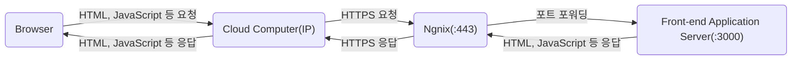
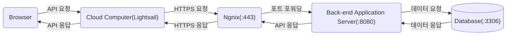

# Browser Note

- [웹 브라우저란?](#웹-브라우저란)
  - [렌더링 과정](#렌더링-과정)
- [웹 서버란?](#웹-서버란)
- [브라우저와 서버의 의사소통](#브라우저와-서버의-의사소통)
- [브라우저의 주소 표시창에 URL을 입력했을 때 발생하는 동작](#브라우저의-주소-표시창에-url을-입력했을-때-발생하는-동작)

## 웹 브라우저란?

브라우저는 HTTP 프로토콜을 해석할 수 있는 프로그램이며, HTTP 요청으로 응답한 컨텐츠를 브라우저 상에 보여주는 역할을 한다. 컨텐츠는 주로 HTML, CSS, JavaScript, JSON, 이미지, 폰트, 미디어 등 여러가지가 존재하는데, 그 중에서 HTML, CSS, JavaScript는 브라우저 내부에 렌더링 엔진과 자바스크립트 엔진에 의해 파싱 되어 렌더 트리를 생성한 후 화면에 표현한다.

### 렌더링 과정

## 웹 서버란?

웹 서버는 HTTP 프로콜을 해석할 수 있는 프로그램이 돌아가고 있는 컴퓨터를 말한다.

아래는 기본적으로 HTTP/HTTPS 요청을 받는 웹서버를 바탕으로 하고 사용성에 따라 구분해 보았다.

API 서버: DB와 연결되어 사용자의 요청에 따라 GET/POST/PUT/DELETE 동작을 수행하는 서버

SSR 서버: DB와 연결되어 사용자의 요청에 따라 알맞은 데이터를 넣어 렌더링된 HTML 파일을 응답하는 서버

Static 서버: 사용자가 요청한 정적 파일(HTML, JavaScript, CSS, Image, Font 등)을 응답하는 서버

## 브라우저와 서버의 의사소통

## 브라우저의 주소 표시창에 URL을 입력했을 때 발생하는 동작

