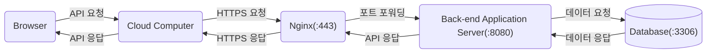

# Browser Note

- [웹 브라우저란?](#웹-브라우저란)
  - [렌더링 과정](#렌더링-과정)
- [웹 서버란?](#웹-서버란)
- [브라우저와 서버의 의사소통](#브라우저와-서버의-의사소통)
- [브라우저의 주소 표시창에 URL을 입력했을 때 발생하는 동작](#브라우저의-주소-표시창에-url을-입력했을-때-발생하는-동작)
- [VSync (Vertical Synchronization) 신호](#vsync-vertical-synchronization-신호)
  - [핵심 개념](#핵심-개념)
  - [렌더링 핵심](#렌더링-핵심)

## 웹 브라우저란?

브라우저는 사용자가 선택한 자원(HTML, 이미지 등)을 서버에 요청하고 브라우저에 표시하는 소프트웨어다. HTTP 프로토콜을 통해 서버와 통신하며, HTML, CSS, JavaScript는 렌더링 엔진과 JavaScript 엔진에 의해 파싱되어 렌더 트리를 생성하고 화면에 표현된다.

### 렌더링 과정

1. DOM 트리 생성: HTML을 파싱하여 DOM 트리를 만든다.
2. CSSOM 트리 생성: CSS를 파싱하여 CSSOM 트리를 만든다.
3. 렌더 트리 생성: DOM과 CSSOM을 결합하여 렌더 트리를 만든다. (display: none 요소 제외)
4. 레이아웃 (Reflow): 뷰포트 내에서 각 노드의 정확한 위치와 크기를 계산한다.
5. 페인트 (Repaint): 계산된 위치에 픽셀을 채워 넣는다.
6. 컴포지트 (Composite): 레이어들을 합성하여 최종 화면을 그린다.

## 웹 서버란?

웹 서버는 클라이언트(브라우저)의 요청을 받아 정적 컨텐츠나 동적 컨텐츠를 제공하는 컴퓨터 또는 프로그램이다. 용도에 따라 다음과 같이 분류된다:

- API 서버: DB와 연결되어 비즈니스 로직을 처리하고 데이터(JSON 등)를 응답
- SSR (Server Side Rendering) 서버: 서버에서 데이터를 포함한 완성된 HTML을 생성하여 응답
- Static 서버: 미리 생성된 정적 파일(HTML, JavaScript, CSS, Image, Font 등)을 그대로 응답

## 브라우저와 서버의 의사소통

브라우저와 서버는 주로 HTTPS를 통해 통신하며, Nginx 등의 웹 서버(또는 리버스 프록시)가 요청을 받아 적절한 애플리케이션 서버로 전달한다.

## 브라우저의 주소 표시창에 URL을 입력했을 때 발생하는 동작

1. URL 해석: 브라우저가 입력된 텍스트가 검색어인지 URL인지 확인한다.
2. DNS 조회: 도메인 이름을 IP 주소로 변환하기 위해 DNS 서버에 요청한다. (캐시 확인 -> hosts 파일 -> DNS 서버)
3. TCP 연결 (3-way Handshake): 서버와 통신하기 위해 TCP 소켓 연결을 맺는다. HTTPS의 경우 TLS Handshake가 추가된다.
4. HTTP 요청: 브라우저가 서버로 HTTP Request 메시지를 보낸다.
5. 서버 처리 및 응답: 서버가 요청을 처리하고 HTTP Response 메시지를 보낸다.
6. 렌더링: 브라우저가 응답받은 리소스를 파싱하여 화면에 그린다.

## VSync (Vertical Synchronization) 신호

- 정의: 디스플레이가 새로운 프레임을 그릴 준비가 되었음을 알리는 하드웨어 신호
- 주기: 60Hz 화면에서 약 16.6ms마다 발생 (144Hz는 약 6.94ms)
- 목적: 티어링(화면 찢김) 방지를 위해 GPU의 프레임 생성 속도와 디스플레이의 주사율(Refresh Rate)을 동기화

### 핵심 개념

- VSync는 "디스플레이가 다음 프레임을 받을 준비가 되었음"을 알리는 신호다.
- 브라우저 렌더링 엔진은 VSync 주기에 맞춰 프레임을 생성하려 노력한다.
- `requestAnimationFrame`은 VSync 신호에 맞춰 콜백을 실행하도록 예약한다.
- 메인 스레드가 VSync 주기(16.6ms) 내에 작업을 완료하지 못하면 프레임 드롭(Jank)이 발생하여 화면이 버벅거린다.

### 렌더링 핵심

- 렌더링 파이프라인: JavaScript 실행 -> 스타일 계산 -> 레이아웃 -> 페인트 -> 컴포지트
- 최적화 전략:
  - 레이아웃/페인트 최소화: `transform`, `opacity` 속성 사용 권장 (컴포지터 스레드에서 처리됨)
  - 메인 스레드 차단 방지: 긴 작업은 Web Worker로 분리하거나 작업을 잘게 쪼개어(Time Slicing) 실행
  - requestAnimationFrame 활용: 애니메이션 관련 로직은 `setTimeout` 대신 `rAF` 사용
- 이벤트 루프와 렌더링: 렌더링 업데이트는 마이크로태스크 큐가 비워진 후, 다음 매크로태스크 실행 전에 발생할 수 있다.
