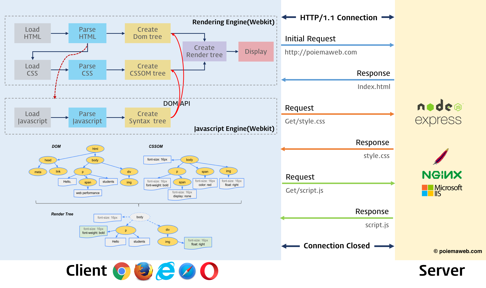

# Browser Note

- [웹 브라우저란?](#웹-브라우저란)
  - [렌더링 과정](#렌더링-과정)
- [웹 서버란?](#웹-서버란)
- [브라우저와 서버의 의사소통](#브라우저와-서버의-의사소통)
- [브라우저의 주소 표시창에 URL을 입력했을 때 발생하는 동작](#브라우저의-주소-표시창에-url을-입력했을-때-발생하는-동작)
  - [VSync (Vertical Synchronization) 신호](#vsync-vertical-synchronization-신호)
    - [핵심 개념](#핵심-개념)
    - [렌더링 핵심](#렌더링-핵심)

## 웹 브라우저란?

브라우저는 HTTP 프로토콜을 해석할 수 있는 프로그램으로, HTTP 요청으로 받은 컨텐츠를 브라우저에 표시한다. HTML, CSS, JavaScript는 렌더링 엔진과 JavaScript 엔진에 의해 파싱되어 렌더 트리를 생성하고 화면에 표현된다.

### 렌더링 과정

## 웹 서버란?

웹 서버는 HTTP 프로토콜을 해석할 수 있는 프로그램이 실행되는 컴퓨터다. 용도에 따라 다음과 같이 분류된다:

- API 서버: DB와 연결되어 GET/POST/PUT/DELETE 요청을 수행
- SSR 서버: DB와 연결되어 데이터를 넣어 렌더링된 HTML을 응답
- Static 서버: 정적 파일(HTML, JavaScript, CSS, Image, Font 등)을 응답

## 브라우저와 서버의 의사소통

브라우저와 서버는 HTTPS를 통해 통신하며, Nginx 등의 리버스 프록시가 포트 포워딩을 담당한다.

## 브라우저의 주소 표시창에 URL을 입력했을 때 발생하는 동작

### VSync (Vertical Synchronization) 신호

- 정의: 디스플레이가 새로운 프레임을 그릴 준비가 되었음을 알리는 하드웨어 인터럽트
- 주기: 60Hz 화면에서 16.6ms마다 발생 (144Hz는 약 6.94ms)
- 목적: 티어링(화면 찢김) 방지를 위해 GPU 출력과 디스플레이 주사율을 동기화

#### 핵심 개념

- VSync = "디스플레이가 다음 프레임을 받을 준비가 되었음"을 알리는 신호
- 렌더링 엔진은 VSync 주기에 맞춰 RAF → 스타일/레이아웃/페인트 → 컴포지트를 실행
- 이벤트 루프는 메인 스레드가 VSync 주기 내에 작업을 완료하지 못하면 프레임 드롭 발생
- 최적화: 컴포지터 스레드 작업 증가 + 메인 스레드 블로킹 최소화

#### 렌더링 핵심

- 렌더링은 콜 스택이 완전히 비워져야 실행
- requestAnimationFrame은 렌더링 직전에 콜 스택에 올라감
- VSync 주기 내에 콜 스택이 비워지지 않으면 프레임 드롭
- 최적화: 마이크로태스크 분할 + requestIdleCallback 활용
