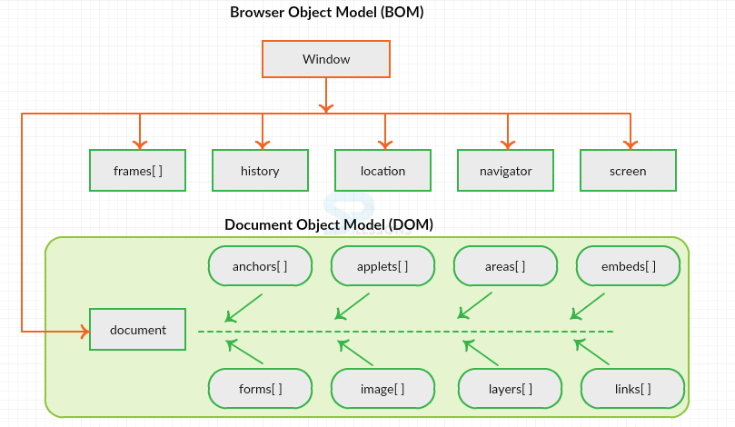
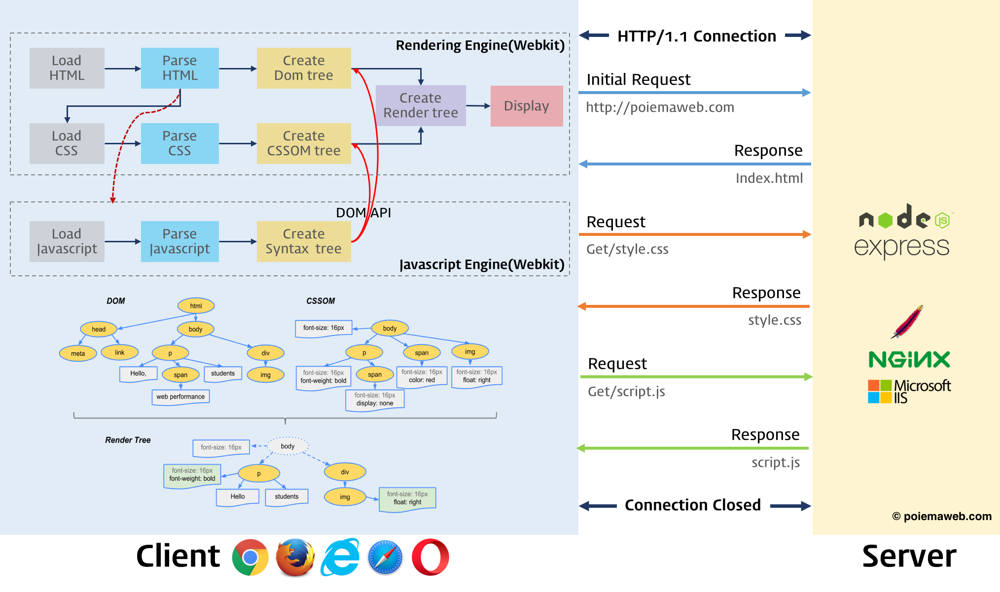

# 브라우저 렌더링

- [웹 브라우저(Web Browser)란?](#웹-브라우저web-browser란)
  - [렌더링 파이프라인(Rendering Pipeline)](#렌더링-파이프라인rendering-pipeline)
- [수직 동기화(VSync) 신호](#수직-동기화vsync-신호)
  - [핵심 개념](#핵심-개념)
  - [렌더링 최적화 전략](#렌더링-최적화-전략)

## 웹 브라우저(Web Browser)란?

브라우저는 사용자가 요청한 자원(HTML, CSS, JS, 이미지 등)을 서버로부터 받아와 화면에 표시하는 소프트웨어다. HTTP 프로토콜을 통해 통신하며, 렌더링 엔진과 JavaScript 엔진을 통해 코드를 해석하고 실행한다.

### 렌더링 파이프라인(Rendering Pipeline)

브라우저가 HTML 데이터를 픽셀로 변환하여 화면에 그리는 과정은 다음과 같은 단계를 거친다.

1. DOM 트리 생성: HTML을 파싱(Parsing)하여 객체 모델인 DOM(Document Object Model) 트리를 구축함.
2. CSSOM 트리 생성: CSS를 파싱하여 스타일 정보가 담긴 CSSOM(CSS Object Model) 트리를 구축함.
3. 렌더 트리(Render Tree) 생성: DOM과 CSSOM을 결합하여 실제로 화면에 보일 요소들만 포함된 트리를 생성함 (`display: none` 요소는 제외됨. `visibility: hidden` 요소는 공간을 차지한 채 포함됨).
4. 레이아웃(Layout) / 리플로우(Reflow): 각 노드의 정확한 위치와 크기를 계산함. 뷰포트(Viewport) 내에서의 기하학적 구조를 결정하는 단계임.
5. 페인트(Paint) / 리페인트(Repaint): 계산된 위치에 실제 픽셀을 채워 넣음. 텍스트, 색상, 이미지, 효과 등을 그림.
6. 레이어 합성(Composite): 생성된 레이어들을 순서대로 합성하여 최종 화면을 완성함.

## 수직 동기화(VSync) 신호

수직 동기화(VSync, Vertical Synchronization)는 디스플레이가 새로운 프레임을 그릴 준비가 되었음을 알리는 하드웨어 신호다.

### 핵심 개념

- 주사율(Refresh Rate): 1초 동안 화면이 갱신되는 횟수임 (예: 60Hz는 약 16.6ms마다 1회).
- 티어링(Tearing) 방지: GPU의 프레임 생성 속도와 모니터의 주사율을 맞추어 화면이 찢어지는 현상을 방지함.
- rAF(requestAnimationFrame): VSync 신호에 맞춰 실행되도록 콜백을 예약하는 API임. `setTimeout`보다 부드러운 애니메이션 구현이 가능함.
- 프레임 드롭(Frame Drop): 메인 스레드가 VSync 주기 내에 작업을 끝내지 못하면 프레임이 생략되어 화면이 끊겨 보이는 현상(Jank)이 발생함.

### 렌더링 최적화 전략

- 레이아웃/페인트 최소화:
  - `transform`, `opacity` 등 기하학적 변화를 주지 않는 속성을 사용하여 레이아웃과 페인트를 건너뛰고 합성(Composite) 단계만 거치도록 유도함.
- 메인 스레드 점유 방지:
  - 무거운 연산은 웹 워커(Web Worker)로 분리함.
  - 긴 작업은 `requestIdleCallback` 등을 활용하여 작업을 잘게 쪼개어(Time Slicing) 실행함.
- 애니메이션 제어:
  - 애니메이션 관련 로직은 반드시 `requestAnimationFrame` 내부에서 처리하여 VSync 주기에 동기화함.
