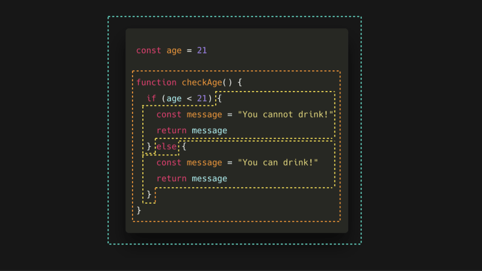

# Context

## context와 this

자바스크립트 컨텍스트와 this의 상관관계

1. 컨텍스트

자바스크립트 컨텍스트는 코드 실행 환경을 의미하며, 크게 전역 컨텍스트와 함수 컨텍스트로 나눌 수 있습니다.
컨텍스트는 변수 및 함수의 스코프를 결정하고, 호이스팅에 영향을 미치며, this 키워드의 값을 결정합니다. 2. this

this 키워드는 현재 실행 중인 코드의 컨텍스트 객체를 참조합니다.
컨텍스트 객체는 함수 컨텍스트에서는 함수 객체이며, 전역 컨텍스트에서는 전역 객체(브라우저 환경에서는 window 객체)입니다. 3. 컨텍스트와 this의 상관관계

this 키워드는 함수가 어떻게 호출되었는지에 따라 값이 결정됩니다.
함수가 독립적으로 호출되면 this는 전역 객체를 참조합니다.
함수가 객체의 메서드로 호출되면 this는 해당 객체를 참조합니다.
함수가 call(), apply(), bind() 메서드를 사용하여 호출되면 this는 첫 번째 인수로 전달된 객체를 참조합니다.

화살표 함수는 this가 없음

```js
const noObjThis = this; // window

function Func() {
  return this; // window
}
const ArrowFunc = () => {
  return this; // window
};

const obj = {
  name: 'Tomas',
  age: 30,
  objThis: this, // window
  objFunc() {
    return this; // obj
  },
  objArrowFunc: () => {
    return this; // window
  },
  nestedObjFunc1() {
    console.log(this); // obj
    return function () {
      return this; // window
    };
  },
  nestedObjFunc2() {
    console.log(this); // obj
    return () => {
      return this; // obj
    };
  },
  nestedObjFunc3: () => {
    console.log(this); // window
    return () => {
      return this; // window
    };
  },
  nestedObjFunc4: () => {
    console.log(this); // window
    return () => {
      return this; // window
    };
  },
};

function wrapperFunc1(callback, localVar1) {
  const localVar2 = 'localVar2';

  return function (...arguments) {
    console.log(localVar1);
    console.log(localVar2);
    return callback(...arguments); // window
  };
}

function wrapperFunc2(callback, localVar1) {
  const localVar2 = 'localVar2';

  return (...arguments) => {
    console.log(localVar1);
    console.log(localVar2);
    return callback(...arguments); // window
  };
}

function wrapperFunc3(callback, localVar1) {
  const localVar2 = 'localVar2';

  return function (...arguments) {
    console.log(localVar1);
    console.log(localVar2);
    return callback.call(this, ...arguments); // obj
  };
}

function wrapperFunc4(callback, localVar1) {
  const localVar2 = 'localVar2';

  return (...arguments) => {
    console.log(localVar1);
    console.log(localVar2);
    return callback.call(this, ...arguments); // window
  };
}
```

## 일급 객체

## Scope




## Closure

## 실무에서 클로저 사용 예시

이벤트에 이벤트 객체 외에 인수를 받는 함수를 연결할 경우 클로저를 사용해서 조금 더 간결하게 작성 가능하다.

```js
// 이벤트 객체와 같은 depth에서 인수를 구성한 경우
const debounce = (event, callback) => {
  ...
}

<button onClick={(event) => debounce(event, callback)}>Click</button>

// 이벤트 객체를 인수로 받는 함수를 클로저로 감싸서 함수를 실행하는 형태로 이벤트에 연결하는 경우
const debounce = (callback) => () => {
  ...
};

<button onClick={debounce(callback)}>Click</button>
```

## 구조 분해 할당

구조 분해 할당 후 기본값을 설정하는 경우, 해당 값이 `undefined`인 경우에만 기본값이 적용된다.

```js
const {
  a = 1,
  b = 2,
  c = 3,
  d = 4,
} = {
  a: null,
  b: undefined,
  c: 3,
  d: 4,
};

console.log(a, b, c, d); // null 2 3 4
```

## Decorator

데코레이터는 함수를 받아서 기능을 확장시킨 새로운 함수를 반환하는 함수

데코레이터 함수 실행은 기능 추가된 함수의 반환이며 그 함수를 실행하려면 한 번 더 실행해야한다.
