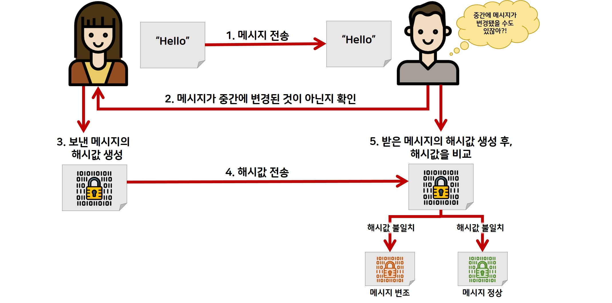
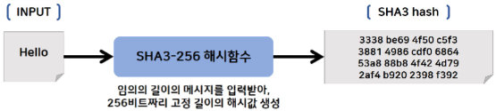
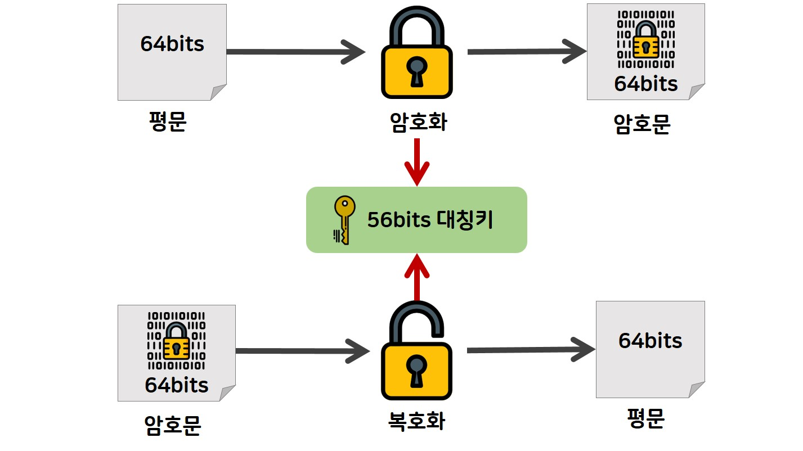

# 암호화 알아보기

- [단방향 알고리즘(해시 알고리즘)](#단방향-알고리즘해시-알고리즘)
- [양방향 알고리즘(대칭키)](#양방향-알고리즘대칭키)
- [양방향 알고리즘(비대칭키)](#양방향-알고리즘비대칭키)

암호란 0과 1로 이루어진 이진수 데이터를 수학적 계산을 통한 비트 변경을 수행하는 것이다. 정상적인 데이터의 2진수 데이터를 암호화라는 과정으로 데이터를 변경하고, 복호화라는 과정을 통해 데이터를 원래대로 돌리는 기술을 의미한다.

## 단방향 알고리즘(해시 알고리즘)

단방향 암호로 잘 알려진 알고리즘으로 해시 알고리즘들이 있다. 해시 알고리즘은 암호화는 가능하지만, 복호화가 불가능하다는 점을 이용하여 데이터의 무결성을 검증한다. 데이터의 무결성이란 데이터가 허락된 사용자로 인해 수정이 제대로 이루어졌는지, 허가되지 않은 사용자가 무단으로 데이터를 조작했는지 여부를 보는 것이다.

## 양방향 알고리즘(대칭키)

대칭키 암호화는 양방향 암호화로써, 복호화가 가능한 암호 알고리즘이다. 암호화와 복호화에 쓰이는 키 크기가 상대적으로 작고 암호 알고리즘 내부 구조가 단순하여, 시스템 개발 환경에 용이하고, 비대칭키에 비해 암호화와 복호화 속도가 빠르다. 하지만 교환 당사자간에 동일한 키를 공유해야 하기 때문에 키관리의 어려움이 있고, 잦은 키 변경이 있는 경우에 불편함을 초래한다. 뿐만 아니라 디지털 서명 기법에 적용이 곤란하고 안전성을 분석하기가 어렵고 중재자가 필요하다.

## 양방향 알고리즘(비대칭키)

비대칭키 암호화는 양방향 암호화로써, 복호화가 가능한 암호 알고리즘입니다. 비대칭키 암호는 대칭키 암호의 키 전달에 있어서 취약점을 해결하고자 한 노력의 결과로 탄생했다. 한 쌍의 키가 존재하며, 하나는 특정 사람만이 가지는 개인키이고 다른 하나는 누구나 가질 수 있는 공개키이다. 비대칭키 암호화 방식은 암호학적으로 연관된 두 개의 키를 만들어서 하나는 자기가 안전하게 보관하고 다른 하나는 상대방에게 공개한다. 개인키로 암호화 한 정보는 그 쌍이 되는 공개키로만 복호화가 가능하고, 공개키로 암호화한 정보는 그 쌍이 되는 개인키로만 복호화가 가능하다.

만약, 개인이 비밀통신을 할 경우 비대칭키 암호화보다 대칭키 암호를 사용할 수 있지만, 다수가 통신을 할 때에는 키의 개수가 급증하게 되어 큰 어려움이 따른다. 이런 어려움을 극복하기 위해 나타난 것이 공개키 암호이다. 공개키 암호는 다른 유저와 키를 공유하지 않더라도 암호를 통한 안전한 통신을 할 수 있다는 장점이 있다.
