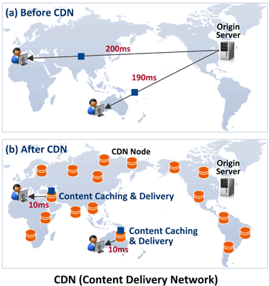

# 네트워크

- [OSI 7계층과 TCP/IP 4계층](#osi-7계층과-tcpip-4계층)
- [TCP와 UDP의 차이](#tcp와-udp의-차이)
  - [TCP 3-way Handshake](#tcp-3-way-handshake)
- [포트(Port)와 트래픽(Traffic)](#포트port와-트래픽traffic)
  - [인바운드와 아웃바운드 트래픽](#인바운드와-아웃바운드-트래픽)
  - [임시 포트(Ephemeral Port)](#임시-포트ephemeral-port)
- [도메인과 DNS(Domain Name System)](#도메인과-dnsdomain-name-system)
  - [DNS 서버의 종류와 계층 구조](#dns-서버의-종류와-계층-구조)
  - [DNS 조회 흐름](#dns-조회-흐름)
  - [리버스 프록시(Reverse Proxy)를 통한 관리](#리버스-프록시reverse-proxy를-통한-관리)
- [CDN(Content Delivery Network)](#cdncontent-delivery-network)
- [터널링(Tunneling)과 VPN](#터널링tunneling과-vpn)
  - [터널링의 동작 원리: 캡슐화(Encapsulation)](#터널링의-동작-원리-캡슐화encapsulation)
  - [VPN(Virtual Private Network)과 암호화](#vpnvirtual-private-network과-암호화)
  - [방화벽 우회 메커니즘](#방화벽-우회-메커니즘)
  - [Tailscale과 메시 VPN(Mesh VPN)](#tailscale과-메시-vpnmesh-vpn)
- [루프백 주소(Loopback Address)](#루프백-주소loopback-address)
- [이메일 프로토콜(SMTP, POP3, IMAP)](#이메일-프로토콜smtp-pop3-imap)

## OSI 7계층과 TCP/IP 4계층

네트워크 통신 과정을 단계별로 표준화한 모델이다. 상위 계층에서 하위 계층으로 데이터를 보낼 때 각 계층의 헤더를 붙이는 캡슐화(Encapsulation)를 거치며, 받을 때는 반대로 헤더를 제거하는 역캡슐화(Decapsulation)를 수행한다.

- OSI 7계층:
  - (7) 응용(Application): 사용자 서비스 제공 (HTTP, FTP, SMTP)
  - (6) 표현(Presentation): 데이터 인코딩, 암호화, 압축
  - (5) 세션(Session): 통신 세션 수립 및 동기화
  - (4) 전송(Transport): 종단 간 신뢰성 있는 전송 (TCP, UDP)
  - (3) 네트워크(Network): 최적의 경로 설정 및 패킷 전달 (IP, Router)
  - (2) 데이터 링크(Data Link): 물리적 매체 간 인접 노드 전송 (Ethernet, Switch)
  - (1) 물리(Physical): 전기적 신호 전송 (Cable, Hub)

## TCP와 UDP의 차이

| 항목      | TCP (Transmission Control Protocol) | UDP (User Datagram Protocol)   |
| :-------- | :---------------------------------- | :----------------------------- |
| 연결 방식 | 연결 지향형 (Connection-oriented)   | 비연결형 (Connectionless)      |
| 신뢰성    | 높음 (순서 보장, 패킷 재전송)       | 낮음 (데이터 유실 가능성 있음) |
| 속도      | 상대적으로 느림 (오버헤드 발생)     | 매우 빠름 (실시간성 위주)      |
| 용도      | 웹(HTTP), 이메일, 파일 전송         | 스트리밍, 게임, DNS            |

### TCP 3-way Handshake

데이터를 전송하기 전, 클라이언트와 서버가 서로 신뢰할 수 있는 연결을 수립하는 과정이다.

1. `SYN`: 클라이언트가 서버에게 연결 요청 패킷을 보냄.
2. `SYN + ACK`: 서버가 요청을 수락하고 클라이언트에게 확인 패킷을 보냄.
3. `ACK`: 클라이언트가 최종적으로 서버에게 확인 패킷을 보내 연결이 완료됨.

## 포트(Port)와 트래픽(Traffic)

포트는 운영체제 통신의 종단점(Endpoint)으로, 하나의 IP 주소 내에서 실행되는 여러 프로세스를 구분하기 위해 사용된다.

### 인바운드와 아웃바운드 트래픽

- 인바운드 트래픽(Inbound Traffic):
  - 외부 네트워크에서 내부 네트워크(또는 서버)로 들어오는 데이터 흐름임.
  - 보안을 위해 방화벽에서 엄격하게 관리됨.
- 아웃바운드 트래픽(Outbound Traffic):
  - 내부 네트워크에서 외부로 나가는 데이터 흐름임.
  - 인바운드에 비해 상대적으로 제한이 덜함.

### 임시 포트(Ephemeral Port)

클라이언트 프로그램(웹 브라우저 등)이 서버와 통신할 때 운영체제로부터 동적으로 할당받는 포트다.

- 특징:
  - 서버처럼 고정된 포트를 리스닝하지 않고, 요청 시에만 할당받음.
  - 통신이 끝나면 운영체제에 반환되어 재사용됨.
  - 보통 `49152`~`65535` 범위의 포트를 사용함.
- 동작 과정:
  1. 클라이언트가 임시 포트를 열고 서버의 포트로 요청을 보냄 (Outbound).
  2. 서버는 요청을 보낸 클라이언트의 임시 포트 번호를 확인하여 응답을 보냄 (Inbound).

## 도메인과 DNS(Domain Name System)

도메인 이름을 IP 주소로 변환하여 사용자가 서버에 접속할 수 있게 해주는 시스템이다.

- 주요 레코드 타입:
  - `A`: 도메인을 IPv4 주소로 매핑함.
  - `AAAA`: 도메인을 IPv6 주소로 매핑함.
  - `CNAME`: 도메인에 대한 별칭(Alias)을 설정함. 값은 반드시 도메인 형태여야 함.
  - `NS`: 도메인의 권한을 가진 네임서버를 지정함.
- `TTL(Time To Live)`: DNS 서버가 해당 레코드 정보를 캐시할 수 있는 유효 기간임. TTL이 짧으면 변경 사항이 빠르게 반영되지만 DNS 서버 부하가 증가함.

### DNS 서버의 종류와 계층 구조

DNS 서버는 역할에 따라 크게 리졸버(Resolver)와 네임서버(Authoritative Name Server)로 나뉜다. 흔히 "DNS 서버"라고 부르는 것은 리졸버를 지칭하는 경우가 많지만, 네임서버 역시 DNS 서버의 일종이다.

- 리졸버(Resolver):
  - 클라이언트로부터 도메인 질의를 받아 대신 답을 찾아주는 중개 서버임.
  - 인터넷 연결 시 ISP(통신사)가 기본으로 제공하며, `8.8.8.8`(Google) • `1.1.1.1`(Cloudflare) 등으로 수동 변경 가능함.
  - 한 번 조회한 결과를 TTL 동안 캐시하여 동일 질의에 대해 빠르게 응답함.
- 권한 네임서버(Authoritative Name Server):
  - 특정 도메인의 DNS 레코드를 직접 관리하는 원본 서버임.
  - 도메인 소유자가 선택하며, AWS Route 53 • Cloudflare DNS 등이 해당함.
  - `nslookup` 결과에서 `Non-authoritative answer`라고 표시되면 리졸버의 캐시를 통해 응답받은 것이고, 권한 네임서버에서 직접 받은 응답이 아님을 의미함.

DNS는 계층적 트리 구조로 설계되어 있으며, 각 계층을 서로 다른 기관이 운영한다.

| 계층          | 운영 주체                           | 예시                            |
| :------------ | :---------------------------------- | :------------------------------ |
| 루트 네임서버 | ICANN 위임, 13개 기관               | Verisign, NASA, RIPE NCC 등     |
| TLD 네임서버  | 각 도메인 레지스트리                | `.com` → Verisign, `.kr` → KISA |
| 권한 네임서버 | 도메인 소유자가 선택                | AWS Route 53, Cloudflare 등     |
| 리졸버        | ISP, 기업, 개인 등 누구나 운영 가능 | KT, SKT, Google(`8.8.8.8`) 등   |

루트 네임서버는 `A.root-servers.net`부터 `M.root-servers.net`까지 13개의 논리적 주소로 구성되지만, 실제로는 애니캐스트(Anycast) 기술로 전 세계 1,000개 이상의 물리 서버가 동일한 IP를 공유한다. 클라이언트의 요청은 물리적으로 가장 가까운 서버가 자동으로 응답한다.

### DNS 조회 흐름

클라이언트가 `example.com`을 조회하면 다음과 같은 단계를 거친다.

1. 클라이언트가 리졸버에게 `example.com`의 IP를 질의함.
2. 리졸버의 캐시에 해당 레코드가 없으면 루트 네임서버에 질의함.
3. 루트 네임서버가 `.com` TLD 네임서버의 주소를 반환함.
4. 리졸버가 `.com` TLD 네임서버에 질의하면, `example.com`의 권한 네임서버 주소를 반환함.
5. 리졸버가 권한 네임서버에 질의하여 최종 IP 주소(A 레코드)를 받아옴.
6. 리졸버가 결과를 캐시한 뒤 클라이언트에게 응답함.

### 리버스 프록시(Reverse Proxy)를 통한 관리

Nginx와 같은 리버스 프록시 서버를 사용하면 하나의 공인 IP로 여러 서브도메인 서비스를 운영할 수 있다.

```nginx
# sub1.example.com → 8081 포트로 전달
server {
    listen 80;
    server_name sub1.example.com;
    location / {
        proxy_pass http://localhost:8081;
    }
}
```

- 장점: 비용 절감, SSL 인증서 및 보안 설정의 통합 관리 가능.

## CDN(Content Delivery Network)



지리적으로 분산된 엣지 서버(Edge Server)를 활용하여 정적 콘텐츠를 빠르게 전송하는 기술이다.

- 동작 원리:
  - 사용자가 콘텐츠를 요청하면 물리적으로 가장 가까운 엣지 서버의 IP를 반환함.
  - 엣지 서버에 데이터가 있다면 즉시 응답함 (`Cache Hit`).
  - 데이터가 없다면 원본 서버(Origin Server)에서 받아와 캐싱한 후 사용자에게 전달함 (`Cache Miss`).

## 터널링(Tunneling)과 VPN

공용 인터넷망을 사용하면서도 마치 전용 회선을 깔아놓은 것처럼 안전하게 데이터를 주고받는 기술이다.

### 터널링의 동작 원리: 캡슐화(Encapsulation)

터널링의 핵심은 패킷 캡슐화(Encapsulation) 기술이다.

- 동작 원리:
  - 실제 전송하려는 데이터(내부 패킷)를 전송용 데이터(외부 패킷)의 내용물로 집어넣음.
  - 외부 패킷은 공용 인터넷망에서 흔히 사용하는 규격을 사용하므로, 네트워크 장비들은 내부의 진짜 데이터를 확인하지 않고 목적지까지 전달함.
- 비유: 일반 도로에서 달릴 수 없는 경주용 자동차(내부 패킷)를 커다란 트럭(외부 패킷)에 실어서 운송하는 것과 같음. 도로에서는 트럭만 보이지만, 목적지에 도착해 트럭 문을 열면 경주용 자동차가 나옴.

### VPN(Virtual Private Network)과 암호화

가상 사설망(VPN)은 터널링 기술에 강력한 암호화 기능을 결합한 형태다.

- 가상(Virtual): 물리적인 전용선을 직접 깔지 않고 소프트웨어로 논리적인 통로를 만듦.
- 사설(Private): 터널 내부의 데이터를 암호화하여 제3자가 내용을 엿볼 수 없게 함.
- 동작 방식:
  - 컴퓨터에 가상 네트워크 카드(Virtual Interface)가 생성됨.
  - 모든 네트워크 데이터는 이 카드를 거치며 암호화된 뒤 터널을 통해 전송됨.
  - 받는 쪽에서만 암호를 풀 수 있으므로 공용망에서도 보안이 유지됨.

### 방화벽 우회 메커니즘

방화벽은 특정 포트나 프로토콜을 차단하지만, 대부분 `HTTPS(443)` 트래픽은 허용한다. 터널링은 이 점을 이용한다.

- 우회 원리:
  - 차단된 프로토콜(예: 게임, DB 접속 등)의 패킷을 허용된 `443(HTTPS)` 패킷 안에 캡슐화하여 보냄.
  - 방화벽은 겉모습인 `HTTPS`만 보고 정상적인 웹 트래픽으로 판단하여 통과시킴.
  - 목적지 서버(터널 종단)에서 캡슐을 벗겨내어 원래의 데이터를 추출함.

### Tailscale과 메시 VPN(Mesh VPN)

`Tailscale`은 복잡한 서버 설정 없이 기기 간에 가상의 직접 연결을 만들어주는 서비스다. `WireGuard` 프로토콜을 기반으로 하며, 강력한 암호화와 뛰어난 성능을 제공한다.

- NAT Traversal(NAT 통과) 기술:
  - 대부분의 기기는 공유기(NAT) 뒤에 있어 외부에서 직접 접속이 불가능함. 이를 해결하기 위해 `STUN(Session Traversal Utilities for NAT)` 서버를 사용하여 자신의 공인 IP와 포트 번호를 먼저 파악함.
  - UDP 홀 펀칭(UDP Hole Punching): 두 기기가 서로의 공인 IP 정보를 교환한 뒤, 양방향에서 동시에 패킷을 보냄. 이때 각 공유기는 이를 외부로 나가는 요청으로 인식하여 일시적으로 통로(Hole)를 열게 되고, 이 틈을 통해 기기 간 직접 연결(P2P)이 수립됨.
  - DERP(Detour Encapsulated Relay Protocol) 릴레이: 네트워크 환경이 너무 엄격하여 홀 펀칭이 실패할 경우, Tailscale이 운영하는 전 세계의 `DERP` 서버를 경유하여 통신을 유지함. 이때 데이터는 여전히 종단 간 암호화(End-to-End Encryption) 상태이므로 릴레이 서버도 내용을 볼 수 없음.
- 메시(Mesh) 구조: 중앙 집중형 VPN과 달리 모든 기기가 서로 직접 연결되도록 구성되어 병목 현상을 줄이고 네트워크 지연 시간을 최소화함.

## 루프백 주소(Loopback Address)

컴퓨터 자기 자신(Localhost)을 가리키는 특수 주소다. 데이터가 네트워크 카드를 거치지 않고 내부 네트워크 스택에서만 이동한다.

- `127.0.0.1` (IPv4): 관례적으로 사용하는 IPv4 루프백 주소임.
- `::1` (IPv6): IPv6 환경에서 로컬 호스트를 가리키는 128비트 주소임.
- OS의 `hosts` 파일(`/etc/hosts`, `C:\Windows\System32\drivers\etc\hosts`)에 `localhost → 127.0.0.1` 매핑이 정의되어 있음.

로컬 개발 환경에서 자주 맞닥뜨리는 문제와 해결 방법:

- 쿠키 도메인 문제: 쿠키의 `domain` 속성이 `localhost`에 적용되지 않는 경우, `hosts` 파일에 별칭을 추가하여 커스텀 도메인을 `127.0.0.1`로 매핑하면 해결할 수 있음.
- 로컬 HTTPS 통신: `mkcert`로 로컬 CA를 생성하면 `localhost`에서 HTTPS 인증서를 발급받아 `https://localhost`로 개발이 가능함.
- CORS 문제: 개발 서버의 프록시 기능(예: Vite `proxy`, Next.js `rewrites`)을 사용하면 브라우저가 CORS 검사를 건너뛰고 서버 측에서 API 요청을 중계할 수 있음.

## 이메일 프로토콜(SMTP, POP3, IMAP)

- `SMTP(Simple Mail Transfer Protocol)`: 이메일 발송을 위한 프로토콜임.
- `POP3(Post Office Protocol v3)`: 서버의 메일을 클라이언트로 내려받으며, 기본적으로 서버 데이터는 삭제됨.
- `IMAP(Internet Message Access Protocol)`: 서버와 클라이언트의 메일 상태를 실시간 동기화함. 여러 기기 사용에 적합함.
