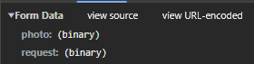
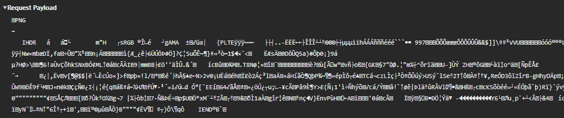
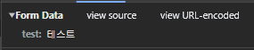

# 네트워크

- [풀 다운로드 • 스트리밍](#풀-다운로드--스트리밍)
- [스트리밍과 버퍼링의 개념](#스트리밍과-버퍼링의-개념)
  - [작동 방식](#작동-방식)
    - [버퍼 크기와 송출의 관계](#버퍼-크기와-송출의-관계)
    - [현대 스트리밍 기술](#현대-스트리밍-기술)
  - [정리](#정리)
- [MIME 타입](#mime-타입)
  - [multipart/form-data](#multipartform-data)
  - [application/json](#applicationjson)
  - [application/octet-stream](#applicationoctet-stream)
  - [application/x-www-form-urlencoded](#applicationx-www-form-urlencoded)
  - [etc](#etc)
- [SMTP](#smtp)
- [서버와 클라이언트의 개념](#서버와-클라이언트의-개념)
- [포트](#포트)
  - [질문 1: **도메인을 구매하면 서브도메인은 무수히 많이 생산 가능?**](#질문-1-도메인을-구매하면-서브도메인은-무수히-많이-생산-가능)
    - [세부 사항:](#세부-사항)
  - [질문 2: **도메인과 서브도메인 모두 DNS 레코드 연결 가능?**](#질문-2-도메인과-서브도메인-모두-dns-레코드-연결-가능)
    - [예:](#예)
    - [주요 항목:](#주요-항목)
    - [예시:](#예시)
  - [질문 3: **많은 서브도메인을 하나의 IP에 연결해서 리버스 프록시로 각기 다른 포트로 도달하게 가능?**](#질문-3-많은-서브도메인을-하나의-ip에-연결해서-리버스-프록시로-각기-다른-포트로-도달하게-가능)
    - [동작 방식:](#동작-방식)
    - [구성 예:](#구성-예)
  - [장점:](#장점)
  - [추가 주의점:](#추가-주의점)
  - [결론:](#결론)
- [도메인](#도메인)
- [CDN](#cdn)

## 풀 다운로드 • 스트리밍

TCP 동작으로 풀 다운로드와 스트리밍의 차이를 설명하자면 다음과 같음.

1. 풀 다운로드(Full Download):

   - TCP는 연결 지향 프로토콜로, 전송을 시작하기 전에 클라이언트와 서버 간에 연결을 설정함.
   - 데이터가 전송되는 동안 모든 패킷은 순차적으로 전송되며, 오류가 있을 경우 재전송이 이루어짐.
   - 파일이 완전히 다운로드될 때까지 클라이언트는 파일에 접근하지 못함. 다운로드가 완료된 후에야 데이터의 사용이 가능함.

2. 스트리밍:
   - 스트리밍도 TCP를 사용할 수 있으며, 연결이 설정된 후 데이터가 연속적으로 전송됨.
   - 클라이언트는 수신한 데이터의 일부를 즉시 사용할 수 있어, 데이터를 순차적으로 소비할 수 있음. 예를 들어, 동영상이나 오디오 스트리밍에서는 처음 몇 초의 데이터가 버퍼링 된 후 즉시 재생될 수 있음.
   - 전체 파일을 다운로드할 필요 없이 사용자는 지속적으로 데이터를 수신하면서 재생을 계속함.

결과적으로, 풀 다운로드는 데이터 전체를 수신한 후 사용해야 하며, 스트리밍은 데이터 일부를 수신하면서 즉시 사용할 수 있는 점에서 차이가 있음. TCP의 신뢰성 있는 데이터 전송 메커니즘은 두 경우 모두 적용되지만, 사용 방식과 시점이 다름.

일반 다운로드와 스트림 다운로드의 차이는 데이터 전송 방식을 기준으로 한다.

일반 다운로드는 파일이 서버에서 클라이언트로 전송될 때, 전송이 완료되어야 해당 파일에 접근할 수 있다. 즉, 파일이 완전히 다운로드될 때까지 사용자가 그 파일에 접근할 수 없다.

반면, 스트림 다운로드는 데이터가 순차적으로 전송되면서 클라이언트가 즉시 일부 데이터에 접근할 수 있도록 한다. 예를 들어, 비디오 스트리밍의 경우, 사용자는 파일의 일부가 전송되자마자 재생할 수 있다.

결론적으로, 일반 다운로드는 전송 완료 후 접근 가능하고, 스트림 다운로드는 중간 데이터에도 즉시 접근 가능하다는 점에서 차이가 있다.

HTTP 요청 시 일반 데이터와 스트림 데이터를 응답으로 받는 것의 차이를 TCP 관점에서 설명하겠습니다.

1. 일반 데이터 응답:

   - TCP 연결 설정: 클라이언트와 서버 간에 TCP 3-way handshake를 통해 연결이 설정됩니다.
   - 데이터 전송: 서버는 요청된 데이터를 한 번에 모두 준비하여 TCP 세그먼트로 분할하고, 이를 순차적으로 클라이언트에게 전송합니다.
   - 연결 종료: 데이터 전송이 완료되면, TCP 연결은 4-way handshake를 통해 정상적으로 종료됩니다.
   - 특징: 데이터가 완전히 준비된 후에 전송되므로, 클라이언트는 모든 데이터를 받을 때까지 기다려야 합니다.

2. 스트림 데이터 응답:
   - TCP 연결 설정: 일반 데이터와 마찬가지로 TCP 3-way handshake를 통해 연결이 설정됩니다.
   - 데이터 전송: 서버는 데이터를 실시간으로 생성하거나 수집하면서, 준비되는 대로 TCP 세그먼트로 분할하여 클라이언트에게 전송합니다. 이는 데이터가 완전히 준비되기 전에 전송이 시작될 수 있음을 의미합니다.
   - 연결 종료: 데이터 스트리밍이 완료되면, TCP 연결은 4-way handshake를 통해 정상적으로 종료됩니다.
   - 특징: 클라이언트는 데이터가 완전히 준비되기 전에 데이터의 일부를 받기 시작할 수 있습니다. 이는 실시간 스트리밍 서비스(예: 비디오 스트리밍)에 유용합니다.

결론: 일반 데이터 응답은 데이터가 완전히 준비된 후 전송되지만, 스트림 데이터 응답은 데이터가 준비되는 대로 실시간으로 전송됩니다. 이는 TCP의 연결 지향적 특성과 데이터 전송의 신뢰성을 기반으로 합니다.

네, 질문하신 내용이 스트리밍의 기본 작동 원리와 상당히 맞닿아 있습니다. 브라우저가 스트리밍 데이터를 처리하는 방식에 대해 조금 더 구체적으로 설명드릴게요.

## 스트리밍과 버퍼링의 개념

스트리밍은 데이터를 실시간으로 전송하고 재생하는 과정이기 때문에, 네트워크 속도나 서버 응답 시간의 불규칙성을 보완하기 위해 버퍼(Buffer)라는 임시 저장 공간을 사용합니다. 브라우저는 이 버퍼를 메모리에 할당하여 스트리밍 데이터를 일정량 저장한 뒤 재생합니다.

### 작동 방식

1. 버퍼 할당:

   - 브라우저는 스트리밍이 시작되면 메모리에 일정한 크기의 버퍼를 할당합니다. 이 버퍼 크기는 보통 콘텐츠의 종류(예: 오디오, 비디오), 재생 품질, 그리고 브라우저나 플레이어 설정에 따라 달라질 수 있습니다.
   - 예를 들어, 비디오 스트리밍의 경우 몇 초에서 몇 분 분량의 데이터를 미리 저장할 수 있는 버퍼가 설정됩니다.

2. 데이터 송출:

   - 서버는 데이터를 작은 조각(청크, Chunk) 단위로 브라우저에 전송합니다. 브라우저는 이 데이터를 버퍼에 채우면서 동시에 재생을 시작합니다.
   - 질문에서 "해당 버퍼만큼의 데이터만 송출한다"고 하셨는데, 엄밀히 말하면 서버는 버퍼 크기에 상관없이 데이터를 계속 보내지만, 브라우저는 버퍼가 가득 차면 수신 속도를 조절하거나 잠시 멈출 수 있습니다(예: TCP 흐름 제어).

3. 재생과 버퍼 관리:
   - 버퍼에 데이터가 충분히 쌓이면 재생이 시작되고, 재생이 진행됨에 따라 버퍼에서 데이터가 소진됩니다.
   - 동시에 브라우저는 네트워크를 통해 새로운 데이터를 계속 받아와 버퍼를 채웁니다. 이 과정에서 네트워크 속도가 느리면 버퍼가 비워지는 속도가 빨라져 "버퍼링" 상태(재생 중단)가 발생할 수 있습니다.

#### 버퍼 크기와 송출의 관계

- 브라우저는 버퍼에 최소한의 데이터(예: 몇 초 분량)를 유지하려고 합니다. 이를 "최소 버퍼 임계값"이라고 할 수 있는데, 이 값에 도달하면 재생을 멈추고 데이터를 더 채우기를 기다립니다.
- 반대로 버퍼가 가득 차면, 브라우저는 서버에 데이터 전송을 일시적으로 느리게 요청하거나 중단할 수 있습니다(스트리밍 프로토콜에 따라 다름). 하지만 서버가 데이터를 "버퍼만큼만 송출"하도록 제한하는 건 아니고, 네트워크와 브라우저 간의 상호작용으로 조절됩니다.

#### 현대 스트리밍 기술

- 적응형 스트리밍(Adaptive Streaming): 요즘 널리 사용되는 기술(예: HLS, DASH)에서는 네트워크 상황에 따라 품질을 동적으로 조정합니다. 버퍼가 부족하면 저해상도 데이터를 요청하고, 여유가 생기면 고해상도로 전환합니다.
- 캐시와의 차이: 버퍼는 단기적인 재생을 위한 임시 메모리일 뿐, 디스크에 영구 저장되는 캐시와는 다릅니다.

### 정리

브라우저는 스트리밍 시 메모리에 버퍼를 할당하고, 이 버퍼에 일정량의 데이터를 저장해 끊김 없는 재생을 보장하려 합니다. 서버는 데이터를 계속 보내지만, 브라우저가 버퍼 상태에 따라 수신 속도를 조절하는 식으로 작동한다고 볼 수 있습니다. 질문하신 "버퍼만큼만 송출"은 송출 자체를 제한한다기보다는, 브라우저가 버퍼를 관리하며 재생과 수신을 균형 있게 유지한다는 개념에 가깝습니다.

## MIME 타입

MIME(Multipurpose Internet Mail Extensions) 타입은 파일의 형식이나 유형을 식별하기 위한 표준화된 문자열이다. MIME 타입은 주로 웹에서 사용되며, 웹 브라우저와 서버가 파일의 내용을 올바르게 처리하도록 도와준다. MIME 타입은 파일의 확장자나 내용의 특성에 따라 결정되며, 파일의 실제 형식을 정확하게 식별할 수 있도록 도와준다.

### multipart/form-data

여러 데이터 유형(텍스트, 이미지, 파일 등)을 동시에 HTTP 요청의 body 값으로 전송할 수 있으며 주로 파일 업로드와 폼 데이터를 같이 전송할 때 사용된다. 각 파트에 Content-Type 및 Content-Disposition 헤더가 부여된다.

자바스크립트에서 바이너리 데이터를 다룰 때 blob 객체로 다뤄지는데 multipart/form-data를 사용하면 해당 객체를 자동으로 바이너리 데이터로 변환하고 서버로 전송한다.

HTML 폼 방식, fetch API, axios 방식으로 요청 가능하다.




### application/json

HTTP 요청의 body 값으로 JSON 데이터를 보낼 때 사용한다.

fetch API, axios 방식으로 요청 가능하다.


바이너리 데이터를 Base64 형식으로 인코딩해서 보내는 경우는 아래와 같다.


### application/octet-stream

HTTP 요청의 body 값으로 아무런 특별한 분류나 변환 없이 원시 바이트 데이터로 이루어진 스트림을 전송할 때 사용한다. 어떤 종류의 파일인지 알 수 있는 바이너리 데이터는 다른 MIME 타입을 사용해서 명시해준다.

자바스크립트에서 바이너리 데이터를 다룰 때 blob 객체로 다뤄지는데 application/octet-stream을 사용하면 해당 객체를 바이너리 데이터로 변환 후에 서버로 전송해야 한다.

fetch API, axios 방식으로 요청 가능하다.



### application/x-www-form-urlencoded

HTML 폼 방식으로 HTTP 요청을 할 때 기본값으로 설정되며, HTTP 요청의 body 값으로 데이터를 URL 인코딩하여 보낼 때 사용한다.




HTML 폼 방식, fetch API, axios 방식으로 요청 가능하다.

### etc

- application/JavaScript
- application/xml
- application/zip
- application/pdf
- application/sql
- application/graphql
- application/ld+json
- application/msword (.doc)
- application/vnd.openxmlformats-officedocument.wordprocessingml.document(.docx)
- application/vnd.ms-excel (.xls)
- application/vnd.openxmlformats-officedocument.spreadsheetml.sheet (.xlsx)
- application/vnd.ms-powerpoint (.ppt)
- application/vnd.openxmlformats-officedocument.presentationml.presentation (.pptx)
- application/vnd.oasis.opendocument.text (.odt)
- audio/mpeg
- audio/vorbis
- text/css
- text/html
- text/csv
- text/plain
- images/image/png
- image/jpeg
- image/gif

## SMTP

POP3

IMAP

SMTP

## 서버와 클라이언트의 개념

웹 서버, 이메일 서버 등 특정 프로토콜을 이용해서 통신이 필요한

## 포트

1 ip 1 A domain
N CName domain 1 A domain

1 server process 1 port listening
1 client process no port listening

CNAME 레코드를 고정 IP 주소에 직접 매핑하는 것은 DNS(Domain Name System)에서 허용되지 않는 동작입니다. 이렇게 할 경우 다음과 같은 문제가 발생할 수 있습니다:

1. **DNS 구조 규칙 위반**: DNS에서 CNAME 레코드는 다른 도메인 이름에 대한 별칭으로 사용되어야 합니다. 직접적인 IP 주소에 대한 CNAME 레코드는 DNS의 구조 규칙을 위반하며, 일반적으로 허용되지 않습니다.

2. **DNS 오류 및 불일치**: DNS 서버가 CNAME 레코드를 고정 IP 주소에 직접 매핑하도록 설정된 경우, DNS 오류가 발생할 수 있습니다. 또한, 이러한 설정은 DNS 쿼리에 대한 응답이 예상대로 되지 않도록 만들 수 있습니다.

3. **유지보수 및 관리의 어려움**: 고정 IP 주소를 직접적으로 CNAME 레코드에 매핑하는 것은 DNS의 목적과 용도에 맞지 않으며, 유지보수와 관리를 어렵게 만들 수 있습니다. 이는 IP 주소 변경 시 DNS 레코드를 업데이트하는 작업을 더욱 복잡하게 만들 수 있습니다.

따라서 고정 IP 주소를 직접적으로 CNAME 레코드에 매핑하는 것은 일반적으로 권장되지 않습니다. 대신, 해당 도메인 이름을 서비스하는 호스트의 도메인 이름에 대한 CNAME 레코드를 사용하는 것이 바람직합니다.

아주 좋은 질문이네요! 각 질문에 대해 정확히 답변드리겠습니다.

---

### 질문 1: **도메인을 구매하면 서브도메인은 무수히 많이 생산 가능?**

**답변:**  
네, 일반적으로 도메인 하나를 구매하면 서브도메인은 **제한 없이** 생성이 가능합니다. 즉, `example.com` 도메인을 구매하면 `sub1.example.com`, `sub2.example.com`, `sub3.example.com` 등을 마음껏 생성할 수 있습니다.

#### 세부 사항:

- 서브도메인의 생성은 실제로 도메인 관리 시스템(DNS 설정)을 통해 필요에 따라 추가 설정하는 작업입니다.
- 대부분의 도메인 등록 업체와 DNS 관리 시스템에서는 서브도메인 생성에 제한을 두지 않으며, 추가 비용 없이 무제한으로 서브도메인을 구성할 수 있습니다.
- **단, 서버나 하드웨어 리소스 사용 측면**에서는 생성된 서브도메인을 실제로 올바르게 운영하려면 서브도메인을 처리할 서버의 리소스와 네트워크 설정이 적절해야 합니다.

---

### 질문 2: **도메인과 서브도메인 모두 DNS 레코드 연결 가능?**

**답변:**  
네, 도메인(루트 도메인)과 서브도메인 모두 각각의 DNS 레코드를 설정하고 연결할 수 있습니다.

#### 예:

1. **루트 도메인:**

   - `example.com` → A 레코드로 특정 IP 주소 연결 가능.
   - `example.com` → CNAME 레코드로 다른 도메인 이름과 연결 가능.

2. **서브도메인:**
   - `api.example.com` → A 레코드로 특정 IP를 연결하거나 CNAME 레코드로 다른 도메인으로 링크 가능.
   - `blog.example.com` → TXT, MX, A 등의 레코드와 함께 설정할 수 있음.

#### 주요 항목:

- 도메인과 서브도메인은 **독립적으로** 레코드를 설정할 수 있어 각각 다른 서비스를 실행할 수 있습니다.
- 서브도메인을 CNAME 레코드로 참조하거나 별도의 서버(IP 주소)로 연결하는 것도 가능합니다.
- 루트 도메인에서 A 레코드를 설정하거나 CNAME을 사용할 때의 제한이란 점도 있습니다. (예: 루트 도메인은 CNAME과 A 레코드를 동시에 사용할 수 없음).

#### 예시:

| 도메인 이름        | DNS 레코드 타입 | 연결 대상        |
| ------------------ | --------------- | ---------------- |
| `example.com`      | **A**           | 123.45.67.89     |
| `api.example.com`  | **CNAME**       | api-backend.com  |
| `blog.example.com` | **A**           | 234.56.78.90     |
| `shop.example.com` | **CNAME**       | shop.service.com |

---

### 질문 3: **많은 서브도메인을 하나의 IP에 연결해서 리버스 프록시로 각기 다른 포트로 도달하게 가능?**

**답변:**  
**네, 가능합니다.**  
이는 리버스 프록시 서버(예: Nginx 또는 Apache)를 사용하여 설정할 수 있습니다. 서브도메인은 하나의 공통 IP로 요청을 보내고, 요청이 도착한 이후의 처리는 리버스 프록시가 전달 경로를 결정하도록 설정하는 방식입니다.

#### 동작 방식:

1. 여러 서브도메인(`sub1.example.com`, `sub2.example.com`, 등)을 하나의 공용 IP 주소로 DNS에서 연결합니다.  
   (예: `A` 레코드에서 모든 서브도메인을 동일한 IP로 연결)
2. 리버스 프록시 서버(Nginx, Apache 등)가 동일한 IP와 포트를 듣고 있다가, **도메인 이름(Host 헤더)**를 기준으로 각기 다른 포트 또는 백엔드 서버로 요청을 전달합니다.

#### 구성 예:

1. **DNS 설정:**

   ```text
   A  sub1.example.com → 123.45.67.89
   A  sub2.example.com → 123.45.67.89
   A  sub3.example.com → 123.45.67.89
   ```

2. **리버스 프록시 설정 (Nginx):**
   Nginx에서는 `server` 지시문을 사용하여 호스트 이름에 따라 요청을 분기할 수 있습니다.

   ```nginx
   # sub1.example.com → 8081로 전달
   server {
       listen 80;
       server_name sub1.example.com;
       location / {
           proxy_pass http://localhost:8081;
       }
   }

   # sub2.example.com → 8082로 전달
   server {
       listen 80;
       server_name sub2.example.com;
       location / {
           proxy_pass http://localhost:8082;
       }
   }

   # sub3.example.com → 8083로 전달
   server {
       listen 80;
       server_name sub3.example.com;
       location / {
           proxy_pass http://localhost:8083;
       }
   }
   ```

3. **결과:**
   - `sub1.example.com` 요청 👉 리버스 프록시가 `localhost:8081`로 전달.
   - `sub2.example.com` 요청 👉 리버스 프록시가 `localhost:8082`로 전달.
   - `sub3.example.com` 요청 👉 리버스 프록시가 `localhost:8083`로 전달.

---

### 장점:

- 서버 하나의 IP로 다양한 서브도메인을 처리 가능.
- 서브도메인별로 백엔드 과정을 분리하여, 앱이나 마이크로서비스 등의 요구사항에 맞도록 유연한 구성을 지원.
- DNS 관리가 단순해짐(A 레코드만 하나의 공통 IP로 설정).

---

### 추가 주의점:

1. **SSL/TLS (HTTPS):**
   - 각 서브도메인별로 SSL 인증서를 설정해야 하는 경우 추가 작업이 필요합니다.
   - 쉽게 관리하려면 **와일드카드 인증서**(예: `*.example.com`)를 사용하는 것을 추천합니다.
2. **포트 제한:**
   - HTTP(포트 80) 및 HTTPS(포트 443)가 일반적으로 공용 네트워크에서 사용되므로 클라이언트가 포트를 명시하지 않을 수 있습니다.
   - 따라서 프록시 서버가 요청을 처리한 뒤 내부에서만 포트를 다르게 매핑해야 합니다.

---

### 결론:

- **질문 1:** 서브도메인은 수량 제한 없이 생성이 가능.
- **질문 2:** 도메인과 서브도메인 모두 개별적인 DNS 레코드 연결이 가능.
- **질문 3:** 리버스 프록시와 함께 서브도메인을 특정 IP 내의 각기 다른 포트로 분기시키는 것이 완벽히 가능합니다.  
  Nginx, Apache, 또는 Traefik을 사용하여 효율적으로 구현해보세요! :)

## 도메인

도메인 구매 - 네임서버에 저장 - 도메인 입력 시 -> 네임서버에서 찾아서 -> ip 반환

A 레코드 구매
CNAME 레코드는 A 레코드의 alias

도메인, 서브 도메인, A 레코드, C 레코드의 차이를 잘 구분해서 작성해보자 설명을

프록시 서버에서 보통 CNAME을 통해 포트 구분해서 프로세스 배분

## CDN

CDN은 Content Delivery Network의 약자로, 지리적인 제약 없이 전 세계 사용자에게 빠르게 정적 콘텐츠(이미지, 동영상, 음악, HTML, JavaScript 등)를 전송하는 기술이다.

콘텐츠를 전송할 때 물리적인 거리가 멀수록 콘텐츠를 불러올 때 소요되는 시간이 길어진다. 이를 해결하기 위해 전 세계 곳곳에 캐싱 서버를 두고 해당 서버에 콘텐츠를 캐싱한 뒤 같은 콘텐츠에 대한 요청이 오면 물리적으로 제일 가까운 거리에 캐싱 서버에서 응답을 준다.


작동원리에 대해 간단히 설명하면 아래와 같다.

- 사용자로부터 요청이 발생한다.
- 요청이 발생한 캐싱 서버는 요청이 발생한 데이터에 대하여 캐싱 여부를 확인한다.
- 캐싱 데이터가 존재하면 사용자에 요청에 맞게 응답하고 존재하지 않으면 Origin Server로 요청한다.
- 요청 받은 데이터에 대해 Origin Server로부터 전달 받은 캐싱 서버는 데이터를 캐싱하고 사용자에게 응답한다.

다국적 서비스를 리액트로 제작한다고 하면, 배포 시에 한국 리전에만 호스팅 서버를 두고 Cloudflare, AWS, Google 등이 제공하는 CDN 서비스를 이용해서 서버 비용 절감 및 웹사이트 로딩 속도를 높일 수 있다.


