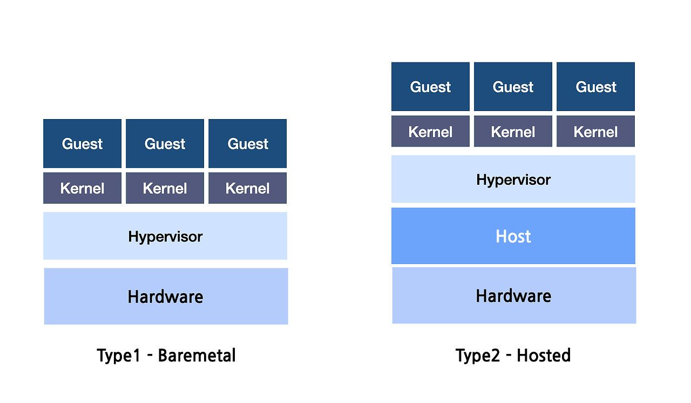

# 운영체제

- [커널 vs 하이퍼바이저](#커널-vs-하이퍼바이저)
- [시스템 호출과 비시스템 호출](#시스템-호출과-비시스템-호출)
  - [시스템 호출 (System Call)](#시스템-호출-system-call)
  - [비시스템 호출 (Non-System Call)](#비시스템-호출-non-system-call)
- [메모리 할당 과정](#메모리-할당-과정)
- [프로세스 vs 스레드](#프로세스-vs-스레드)
  - [주요 차이점](#주요-차이점)
  - [컨텍스트 스위칭 (Context Switching)](#컨텍스트-스위칭-context-switching)
- [가상 메모리 (Virtual Memory)](#가상-메모리-virtual-memory)
  - [페이징 (Paging)](#페이징-paging)
  - [세그먼테이션 (Segmentation)](#세그먼테이션-segmentation)
  - [페이지 폴트 (Page Fault)](#페이지-폴트-page-fault)
- [BIOS • UEFI • 부트로더](#bios--uefi--부트로더)
- [파일과 폴더](#파일과-폴더)
- [키보드 스캔코드 매핑 원리](#키보드-스캔코드-매핑-원리)

## 커널 vs 하이퍼바이저

운영체제(Operating System)의 핵심인 커널(Kernel)과 가상화 환경을 관리하는 하이퍼바이저(Hypervisor)는 자원 관리 방식에서 차이가 있다.

| 특징      | 커널                                                                            | 하이퍼바이저                                        |
| --------- | ------------------------------------------------------------------------------- | --------------------------------------------------- |
| 정의      | 운영 체제의 핵심 구성 요소로, 하드웨어 자원과 소프트웨어 간의 상호작용을 관리함 | 여러 가상 머신(VM)을 생성하고 관리하는 소프트웨어임 |
| 주 목적   | 프로세스 관리, 메모리 관리, 파일 시스템 관리 등 기능 제공                       | 가상화, 자원 할당, 여러 운영 체제의 동시 실행 지원  |
| 자원 관리 | 물리적 자원(CPU, 메모리, I/O) 직접 관리                                         | 물리적 자원을 가상 머신에 할당하고 관리함           |
| 문맥 교환 | 프로세스 간의 문맥 교환 관리                                                    | 가상 머신 간의 문맥 교환 관리                       |
| 의존성    | 하드웨어 위에서 직접 실행됨                                                     | 하드웨어 위(타입 1) 또는 OS 위(타입 2)에서 실행됨   |

## 시스템 호출과 비시스템 호출

### 시스템 호출 (System Call)

시스템 호출은 응용 프로그램이 운영체제의 커널이 제공하는 서비스를 이용하기 위해 호출하는 인터페이스다. 주로 파일 시스템, 네트워크, 프로세스 관리와 관련된 작업을 수행한다.

- `fs.readFile()`: 파일을 읽기 위한 시스템 호출임
- `fs.writeFile()`: 파일에 쓰기 위한 시스템 호출임
- `http.createServer()`: 네트워크 자원을 사용하는 시스템 호출임
- `child_process.exec()`: 자식 프로세스를 생성하는 시스템 호출임

### 비시스템 호출 (Non-System Call)

비시스템 호출은 커널의 개입 없이 사용자 모드(User Mode)에서 라이브러리나 애플리케이션 코드 내에서 처리되는 명령이다.

- 단순 산술 연산 및 문자열 조작
- 메모리 내 자료구조 처리 (배열, 객체 등)
- 시스템 자원에 의존하지 않는 비동기 로직 처리

## 메모리 할당 과정

고급 언어로 작성된 애플리케이션은 직접 하드웨어에 접근하지 않고 계층적인 구조를 거쳐 메모리를 할당받는다.

- 애플리케이션이 런타임 환경(Node.js, JVM 등)에 메모리 요청함
- 런타임 환경은 운영체제에게 시스템 호출을 통해 필요한 덩어리의 메모리를 할당받음
- 운영체제는 물리 메모리 관리자 및 가상 메모리 시스템을 통해 실제 주소를 할당함

## 프로세스 vs 스레드

프로세스(Process)는 실행 중인 프로그램의 인스턴스이며, 스레드(Thread)는 프로세스 내에서 실행되는 흐름의 단위다.

### 주요 차이점

| 항목      | 프로세스                                             | 스레드                                                           |
| --------- | ---------------------------------------------------- | ---------------------------------------------------------------- |
| 자원 공유 | 독립적인 메모리 영역(Code, Data, Stack, Heap)을 가짐 | 프로세스 내 Code, Data, Heap 영역을 공유하고 Stack만 개별 보유함 |
| 통신 방식 | IPC(Pipe, Socket, Shared Memory)가 필요함            | 공유 메모리를 통해 직접 통신이 가능하여 효율적임                 |
| 생성 비용 | 프로세스 생성 및 자원 할당 비용이 큼                 | 스레드 생성 및 제거 비용이 상대적으로 낮음                       |
| 동기화    | 프로세스 간 영향을 주지 않아 안전함                  | 공유 자원 접근 시 동기화 문제(Race Condition)가 발생할 수 있음   |

### 컨텍스트 스위칭 (Context Switching)

컨텍스트 스위칭은 CPU가 한 작업에서 다른 작업으로 전환될 때, 현재 상태를 저장하고 새로운 상태를 불러오는 과정이다.

- 프로세스 컨텍스트 스위칭:
  - PCB(Process Control Block)에 상태를 저장하고 복원함
  - 캐시 메모리 초기화 등 오버헤드가 큼
- 스레드 컨텍스트 스위칭:
  - TCB(Thread Control Block)를 사용함
  - 공유하는 자원을 제외한 정보만 교체하므로 프로세스 스위칭보다 빠름

## 가상 메모리 (Virtual Memory)

가상 메모리는 물리적 메모리(RAM)의 한계를 극복하기 위해 프로세스마다 독립적인 논리적 주소 공간을 제공하는 기술이다.

### 페이징 (Paging)

- 가상 메모리를 고정된 크기의 블록인 페이지(Page)로 나누어 관리함
- 물리 메모리는 페이지와 같은 크기의 프레임(Frame)으로 나뉨
- 페이지 테이블(Page Table)을 통해 가상 주소를 물리 주소로 매핑함

### 세그먼테이션 (Segmentation)

- 메모리를 의미 있는 단위(Code, Data, Stack 등)인 세그먼트로 나누어 관리함
- 논리적 단위로 나누어지므로 보호와 공유 측면에서 유리함

### 페이지 폴트 (Page Fault)

- 프로세스가 접근하려는 페이지가 현재 물리 메모리에 없는 경우 발생함
- 운영체제는 디스크에서 해당 페이지를 찾아 메모리에 로드함
- 이 과정에서 디스크 I/O가 발생하여 성능 저하의 원인이 됨

## BIOS • UEFI • 부트로더

컴퓨터 전원이 켜진 후 운영체제가 실행되기까지의 과정을 담당하는 펌웨어와 소프트웨어다.

- BIOS (Basic Input/Output System):
  - 하드웨어 초기화 및 POST(Power-On Self-Test) 수행함
  - MBR(Master Boot Record) 방식을 사용하여 2TB 이상의 디스크 인식이 제한됨
- UEFI (Unified Extensible Firmware Interface):
  - BIOS의 한계를 극복한 최신 인터페이스임
  - GPT(GUID Partition Table) 지원 및 GUI 환경 제공, 보안 부트 기능 포함함
- 부트로더 (Bootloader):
  - 커널을 메모리에 로드하고 제어권을 넘겨주는 역할을 함
  - 리눅스의 GRUB, 윈도우의 Windows Boot Manager가 대표적임

## 파일과 폴더

운영체제는 데이터를 효율적으로 관리하기 위해 파일 시스템(File System)을 사용한다.

- 파일(File): 논리적인 데이터 저장 단위로, 바이너리 형태로 디스크에 기록됨
- 폴더(Folder/Directory): 파일을 계층적으로 조직화하기 위한 메타데이터임
- 확장자: 운영체제가 파일 형식을 식별하고 연결 프로그램을 결정하는 단서로 활용됨

## 키보드 스캔코드 매핑 원리

키보드 입력은 하드웨어 신호에서 소프트웨어 데이터로 변환되는 과정을 거친다.

- 스캔코드(Scan Code): 키보드 컨트롤러가 생성하는 물리적 위치 신호임
- OS 매핑: 운영체제의 키보드 드라이버가 스캔코드를 특정 문자로 변환함
- 인코딩: 입력된 문자는 메모리에 유니코드(Unicode)로 저장되고, 파일 저장 시 UTF-8 등으로 변환됨
