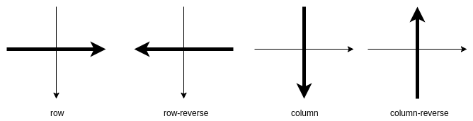
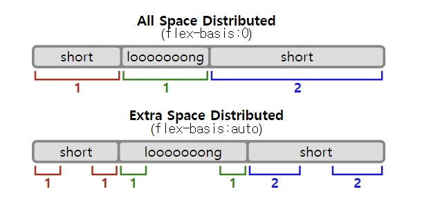

# CSS 기록하기

- [css를 연동시키는 법](#css를-연동시키는-법)
- [pseudo class](#pseudo-class)
- [pesudo element](#pesudo-element)
- [variable](#variable)
- [`display`](#display)
- [텍스트 제어](#텍스트-제어)
  - [`white-space`](#white-space)
  - [`word-break`](#word-break)
- [`box-sizing`](#box-sizing)
- [`flex`](#flex)
  - [`flex-direction`](#flex-direction)
  - [`flex-basis`](#flex-basis)
  - [응용](#응용)
- [`grid`](#grid)
  - [flex 와 overflow: 'hidden', minWidth, maxWidth](#flex-와-overflow-hidden-minwidth-maxwidth)
  - [반응형](#반응형)
- [position](#position)
  - [`sticky` 속성이 적용되지 않는 경우](#sticky-속성이-적용되지-않는-경우)
- [레이아웃 Tip](#레이아웃-tip)
- [`outline`, `box-shadow`](#outline-box-shadow)
- [pointer-events, user-select](#pointer-events-user-select)
- [color](#color)
  - [HEX](#hex)
  - [RGB RGBA](#rgb-rgba)
  - [HSL HSLA](#hsl-hsla)
- [Image](#image)
  - [img 태그](#img-태그)
  - [background](#background)
- [media query](#media-query)
- [transition \& animation](#transition--animation)
- [초기 CSS 설정](#초기-css-설정)
- [모달 창 스크롤 바 제어](#모달-창-스크롤-바-제어)
- [overflow 적용 안되는 이슈](#overflow-적용-안되는-이슈)
- [:before, :after content 안에 attr() 속성으로 태그 속성값 쉽게 추가 가능](#before-after-content-안에-attr-속성으로-태그-속성값-쉽게-추가-가능)

## css를 연동시키는 법

1. link tag
2. css 파일 내부 import
3. js 파일 내부 import

## pseudo class

| 분류 | 의사 클래스            | 설명                                                     |
| ---- | ---------------------- | -------------------------------------------------------- |
| 동적 | `:hover`               | 마우스를 요소 위로 올렸을 때 스타일 적용                 |
|      | `:focus`               | 요소가 포커스를 받을 때 스타일 적용                      |
|      | `:active`              | 요소가 활성 상태(클릭 중)일 때 스타일 적용               |
| 상태 | `:checked`             | 선택된 상태(주로 체크박스나 라디오 버튼)에 스타일 적용   |
|      | `:disabled`            | 비활성화된 요소에 스타일 적용                            |
|      | `:enabled`             | 활성화된 요소에 스타일 적용                              |
|      | `:visited`             | 방문한 링크에 스타일 적용                                |
|      | `:link`                | 방문하지 않은 링크에 스타일 적용                         |
| 구조 | `:first-child`         | 부모 요소의 첫 번째 자식 요소에 스타일 적용              |
|      | `:last-child`          | 부모 요소의 마지막 자식 요소에 스타일 적용               |
|      | `:nth-child(n)`        | 부모 요소의 n번째 자식 요소에 스타일 적용                |
|      | `:nth-last-child(n)`   | 부모 요소의 뒤에서 n번째 자식 요소에 스타일 적용         |
|      | `:only-child`          | 부모 요소의 유일한 자식 요소에 스타일 적용               |
|      | `:first-of-type`       | 동일한 형제 중 첫 번째 특정 타입 요소에 스타일 적용      |
|      | `:last-of-type`        | 동일한 형제 중 마지막 특정 타입 요소에 스타일 적용       |
|      | `:nth-of-type(n)`      | 동일한 형제 중 n번째 특정 타입 요소에 스타일 적용        |
|      | `:nth-last-of-type(n)` | 동일한 형제 중 뒤에서 n번째 특정 타입 요소에 스타일 적용 |
|      | `:only-of-type`        | 동일한 형제 중 유일한 특정 타입 요소에 스타일 적용       |

## pesudo element

| 의사 요소        | 설명                                                |
| ---------------- | --------------------------------------------------- |
| `::before`       | 요소의 콘텐츠 앞에 생성되는 가상 요소에 스타일 적용 |
| `::after`        | 요소의 콘텐츠 뒤에 생성되는 가상 요소에 스타일 적용 |
| `::first-letter` | 요소의 첫 번째 글자에 스타일 적용                   |
| `::first-line`   | 요소의 첫 번째 줄에 스타일 적용                     |
| `::selection`    | 사용자가 선택한 텍스트 부분에 스타일 적용           |
| `::placeholder`  | 입력 요소의 placeholder 텍스트에 스타일 적용        |

## variable

```css
/* 변수 선언 */
:root {
  --user-color: #ffffff;
  --user-background-color: #000000;
}

/* 변수 사용 */
body {
  color: var(--user-color);
  background-color: var(--user-background-color);
}
```

## `display`

`display` 속성에 따라 제어 가능한 속성:

- `inline` 요소는 `paddingY`와 `borderY`는 동작은 되지만 위아래로 영역을 침범한다.
- `inline` 요소끼리 배치되면 제어가 어려운 여백이 생긴다.
- `inline`, `inline-*` 요소는 기본적으로 줄 바꿈이 일어나지 않는다.

|                | `width` | `height` | `paddingX` | `paddingY` | `borderX` | `borderY` | `marginY` | `marginX` |
| -------------- | :-----: | :------: | :--------: | :--------: | :-------: | :-------: | :-------: | :-------: |
| `inline`       |    X    |    X     |     O      |     △      |     O     |     △     |     X     |     O     |
| `inline-block` |    O    |    O     |     O      |     O      |     O     |     O     |     O     |     O     |
| `inline-flex`  |    O    |    O     |     O      |     O      |     O     |     O     |     O     |     O     |
| `inline-grid`  |    O    |    O     |     O      |     O      |     O     |     O     |     O     |     O     |
| `block`        |    O    |    O     |     O      |     O      |     O     |     O     |     O     |     O     |
| `flex`         |    O    |    O     |     O      |     O      |     O     |     O     |     O     |     O     |
| `grid`         |    O    |    O     |     O      |     O      |     O     |     O     |     O     |     O     |

`display` 속성에 따른 `width: auto`:

- 가로 길이는 `width`, `paddingX`, `borderX`, `marginX` 값을 합친 값이다.
- 일반적으로 `inline` 요소는 자식으로 `inline` 요소를 제외한 요소를 넣지 않는다.
- 텍스트 길이 or 자식 요소 가로 길이를 따르는 경우 해당 값이 유동적으로 변해도 값을 따라간다.

|                | `width: auto`                          |
| -------------- | -------------------------------------- |
| `inline`       | 텍스트 길이 or `inline` 요소 가로 길이 |
| `inline-block` | 텍스트 길이 or 자식 요소 가로 길이     |
| `inline-flex`  | 텍스트 길이 or 자식 요소 가로 길이     |
| `inline-grid`  | 텍스트 길이 or 자식 요소 가로 길이     |
| `block`        | 부모 요소의 `width` - 자신의 `marginX` |
| `flex`         | 부모 요소의 `width` - 자신의 `marginX` |
| `grid`         | 부모 요소의 `width` - 자신의 `marginX` |

`display` 속성에 따른 `width: 100%`:

- `width: 100%`는 부모의 `width`를 100% 채우는 것이 일반적이지만, 부모 요소의 `min-width`, `max-width`에도 영향을 받을 수 있다. `min-width`는 직접적으로 부모 크기를 100%로 확장하는 것을 막을 수 있다.

|                | `width: 100%`                                   |
| -------------- | ----------------------------------------------- |
| `inline`       | `width` 작동하지 않음                           |
| `inline-block` | 부모 요소 `width`의 100%(부모가 `block`일 때만) |
| `inline-flex`  | 부모 요소 `width`의 100%(부모가 `block`일 때만) |
| `inline-grid`  | 부모 요소 `width`의 100%(부모가 `block`일 때만) |
| `block`        | 부모 요소 `width`의 100%                        |
| `flex`         | 부모 요소 `width`의 100%                        |
| `grid`         | 부모 요소 `width`의 100%                        |

`display` 속성에 따른 `height: auto`:

- 세로 길이는 `height`, `paddingY`, `borderY`, `marginY` 값을 합친 값이다.
- `inline-block` 요소의 경우 내부에 `inline-*` 요소를 가질 경우 이상한 높이값을 가진다.

|                | height: auto                         |
| -------------- | ------------------------------------ |
| `inline`       | 자동 계산된 텍스트 세로 길이         |
| `inline-block` | `line-height` or 자식 요소 세로 길이 |
| `inline-flex`  | `line-height` or 자식 요소 세로 길이 |
| `inline-grid`  | `line-height` or 자식 요소 세로 길이 |
| `block`        | `line-height` or 자식 요소 세로 길이 |
| `flex`         | `line-height` or 자식 요소 세로 길이 |
| `grid`         | `line-height` or 자식 요소 세로 길이 |

`display` 속성에 따른 `height: 100%`:

|                | height: 100%                          |
| -------------- | ------------------------------------- |
| `inline`       | `height` 작동하지 않음                |
| `inline-block` | 부모 요소 `height`가 설정된 경우 100% |
| `inline-flex`  | 부모 요소 `height`가 설정된 경우 100% |
| `inline-grid`  | 부모 요소 `height`가 설정된 경우 100% |
| `block`        | 부모 요소 `height`가 설정된 경우 100% |
| `flex`         | 부모 요소 `height`가 설정된 경우 100% |
| `grid`         | 부모 요소 `height`가 설정된 경우 100% |

## 텍스트 제어

- 텍스트는 기본적으로 텍스트를 최대한 보여주기 위한 너비를 가진다.
- `white-space`, `word-break` 등을 통해 반응형에 알맞는 제어가 가능하다.

### `white-space`

| `white-space`     | 스페이스(`\s`)와 탭(`\t`) | 줄바꿈(\n)            | 줄바꿈(\n)에 관계없이 오버플로우 시 줄바꿈 |
| ----------------- | ------------------------- | --------------------- | ------------------------------------------ |
| `normal`(default) | 한 개의 공백으로 변경     | 한 개의 공백으로 변경 | O                                          |
| `nowrap`          | 한 개의 공백으로 변경     | 한 개의 공백으로 변경 | X                                          |
| `pre`             | 그대로 보존               | 그대로 보존           | X                                          |
| `pre-wrap`        | 그대로 보존               | 그대로 보존           | O                                          |
| `pre-line`        | 한 개의 공백으로 변경     | 그대로 보존           | O                                          |

### `word-break`

- CJK(Chinese/Japanese/Korean): 띄어쓰기 없이 이어진 중국어, 일본어, 한국어 단어
- Non-CJK(Chinese/Japanese/Korean): 띄어쓰기 없이 이어진 중국어, 일본어, 한국어 제외 단어(영어, 숫자 등)
- 단어 중간에 특수문자가 있으면 예상대로 동작하지 않을 수 있다. 이럴 땐 `white-space` 속성을 같이 사용한다.

| `word-break`      | 오버플로우 시 Non-CJK 자름 여부 | 오버플로우 시 CJK 자름 여부 |
| ----------------- | ------------------------------- | --------------------------- |
| `normal`(default) | X                               | O                           |
| `break-all`       | O                               | O                           |
| `keep-all`        | X                               | X                           |

## `box-sizing`

- 실무에서는 대부분 모든 요소에 `box-sizing: border-box`를 사용하여 작업을 한다.

| `box-sizing`  | 설명                                                                        |
| ------------- | --------------------------------------------------------------------------- |
| `content-box` | `width`와 `height` 값과 `padding`, `border` 값이 따로 계산되며, 기본값이다. |
| `border-box`  | `padding`, `border` 값이 `width`와 `height` 값에 포함되어 계산된다.         |

## `flex`

`display: flex`는 해당 속성이 적힌 요소를 플렉스 컨테이너로 만들고, 자식 요소들을 플렉스 아이템으로 만들어 `flex` 관련 속성을 사용할 수 있게해서 유연한 레이아웃을 구현할 수 있도록 해준다.

### `flex-direction`

`flex`의 모든 속성은 메인 축을 기준으로 작동하며, `flex-direction`으로 메인 축을 변경할 수 있다.



|                   | `flex-direction: row`    | `flex-direction: column` |
| ----------------- | ------------------------ | ------------------------ |
| 메인 축           | 가로                     | 세로                     |
| `justify-content` | 가로 정렬                | 세로 정렬                |
| `align-*`         | 세로 정렬                | 가로 정렬                |
| `flex-basis`      | 기본 가로 여백 차지 공간 | 기본 세로 여백 차지 공간 |
| `flex-grow`       | 가로 증가                | 세로 증가                |
| `flex-shrink`     | 가로 감소                | 세로 감소                |

### `flex-basis`

1. 자식의 `flex-basis`
2. 자식의 `width`, `height`
3. 자식의 `flex-basis: auto`
4. 부모의 `flex-basis`
5. 부모의 `width`, `height`
6. 부모의 `flex-basis: auto`

;

|                          | `flex-basis: auto`                   |
| ------------------------ | ------------------------------------ |
| `flex-direction: row`    | 텍스트 너비 or 자식 요소 가로 길이   |
| `flex-direction: column` | `line-height` or 자식 요소 세로 길이 |

### 응용

```css
div {
  display: flex;
}

div.flex-item-1 {
  flex: 100 0;
}

div.flex-item-2 {
  flex: 1 0;
}
```

위와 같이 여백을 차지하는 비율을 크게 해놓으면, `flex-wrap: wrap`일 경우 밑으로 내려가는 아이템이 아래 공간을 모두 차지할 수 있다.

## `grid`

`grid`는 해당 속성이 적힌 요소를 그리드 컨테이너로 만들고, 자식 요소들을 그리드 아이템으로 만들어 `grid` 관련 속성을 사용할 수 있게해서 유연한 레이아웃을 구현할 수 있도록 해준다.

### flex 와 overflow: 'hidden', minWidth, maxWidth

flexBasis가 차지하는 여백을 제외하고 계산됨

<!-- todo -->

### 반응형

- `grid-template-columns` 속성의 값을 `repeat(auto-fit, minmax(100px ,1fr))` 또는 `repeat(auto-fill, minmax(100px ,1fr))`을 사용하여 반응형으로 구성 가능하다.

  - `auto-fill`: 행에 들어갈 수 있는 만큼의 열로 행을 채운다. 따라서 가능한 한 많은 열로 행을 채우려고 하기 때문에 새 열이 들어갈 수 있을 때마다 암시적 열을 생성한다. 새로 추가된 열은 비어 있을 수도 있고 비어 있지 않을 수도 있지만 여전히 행의 지정된 공간을 차지한다.
  - `auto-fit`: 현재 사용 가능한 열을 확장하여 사용 가능한 공간을 차지하도록 열을 공간에 끼워 넣습니다.

- `grid-template-columns` 속성의 값을 미디어쿼리로 제어하여 반응형으로 구성한다.

```css
.container {
  display: grid;
  grid-template-columns: 1fr 1fr;
}

@media (max-width: 600px) {
  .container {
    grid-template-columns: 1fr;
  }
}
```

## position

| `position` | 배치 위치                                                                         | `top`, `bottom`, `left`, `right`, `z-index` |
| ---------- | --------------------------------------------------------------------------------- | :-----------------------------------------: |
| `static`   | 문서의 일반적인 흐름                                                              |                      X                      |
| `relative` | 문서의 일반적인 흐름                                                              |                      O                      |
| `absolute` | `position` 속성이 `relative`, `absolute`, `fixed`로 설정된 가장 가까운 부모 요소  |                      O                      |
| `fixed`    | 뷰포트                                                                            |                      O                      |
| `sticky`   | 문서의 일반적인 흐름에 따라 배치되다가, 스크롤에 의해 화면에서 없어지기 전 고정됨 |                      O                      |

### `sticky` 속성이 적용되지 않는 경우

- `top`, `bottom`, `left`, `right` 속성으로 고정될 위치가 지정되지 않는 경우
- 부모 요소에 `overflow` 속성이 적용되어 있는 경우
- 부모 요소에 높이가 설정되어 있지 않는 경우

## 레이아웃 Tip

- `vw`는 뷰포트 너비로, `width: 100vw` 사용 시 스크롤 크기를 고려하지 않기 때문에 수직 스크롤이 생기면 수평 스크롤이 생기기 때문에 사용을 지양한다.
- `vh`는 뷰포트 높이로, `height: 100vh`보다는 `min-height: 100vh`를 더 사용한다. 이유는 브라우저는 항상 충분히 길어질 수 있기 때문에 레이아웃에서 고정 높이를 사용하는 것은 지양한다.
- 레이아웃의 최대 너비를 고정하고 가운데 정렬하고 싶은 경우에는 `max-width` 값을 지정하고 `margin: auto`를 통해 가운데 정렬한다.
- 반응형으로 작성 시 브라우저 너비가 매우 좁아졌을 때 컨텐츠들이 오버플로우로 인해 튀어나가는 현상을 방지하려면 컨텐츠를 감싸는 부모 요소의 `min-width` 값을 주고 `overflow-x: auto`를 통해 튀어나가는 현상을 방지한다.
- 고정 너비 및 고정 높이는 반응형으로 작성할 경우 많이 사용되지 않으므로, 반응형 작성 시 `flex`, `grid`, `min-width`, `max-width`, `min-height`, `max-height` 등을 많이 활용한다.
- `min-content`는 요소가 가질 수 있는 최소의 길이를 의미한다.
- `max-content`는 요소가 가질 수 있는 최대의 길이를 의미한다.

## `outline`, `box-shadow`

- `border` 값을 동적으로 조작하게 되면 주변 레이아웃들의 영향을 주기 때문에 영향을 주지 않고 스타일링을 하기 위해서는 `outline` 또는 `box-shadow` 속성으로 스타일링을 한다.
- `outline` 또는 `box-shadow` 속성은 동적으로 제어해도 주변 레이아웃에 영향을 주지 않는다.
- 입력 자동완성의 스타일링은 `!important`로 브라우저 정의가 되어있어 `box-shadow`로 배경색을 제거해주는 트릭을 사용한다.

  ```css
  '& input:autofill': {
      bo;xShadow: `0 0 0px 1000px ${theme.palette.grey[100]} inset`,
    },
  ```

## pointer-events, user-select

- `pointer-events: none`으로 설정하면 해당 속성이 적용된 요소에서는 클릭 이벤트가 발생하지 않는다.
- `user-select: none`이면 텍스트가 클릭이나 드래그로 선택되는 것을 막는다.
- `user-select: all`이면 클릭 한 번으로 텍스트가 선택된다.

## color

<!-- todo: 내용 보완 필요 -->

alpha channel vs opacity

alpha 값은 색상이 적용되는 속성에만 적용

opacity는 전체 적용

### HEX

### RGB RGBA

### HSL HSLA

## Image

<!-- 인라인 태그에서 text-align과 vertical-align으로 텍스트를 정렬하듯, 이미지 태그도 object-fit을 통해 이미지를 정렬하는거로 생각해도돼? -->

이미지 태그에 이미지 파일을 연결하면 해당 이미지 파일의 크기로 세팅된다.

width와 height을 설정해서 이미지 태그의 컨테이너 크기를 지정하고 object-fit, object-position 속성으로

이미지 파일이 해당 컨테이너의 어떻게 들어갈건지 정한다.

width와 height 둘 중 하나 값이 설정되면 이미지 파일의 종횡비에 맞게 다른 한 값이 정해진다

aspect-ratio 값도 둘 중 하나를 기준으로 맞춰진다


| `object-fit` | 종횡비 유지 | 컨테이너에 맞춤 | 너비,높이 변화 |
| ------------ | ----------- | --------------- | -------------- |
| `fill`       | X           | O               | O              |
| `cover`      | O           | X               | O              |
| `contain`    | O           | O               | O              |
| `none`       | O           | X               | X              |

### img 태그

```css
/* 반응형 이미지 */
img {
  max-width: 100%;
  height: auto;
}

/* 고정된 너비와 높이 안에서 object-fit, object-position 속성으로 이미지 제어 */
img {
  width: 300px;
  height: 150px
  object-fit: cover;
  object-position: center top;
}

/* width를 유동적으로 가져가기 위해서 컨테이너를 추가해서 이미지 제어 */
div {
  flex: 1 0 300px;
  height: 150px;
}

div > img {
  width: 100%;
  height: 100%;
  object-fit: cover;
  object-position: center top;
}
```

### background

<!-- todo: 내용 보완 필요 -->

| `background-size` | 종횡비 유지 | 컨테이너에 맞춤 |
| ----------------- | ----------- | --------------- |
| `contain`         | O           | O               |
| `cover`           | O           | X               |

`cover`의 경우 이미지 파일의 높이와 너비 중 더 짧은 걸 기준으로 잡아서 종횡비를 유지하고 컨테이너에 맞추지 않는다.

`contain`의 경우 `background-repeat`의 영향을 받는다.

| 주요 속성             |
| --------------------- |
| `background-image`    |
| `background-size`     |
| `background-position` |
| `background-repeat`   |

## media query

```css
@media (max-width: 600px) {
  /* 600px 이하의 스크린에서 적용 */
}

@media (min-width: 1200px) {
  /* 1200px 이상의 스크린에서 적용 */
}
```

```js

      xs: 0,
      sm: 600,
      md: 900,
      lg: 1200,
      xl: 1536,

```

모바일 고려해서 최소기준 `340px`로 잡자.

## transition & animation

```css
/* Apply 1 property */
transition: property-name | duration | easing-function | delay;
/* Apply multiple property */
transition:
  property-name | duration | easing-function | delay,
  property-name | duration | easing-function | delay,
  ...;
/* Apply All property */
transition: all | duration | easing-function | delay;

/* Apply 1 animation */
animation: duration | easing-function | delay | iteration-count | direction | fill-mode | play-state | name;
/* Apply multiple animation */
animation:
  duration | easing-function | delay | iteration-count | direction | fill-mode | play-state | name,
  duration | easing-function | delay | iteration-count | direction | fill-mode | play-state | name;
```

## 초기 CSS 설정

```css
* {
  margin: 0;
  padding: 0;
  border: 0;
  font: inherit;
  /* ...기본 타이포그래피 설정; */
}

html,
body,
#root {
  min-height: 100vh;
}

*,
:after,
:before {
  box-sizing: border-box;
}

html {
  font-size: 62.5%; /* 계산 필요없이 rem 값을 사용하기 위한 설정 */
}

a {
  text-decoration: none;
}

ul,
ol,
li {
  list-style: none;
}
```

## 모달 창 스크롤 바 제어

```js
const header = document.querySelector('header');
const scrollbarWidth = window.innerWidth - document.documentElement.clientWidth;

if (!header) return;

if (userInterface.isAsideOpen === true) {
  document.body.style.overflow = 'hidden';
  document.body.style.paddingRight = `${scrollbarWidth}px`;
  header.style.paddingRight = `${scrollbarWidth}px`;
} else {
  document.body.style.overflow = '';
  document.body.style.paddingRight = '';
  header.style.paddingRight = '';
}
```

## overflow 적용 안되는 이슈

1. 부모 요소의 `overflow` 설정 확인

   - 부모 요소에 `overflow: hidden`, `overflow: auto`, 또는 `overflow: scroll`이 설정되어 있는지 확인한다. 부모 요소가 자식 요소의 overflow를 제어할 수 있기 때문이다.

2. 부모 요소의 크기 설정

   - 부모 요소의 크기가 고정되어 있지 않으면 자식 요소의 `overflow` 속성이 제대로 작동하지 않을 수 있다. 부모 요소의 크기를 명시적으로 설정한다.

3. 포지셔닝 설정

   - 자식 요소에 `position: absolute` 또는 `position: fixed`가 설정되어 있을 때, `overflow` 속성이 예상대로 작동하지 않을 수 있다. 이런 경우 부모 요소의 `position`을 `relative`로 설정하거나, 자식 요소의 크기를 명확히 지정한다.

4. Flexbox 사용 시

   - Flexbox 레이아웃을 사용할 때 자식 요소의 `overflow` 속성이 제대로 작동하지 않을 수 있다. 부모 요소에 `min-height`나 `min-width`를 설정하거나, 자식 요소에 `flex-shrink: 0`을 설정하여 자식 요소가 줄어들지 않도록 한다.

5. Grid 사용 시:
   - Grid 레이아웃을 사용할 때도 비슷한 문제가 발생할 수 있다. 부모 요소와 자식 요소의 크기와 배치를 명확하게 설정하여 `overflow` 속성이 적용되도록 한다.

## :before, :after content 안에 attr() 속성으로 태그 속성값 쉽게 추가 가능

input을 감싸서 input에서 오는 onChange를 버블링 가능함
