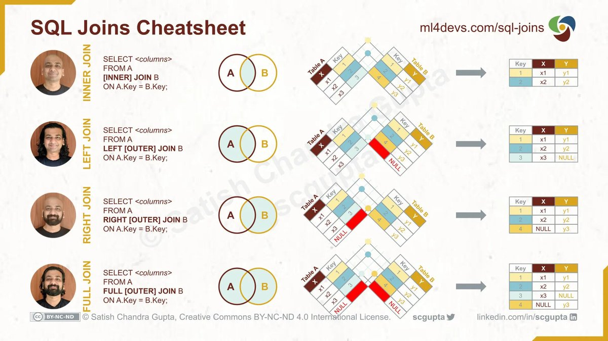
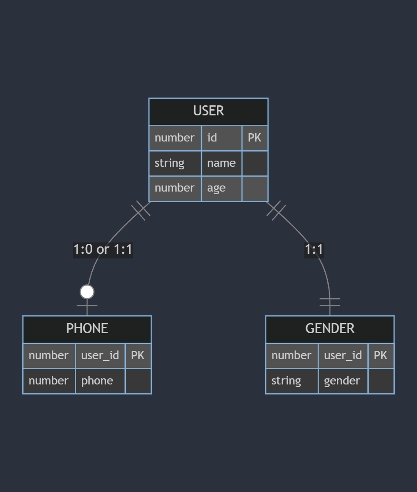
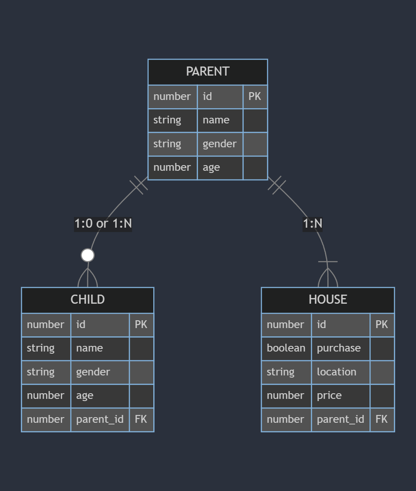
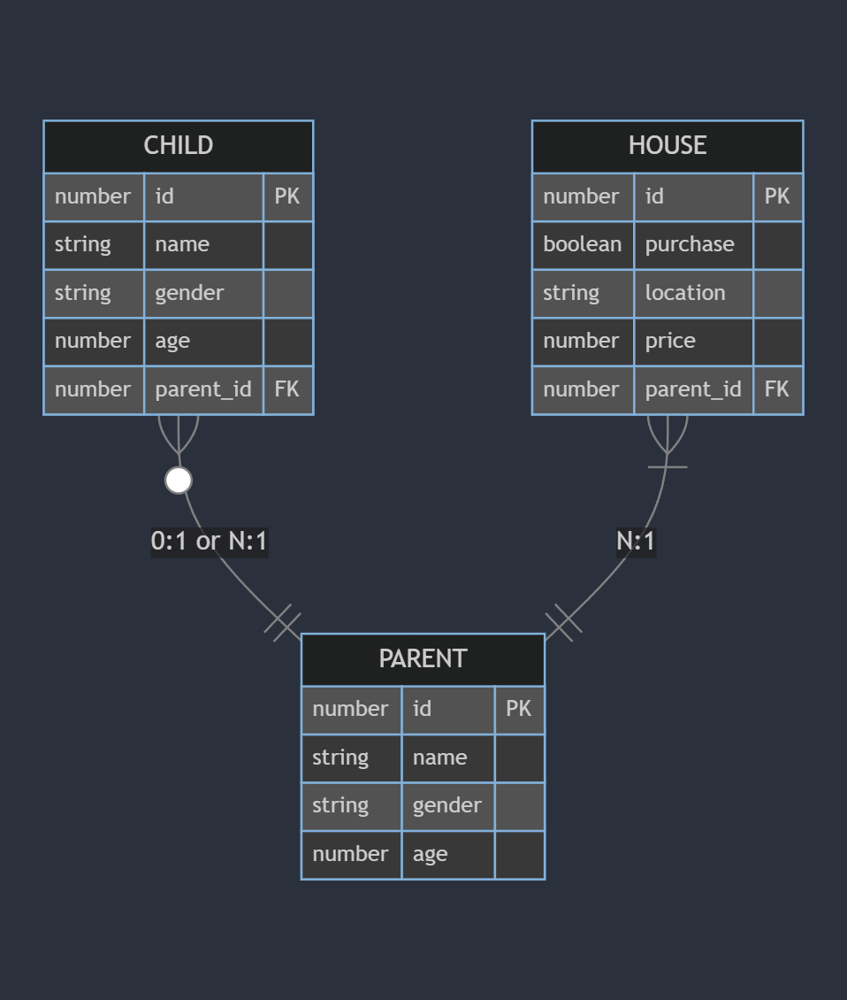
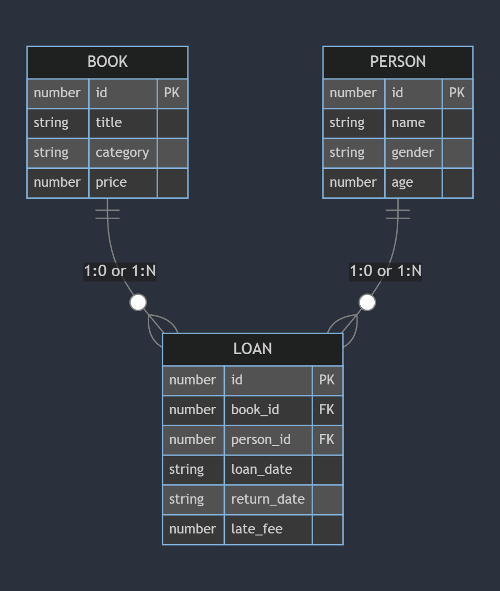

# SQL 기록하기

- [특정 테이블에서 컬럼 데이터 확인하기 및 별칭 지정](#특정-테이블에서-컬럼-데이터-확인하기-및-별칭-지정)
- [조건문](#조건문)
- [정렬](#정렬)
- [출력 갯수 제한](#출력-갯수-제한)
- [조인](#조인)
- [관계형 DB의 관계](#관계형-db의-관계)
  - [일대일 관계 (One-to-One Relationship)](#일대일-관계-one-to-one-relationship)
  - [일대다 관계 (One-to-Many Relationship)](#일대다-관계-one-to-many-relationship)
  - [다대일 관계 (Many-to-One Relationship)](#다대일-관계-many-to-one-relationship)
  - [다대다 관계 (Many-to-Many Relationship)](#다대다-관계-many-to-many-relationship)

## 특정 테이블에서 컬럼 데이터 확인하기 및 별칭 지정

```sql
SELECT * FROM user
SELECT id FROM user
SELECT id, name FROM user
SELECT post.id, user.name FROM user, post
SELECT post.id, user.* FROM user, post
SELECT post.id AS postId, user.* FROM user, post
```

## 조건문

```sql
SELECT * FROM user WHERE id = 50
SELECT * FROM user WHERE name LIKE "%현%" # %는 길이와 값 상관없는 모든 문자 데이터와 매칭
SELECT * FROM user WHERE name LIKE "_현_" # _는 값 상관없이 한 개의 문자 데이터와 매칭
SELECT * FROM user WHERE id = 50 AND name LIKE "%현%"
SELECT * FROM user WHERE id = 50 OR name LIKE "%현%"
SELECT * FROM user WHERE id IN (3, 20, 25)
SELECT * FROM user WHERE id NOT IN (3, 20, 25)
SELECT * FROM user WHERE id BETWEEN 20 AND 50
SELECT * FROM user WHERE id IS NULL
SELECT * FROM user WHERE id IS NOT NULL
```

## 정렬

```sql
SELECT * FROM user WHERE name LIKE "%현%" ORDER BY id ASC
SELECT * FROM user WHERE name LIKE "%현%" ORDER BY id DESC
```

## 출력 갯수 제한

```sql
SELECT * FROM user WHERE name LIKE "%현%" ORDER BY id ASC LIMIT 10
SELECT * FROM user WHERE name LIKE "%현%" ORDER BY id ASC LIMIT 5,100
```

## 조인

```sql
SELECT * FROM user LEFT JOIN post ON user.id = post.user_id
SELECT * FROM user RIGHT JOIN post ON user.id = post.user_id
SELECT * FROM user LEFT JOIN post ON user.id = post.user_id WHERE user.id = 20
SELECT * FROM user INNER JOIN post ON user.id = post.user_id
```



## 관계형 DB의 관계

### 일대일 관계 (One-to-One Relationship)

한 테이블의 각 레코드가 다른 테이블의 레코드와 1:1 관계를 가진다.



### 일대다 관계 (One-to-Many Relationship)

한 테이블의 레코드가 다른 테이블의 여러 레코드와 관련이 있는 경우이다.
일대다 관계에서 "일"쪽의 PK 값을 알면 연관된 모든 "다"를 알 수 있지만, 특정 "다"를 알려면 추가적인 정보가 요구된다.



### 다대일 관계 (Many-to-One Relationship)

다수의 레코드가 다른 테이블의 한 레코드와 관련이 있는 경우입니다.
다대일 관계에서 특정한 "다"는 FK 값을 통해서 연결된 "일"의 관계를 알 수 있다.



### 다대다 관계 (Many-to-Many Relationship)

다수의 레코드가 다른 테이블의 다수의 레코드와 관련이 있는 경우이다.


