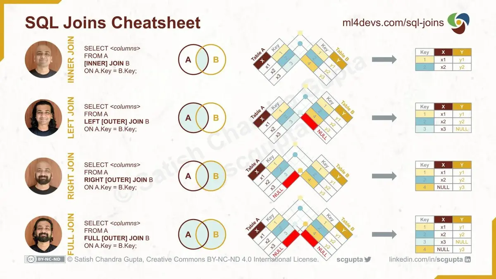
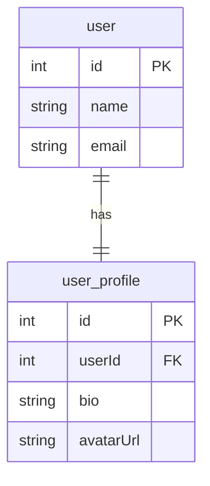
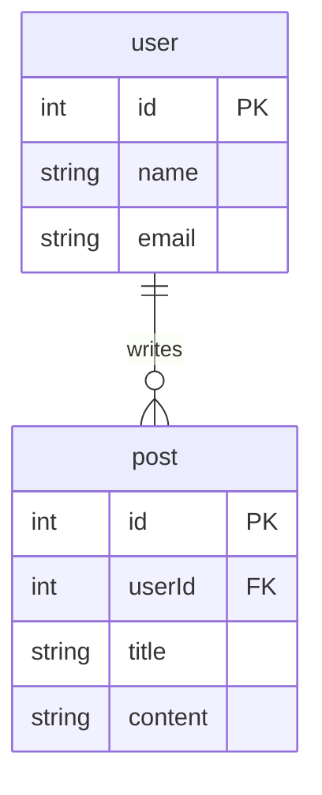
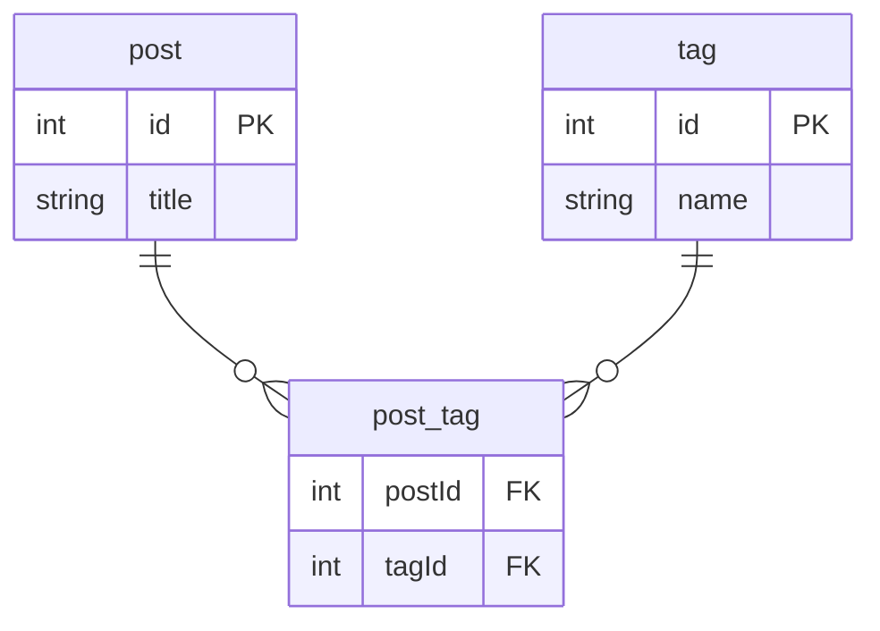

# SQL

- [데이터 조회 및 별칭](#데이터-조회-및-별칭)
- [조인 (Join)](#조인-join)
  - [조인 종류](#조인-종류)
  - [조인 예제](#조인-예제)
  - [조인의 기술적 실행 방식](#조인의-기술적-실행-방식)
- [조건문 및 필터링](#조건문-및-필터링)
- [정렬 및 제한](#정렬-및-제한)
- [데이터 그룹화 및 중복 분석](#데이터-그룹화-및-중복-분석)
- [인덱스 (Index)](#인덱스-index)
  - [B-Tree 인덱스 원리](#b-tree-인덱스-원리)
- [정규화 (Normalization)](#정규화-normalization)
  - [정규화 단계 요약](#정규화-단계-요약)
- [관계형 데이터베이스의 관계](#관계형-데이터베이스의-관계)
  - [일대일](#일대일)
  - [일대다](#일대다)
  - [다대다](#다대다)

## 데이터 조회 및 별칭

테이블의 데이터를 조회하고 별칭(Alias)을 지정하여 가독성을 높일 수 있다.

```sql
SELECT * FROM user; -- 모든 컬럼 조회
SELECT id, name FROM user; -- 특정 컬럼 조회
SELECT post.id AS postId, user.name FROM user, post; -- 별칭 지정
```

## 조인 (Join)

조인(Join)은 두 개 이상의 테이블을 결합하여 데이터를 조회하는 연산이다.



### 조인 종류

- 내부 조인 (Inner Join): 양쪽 테이블에 매칭되는 데이터가 모두 있는 경우에만 반환함
- 왼쪽 외부 조인 (Left Outer Join): 왼쪽 테이블의 모든 행과 오른쪽 테이블의 매칭되는 데이터를 반환하며, 매칭이 없으면 NULL로 채움
- 오른쪽 외부 조인 (Right Outer Join): 오른쪽 테이블의 모든 행을 기준으로 함

### 조인 예제

조인은 각 테이블의 관계에 따라 적절한 형식을 선택하여 사용한다.

```sql
-- 내부 조인 (Inner Join)
-- 유저와 해당 유저가 작성한 게시글을 모두 조회함 (작성글이 없는 유저는 제외)
SELECT u.name, p.title
FROM user u
INNER JOIN post p ON u.id = p.userId;

-- 왼쪽 외부 조인 (Left Outer Join)
-- 작성한 게시글이 없는 유저도 결과에 포함됨 (게시글 제목은 NULL로 표시됨)
SELECT u.name, p.title
FROM user u
LEFT JOIN post p ON u.id = p.userId;

-- 오른쪽 외부 조인 (Right Outer Join)
-- 게시글을 기준으로 작성자가 없는 경우도 포함됨
SELECT u.name, p.title
FROM user u
RIGHT JOIN post p ON u.id = p.userId;

-- 셀프 조인 (Self Join)
-- 같은 테이블 내에서 부모-자식 관계 등을 조회할 때 사용함 (예: 직원과 매니저 관계)
SELECT e1.name AS employee, e2.name AS manager
FROM employee e1
JOIN employee e2 ON e1.managerId = e2.id;
```

### 조인의 기술적 실행 방식

데이터베이스 엔진은 쿼리 최적화 단계에서 다음과 같은 알고리즘을 선택하여 조인을 실행한다.

- 중첩 루프 조인 (Nested Loop Join): 하나의 테이블을 기준으로 다른 테이블의 행을 하나씩 검색함 (소량의 데이터에 적합)
- 해시 조인 (Hash Join): 조인 속성을 기반으로 해시 테이블을 생성하여 결합함 (대용량 데이터 조인에 효율적)
- 정렬 병합 조인 (Sort Merge Join): 양쪽 데이터를 정렬한 뒤 순차적으로 병합함 (범위 조건 조인에 유리)

## 조건문 및 필터링

```sql
SELECT * FROM user WHERE id = 50;
SELECT * FROM user WHERE name LIKE "%현%"; -- 부분 일치 검색
SELECT * FROM user WHERE id IN (3, 20, 25); -- 여러 값 매칭
SELECT * FROM user WHERE id BETWEEN 20 AND 50; -- 범위 검색
SELECT * FROM user WHERE id IS NULL; -- NULL 값 확인
```

## 정렬 및 제한

```sql
SELECT * FROM user ORDER BY id ASC; -- 오름차순
SELECT * FROM user ORDER BY id DESC; -- 내림차순
SELECT * FROM user LIMIT 10; -- 출력 개수 제한
SELECT * FROM user LIMIT 5, 100; -- 오프셋 5부터 100개 조회
```

## 데이터 그룹화 및 중복 분석

```sql
-- 나이별 인원수를 집계하고 중복된 데이터(2명 이상)만 추출함
SELECT age, COUNT(*) FROM user GROUP BY age HAVING COUNT(*) > 1;
```

## 인덱스 (Index)

인덱스(Index)는 데이터베이스에서 검색 속도를 향상시키기 위해 사용하는 자료구조다.

### B-Tree 인덱스 원리

대부분의 관계형 데이터베이스(RDBMS)는 B-Tree(Balanced Tree) 구조를 인덱스로 사용한다.

- 균형 잡힌 트리 구조를 유지하여 모든 데이터 접근 시간을 `O(log N)`으로 일정하게 보장함
- 리프 노드(Leaf Node)들이 연결 리스트(Linked List)로 연결되어 있어 범위 검색(Range Scan)에 유리함
- 루트 노드에서 시작하여 각 노드의 키 값과 비교하며 최적의 경로를 찾아감

## 정규화 (Normalization)

정규화(Normalization)는 데이터 중복을 최소화하고 데이터 무결성을 유지하기 위해 테이블을 구조화하는 과정이다.

### 정규화 단계 요약

1. 제1정규형 (1NF): 모든 도메인이 원자 값(Atomic Value)으로만 구성되어야 함
2. 제2정규형 (2NF): 부분 함수 종속성을 제거하여 완전 함수 종속이 되도록 함
3. 제3정규형 (3NF): 이행적 함수 종속성을 제거함 (기본키 이외의 속성 간 종속성 제거)
4. BCNF (Boyce-Codd Normal Form): 모든 결정자가 후보키여야 한다는 조건을 만족해야 함

## 관계형 데이터베이스의 관계

- 일대일 (1:1): 두 테이블의 레코드가 서로 하나씩만 연결됨
- 일대다 (1:N): 한 테이블의 레코드가 다른 테이블의 여러 레코드와 연결됨 (가장 일반적인 형태)
- 다대다 (N:M): 양쪽 테이블 모두 서로 여러 레코드와 연결될 수 있으며, 조인 테이블(매개 테이블)이 필요함

### 일대일

`user` 한 명은 하나의 `user_profile`을 가지며, 반대로 `user_profile`도 하나의 `user`에만 속한다. `user_profile`의 외래키 `userId`에 `UNIQUE` 제약을 걸어 중복 연결을 방지한다.


```mermaid
erDiagram
  user {
    int id PK
    string name
    string email
  }
  user_profile {
    int id PK
    int userId FK
    string bio
    string avatarUrl
  }
  user ||--|| user_profile : "has"
```

### 일대다

`user` 한 명은 여러 `post`를 작성할 수 있고, 각 `post`는 반드시 하나의 `user`에 속한다. `post` 테이블의 `userId` 외래키가 `user.id`를 참조한다.


```mermaid
erDiagram
  user {
    int id PK
    string name
    string email
  }
  post {
    int id PK
    int userId FK
    string title
    string content
  }
  user ||--o{ post : "writes"
```

### 다대다

`post`는 여러 `tag`를 가질 수 있고, `tag`도 여러 `post`에 붙을 수 있다. 이 관계는 `post_tag` 조인 테이블로 분해하여 표현한다.


```mermaid
erDiagram
  post {
    int id PK
    string title
  }
  tag {
    int id PK
    string name
  }
  post_tag {
    int postId FK
    int tagId FK
  }
  post ||--o{ post_tag : ""
  tag ||--o{ post_tag : ""
```
