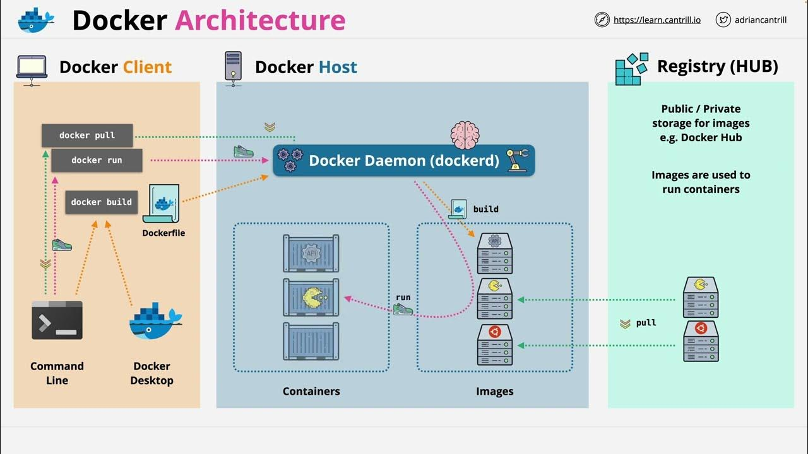

# Docker

- [Docker Architecture](#docker-architecture)
- [Dockerfile](#dockerfile)
- [Docker Registry](#docker-registry)
  - [Login to a Docker registry](#login-to-a-docker-registry)
  - [Logout from a Docker registry](#logout-from-a-docker-registry)
  - [Build an image from a Dockerfile](#build-an-image-from-a-dockerfile)
  - [Push an image to a Docker registry](#push-an-image-to-a-docker-registry)
- [Docker Containers](#docker-containers)
  - [List Containers](#list-containers)
  - [Run a container interactively](#run-a-container-interactively)
  - [Run a detached container](#run-a-detached-container)
  - [Run a container with a custom name](#run-a-container-with-a-custom-name)
  - [Run a container with environment variables](#run-a-container-with-environment-variables)
  - [Run a container and map ports](#run-a-container-and-map-ports)
  - [Run a container and mount a volume](#run-a-container-and-mount-a-volume)
  - [Stop a running container](#stop-a-running-container)
  - [Start a stopped container](#start-a-stopped-container)
  - [Pause a running container](#pause-a-running-container)
  - [Unpause a paused container](#unpause-a-paused-container)
  - [Restart a container](#restart-a-container)
  - [Attach to a running container](#attach-to-a-running-container)
  - [Remove a stopped container](#remove-a-stopped-container)
  - [Remove all stopped container](#remove-all-stopped-container)
  - [Remove a running container](#remove-a-running-container)
  - [Show container resource usage](#show-container-resource-usage)
  - [Show container logs](#show-container-logs)
  - [Copy files from/to a container](#copy-files-fromto-a-container)
  - [Inspect a container](#inspect-a-container)
  - [Create a container without starting it](#create-a-container-without-starting-it)
- [Docker Networking](#docker-networking)
  - [List networks](#list-networks)
  - [Create a network](#create-a-network)
  - [Inspect a network](#inspect-a-network)
  - [Remove a network](#remove-a-network)
  - [Connect a container to a network](#connect-a-container-to-a-network)
  - [Disconnect a container from a network](#disconnect-a-container-from-a-network)
  - [Attach a container to multiple networks](#attach-a-container-to-multiple-networks)
  - [Create an overlay network](#create-an-overlay-network)
  - [Remove all unused networks](#remove-all-unused-networks)
  - [Set up a custom bridge network](#set-up-a-custom-bridge-network)
  - [Limit container bandwidth on a network](#limit-container-bandwidth-on-a-network)
- [Docker Volumes](#docker-volumes)
  - [List volumes](#list-volumes)
  - [Create a volume](#create-a-volume)
  - [Inspect a volume](#inspect-a-volume)
  - [Remove a volume](#remove-a-volume)
  - [Remove all unused volumes](#remove-all-unused-volumes)
  - [Mount a volume while running a container](#mount-a-volume-while-running-a-container)
  - [Mount a host directory as a volume](#mount-a-host-directory-as-a-volume)
  - [Specify volume driver](#specify-volume-driver)
  - [Copy files from a container volume to the local host](#copy-files-from-a-container-volume-to-the-local-host)
  - [Mount a read-only volume](#mount-a-read-only-volume)
  - [Mount a named volume with specific options](#mount-a-named-volume-with-specific-options)
  - [Backup a volume to a tar archive](#backup-a-volume-to-a-tar-archive)
- [Docker Compose](#docker-compose)
  - [Create and start containers](#create-and-start-containers)
  - [Stop and remove containers](#stop-and-remove-containers)
  - [Build services](#build-services)
  - [Start services](#start-services)
  - [Stop services](#stop-services)
  - [Restart services](#restart-services)
  - [Pause services](#pause-services)
  - [Unpause services](#unpause-services)
  - [View service logs](#view-service-logs)
  - [Scale services](#scale-services)

## Docker Architecture



## Dockerfile

A Dockerfile is a script used to build Docker images. It consists of a series of commands:

```bash
# Specifies the base image used to build the new image.
FROM image_name:tag

# Executes a command in the new image's filesystem during the build process.
RUN command

# Specifies the default command to run when a container is launched from the image.
CMD command

# Sets the working directory for subsequent instructions.
WORKDIR /path/to/directory

# Copies files or directories from the host system into the image.
COPY source destination

# Similar to COPY, but can also extract tarballs or fetch URLs.
ADD source destination

# Informs Docker that the container listens on specific network ports at runtime.
EXPOSE port

# Sets environment variables in the image.
ENV key=value

# Configures the container to run as an executable.
ENTRYPOINT command

# Defines a variable that users can pass at build-time to the builder with the docker build command.
ARG variable_name

# Sets the user the application will run as within the container.
USER username
```

## Docker Registry

### Login to a Docker registry

Logs in to a Docker registry interactively.

```bash
docker login
```

### Logout from a Docker registry

Logs out from a Docker registry.

```bash
docker logout
```

### Build an image from a Dockerfile

Builds a Docker image from a Dockerfile in the current directory.

```bash
docker build -t image_name .
```

### Push an image to a Docker registry

Pushes a Docker image to a Docker registry.

```bash
docker push image_name
```

## Docker Containers

### List Containers

Shows containers in all states.

```bash
docker ps -a
```

### Run a container interactively

Starts a new container interactively using the specified image.

```bash
docker run -it image_name
```

### Run a detached container

Starts a new container in detached mode (background).

```bash
docker run -d image_name
```

### Run a container with a custom name

Starts a new container with a specific name.

```bash
docker run --name custom_name image_name
```

### Run a container with environment variables

Sets environment variables in the container.

```bash
docker run -e "VAR=value" image_name
```

### Run a container and map ports

Maps a container port to a host port.

```bash
docker run -p host_port:container_port image_name
```

### Run a container and mount a volume

Mounts a host directory into the container.

```bash
docker run -v /host/path:/container/path image_name
```

### Stop a running container

Stops a running container.

```bash
docker stop container_id
```

### Start a stopped container

Starts a stopped container.

```bash
docker start container_id
```

### Pause a running container

Pauses the execution of a container.

```bash
docker pause container_id
```

### Unpause a paused container

Resumes a paused container.

```bash
docker unpause container_id
```

### Restart a container

Restarts a running or stopped container.

```bash
docker restart container_id
```

### Attach to a running container

Attaches to a running container and opens a shell.

```bash
docker exec -it container_id /bin/bash
```

### Remove a stopped container

Deletes a stopped container.

```bash
docker rm container_id
```

### Remove all stopped container

Deletes all stopped container.

```bash
docker container prune
```

### Remove a running container

Forces removal of a running container.

```bash
docker rm -f container_id
```

### Show container resource usage

Displays live resource usage statistics of a container.

```bash
docker stats container_id
```

### Show container logs

Displays logs from a container.

```bash
docker logs container_id
```

### Copy files from/to a container

Copies files between a container and the local filesystem.

```bash
docker cp /local/path container_id:/container/path
```

### Inspect a container

Shows detailed information about a container.

```bash
docker inspect container_id
```

### Create a container without starting it

Creates a new container without starting it.

```bash
docker create image_name
```

## Docker Networking

### List networks

Lists all networks created on the Docker host.

```bash
docker network ls
```

### Create a network

Creates a user-defined bridge network named 'my_network'.

```bash
docker network create my_network
```

### Inspect a network

Displays detailed information about the 'my_network' network.

```bash
docker network inspect my_network
```

### Remove a network

Removes the 'my_network' network.

```bash
docker network rm my_network
```

### Connect a container to a network

Connects a container to the 'my_network' network.

```bash
docker network connect my_network container_name
```

### Disconnect a container from a network

Disconnects a container from the 'my_network' network.

```bash
docker network disconnect my_network container_name
```

### Attach a container to multiple networks

Attaches the container to an additional network 'my_network_2'.

```bash
docker network connect my_network_2 container_name
```

### Create an overlay network

Creates a multi-host overlay network 'my_overlay_network'.

```bash
docker network create --driver overlay my_overlay_network
```

### Remove all unused networks

Removes all networks not used by at least one container.

```bash
docker network prune
```

### Set up a custom bridge network

```bash
docker network create --driver bridge --subnet=192.168.5.0/24 --gateway=192.168.5.1 my_custom_network
```

Creates a custom bridge network 'my_custom_network' with specified subnet and gateway.

### Limit container bandwidth on a network

```bash
docker network create --driver bridge --subnet=192.168.5.0/24 --gateway=192.168.5.1 --opt "com.docker.network.bridge.enable_icc=false" my_secure_network
```

Creates a secure bridge network 'my_secure_network' disabling inter-container communication.

## Docker Volumes

### List volumes

Lists all volumes on the Docker host.

```bash
docker volume ls
```

### Create a volume

Creates a named volume named 'my_volume'.

```bash
docker volume create my_volume
```

### Inspect a volume

Displays detailed information about the 'my_volume' volume.

```bash
docker volume inspect my_volume
```

### Remove a volume

Removes the 'my_volume' volume.

```bash
docker volume rm my_volume
```

### Remove all unused volumes

Removes all volumes not used by at least one container.

```bash
docker volume prune
```

### Mount a volume while running a container

Mounts the 'my_volume' volume to a specific path inside the container.

```bash
docker run -v my_volume:/path/in/container image_name
```

### Mount a host directory as a volume

Mounts a directory from the host system into the container.

```bash
docker run -v /host/path:/container/path image_name
```

### Specify volume driver

Creates a volume using a specific volume driver 'my_driver'.

```bash
docker volume create --driver my_driver my_volume
```

### Copy files from a container volume to the local host

Copies files from a container volume to a directory on the local host.

```bash
docker cp container_id:/path/in/container /local/host/path
```

### Mount a read-only volume

Mounts the 'my_volume' volume as read-only inside the container.

```bash
docker run -v my_volume:/path/in/container:ro image_name
```

### Mount a named volume with specific options

Mounts the 'my_volume' volume with specific options (e.g., read-write permissions).

```bash
docker run -v my_volume:/path/in/container:options image_name
```

### Backup a volume to a tar archive

Creates a tar archive of the 'my_volume' volume in the /backup directory.

```bash
docker run --rm -v my_volume:/data -v /backup:/backup ubuntu tar cvf /backup/my_volume_backup.tar /data
```

## Docker Compose

### Create and start containers

Builds, (re)creates, starts, and attaches to containers for a service.

```bash
docker compose up
```

### Stop and remove containers

Stops and removes containers, networks, volumes, and images created by 'up' command.

```bash
docker compose down
```

### Build services

Builds or rebuilds services defined in the docker-compose.yml file.

```bash
docker compose build
```

### Start services

Start services defined in the docker-compose.yml file.

```bash
docker compose start
```

### Stop services

Stops services defined in the docker-compose.yml file without removing containers.

```bash
docker compose stop
```

### Restart services

Restarts services defined in the docker-compose.yml file.

```bash
docker compose restart
```

### Pause services

Pauses all services in the docker-compose.yml file.

```bash
docker compose pause
```

### Unpause services

Unpauses all paused services in the docker-compose.yml file.

```bash
docker compose unpause
```

### View service logs

Displays log output from services.

```bash
docker compose logs
```

### Scale services

Scale services to a specified number of instances.

```bash
docker compose scale service_name=num_of_instances
```
