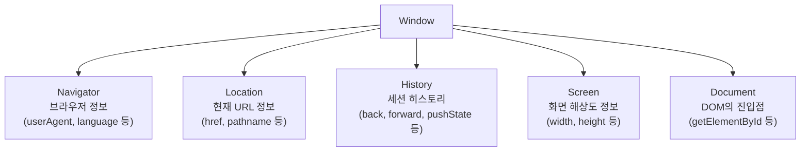
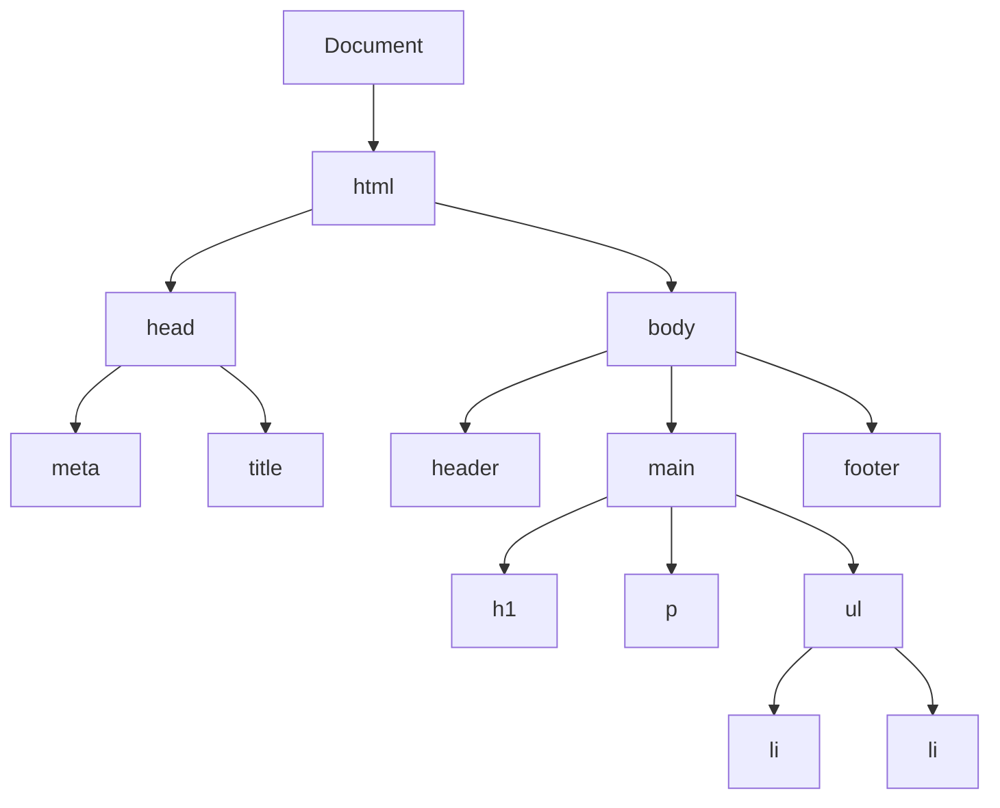
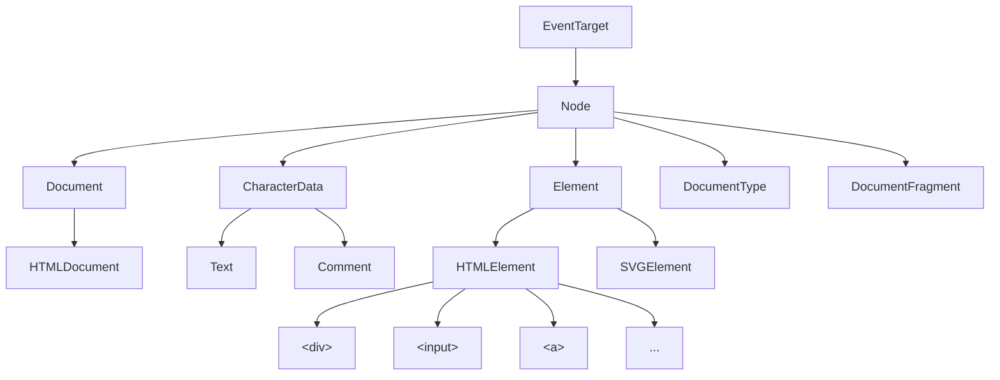

# DOM

- [BOM(Browser Object Model)](#bombrowser-object-model)
- [DOM(Document Object Model)](#domdocument-object-model)
  - [DOM 트리(DOM Tree)](#dom-트리dom-tree)
  - [노드 상속(Node Inheritance)](#노드-상속node-inheritance)
  - [속성(Attribute • Property)](#속성attribute--property)
  - [Attribute와 Property의 차이](#attribute와-property의-차이)
  - [예시](#예시)

## BOM(Browser Object Model)

BOM은 브라우저 자체를 제어하기 위한 객체 모델이다. 공식 표준은 없으나 브라우저들이 사실상 표준으로 구현하고 있으며, 최상위 객체인 `window`를 중심으로 구성된다.



- `window`: 전역 객체로, 브라우저 창을 나타낸다. 전역 변수와 함수는 모두 `window`의 프로퍼티로 등록된다.
- `navigator`: 브라우저의 종류, 버전, 운영체제 등의 환경 정보를 제공한다.
- `location`: 현재 페이지의 URL을 읽거나 변경하여 페이지 이동을 제어한다.
- `history`: 브라우저 세션의 방문 기록을 관리하며, SPA의 클라이언트 사이드 라우팅에 활용된다.
- `screen`: 사용자 디스플레이의 물리적 크기와 해상도 정보를 제공한다.
- `document`: DOM의 진입점으로, HTML 문서 전체를 나타내는 객체다.

## DOM(Document Object Model)

### DOM 트리(DOM Tree)

DOM은 HTML 문서를 트리 구조의 객체로 표현한 모델이다. 브라우저가 HTML을 파싱하여 생성하며, JavaScript로 문서의 구조, 스타일, 콘텐츠를 동적으로 읽고 수정할 수 있게 한다.



DOM은 노드(Node) 단위로 구성된다. 주요 노드 유형은 다음과 같다.

- 문서 노드(Document Node): 트리의 최상위 노드로, 모든 노드에 접근하는 진입점이다.
- 요소 노드(Element Node): HTML 태그를 나타내며, 트리의 주요 구성 단위다.
- 텍스트 노드(Text Node): 요소 내부의 텍스트 콘텐츠를 나타낸다.
- 속성 노드(Attribute Node): 요소의 속성(`id`, `class` 등)을 나타낸다.

### 노드 상속(Node Inheritance)

DOM의 모든 노드는 특정 인터페이스를 상속받는다. 이 계층 구조를 이해하면 각 노드에서 사용할 수 있는 메서드와 속성을 파악하기 용이하다.



### 속성(Attribute • Property)

HTML 요소의 값을 다루는 두 가지 방식인 어트리뷰트(Attribute)와 프로퍼티(Property)는 명확히 구분되어야 한다.

### Attribute와 Property의 차이

| 항목 | 어트리뷰트(Attribute)              | 프로퍼티(Property)                   |
| :--- | :--------------------------------- | :----------------------------------- |
| 위치 | HTML 소스 코드에 정의됨            | DOM 객체의 메모리 내 속성임          |
| 성격 | 정적 (HTML에 고정된 초기값)        | 동적 (JavaScript로 실시간 변경 가능) |
| 접근 | `getAttribute()`, `setAttribute()` | `element.property` 점 표기법         |
| 타입 | 항상 문자열(String)임              | 문자열, 숫자, 불리언, 객체 등 다양함 |

### 예시

```html
<input type="text" value="초기값" />
```

```ts
const input = document.querySelector('input');

// Attribute 접근
console.log(input.getAttribute('value')); // "초기값" (HTML 소스에 명시된 값)
// Property 접근
console.log(input.value); // "초기값" (DOM 객체의 현재 상태값)

// 사용자가 입력창에 "새 값"을 입력하거나 스크립트로 변경하면
input.value = '새 값';

console.log(input.value); // "새 값" (Property는 현재 상태를 반영함)
console.log(input.getAttribute('value')); // "초기값" (Attribute는 초기 설계 상태를 유지함)
```
